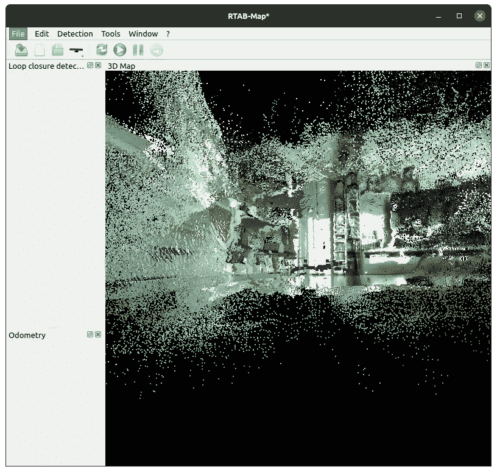
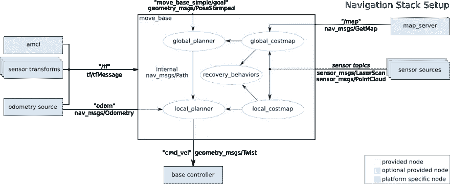

# 机器人操作系统:自主导航的要求

> 原文：<https://medium.com/geekculture/robot-operating-system-requirements-for-autonomous-navigation-eb04e00fe73?source=collection_archive---------8----------------------->



为了在 ROS 中构建一个自导航机器人，我们需要理解不同方面的基础知识。机器人本身需要以能够实现其姿态变换的方式建模。此外，机器人需要倾听并对`Twist`数据做出反应。最后，它需要以里程计消息的形式持续发布位置传感器数据。

本文将分别讨论这三个方面。它解释了基本概念，并列出了实现所需行为的可用 ROS 包。

*本文原载于我的博客*[*admantium.com*](https://admantium.com/blog/ros11_requirements_autonomous_navigation/)。

# ROS 导航要点

根据 [ROS 导航文档页面](https://wiki.ros.org/navigation)，您的机器人需要满足以下假设和要求:

*   它的底座大致呈正方形
*   它使用差动驱动或者是完整的轮式驱动
*   它监听`Twist`消息命令，并将 x 速度、y 速度和θ速度转化为具体和正确的运动
*   它以`LaserScan`或`PointCloud`的形式接收关于其外部环境的传感器数据。

考虑到这几点，最后一点是一个相当激烈的限制:其他传感器如立体摄像机，声纳和红外不能开箱即用。相反，它们的本地数据格式需要被翻译成相应的主题。

为了进一步理解这些需求的含义，下面两个部分分别讨论了 ROS 导航栈所需的数据和组件。

# 数据要求

# 里程计数据

转换数据表示两个坐标参考之间的静态关系。当机器人移动时，其*里程表数据*代表其速度的动态变化。在 ROS 中，机器人需要发布变换数据和里程计数据。抽象地说，里程计数据是通过转换数据过滤的。

里程计数据作为`Odometry`发布，由以下部分组成:

```
# This represents an estimate of a position and velocity in free space.  
# The pose in this message should be specified in the coordinate frame given by header.frame_id.
# The twist in this message should be specified in the coordinate frame given by the child_frame_id
Header header
string child_frame_id
geometry_msgs/PoseWithCovariance pose
geometry_msgs/TwistWithCovariance twist
```

*来源:*[*http://docs . ROS . org/en/no etic/API/nav _ msgs/html/msg/odometry . html*](http://docs.ros.org/en/noetic/api/nav_msgs/html/msg/Odometry.html)

# 传感器数据

导航所需的最终数据类型是`LaserScan`或`PointCloud`形式的传感器数据。该数据用于测量机器人的周围环境。

让我们分别调查每一个。

## 激光扫描数据

激光扫描代表在水平面上获得的 2D 数据。数据点是在特定的角度、各个点之间的特定距离以及特定的时间戳中获取的。所有这些都包含在[激光扫描信息类型](http://docs.ros.org/en/noetic/api/sensor_msgs/html/msg/LaserScan.html)中。

```
Header header            # timestamp in the header is the acquisition time of 
                         # the first ray in the scan.
                         #
                         # in frame frame_id, angles are measured around 
                         # the positive Z axis (counterclockwise, if Z is up)
                         # with zero angle being forward along the x axisfloat32 angle_min        # start angle of the scan [rad]
float32 angle_max        # end angle of the scan [rad]
float32 angle_increment  # angular distance between measurements [rad]float32 time_increment   # time between measurements [seconds] - if your scanner
                         # is moving, this will be used in interpolating position
                         # of 3d points
float32 scan_time        # time between scans [seconds]float32 range_min        # minimum range value [m]
float32 range_max        # maximum range value [m]float32[] ranges         # range data [m] (Note: values < range_min or > range_max should be discarded)
float32[] intensities    # intensity data [device-specific units].  If your
                         # device does not provide intensities, please leave
                         # the array empty.
```

*来源:*[*http://docs . ROS . org/en/no etic/API/sensor _ msgs/html/msg/laserscan . html*](http://docs.ros.org/en/noetic/api/sensor_msgs/html/msg/LaserScan.html)

激光扫描的典型来源是[激光雷达](https://en.wikipedia.org/wiki/Lidar)，这是一种在平面区域连续移动激光并检测物体距离的技术。

## 点云数据

点云是其周围环境的三维表示。它由具有 x，y，z 数据的单个点组成。结合所有这些点给出了周围环境的 3D 深度图。下面是[点云数据格式](http://docs.ros.org/en/noetic/api/sensor_msgs/html/msg/PointCloud.html)的内容。

```
# Time of sensor data acquisition, coordinate frame ID.
Header header# Array of 3d points. Each Point32 should be interpreted as a 3d point
# in the frame given in the header.
geometry_msgs/Point32[] points# Each channel should have the same number of elements as points array,
# and the data in each channel should correspond 1:1 with each point.
# Channel names in common practice are listed in ChannelFloat32.msg.
ChannelFloat32[] channels
```

*来源:*[*http://docs . ROS . org/en/no etic/API/sensor _ msgs/html/msg/point cloud . html*](http://docs.ros.org/en/noetic/api/sensor_msgs/html/msg/PointCloud.html)

点云数据可以从 3D 激光雷达扫描中获得，如本文[中的文章](/@amritgupta1999/merging-data-from-multiple-lidar-s-in-ros-e890fb60cbbf)所述，或者从 [RGB-D](https://en.wikipedia.org/wiki/Range_imaging) 相机中获得，这些相机结合了特殊的相机镜头和结构光、飞行时间或干涉测量法来测量距离。

# 转换数据

表示机器人或传感器的空间关系的数据需要被翻译，以便表示实际的数据。在抽象的层面上，移动机器人由不同的结构组件组成，例如它的中心、轮子、安装在顶部的传感器等等。这些组件中的每一个都有一个基点，即 x、y、z 形式的绝对坐标参考。现在，假设一个传感器安装在机器人的顶部。该传感器对其周围环境进行激光扫描。这些测量是从传感器的基点开始的。但是为了采取行动，我们需要*转换*传感器数据来匹配机器人的中心基点。为此，ROS 使用了一个*变换树*，一种确定从机器人中心基点到其他组件基点的偏移的表示。例如，平移`x=1.0, y=0.0, z=5.0`意味着传感器安装在前方 1.0 厘米处，中心基点上方 5.0 凸轮处。如果你有一个完整的机器人模型，那么这些关系是由 ROS 自动计算的。

这就完成了数据要求。现在，让我们考虑单独的导航栈组件。

# 导航堆栈组件

在 ROS 导航堆栈中，利用变换、里程计和传感器数据来确定机器人的位置，并在给定目标的情况下，确定移动到哪里。为了实现这一点，需要 ROS 导航栈的不同软件组件。

首先，让我们看一下[官方文档](https://wiki.ros.org/navigation/Tutorials/RobotSetup)提供的概述。下面将讨论每个组件。



*来源:*[*https://wiki.ros.org/navigation/Tutorials/RobotSetup?action = attach file&do = get&target = overview _ TF . png*](https://wiki.ros.org/navigation/Tutorials/RobotSetup?action=AttachFile&do=get&target=overview_tf.png)

# 导航规划器

计划者节点负责计算给定目标的所有可能的遍历选项。他们将创建成本图来表示采取某条路径或一系列步骤的努力。有两个策划者。全球规划者是制定长期规划的高级组件。它的配置选项包括检测障碍物的距离将存储在成本图中，从机器人到障碍物的空间是否应该保持空闲，以及机器人的基本足迹或半径。本地规划者评估机器人需要采取的下一步，并且需要配置机器人的基本运动能力、最小/最大速度和加速度。

# 基本控制器

当规划器决定走哪条路时，它将向`cmd_vel`主题发送`Twist`消息。然后，机器人的基本控制器需要监听这些消息并应用移动命令。

# 地图服务器

地图服务器是用于创建环境表示的可选组件。可以记录并保存地图，然后在机器人下次运行时使用，甚至可以导出到另一个机器人。

# 导航算法

解释完数据要求并列出导航栈的 par 后，我们现在可以选择一个合适的算法。

ROS 导航基于 SLAM，这是一种提供同步定位和地图绘制的方法。这意味着机器人可以在移动的同时制作地图，并同时使用该地图来定位其位置。正如本文开头所解释的，导航堆栈需要激光扫描或点云数据的可用性。因此，支持的导航算法建立在这些格式之上。

对于 RSO1，存在两种 SLAM 算法。库 [rtabmap_ros](http://wiki.ros.org/rtabmap_ros) 是一个最新的基于 RGB-D 的算法，具有良好的文档记录和丰富的示例文档。RTAB 代表实时基于外观的映射，可用于生成 3D 点云数据和 2D 占用网格。在[手持绘图教程](http://wiki.ros.org/rtabmap_ros/Tutorials/HandHeldMapping)中可以找到针对各种设备的通用教程。库 [orb_slam2](http://wiki.ros.org/orb_slam2_ros) 使用来自单目、立体和 RGB-D 相机的简单图像数据来创建地图。但是，它最多只支持 ROS1 发行版 melodic。

对于 ROS2，有几种选择:

*   [SLAM Gmapping](https://github.com/Project-MANAS/slam_gmapping) : ROS2 核心 SLAM 包，需要一个`sensor_msg/laser_scan`主题才能工作。
*   [制图员](https://github.com/ros2/cartographer):利用一组可变传感器同时进行 2D/3D Slam
*   [玄武岩 ROS2](https://github.com/berndpfrommer/basalt_ros2) :玄武岩是一个大学研究项目，旨在结合图像和 IMU 数据进行精确定位
*   [激光雷达 slam ROS2](https://github.com/rsasaki0109/lidarslam_ros2) :使用激光雷达扫描和[OpenMP](https://en.wikipedia.org/wiki/OpenMP)——用于精确定位

# 结论

本文研究了用于实现机器人自主导航的 ROS 导航栈。首先，我们了解了机器人需要满足的基本要求:a)它大致呈方形，b)它使用差动或完整驱动，c)它提供激光扫描或点云数据。其次，我们了解了转换、里程计和传感器数据。第三，我们看到了导航堆栈的不同组件以及如何处理数据。本质上，导航基于 SLAM，即同步定位和地图绘制，这是当前的技术标准。SLAM 使机器人能够在任何环境中移动，在移动的同时形成地图，并获得在该地图中导航的能力。