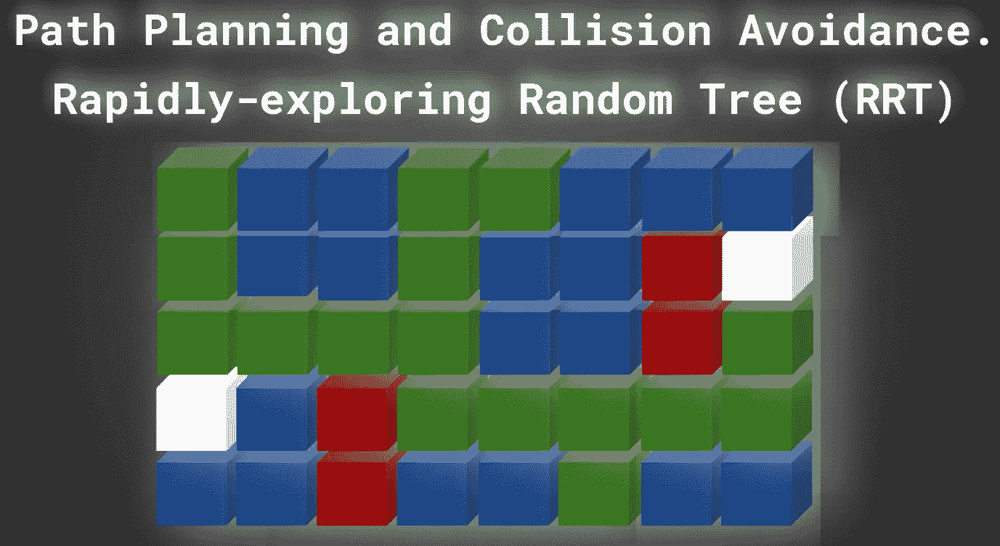
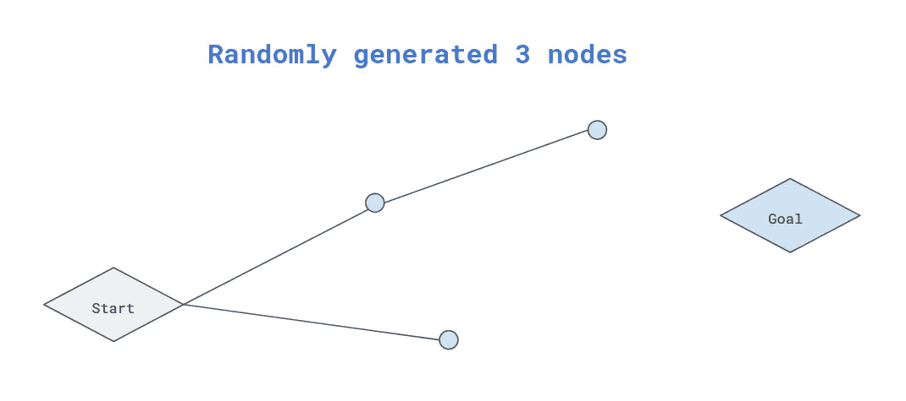
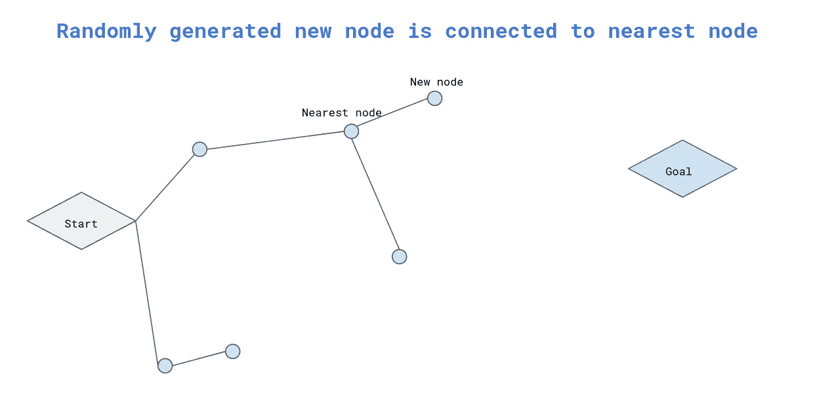
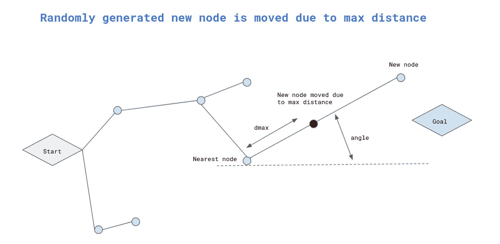
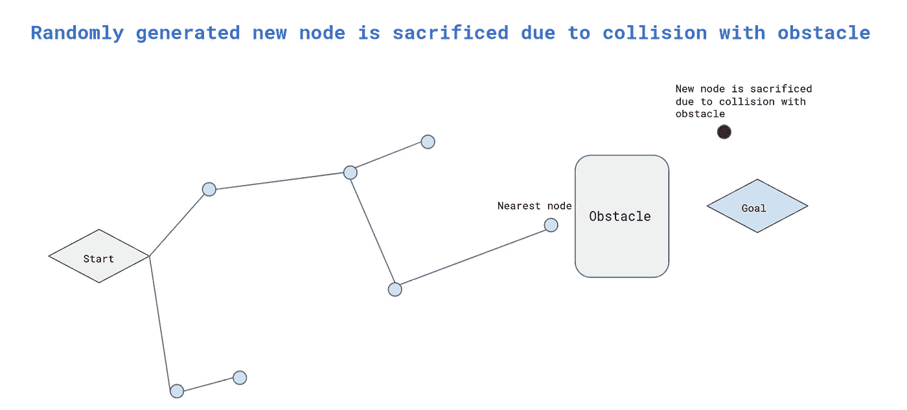
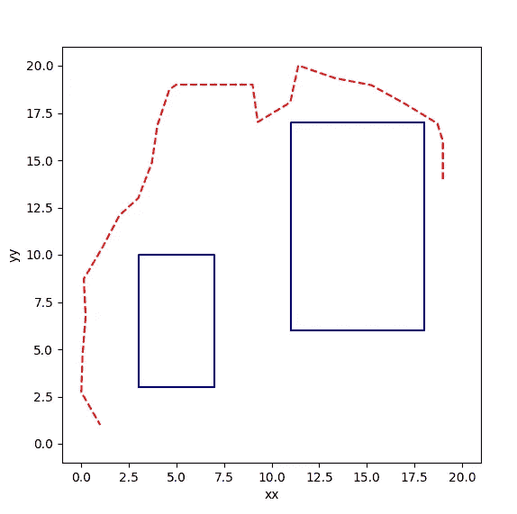
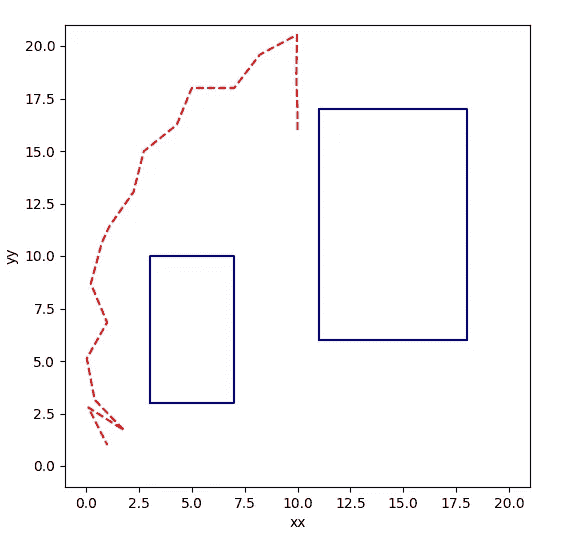
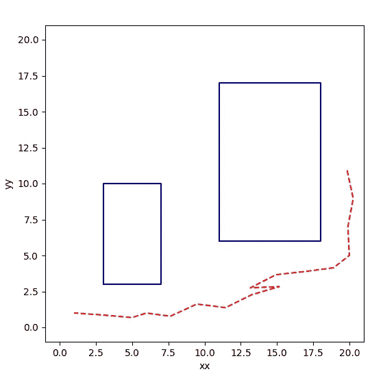

# 机器人路径规划。RRT 算法。

> 原文：<https://medium.com/geekculture/robot-path-planning-rrt-algorithm-d836fb52cb38?source=collection_archive---------4----------------------->



接下来的博客可以被认为是我上一篇博文的延续，在那篇博文中，我介绍了自主机器人运动的核心原理。前文讨论了人工势场算法，描述了算法在 C++中的实现和实例仿真。

在本文中，我将介绍下一个流行的算法，它经常用于路径规划([RRT——快速探索随机树](https://en.wikipedia.org/wiki/Rapidly-exploring_random_tree))。
机器人面临的任务与前一个相似。机器人必须找到从起点到终点的无碰撞路径。我们假设机器人环境和机器人运动的地图是在统计环境中执行的——障碍物不移动。
每次运行模拟时，除了起点、终点和环境地图的位置相同之外，计算出的路径也会发生变化。关于下一个机器人位置的随机决策会影响性能和最终路径。它可能发生，RRT 算法不能在有限的迭代内找到解决方案。没有讨论当前讨论的算法的变体，如 RRT*、RT-RRT*。

我讨论的算法的 C++实现你会在这里找到。

可以编译和运行的 C++代码如下。
[头文件](https://github.com/lava/matplotlib-cpp)(用于绘图库)必须在与你的 cpp 相同的文件夹中。

```
//compile
g++ my_prog.cpp -o my_prog -I/usr/include/python3.8 -lpython3.8//run
./my_prog//folder tree
├── my_prog
├── my_prog.cpp
├── matplotlibcpp.h
```

一如既往，最重要的是熟悉原理。这些原理或算法步骤可以如下导出:

1.  为了开始路径规划，机器人大脑(视频控制系统)必须知道环境地图(障碍物)、当前位置、目标、算法将要循环运行的迭代次数以及机器人可以移动的最大距离(每次迭代)。
    以上给出的所有参数都会影响性能。除了明显不能由机器人大脑调节的参数之外，还有障碍集(地图上的数量和位置)、当前位置(起点)和目标。
    对于某些设置(障碍物位置、起点和机器人目标),路径规划器的性能受迭代次数和机器人可移动的最大距离的影响。强烈建议运行所讨论的(GitHub 中提供的)C++程序，并在实践中验证 RRT 的性能。
2.  机器人大脑在地图上随机选择下一个位置。



by author

3.计算当前机器人位置和控制系统(大脑)随机给出的位置之间的距离，并与作为系统参数 **dmax** 提供的最大长度进行比较。此外，计算线(连接当前机器人位置和随机选择的位置)和轴 Ox 之间的角度(考虑下图)。



by author

4.如果计算出的到随机点的距离大于 dmax，那么新的机器人位置将作为 dmax(记住上一步计算的角度)。
如果 dmax 大于到随机节点的距离，那么机器人(如果保证没有碰撞)转移到新的(随机选择的)位置。



by author

5.接下来，检查当前机器人位置和新位置之间的路径是否有碰撞。如果机器人路径与障碍物发生碰撞，则新的机器人位置(随机生成)会被划开(不进行评估)。大脑随机产生新的位置，这个过程又开始了。
如果路径是自由的(没有与障碍物碰撞),那么机器人转移到新的位置。



by author

6.重复该过程，直到机器人达到目标或迭代次数用尽。

7.请注意，一段时间后，树会有几个分支，因为随机给定点会根据树的所有节点进行验证(树会扩展)。树在从树的节点到随机给定的新位置的距离最短的方向上扩展(从节点开始生长)。

下面你会发现一些模拟的预期结果(相同的开始，但不同的目标)，你可以很容易地在你的机器上重现。

**模拟 1。**



by author

**模拟 2。**



by author

**模拟 3。**



by author

感谢您的阅读。