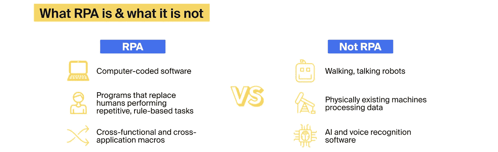
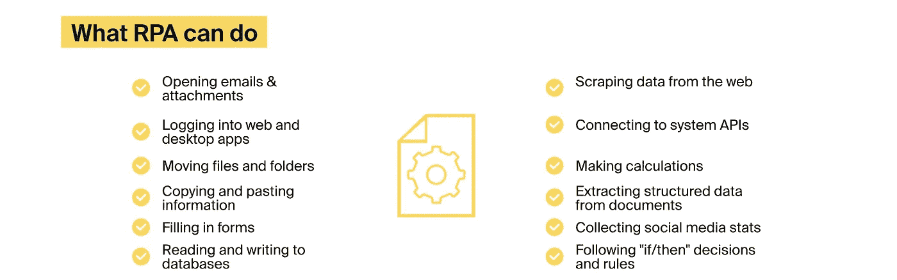
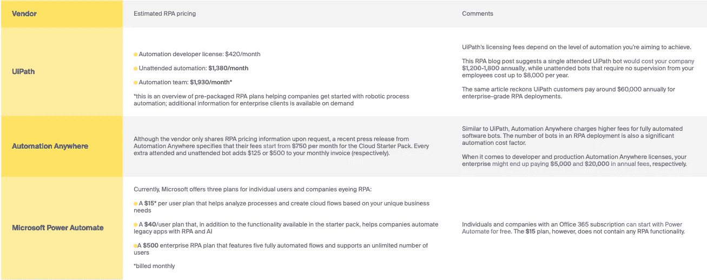
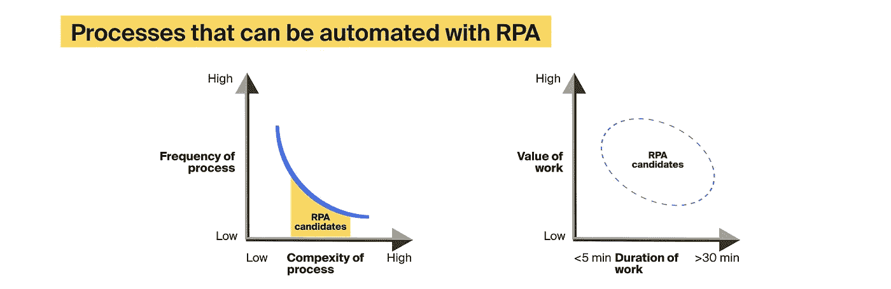

# 机器人过程自动化成本，解密

> 原文：<https://medium.com/geekculture/robotic-process-automation-cost-deciphered-bc09e783f93?source=collection_archive---------20----------------------->

办公室员工每年大约有 69 天花在管理工作上。这使美国企业每年损失 2.87 万亿美元的生产力。无论你在哪个行业工作，从你的员工肩上卸下平凡的、基于规则的任务总是一个好主意。这就是 [RPA 即服务](https://itrexgroup.com/services/robotic-process-automation/)解决方案派上用场的地方。

截至 2020 年，德勤[调查的 72%的公司已经实施了 RPA 工具](https://www2.deloitte.com/content/dam/Deloitte/us/Documents/process-and-operations/us-cons-global-rpa-survey.pdf)。RPA 先锋报告的好处中，合规性和质量的提高名列榜首。与此同时，59%的企业显著降低了 RPA 相关成本，RPA 项目的平均回收期不到 12 个月。然而，只有 3%的公司成功扩展了他们的数字员工队伍，而高达 50%的初始 RPA 项目失败。鉴于单个软件机器人[的机器人流程自动化成本可能在 5000 美元到 15000 美元](https://deloitte.wsj.com/articles/robotic-process-automation-slashes-it-costs-alleviates-complexity-1467777743)之间，您的企业可能最终会花费数百万美元来实现全公司范围的自动化。

高机器人过程自动化成本背后的关键因素是什么？最重要的是，您的公司应该做些什么来实现 RPA 的全部潜力，而又不至于倾家荡产？

让我们找出答案！

# 推动机器人过程自动化成本的五大因素

*   RPA 供应商定价
*   构成 RPA 部署的机器人的数量和复杂性
*   初始流程分析、RPA 咨询和工程成本
*   第三方机器人过程自动化集成的成本
*   维护、支持和 RPA 扩展成本

以下是这些因素的详细概述。

# RPA 供应商定价模型

有几家技术公司在订阅的基础上提供 RPA 工具和开发平台。根据 [Gartner 的 2021 年机器人流程自动化魔力象限报告](https://www.uipath.com/blog/rpa/gartner-magic-quadrant-rpa-report)以及 [Forrester Wave:机器人流程自动化、Q1 2021 年调查](https://www.automationanywhere.com/lp/forrester-wave-rpa)、UiPath、Automation Anywhere 和 Microsoft Power Automate 是全球 RPA 市场的驱动力，[预计到 2030 年该市场将达到 450 亿美元](https://finance.yahoo.com/news/global-robotic-process-automation-markets-210000232.html)。让我们看看领先的 RPA 供应商的定价模式是如何相互比较的:

在大多数情况下，RPA 供应商定价模式和软件部署模式(基于云或内部部署)将决定 RPA 许可证的成本。例如，如果捆绑销售，基于云的 RPA 工具的成本可能会更低，而如果您选择长期承诺，本地部署可能会更便宜。通常，供应商许可费占机器人过程自动化总成本的 30%—[或者说你要支付给从事手工工作的全职员工的平均工资的⅓。](https://www.capgemini.com/consulting-de/wp-content/uploads/sites/32/2017/08/robotic-process-automation-study.pdf)

# RPA 机器人的数量和复杂性

机器人过程自动化工具并非生而平等。

例如，我们在上一节提到了有人值守和无人值守的 RPA 机器人。这两种类型的智能软件代理的核心区别在于它们的能力(或缺乏能力！)独立执行任务。

还有必要区分业务流程自动化(BPA)和机器人流程自动化工具；前者仅仅遵循 if-then 模式来自动化工作流，而后者观察您的员工与软件系统界面的交互并复制他们的动作。BPA 和 RPA 有一个更聪明、技术更先进的表亲，叫做[智能过程自动化(IPA)](https://itrexgroup.com/services/intelligent-process-automation/) 。IPA 系统的特点是 [imachine 学习算法](https://itrexgroup.com/blog/ai-types-subsets-use-cases/)，可以检索和分析隐藏在企业 IT 系统中的[非结构化数据](https://itrexgroup.com/blog/ai-types-subsets-use-cases/)。

组成 RPA 系统的机器人数量、它们的认知能力以及它们处理的工作负载被列为关键的机器人流程自动化成本驱动因素。

例如，一个简单的 RPA 机器人将 PDF 文档转换成 CSV 文件[可能会让](https://bytescout.com/articles/cost-of-rpa-implementation/)贵公司每月花费 25 美元——只要它在 30 天内处理几十条记录，除此之外什么也不做。在这种情况下，额外的 RPA 成本可能只包括几个小时的维护和验证工作。

相反，RPA 工具在多个应用程序和信息系统中运行，同时根据多种条件检查工作流，这需要费力的配置，并且需要更长的实施时间。

由于机器人流程自动化的初始成本对于中小型企业来说可能是一个沉重的负担，并且投资回报前景可能过于模糊，无法证明投资的合理性，因此公司应该仔细审查和分析其希望自动化的流程。通常，频繁执行且执行时间不超过 30 分钟的操作最适合 bot 驱动的自动化。

[Source](https://www.google.com/url?q=https://www.capgemini.com/consulting-de/wp-content/uploads/sites/32/2017/08/robotic-process-automation-study.pdf&sa=D&source=docs&ust=1644415142533530&usg=AOvVaw1mijK9FOL6bPb9vY167vKI)

# 初始流程分析、RPA 咨询和工程成本

就技术而言，RPA 工具不需要全新的平台和重大的基础架构升级。然而，机器人过程自动化需要良好的前期设计和对自动化过程的深入了解。否则，您的 RPA 部署将包含配置错误，这可能会阻止机器人从 IT 系统获取信息并有效执行任务。

这就是为什么大多数关注机器人过程自动化的公司转向 RPA 开发公司。您选择的供应商可能是经过认证的 UiPath 或 Automation Anywhere 合作伙伴。或者像 Gartner、Accenture 这样的世界 500 强 RPA 咨询公司。或者是一家不太知名的技术公司，但却雇佣了熟练的机器人过程自动化工程师。

您选择的 RPA 公司将对您的流程进行全面审查，确定自动化的合适候选对象，并对技术堆栈提出建议。然后，您的技术合作伙伴将设计一个高级 RPA 体系结构和实施路线图。可靠的 RPA 供应商通常采用迭代、结果驱动的自动化方法，创建智能软件代理的概念验证(POC)版本，培训他们执行任务，微调他们的性能，并提供[强大的数据可视化](https://itrexgroup.com/services/data-visualization/)和报告工具，使 RPA 可供所有员工访问，无论他们的技术背景如何。这种方法有助于公司以无风险的方式开始使用 RPA，更快地实现 ROI，并避免[自动化超支](https://www.thinkautomation.com/our-two-cents/the-business-heist-of-the-century-rpa-costs/)。

根据您的供应商所在的国家，RPA 顾问和工程师的时薪可能在 15 美元到 60 美元之间。

# 第三方机器人过程自动化集成的成本

为了能够登录 IT 系统并访问其界面，RPA 工具必须通过 API 连接到这些系统。毫不奇怪，赋予软件机器人超能力的所有 API、应用程序和服务的价格都会增加机器人流程自动化的总成本，而且默认情况下，RPA 供应商并不提供或支持所有这些 API。

例如，将你的机器人连接到 AWS、Azure 或谷歌云服务会产生额外的机器人流程自动化成本，这些成本会随着机器人处理的数据和服务器调用的数量成比例增加。

总体而言，附加工具约占 RPA 总成本的 5%。

# 维护、支持和 RPA 扩展成本

由于 RPA 机器人驻留在现有软件应用程序中并与之交互，因此对这些系统或其产生的数据进行重大更改也可能会触发 RPA 重新配置和更新。

类似地，许多公司忽略了 RPA 扩展成本或成为范围蔓延的受害者，试图将自动化工作扩展到尽可能多的流程和业务部门，或者玩弄向现有 RPA 系统添加人工智能功能的想法。

避免这些问题的一种方法是尽早设计一个高级 RPA 实施战略。这个策略，除了别的以外，应该为软件依赖、主动变更管理和涉众联盟做准备。

# 机器人过程自动化要花多少钱？这些例子可能会给你一个想法！

我们与 ITRex 集团的 Python 团队负责人 [Dzmitry Kliuchnik](https://www.linkedin.com/in/dzmitry-kliuchnik/) 讨论了我们投资组合中的几个 RPA 项目。Dzmitry 友好地分享了这些项目的大概成本估计，并为您提供了一些背景信息，让您根据您的行业、项目要求和自动化需求来计算特定 RPA 系统的成本。

# 用于患者预约安排的 RPA 解决方案

一家医疗保健技术公司求助于 ITRex 来创建一个 [RPA 解决方案，用于从电子病历(EMR)中复制患者数据](https://itrexgroup.com/case-studies/medical-appointment-scheduling-system/)，并将其粘贴到预约安排软件中。为了实现这一目标，我们同步了两个系统，并实现了简单的脚本来记录事件，并在出现错误时重启流程。

> Dzmitry 估计，两个 RPA 开发人员花了大约八周时间来设计和部署 RPA 工具。类似的机器人流程自动化解决方案将花费您**5000-10000**美元。这笔款项包括实际的开发工作和必要的一揽子支助。该项目不涉及许可费用，因为我们使用定制的 API 和软件代理来实现自动化功能。

# RPA 支付处理工具

一家金融机构与 ITRex 合作创建了一个机器人流程自动化系统，该系统将处理支付信息，根据银行数据进行验证，并对会计系统和内部报告进行必要的更改。客户选择 WorkFusion 作为主要的技术堆栈，因此人工智能代理处理文档处理任务。出于安全原因，我们不得不在内部部署该系统。

根据 Dzmitry 的说法，项目团队由一名项目经理、两名 RPA 开发人员、一名机器学习工程师和一名业务分析师组成。该团队花了八周时间成功构建了 RPA 工具的概念验证版本，又花了六周时间将该系统投入生产。

> 在这里，RPA 实施的成本将在**50，000 美元到 150，000 美元**之间波动，并涉及 RPA 供应商定价、服务器部署和维护的额外基础架构费用以及员工培训费。

# 某电信公司的 RPA 文档处理系统

一家电信公司与我们的 RPA 专家合作，实现了几个[互连文档处理](https://itrexgroup.com/blog/intelligent-document-processing-complete-guide/)和管理工作流的自动化。WorkFusion 再次被选为主要 RPA 平台。

> 由三名 RPA 工程师、一名项目经理、一名业务分析师和一名项目经理组成的团队在六个月内完成了项目。考虑到额外的基础设施配置和设置费用，以及 RPA 供应商许可费用，像这样的机器人流程自动化系统可能会让您的公司花费**15 万到 30 万美元**。

# 如何降低 RPA 实施成本并更快实现投资回报

[据 McKinsey](https://www.mckinsey.com/industries/financial-services/our-insights/the-value-of-robotic-process-automation) 称，RPA 可以带来快速而稳健的投资回报，即在部署的第一年高达 200%,并节省 20–25%的成本。德勤的另一项研究表明，假设机器人取代了 1000 名员工，一家公司以 2000 万美元的满载成本(包括软件许可、规划、流程再造、编程、测试和实施)[部署 500 个机器人，可能会实现 1 亿美元的节约](https://deloitte.wsj.com/articles/robotic-process-automation-slashes-it-costs-alleviates-complexity-1467777743)。

自然，由于独特的组织问题和要求，每个 RPA 实例都会带来不同的总体预算和成本节约。然而，当考虑在您的组织中实现自动化时，有几件事情您应该记住:

*   机器人过程自动化不是解决你公司问题的灵丹妙药；相反，你应该把它当作一个引擎，让你的业务车轮不断转动
*   实施 RPA 不需要您放弃其他 IT 系统；但是，RPA 工具应该与现有软件无缝集成，以跨您的 IT 基础架构获取数据，并像员工一样与目标应用程序交互
*   在进行任何开发活动之前，务必进行彻底的审核并设计一个考虑到可扩展性的高级 RPA 实施计划，因为机器人的好坏取决于它们的编程水平
*   跨职能团队和利益相关方的意见是成功实施 RPA 的支柱
*   在自动化之前优化业务流程是无故障 RPA 推广的关键
*   缺乏 RPA 教育和意识，以及 IT 部门对变更的抵制，可能会阻止您的项目启动
*   应该为机器人驱动的操作适当地格式化和优化数据；这个问题可以通过实现基于人工智能的自动化工具来部分解决

定制机器人过程自动化工具可能会让你的公司花费 5000 到 300000 美元。RPA 成本之间的巨大差距是由不同因素造成的，包括智能软件代理的数量和复杂性、供应商定价、bot 配置要求和维护工作。但是，如果正确实施，RPA 可确保相对快速的回报，并有助于降低运营成本。

> 有关 RPA 挑战和克服这些挑战的方法的更多信息，请查看最近的博客文章。如果你心中有一个 RPA 项目，不要犹豫[联系 ITRex 自动化专家](https://itrexgroup.com/blog/contact-us/)。它们将帮助您更快地获得 RPA 的好处，同时降低机器人流程自动化的成本。

*原载于 2022 年 2 月 8 日 https://itrexgroup.com***。**