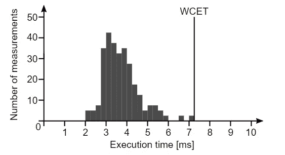
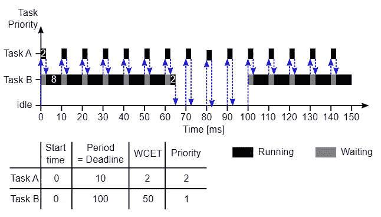
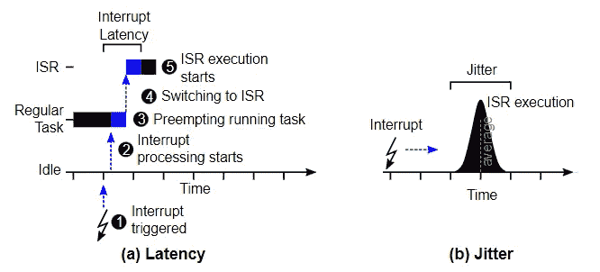

# 作为软件的机器人

> 原文：<https://medium.com/geekculture/robots-as-software-15f41c3aaa59?source=collection_archive---------3----------------------->

## 引用

## *摘自安德烈亚斯·比尔迈尔*为程序员 *设计的* [*机器人*](https://www.manning.com/books/robotics-for-programmers)

*本文探讨了对机器人技术非常重要的几个专业软件领域。*

如果你是一个对学习更多机器人技术感兴趣的软件开发人员，请阅读这篇文章。

在[manning.com](https://www.manning.com/books/robotics-for-software-engineers?utm_source=medium&utm_medium=referral&utm_campaign=book_bihlmaier_robotics_1_28_22)结账时，将 **fccbihlmaier** 输入折扣代码框，即可享受 25%的折扣。

机器人是一个高度跨学科的领域。我们至少需要机械、电子和软件来制造一个机器人。但是，即使在软件领域，也有各种对机器人软件很重要的专业领域。让我们简要看看这些领域，并了解它们与机器人的关系。

## 作为嵌入式实时系统的机器人

第一个相关领域是嵌入式实时系统的软件。嵌入式软件是在不作为通用计算机使用的设备中运行的软件。这些设备通常具有有限的计算和存储资源。嵌入式软件的另一个共同特点是用户不直接与之交互。嵌入式软件通常被称为固件。

实时软件是有时间限制的软件。对于实时软件，给出正确的结果(逻辑正确性)是不够的，它还必须在正确的时间给出结果(时间正确性)。因为实时意味着“快”是一个如此普遍的误解，让我重申这一点:实时软件必须保证计算在指定的时间点产生结果。这与声明软件必须表现出时间确定性是一样的。

结合这两个方面，嵌入式实时软件领域涉及在实时约束下控制设备的软件。雇用许多嵌入式实时软件开发人员的三个行业示例是航空航天、汽车和通信。一辆现代汽车包含大约 100 个电子控制单元(ECU)。每个 ECU 都有自己的运行嵌入式实时软件的处理单元。它们通过总线系统相互通信，并控制汽车中的一切，从各种发动机部件到刹车到挡风玻璃雨刷。该软件是 ECU 的一个组成部分，司机甚至可能不知道它们的存在，因此嵌入式方面是显而易见的。实时方面也很容易理解，不仅考虑到燃料需要在正确的时间注入发动机的气缸，而且还考虑到人们真的希望在踩下制动踏板和制动 ECU 启动制动之间有一个有保证的时间。

正如你从例子中看到的，嵌入式实时软件是一个大而多样的领域。它与机器人技术也有重要的交集。机器人系统通常由运行自己软件的设备组成。在许多情况下，这是嵌入式实时软件，负责(低级)传感器数据采集和执行器控制。当然，并不是所有的机器人都与接近金属的嵌入式实时软件有关。如果你的主要兴趣是机器人软件栈的更高层，你不必成为嵌入式实时软件的专家。尽管如此，每个从事机器人工作的人，无论在哪一层，都会从对嵌入式和实时的基础知识的透彻理解中受益。

Python 是一种流行的现代多范式语言，语法简洁，标准库全面；它通常用于机器人和人工智能。不幸的是，它不适合嵌入式实时编程。对于这个用例来说，Python 的主要缺点是它是一种解释型语言，并且有一个垃圾收集器。

与(预)编译的编程语言相反，解释语言(如 Python)在执行前不会被翻译成机器代码。相反，源代码或其中间表示直接由语言运行时(即解释器)读取和执行。对于简单的循环，例如:

```
iterations = 100000000  # 10 million
 sum = 0
 for i in range(iterations):
   sum += i
 print(sum)
```

与用 C++编写和编译的相同循环相比，性能上的差异大约是 100 倍，即 Python 的运行速度慢了 100 倍。请注意，这是一个极端的例子，在 Python 生态系统中有变通方法。这里的要点是，对于解释型语言来说，有一个显著的性能损失，特别是在资源受限的系统上。对于内存使用来说也是如此，在嵌入式系统中内存通常是稀缺的。虽然现在个人电脑的内存在几十千兆字节(GB)的范围内，但微控制器只有几百千字节(KB)或几兆字节(MB)的内存仍然很常见。

除了主要是嵌入式软件问题的资源利用之外，垃圾收集(GC)也是实时软件的一个重要问题。在没有 GC 的编程语言中，必须显式管理内存。软件开发人员有责任手动分配内存供使用，并在使用后手动释放内存。不得不执行手动内存管理不仅是一件麻烦的事情，而且也是一个持续的错误源，例如内存泄漏。在使用 GC 的语言中，内存管理是自动化的。内存会自动分配和释放。实时软件的问题是何时执行这些自动化的内存管理操作，尤其是当 GC 变得活跃并释放内存时。在非实时软件中，我们只对平均性能感兴趣。只要平均速度足够快，GC 何时激活并延迟程序执行并不重要。然而，在实时系统中，我们非常关心每个程序执行的确定性行为，而不仅仅是一般情况。GC 在程序执行中引入了随机延迟，因此很难或不可能提供实时保证。

在下面的嵌入式实时编程示例中，我仍然会使用 Python，因为 Python 可以很好地表达这些概念。请记住，在实现机器人软件堆栈的这些部分时，Python 不应该是您的首选。

开发嵌入式软件时，我们必须特别注意资源利用:

*   非易失性存储器
*   随机存取存储
*   中央处理器

嵌入式系统中的非易失性存储器(NVM)通常不由硬盘或固态驱动器提供，而是由少量的 EEPROM 或闪存提供。NVM 通常甚至不是一个独立的组件，而是微控制器芯片本身的一部分。由于历史原因，NVM 在嵌入式系统中通常被称为只读存储器(ROM ),尽管它不再是严格意义上的只读存储器。

虽然大多数软件开发人员习惯于考虑程序数据所需的存储空间，但他们通常不太注意程序本身的大小。他们为什么要这么做？即使是大型程序的代码通常也不会超过几百兆字节(MB ),而磁盘空间是以兆兆字节(TB)来衡量的。在嵌入式系统中，“磁盘”，即 NVM / ROM，只有几百千字节(KB)或几兆字节。因此，程序大小很重要，有时需要优化。

许多软件开发人员在开发过程中也会考虑内存(RAM)的使用。例如，通常不应该将文件完全读入内存，而是应该分块处理它们，以避免在处理大文件时耗尽内存。然而，嵌入式系统中的资源比 PC 和服务器中的资源更加有限。通常保存在主存中的数据结构很容易超过嵌入式系统中的可用内存。因此，必须时刻牢记内存使用情况，并且可能需要调整一些熟悉的实现。

最后，嵌入式系统的 CPU 性能远低于 PC。为了让您有一个概念，让我们更仔细地看看作为性能指标的每秒浮点运算数(FLOPS):(高端)微控制器约为 0.1 GFLOPS，一个(高端)片上系统(SoC)约为 10 GFLOPS，一个(高端)桌面 CPU 约为 100 GFLOPS。换句话说，PC 和微控制器之间有 1000 倍的性能差异。因此，在嵌入式系统中，通过选择正确的方法、算法和数据结构来关注计算资源的有效使用是至关重要的。

从嵌入式到实时，有许多问题需要注意:

*   最坏情况执行时间(WCET)
*   随机硬件性能
*   调度程序、任务优先级和抢占
*   同步原语和进程间通信(IPC)
*   中断和定时器

如果我们想保证计算的结果能按时得到，我们需要从知道这些计算的持续时间开始。虽然测量运行某个函数需要多长时间听起来很简单，但还是有一些陷阱需要注意。因为我们必须*保证*最后期限*总是*被满足，我们不关心平均执行时间，相反我们感兴趣的是最坏情况下的执行时间(WCET)。包含条件语句或循环的函数可能有不同的执行时间，这取决于它们的输入或整体程序状态。我们感兴趣的是找到导致*最差*，即最长执行时间的输入数据和程序状态。一旦我们分析了程序最坏情况下的执行路径，仅仅测量一次执行时间仍然是不够的。

原因是大多数现代 CPU，包括微控制器中的 CPU，都已经过优化，以提供平均高性能*。我们不能在这里深入现代计算机体系结构的细节。简而言之，缓存、流水线、无序执行、推测性执行和其他优化极大地提高了 CPU 的平均性能，但它们也导致了相同代码的最快和最慢执行之间的巨大差异——有时是几个数量级。不幸的是，通过查看源代码和 CPU 数据表来分析执行时间几乎是不可能的。获得一个函数的 WCET 的实际解决方案是多次运行该函数，同时将整个系统置于不同的状态和不同的负载下。结果是如图 1 所示的执行时间直方图。*

**

*Figure 1\. Histogram of execution times for worst-case execution time (WCET) analysis.*

*横轴显示执行时间，纵轴显示测量该执行时间的次数。虽然更高级的 WCET 分析技术也分析执行时间的分布，但我们仅限于查看最高的测量执行时间。虽然我们不能证明更差的执行时间不会发生，但是在足够多样的系统状态下进行足够数量的测量在实践中已经足够好了。*

*下一个实时考虑是调度器、任务优先级和抢占。让我们看一个有两个任务的示例系统，任务 A 和任务 B，其中任务 A 必须每 10 毫秒执行一次，任务 B 必须每 100 毫秒执行一次。换句话说，任务 A 的周期截止时间为 10 毫秒，任务 B 的周期截止时间为 100 毫秒。任务 A 的 WCET 为 2 毫秒，任务 B 的周期截止时间为 50 毫秒。我们不能简单地按顺序运行任务，因为在任务 B 执行时，我们会错过任务 A 的截止时间 5 次。相反，我们需要每隔 10 ms 暂停任务 B，运行任务 A，然后继续运行任务 B，直到 A 的下一个周期。暂停一个任务并切换到另一个任务也称为抢占。决定在什么时间运行什么任务的软件是调度程序。如果一个任务被另一个任务抢占，我们说一个任务比另一个任务优先级高。在我们的例子中，相对于任务 b，我们需要给任务 A 分配一个更高的优先级。*

**

*Figure 2\. Example of preemptive scheduling for two tasks with fixed priorities.*

*实时操作系统为这些实时需求提供了合适的调度器和相应的任务模型。任务通常不是完全独立的，而是必须相互交换数据。因此，RTOSes 提供了同步原语，如互斥和信号量，以及进程间通信(IPC)机制，如共享内存和消息队列。*

*最后，实时系统需要中断和定时器。中断是一种硬件机制，它中断程序的顺序执行并执行预定义的功能，即所谓的中断服务例程(ISR)。中断可以来自系统内部，也可以来自外部。在这两种情况下，它们都表示某种事件已经发生。硬件定时器可以配置为在规定的时间后或以规定的频率周期性地产生中断。例如，调度程序使用定时器定期中断正在运行的程序，并在 ISR 中执行自己，以确定是继续运行当前程序还是运行另一个程序。使用中断的另一个例子是避免循环检查输入的变化，即所谓的轮询。而不是通过定期轮询输入来占用宝贵的 CPU 资源，例如:*

```
*while input.status() != True:  # wait for input signal to become true
   pass
 do_something()  # then run do_something()*
```

*如果有硬件支持，我们可以为输入变化中断注册一个 ISR:*

```
*input.on_change(True, do_something)  # run do_something() when input changes to True*
```

*当中断被触发时，CPU 和操作系统必须从执行当前任务切换到运行 ISR。该过程具有非零持续时间。从硬件触发中断到执行 ISR 的持续时间称为中断延迟。根据上面我们对现代计算机体系结构的(非)确定性的了解，延迟并不总是完全相同的。这种与平均持续时间的偏差称为抖动。请参见图 3 中的图示。*

**

*Figure 3\. Illustration of interrupts their latency and jitter.*

*这结束了对嵌入式实时系统及其与机器人软件的关系的简要介绍。*

*如果你想了解这本书的更多信息，可以在曼宁的 liveBook 平台上查看[这里](https://www.manning.com/books/robotics-for-software-engineers?utm_source=medium&utm_medium=referral&utm_campaign=book_bihlmaier_robotics_1_28_22)。*