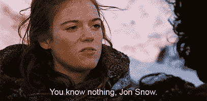
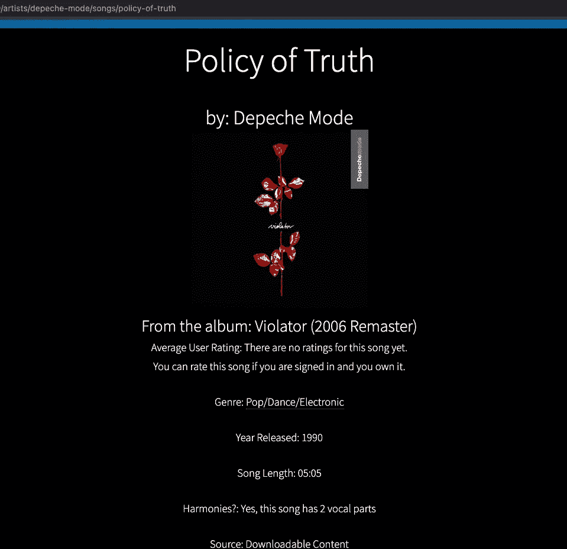
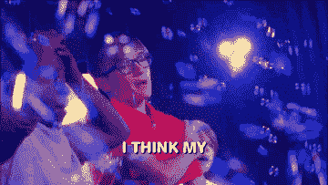
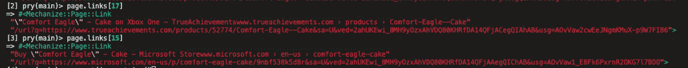
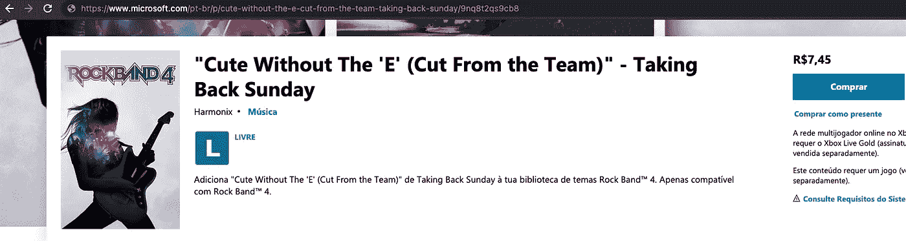
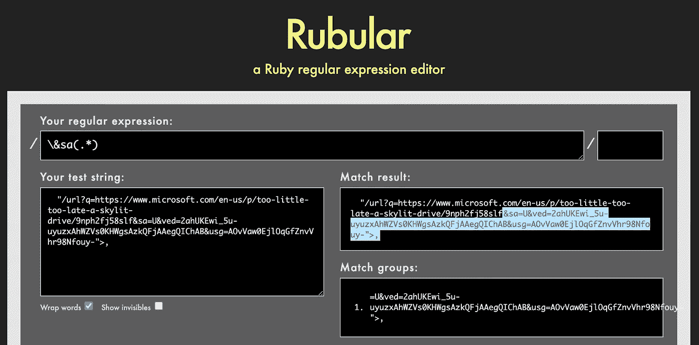
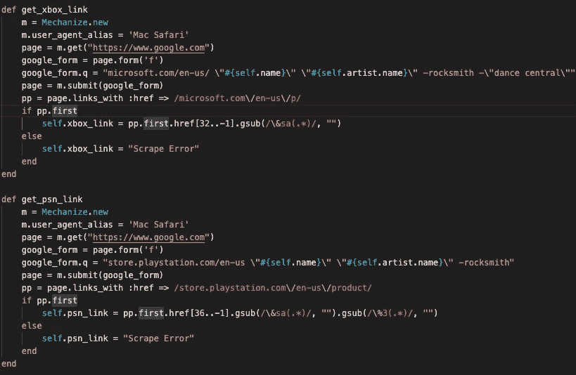

# 摇滚乐队之夜:火车不停地滚动

> 原文：<https://medium.com/geekculture/rock-band-night-the-rails-train-kept-a-rollin-88f5f2714cf8?source=collection_archive---------35----------------------->

## 我很不高兴我用这个作为标题。

进入 Flatiron School 的软件工程训练营的第三阶段，我已经根据我在第二阶段项目中不能完成的事情，规划出了我想要完成的事情。我采取了一种新的方法:不是等待两周的项目阶段正式开始，以开始应用程序的构建，而是在课程过程中构建它，以消除所有无聊的框架，并在我们学习它们时加入 Kool 的东西。作为一个不必要的痴迷的人，我认为我已经完全掌握了旧的概念，特别是关于从 API 中植入数据。

嗯…



# 你爱谁？

对于这个项目，我想改进游戏系列摇滚乐队已经存在的网络应用程序。自 2007 年摇滚乐队发行以来，通过 2015 年摇滚乐队 4 的发行，以及更远的时间，已经有超过 3000 首歌曲可供使用，可以用塑料吉他、塑料鼓和你真实、美丽的声音(取决于你喝了多少酒。)自摇滚乐队首次发行以来，歌曲一直作为可购买的可下载内容每周发布，它们可以有广泛的艺术家和流派，从贾斯汀比伯到金属乐队。

自然，休闲和硬核玩家多年来已经积累了数百首歌曲，如果不是数千首的话。然而，在游戏中选择歌曲的过程没有改变:向下滚动歌曲列表并选择一首。可以想象，根据收藏的歌曲数量或负责选择的人的音乐倾向，这可能需要的时间会急剧增加。

卡拉 ok 酒吧在任何时候都有数千首歌曲可供选择，他们通过以书籍的形式提供他们的收藏(或者通过 Healsonic 应用程序，为未来主义、环保的歌曲)来完善这一选择过程。)如果这是为摇滚乐队而存在的呢？

事实证明，确实如此。已经进行了几次尝试来简化这一过程。甚至有一个官方的 iOS/Android 应用程序可以直接从你的微软/索尼系统的歌曲缓存文件中提取你的收藏，尽管它维护得很差，很容易中断。我觉得我可以做得更好。

# 青少年焦虑(世界现在需要什么)，更像是我现在需要什么

当我着手这个项目时，我心中有几个目标:

*   提供摇滚乐队所有可用歌曲的列表
*   允许用户添加歌曲到他们的收藏中，忠实于他们的购买历史
*   (好吧，我还没有破坏其他功能。)

让我们来看看这篇文章中的《天堂里的芝士汉堡》:我需要可以找到的歌曲。我需要从现有的数据库中提取这些信息，而不是手动输入。RBDB 是一个极好的初始资源。它甚至被游戏开发商 Harmonix 选中，为他们的[官方歌曲数据库](http://rbdb.online)服务。然而，随着许多 fan 项目走向，它不再被维持(截至 2020 年 9 月 17 日。)，也许是出于缺乏官方支持，无聊，或者是报复。虽然我能够从 [DLC Quickplay](http://www.dlcquickplay.com) 上获得此后可用的歌曲列表，但它只提供了歌曲的名称及其艺术家。我仍然需要提供以下功能:

*   能够预览歌曲，在这种情况下通过 Spotify 播放器小工具。
*   即使用户的收藏中没有这首歌，我也想提供通过摇滚乐队之夜直接从用户的游戏平台或选择(Xbox 或 Playstation)购买这首歌的能力。这意味着在每个平台各自的市场上获得购买歌曲的链接。

RBDB 是提供这两者的绝佳资源，但只是在得到支持的情况下。这意味着 92 首歌曲(截至 2021 年 7 月 25 日)除了艺术家、流派、发行年份、可用性、演唱部分数量和乐队组件(吉他、鼓、人声)的游戏难度等基本属性外，没有必要的信息。)不能让那个混球在派对上挑选一些荒谬的、毫无必要的高难度死亡金属歌曲，对吧？

# 拿着钱跑吧

我不想手动完成这项工作，而是想为优秀的歌曲自动完成这一过程，并能够为未来的添加做准备。为了直接从 Spotify 的 API 以及微软和索尼的游戏内容市场获取信息，我回到了我信任的 Mechanize gem。

第一步是在每首歌曲的视图页面中启用 Spotify 预览。RBDB 为它跟踪的每首歌曲提供了 Spotify ID，所以这个调用就像

```
# app/views/song/show.html/erb #
...
<%= render partial: 'player', locals: {song: @song} %> <br>
...# app/views/songs/_player.html.erb #<iframe src="https://open.spotify.com/embed/track/<%= @song.spotify_id %>" width="300" height="80" frameborder="0" allowtransparency="true" allow="encrypted-media"></iframe>
```

考虑到这一点:

The “width=”300" height=”80"” removes the album cover area. Also, please PLEASE remember Coldplay for once being a great Jeff Buckley cover band instead of just thinking about all the awful crap they’ve put out since then.

效果非常好。除非我没有 Spotify 的 track ID，在 Spotify 的 API 之外不容易找到。获得一个 Spotify 开发者账户非常容易，一旦你获得了你的客户 ID 和客户密码(别忘了把这些钥匙扔进你的口袋里),设置 [RSpotify gem](https://github.com/guilhermesad/rspotify) 也同样容易。gitignore！).在 Rails 控制台中经历了许多痛苦之后，我最终得到了这个结果:

```
def get_spotify_id
    RSpotify.authenticate(ENV["SPOTIFY_CLIENT_ID"], ENV["SPOTIFY_CLIENT_SECRET"])
    tracks = RSpotify::Track.search("#{self.full_title}")
    if tracks.first.artists.first.name == self.artist.full_name
        self.spotify_id = tracks.first.id
    elsif tracks.second.artists.first.name == self.artist.full_name
        self.spotify_id = tracks.second.id
    elsif tracks.third.artists.first.name == self.artist.full_name
        self.spotify_id = tracks.third.id
    else
        self.spotify_id = "Find It Yourself"
    end
end
```

来自 RSpotify 的`.authenticate`负责根据需要刷新授权载体令牌。虽然并不完美，但它给了我三次机会来获得准确的 Spotify 曲目 ID。比如酷玩的颤栗 [0qksx8mV28lztYIZ1om8ml](https://open.spotify.com/track/0qksx8mV28lztYIZ1om8ml) 。有可能这位艺术家完全是个无名小卒，没有通过流媒体提供他们的音乐。也有可能是歌曲或艺术家(或者两者都是！)是如此通用，以至于它会导致多个匹配。我给了自己三次机会，看看歌曲名称是否与我提供的艺术家名称匹配。如果还是不行，我会在数据库中收到一条消息，提醒我无法找到合适的匹配。幸运的是，这仍然允许小部件呈现，但是显示找不到歌曲。

**编辑**:哦，RSpotify 毕竟可以带多部分查询。这往往会在第一时间抓住正确的轨道。

```
tracks = RSpotify::Track.search("#{self.full_title} artist:#{self.artist.full_name}")
```

不要不满足:

```
def get_album_art_url(song)
    RSpotify.authenticate(ENV["SPOTIFY_CLIENT_ID"], ENV["SPOTIFY_CLIENT_SECRET"])
    track = RSpotify::Track.search("#{song.full_title} artist:#{song.artist.full_name}")
    if !track.empty?
        album = RSpotify::Album.find("#{track.first.album.id}")
        album.images.second.values.second
    end
enddef display_album_art(song)
    if !get_album_art_url(song).nil?
        image_tag(get_album_art_url(song), class: "card-img-top")
    else
        "No Album Artwork Found"
    end
enddef get_album_name(song)
    RSpotify.authenticate(ENV["SPOTIFY_CLIENT_ID"], ENV["SPOTIFY_CLIENT_SECRET"])
    track = RSpotify::Track.search("#{song.full_title} artist:#{song.artist.full_name}")
    if !track.empty?
        track.first.album.name
    else
        "Album Information Not Found"
    end
end
```

Whee！



诚然，如果专辑是单曲、再版、合辑或 Kidz Bop，我们仍受 Spotify 的支配，但我们现在有大量资源可供支配。



Towel so wet, it’s gotta be hand dried.

# 出来玩吧(把他们分开)

这对 Spotify IDs 来说相当有效(抱歉，没有 Harmonix 试图向我们灌输的名字乐队)，但接下来是清理 Xbox 和 Playstation IDs 的艰难步骤。由于两家公司都没有提供直接提取这些数据的 API，而且他们自己的搜索表单往往不会返回相关的结果，所以我不得不从谷歌获取链接。不知何故。

Mechanize 特别漂亮，因为它允许您完成和提交表单。至少可以说，我的第一次尝试有点偶然:

```
def scrape_xbox_link        
    page = Mechanize.new.get("https://www.google.com")   
    google_form = page.form('f')         
    google_form.q = "xbox live #{self.artist.name} #{self.name}"     
    page = Mechanize.new.submit(google_form)        
    self.xbox_link = page.links[17].href[52..63]       
end
```

[。form 是一个机械化的类](https://www.rubydoc.info/gems/mechanize/Mechanize/Form)，它允许用户在页面上选择一个表单元素。就谷歌的首页而言，只有一种形式可供选择:位于页面中间的标志性形式。接下来，我们需要一个可能返回我们正在寻找的值的查询:给定歌曲名称和歌曲艺术家的平台的 marketplace 购买链接。然后，带有搜索结果的页面将被检查市场链接(通常是[！])第 17 个)，然后我会把 URL 中对应于那首歌的字符串的唯一位砍掉。比如 Wheatus 购买**少年人渣的 PSN 商店链接是[**up 8802-CUSA 02084 _ 00-s18 passsong 13 XXX**](https://store.playstation.com/en-us/product/UP8802-CUSA02084_00-S18PASSSONG13XXX/)而 **Limp Bizkit** 购买**Rollin’(空袭车)**的 Xbox 商店链接是 [**9mz932f3f8nb**](https://www.microsoft.com/en-us/p/rollin-air-raid-vehicle-limp-bizkit/9mz932f3f8nb) 。**

一切都很好，直到我开始抓取许多不相关的链接。果然，在 17 岁的边缘有麻烦了(哦，宝贝，哦，说哦):



Discomfort Penguin

第 15 个链接是我需要的，因为第 17 个是一个游戏博客的链接。这需要一种不同的方法。我进一步研究了机械化的工作方式。显然，如果它检测到自动爬虫，微软和索尼会附加盐咸的废话，所以 Mechanize 提供了一种方法来定义用户代理，并假装请求来自使用浏览器的人。

```
Mechanize.new.user_agent_alias = 'Mac Safari'
```


At least I didn’t get a picture of a golden Harry Styles statue.

其他问题出现在共同条款(Xbox Live Gold 是一种高级订阅服务)以及歌曲何时成为其他游戏的可下载内容。在这个例子中，第一个链接(技术上是第三个，因为谷歌的建议)是为游戏 Fuser 购买 Golden。Dance Central 和 Rocksmith 是其他游戏，其中歌曲也可以作为可下载内容存在。最后，只有美国版的可下载内容可以被美国版的摇滚乐队使用，在 URL 中用“en-us”表示。



Hey, how come theirs is cheaper? ($1.44 USD at time of writing, vs. $1.99 here)

为了删除错误的游戏和市场区域，新的查询是:

```
google_form.q = "xbox live en-us #{song.name} #{song.artist.name} -rocksmith -dance -fuser"
```

# 鲁布拉，鲁布拉索霍

然而，我仍然需要停止依赖固定的链接位置，能够直接搜索正确的数据。通过使用 Mechanize 的 [links_with](https://www.rubydoc.info/gems/mechanize/Mechanize/Page#link-instance_method) ，我可以定义链接返回的标准，使用反斜杠来转义正则表达式中的斜杠。

```
pp = page.links_with :href => /microsoft.com\/en-us\/p/
```

在进一步观察返回的链接后，我注意到附加的加盐散列，尽管长度不同，但总是以“&sa”开头。使用仁慈的 [Rubular](https://rubular.com/) 测试编辑器，我能够编写表达式，用 Ruby 删除所有无用的尾随字符。gsub 方法。



Regular expression? Don’t downplay yourself, you’re an awesome expression!

因此，我可以获取相关的 URL 字符串，并安全地将其保存为歌曲的 xbox_link 属性。数组的-1 索引是它的最后一个元素，所以我不需要指定我的范围的结尾。

```
self.xbox_link = pp.first.href[32..-1].gsub(/\&sa(.*)/, “”)
```

在这一点上，我只是偶尔遇到一个错误，因为缺少匹配的结果，我会简单地把它写下来，以后再修复。1 比 3000 好吧？

```
if pp.first
    self.xbox_link = pp.first.href[32..-1].gsub(/\&sa(.*)/, "")
else
    self.xbox_link = "Scrape Error"
end
```


Hooray for perpetuating late-stage capitalism!

最终的运行代码如下所示:



我在 Google 查询中添加了双引号，要求搜索精确的字符串，也可以用反斜杠进行转义。Dance Central 是 XBox 平台独有的，但不将其括在引号中会导致 Dance Gavin Dance 这样的乐队被省略(在大多数情况下这并不是一件坏事。).索尼的链接有一个额外的 gsub out 散列，但一旦我找到了共同的元素，这就不是问题了。

# **徒然训练(袖手旁观我)**

我希望我不是摇滚乐队 app 火炬接力中的最后一名幸存者，但我绝对愿意投入工作，以确保我的数据库仍然是真实的准确来源。