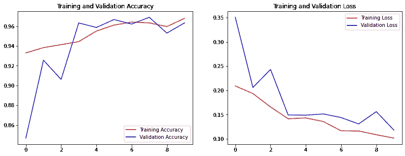
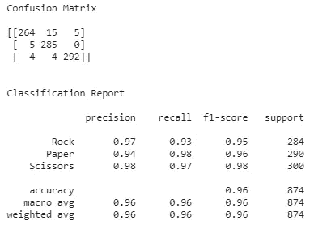
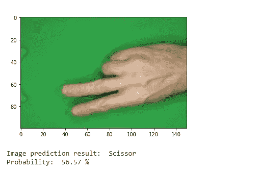
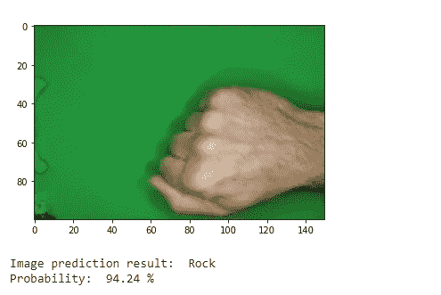
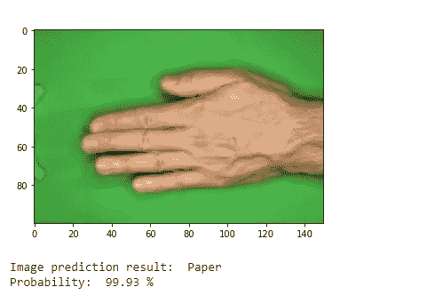
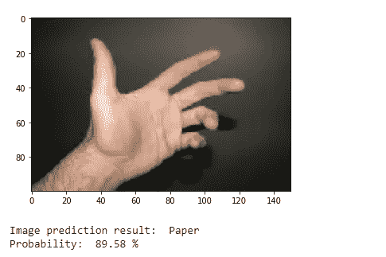

# 基于 CNN 的石头剪子布图像分类

> 原文：<https://medium.com/geekculture/rock-paper-scissors-image-classification-using-cnn-eefe4569b415?source=collection_archive---------3----------------------->

这是我第一次在 [Dicoding Academy](https://www.dicoding.com/learningpaths/30) 学习作为 ML 开发者学习路径的一部分的图像分类，所以我决定把它贴出来，以便特别为初学者提供一个更好的图像分类的图片。

您可以在 [GitHub](https://github.com/Farah-Amalia/Rock-Paper-Scissors-Image-Classification/blob/main/Rock_Paper_Scissors.ipynb) 上访问完整的代码。

# 了解数据集

数据集由 Dicoding Academy 提供，可通过此[链接](https://dicodingacademy.blob.core.windows.net/picodiploma/ml_pemula_academy/rockpaperscissors.zip)访问。该数据集总共包含 2188 幅 300 x 200 像素的图像，对应于石头剪刀布游戏的手势:“石头”(726 幅图像)、“布”(710 幅图像)和“剪刀”(752 幅图像)。以下是从数据集中截取的一些图像:

# 加载数据集

我们将使用 wget 命令来加载数据集。我们还需要导入我们将在这个项目中使用的库。

# 数据预处理

首先，我们提取已经下载的文件。

下一步是使用数据扩充来帮助训练过程。数据集非常有组织，所以我们需要添加一些变化。

根据参数的不同，上面的代码可以生成不同变化的随机图像。下面是对我们刚刚写的内容的解释[【1】](https://blog.keras.io/building-powerful-image-classification-models-using-very-little-data.html):

*   `rescale`是一个值，在进行任何其他处理之前，我们会将数据乘以该值。我们的原始图像包含 0-255 范围内的 RGB 系数，但是这样的值对于我们的模型来说太高而无法处理(给定典型的学习率)，因此我们通过以 1/255 的因子进行缩放来将目标值设置在 0 和 1 之间
*   `rotation_range`以度为单位的值(0-180)，在此范围内随机旋转图片
*   `horizontal_flip`用于在没有水平不对称假设的情况下，随机翻转一半水平相关的图像(如真实图片)
*   `shear_range`用于随机应用剪切变换
*   `fill_mode`是用于填充新创建的像素的策略，它可以在旋转或宽度/高度移动后出现
*   `validation_split`是将训练数据集分为训练和验证

请注意，数据扩充应该只应用于训练数据集，而不是验证数据集。

# 卷积神经网络(CNN)

A regular Neural Network representation ([source](https://cs231n.github.io/convolutional-networks/))

CNN representation ([source](https://cs231n.github.io/convolutional-networks/))

卷积神经网络(简称 CNN)是图像分类中最流行的技术之一。

CNN 与前一章中的普通神经网络非常相似:它们由具有可学习的权重和偏差的神经元组成。每个神经元接收一些输入，执行点积，并且可选地以非线性跟随它。整个网络仍然表达一个可微分的分数函数:从一端的原始图像像素到另一端的类分数。并且它们在最后(全连接)层上仍然具有损失函数(例如，SVM/软最大),并且我们为学习常规神经网络开发的所有提示/技巧仍然适用。

不同之处在于，CNN 架构明确假设输入是图像，这允许我们将某些属性编码到架构中。这使得转发功能更有效地实现，并极大地减少了网络中的参数数量[【2】](https://cs231n.github.io/convolutional-networks/)。

## 模型构建

在我们完成预处理和分割数据集之后，我们就可以开始构建 CNN 模型了。

下面是对上述代码的简要解释:

*   第一层由 16 个大小为 3 的过滤器组成，包括大小为 100 x 150 的输入形状。
*   ReLU(整流线性单元)用于激活功能
*   接下来，我们有 2 x 2 最大池层。最大池是一种技术，通过提供抽象形式的表示[【3】](https://deepai.org/machine-learning-glossary-and-terms/max-pooling)来帮助减少过度拟合。
*   速率为 0.2 的退出技术用于最小化训练网络内的过拟合效应[【4】](https://towardsdatascience.com/understanding-and-implementing-dropout-in-tensorflow-and-keras-a8a3a02c1bfa)。
*   随着过滤器 32 和 64 数量的增加，重复相同的层
*   使用展平层是因为完全连接的层的输入应该是二维的。
*   128 个单元的密集隐藏层
*   最后是输出层，包含 3 个单元，因为我们有 3 类输出。该层的激活函数是 softmax。

## 回调、编译和拟合

接下来我们将使用回调，然后编译并拟合我们构建的模型。

回调函数(ReduceLROnPlateau)用于在指标停止改善时降低学习率[【5】](https://keras.io/api/callbacks/reduce_lr_on_plateau/)。

对于模型编译，我们使用 Adam 算法，一种基于一阶和二阶矩的自适应估计的随机梯度下降方法[【6】](https://keras.io/api/optimizers/adam/)。

## 模型评估

现在让我们评价一下我们 CNN 模型的性能。我创建了一个函数来绘制每个训练和验证数据集的准确度和损失。

我还创建了一个函数来显示混淆矩阵和分类报告。

接下来我们只需要调用函数来显示情节和报告。您可以在下面看到结果:

Accuracy and Loss Plot

上述结果表明，对于训练数据集和验证数据集，精度在稳步增加，而损失也在减少。

Confusion Matrix and Classification Report

接下来，我们评估验证数据，我们获得了 96%的准确率，这是相当高的。我们可以通过上传新图像来测试它，并让模型预测它是一个纸、石头还是剪刀的手势。这是我创建的预测新图像的函数。

正如我们所看到的，CNN 模型可以正确地将图像预测到它们各自的手势类别。现在，我们还想测试模型的其他手的形象如下所示。

有趣的是，模型将图像分类为纸张，而事实上，手并不意味着石头、纸张或剪刀的手势。无论如何，模型预测它是纸，因为它看起来更像纸手势。

# 结论

我们的 CNN 模型能够以 96%的准确率检测石头剪刀布手势。在下一篇文章中，我将讲述在相同的数据集上使用 ResNet50V2 实现迁移学习。

参考资料:

[1][https://blog . keras . io/building-powerful-image-class ification-models-using-very-little-data . html](https://blog.keras.io/building-powerful-image-classification-models-using-very-little-data.html)

[2]https://cs231n.github.io/convolutional-networks/

[3][https://deepai . org/machine-learning-glossary-and-terms/max-pooling](https://deepai.org/machine-learning-glossary-and-terms/max-pooling)

[4][https://towards data science . com/understanding-and-implementing-dropout-in-tensor flow-and-keras-a 8 a3 a 02 C1 BFA](https://towardsdatascience.com/understanding-and-implementing-dropout-in-tensorflow-and-keras-a8a3a02c1bfa)

[https://keras.io/api/callbacks/reduce_lr_on_plateau/](https://keras.io/api/callbacks/reduce_lr_on_plateau/)

[https://keras.io/api/optimizers/adam/](https://keras.io/api/optimizers/adam/)