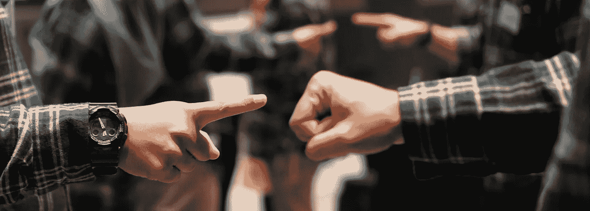
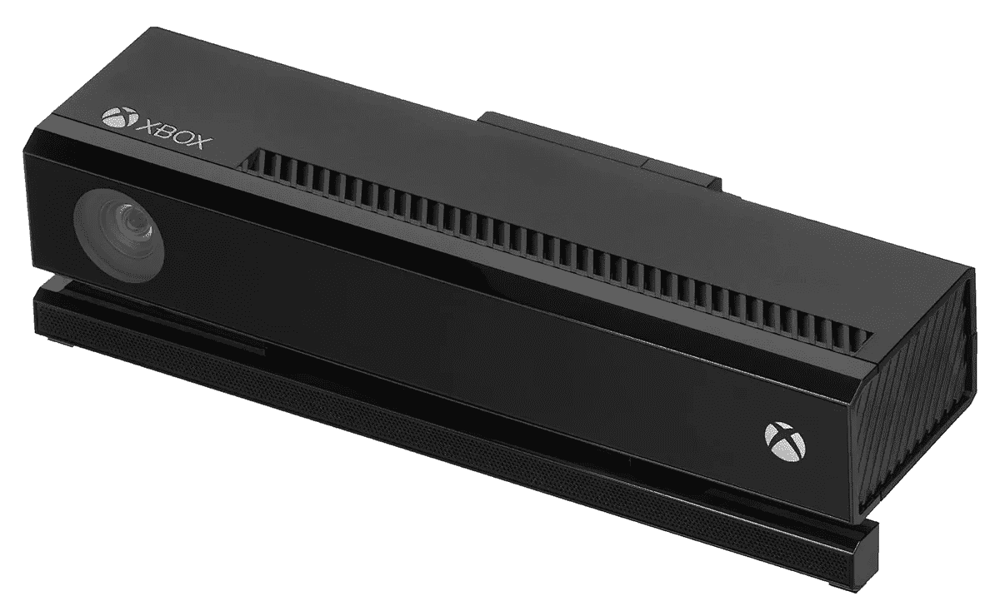
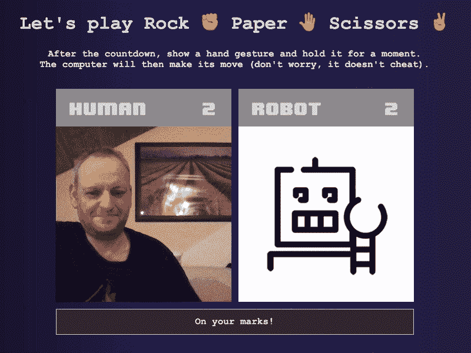
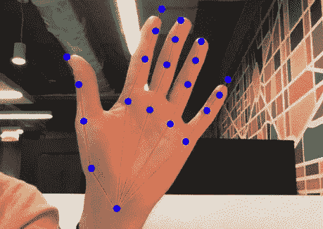
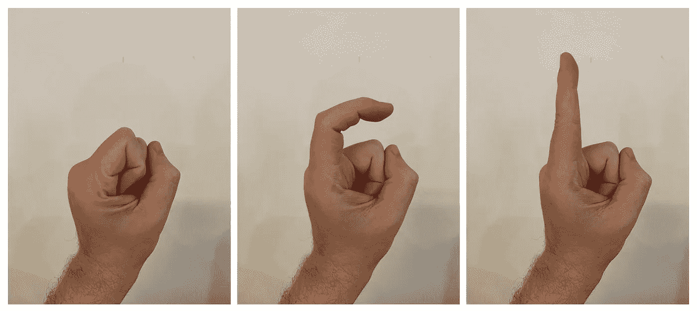
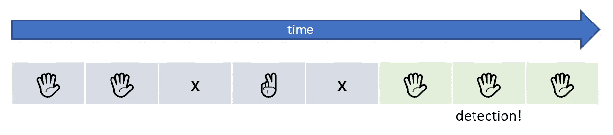

# 具有手势识别功能的石头、剪子、布

> 原文：<https://medium.com/geekculture/rock-paper-scissors-with-hand-gesture-recognition-841297a7d915?source=collection_archive---------2----------------------->



Photo by [Akeyodia — Business Coaching Firm](https://unsplash.com/@akeyodia?utm_source=unsplash&utm_medium=referral&utm_content=creditCopyText) on [Unsplash](https://unsplash.com/?utm_source=unsplash&utm_medium=referral&utm_content=creditCopyText)

用 JavaScript 和 TensorFlow.js 创建一个有趣的浏览器游戏

*TL；博士，如果你只是为了源代码而来，你可以从我下面的仓库下载👇👇👇还可以* [*在线玩游戏*](https://andypotato.github.io/rock-paper-scissors/demo/) *。*

[](https://github.com/andypotato/rock-paper-scissors) [## GitHub-andypotato/石头剪刀布:用 TensorFlow.js 实现的石头剪刀布游戏…

### 用 TensorFlow.js 和 finger pose-GitHub-and ypotato/石头剪刀布实现的石头剪刀布游戏…

github.com](https://github.com/andypotato/rock-paper-scissors) 

还记得微软 Kinect 吗？那个庞大的感应条曾经是世界上销售最快的消费电子设备，后来不得不从 Xbox One 的包装中分离出来？

它没有得到游戏开发者的喜爱，但 Kinect 实际上是一款相当不错的硬件。头部跟踪和身体姿势估计工作得非常好，它甚至可以检测到像“捏”和“拳头”这样的简单手势。它的零售价格在 99 美元左右，很快成为黑客社区和制造商社区的最爱。



The Microsoft Kinect 2 (Image credit: [Wikipedia](https://en.wikipedia.org/wiki/Kinect))

遗憾的是，我们还没有看到 2014 年“Kinect 2”型号的真正继任者，该型号已于 2018 年停产。2019 年的“Kinect Azure”没有填补这一空白，原因有多种:

*   它要贵得多。你可以找到一个大约 50 美元的二手 Kinect 2，而 Azure 开发套件目前的售价超过 1000 美元。
*   Kinect 2 是一款开箱即用的独立设备。Azure 需要额外的英伟达 GPU (RTX 2060 或更好的)才能工作。祝你最近能找到一个。

幸运的是，随着机器学习和计算机视觉的最新进展，现在有一些很好的替代方法可以将类似 Kinect 的功能添加到您的项目中。

## TensorFlow.js 简介

TensorFlow 由谷歌大脑团队开发，是一个流行的 Python 编程语言的机器学习(ML)库。TensorFlow.js (TFJS)是它的 JavaScript 配套库。引用[官网](https://www.tensorflow.org/js):

> TensorFlow.js 是 JavaScript 中机器学习的库。用 JavaScript 开发 ML 模型，直接在浏览器或者 Node.js 中使用 ML。

TensorFlow.js 不仅仅是一个令人惊叹的软件，它还让你可以访问一个不断增长的机器学习模型库，随时可以用于你的项目。

在本教程中，我将向您展示如何使用基于 TFJS 的机器学习模型来创建一个带有手势控制的“石头、剪子、布”游戏。最终的游戏将在你的网络浏览器中运行，只使用 HTML 和 JavaScript。

# 让我们做个游戏吧！

本教程的重点是手势识别部分，没有那么多的游戏开发。所以为了加快速度，[我已经为你准备了一个简单的游戏界面](https://andypotato.github.io/rock-paper-scissors/demo/)。👇👇



I swear the computer is not cheating! [Play the game here](https://andypotato.github.io/rock-paper-scissors/demo/)

然而，为了更好地理解我们正在构建的游戏，让我们创建一个简单的游戏设计文档。

## 游戏设计文档

开发游戏时，通常最好的开始方式是通过创建游戏设计文档来描述游戏性。有很多方法可以做到这一点，例如画一个故事板。


Very professional Game Design Document example

对于像“石头、剪子、布”这样的简单游戏，我们将只是口头描述游戏应该如何工作:

1.  游戏将加载并在初始化期间显示“请等待”消息
2.  玩家和对手显示在一起
3.  游戏的第一轮通过按键或按钮开始
4.  新一轮开始倒计时，要求玩家做好准备
5.  玩家应展示手势(石头、布或剪刀)
6.  一旦注册了有效的手势，就将其与计算机手势进行比较(此时计算机手势仍然是隐藏的)
7.  根据“石头、剪刀、布”的规则来评估结果
8.  获胜者获得一分，分数显示更新
9.  开始下一轮(转到第 4 项)

UI 已经过时了，让我们直接进入正题。

# 构建手势识别器

在构建石头、剪子、布游戏时，关键的挑战是识别✊的三种手势🤚相机里的✌。

在我们研究事情的实际实现之前，让我们先后退一步，想想检测手势的高级过程是什么样子的:

*   我们正试图从相机照片中确定手势。因此，第一步是检测手是否真的在相机画面内。
*   如果检测到手，我们估计所有手指关节的位置来跟踪手的骨架。



Finger joint estimation ([Source](https://github.com/tensorflow/tfjs-models/tree/master/handpose))

手部骨骼检测器返回 21 个关键点(也称为“标志”):每个手指的四个关节加上手腕。这是我们的原始数据，我们将进一步处理。

## 使用关键点

关键点代表 2D 坐标，告诉我们图片中每个骨架点的位置。这对于描述一个手势不是很有用，因为很难根据关节的位置来比较两个手势。一只手可以出现在照片的任何地方，它可以旋转，人们可以是左撇子或右撇子。

让我们试着用自然语言描述一个手势来找到一个更好的表达方式:

采取“竖起大拇指”的手势👍举个例子:它可以被描述为“所有四个手指完全卷曲并指向左边或右边。拇指不得卷曲并指向上方”。

卷曲和指向是描述手势的一种更简洁的方式。它们与相机画面中手的大小和位置无关，也可以很容易地从原始 2D 坐标中推导出来。



Index finger fully curled, half curled, non-curled

**这使我们进入检测过程的下一步:**

*   使用关键点，我们描述每个检测到的手指的卷曲和指向。
*   最后，我们将这个描述与已知手势列表进行比较，并检查哪一个是最佳匹配。

太好了，我们找到了检测手势的方法——至少在理论上。现在让我们看看 TensorFlow.js 如何帮助我们实际实现它:

## 选择合适的机器学习模型

正如我在介绍中提到的，TensorFlow.js 让您可以访问许多有用的机器学习模型的[库，您可以立即在自己的应用程序中使用这些模型。](https://www.tensorflow.org/js/models)

其中一款提供“手部姿势检测”。描述如下:

> 手掌检测器和手骨架手指跟踪模型。它预测每个检测到的手的 21 个 3D 手关键点。

[](https://github.com/tensorflow/tfjs-models/tree/master/handpose) [## 主 tensorflow/tfjs-models 的 tfjs-models/handpose

### 注意:此模型最多只能检测输入中的一只手-多手检测将在未来推出…

github.com](https://github.com/tensorflow/tfjs-models/tree/master/handpose) 

听起来这个模型已经可以覆盖我们检测过程的步骤(1)和(2)并提取我们需要的原始数据。厉害！让我们安装它:

## 安装手摇电话

首先，我们需要安装模型本身:

```
npm i --save @tensorflow-models/handpose
```

接下来，我们安装它的 TensorFlow.js 依赖项:

```
npm i --save @tensorflow/tfjs-core
npm i --save @tensorflow/tfjs-converter
npm i --save @tensorflow/tfjs-backend-webgl
```

TensorFlow.js 可以使用计算机的 GPU 来获得额外的性能。几乎任何 GPU(英伟达、AMD、Intel)只要支持 WebGL 都可以工作。[你的最有可能做](https://get.webgl.org/)，所以一定要安装 WebGL 后端，免费获得巨大的速度提升。

## 处理原始数据

正如我之前提到的，原始数据对于手势检测不是很有用。为了处理数据，我们需要将其转换为“卷曲”和“指向”。幸运的是，有另一个库可以做到这一点:

[](https://github.com/andypotato/fingerpose) [## GitHub - andypotato/fingerpose:基于 TFJS 的手指姿态分类器，用于通过…

### 用于由 MediaPipe Handpose 检测的手标志的手指手势分类器。它能检测出像“胜利”✌️or…这样的手势

github.com](https://github.com/andypotato/fingerpose) 

*(嗨👋我也是 Fingerpose 库的作者)*

使用以下命令安装 Fingerpose 库:

```
npm i --save fingerpose
```

## 定义手势

Fingerpose 希望你通过描述每个手指的**方向**和**卷曲**来定义一个手势。我们的游戏使用三种不同的手势，所以我们需要为每个手势创建一个`GestureDescription`。

**形容✊:的摇滚姿态**

摇滚手势基本上就是你握紧拳头:

*   你把手指弯向手掌，向下弯曲，直到每个指尖接触到相应的底部。
*   然后你向下弯曲拇指，使它落在食指和中指的上半部分。

该代码将“摇滚”手势描述为:

1.  所有手指完全卷曲
2.  拇指必须半卷曲或根本不卷曲

以防你对第二个条件感到疑惑:你完全翘起大拇指在生理上是不可能的(除非你是胡迪尼)。此外，有些人在握拳时会将拇指放在食指旁边，有效地将其伸出。所以我们告诉 finger pose,**和**都是可接受的，同样有效。

**接下来我们来看看“纸”的手势** 🖐 **:**

这里没有惊喜。要做一个“纸”的手势，你必须伸出你所有的手指和拇指。

**最后我们来看看《剪刀》** ✌️ **:**

“剪刀”手势很像一个“胜利”的标志。伸出食指和中指。无名指和小指应该是半卷或全卷。我们不关心大拇指，就省略了。

如果你想知道每个手指的指向:不像一个“竖起大拇指”的手势在颠倒时有完全不同的含义，我们游戏的手势在镜像或旋转时不会改变它们的含义。因此，可以省略方向以保持描述简单。

## 把所有的放在一起

手势识别器的实现包括两个部分:

1.  模型的一次性初始化
2.  处理每个视频帧

让我们看看初始化过程的一些代码:

上面的代码将首先创建一个 Fingerpose `GestureEstimator`实例。只需将已知手势的列表传递给它的构造函数，就可以使用了。

之后，HandPose 模型将被加载和初始化。这可能需要一些时间，因为它还会从 tfhub.dev 网站下载一些文件(模型权重)。

最后一步是可选的，但将极大地改善用户体验。加载模型后，我建议您通过对样本图像进行一次预测来“预热”模型。这是因为第一次预测可能会花费相当多的时间，而后续预测通常会快得多。如果你在初始化过程中做了第一个(慢的)预测，它不会减慢你以后的游戏速度。

**处理视频帧:**

同样，让我们先看一些代码:

**代码解释:**

1.  我们通过调用 HandPose 模型的`estimateHands`函数来预测 21 个关键点(地标)，将 HTML 视频元素作为第一个参数传递。第二个参数指示源视频是否水平翻转。
2.  如果预测了关键点，我们将它们和最低要求的匹配分数(0 到 10，10 =完全匹配)一起传递给 Fingerpose。匹配分数告诉 Fingerpose 忽略分数较低的可能匹配。
3.  根据您的最低匹配分数，Fingerpose 可以返回一个包含多个可能匹配的数组。这段代码将选择具有最高匹配分数(置信度)的手势。

此方法的返回值将是具有最高匹配分数的手势的名称，或者在没有检测到手势的情况下为空字符串。

## 提高检测稳定性

当您在源视频上运行上面的代码时，您会注意到预测偶尔会不稳定。在某些帧中，HandPose 将检测“幻影手”(假阳性)或根本没有手(假阴性)。这会对游戏性产生影响。



一个简单的解决方案是通过将来自几个连续帧的检测组合成单个结果来创建低通滤波器。例如，在我们发出“检测到岩石”事件之前，我们可以等待三个连续帧被分类为“岩石”手势:

## 防止阻止游戏用户界面

运行机器学习模型可能会对您的 CPU 和 GPU 造成很大负担。虽然 TensorFlow.js 非常快(尤其是在使用 WebGL 后端运行时)，但它仍然会导致您的游戏 UI 无响应。尤其是当您在视频流的每一帧上运行该模型时。

同样，有一个简单的解决方法可以防止 UI 锁定。您可以将`predictGesture`函数包装在一个`setTimeout`调用中，超时时间为零秒。在 StackOverflow 上查看[这个线程，了解更多关于这个解决方法的信息。](https://stackoverflow.com/questions/779379/why-is-settimeoutfn-0-sometimes-useful)

下面是一些如何创建非阻塞检测循环的示例代码:

## 包装它

通过上面的代码，我们实现了一个快速稳定的手势检测器。查看完整的源代码，了解如何将其集成到最终游戏中:

[](https://github.com/andypotato/rock-paper-scissors) [## GitHub-andypotato/石头剪刀布:用 TensorFlow.js 实现的石头剪刀布游戏…

### 用 TensorFlow.js 和 finger pose-GitHub-and ypotato/石头剪刀布实现的石头剪刀布游戏…

github.com](https://github.com/andypotato/rock-paper-scissors) 

我的教程到此结束。请随意使用我的源代码作为您自己的游戏或应用程序的基础。如果您有任何意见、问题或建议，请在评论中开始对话。

也可以看看我的另一个教程，关于如何使用面部表情检测来创建一个有趣的游戏。

[](/@andreas.schallwig/do-not-laugh-a-simple-ai-powered-game-3e22ad0f8166) [## 不要笑——一个简单的人工智能驱动的游戏

### 我如何将 TensorFlow.js 与 Vue 和 Electron 集成

medium.com](/@andreas.schallwig/do-not-laugh-a-simple-ai-powered-game-3e22ad0f8166) 

**非常感谢你阅读本教程！给我留点掌声👏如果你喜欢的话——我很想看看你想出的所有酷的东西！️❤️**