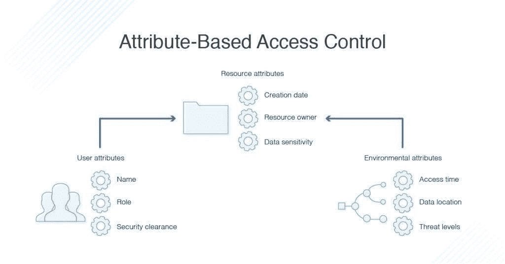

# Nodejs 中 NoSQL 数据库的基于角色的访问控制(RBAC)

> 原文：<https://medium.com/geekculture/role-based-access-control-rbac-for-nosql-db-in-nodejs-e72924074d13?source=collection_archive---------2----------------------->

> *许多 RBAC(基于角色的访问控制)的实现各不相同，但其基础被广泛采用，因为它模拟了现实生活中的角色(工作)分配。—* [奥努尔耶尔德勒姆](https://github.com/onury)。

基于角色的访问控制(RBAC)是一种基于组织内单个用户或用户组的角色来修改访问和权限的方法。

RBAC 允许组织成员只访问他们工作所需的资源，并限制或阻止对不属于他们的资源的无限特权。


# RBAC 对 ABAC

基于角色的访问控制和基于属性的访问控制(ABAC)都是访问控制方法的类型，但是它们的方法不同。需要 RBAC 系统的一个用例是，我们打算根据用户的角色授予应用程序特权。


而 ABAC 基于属性的组合，即用户属性、资源属性、与要访问的系统或应用程序相关联的属性、环境属性等，来授予访问权。例如，用户属性可能包括生物数据信息、唯一标识、角色、安全许可等。



# 背景故事

在最近的一个项目中，我的团队负责使用 mongoose ORM 模式为 MongoDB(NoSQL 数据库)实现一个定制的基于角色的访问控制框架。在这个访问控制框架中，我们将考虑 3 个实体:

**实现上下文**

*   用户有一个角色
*   应用程序已经定义了资源，
*   该角色拥有资源的特权和权限

让我们为我们的集合编写一些 mongoose 模式😄

# (计划或理论的)纲要

**resources.models.js**

```
/* RBAC - role-based access control
 first create roles; role =[ "user", "guest", "organization",  "superadmin" "globalsuperadmin"]
 next, create resouuce, add their roles_id and permmissions
 finally create users and indcate thier roles
*/const mongooseClient = app.get('mongooseClient');
    const { Schema } = mongooseClient;const resources = new Schema({
      name: { type: String, required: true },
      slug: { type: String, required: true },
      resources_roles: [{
        roles_id: { type: Schema.Types.ObjectId, ref : 'Roles' },
        roles_name: { type:  String },
        create: { type: Boolean },
        delete: { type: Boolean },
        update: { type: Boolean },
        read: { type: Boolean },
      }]
    }, {
      timestamps: true
    });return mongooseClient.model('resources', resources);
```

**roles.models.js**

```
const mongooseClient = app.get('mongooseClient');
    const { Schema } = mongooseClient;module.exports = function (app) {
    const mongooseClient = app.get('mongooseClient');
    const { Schema } = mongooseClient;
    const roles = new Schema({
      name: { type: String, required: true },
      slug: { type: String, required: true },
    }, {
      timestamps: true
    });return mongooseClient.model('roles', roles);
  };
```

**users.models.js**

```
const mongooseClient = app.get('mongooseClient');
    const { Schema } = mongooseClient;module.exports = function (app) {
    const mongooseClient = app.get('mongooseClient');
    const { Schema } = mongooseClient
    const users = new mongooseClient.Schema({
      email: {type: String, unique: true, lowercase: true},
      password: { type: String },
      first_name: { type: String },
      last_name: { type: String },
      roles: { type: Schema.Types.ObjectId, ref : 'Roles' },}, {
      timestamps: true
    });return mongooseClient.model('users', users);
  };
```

现在，当您需要某个角色对某个资源的权限时，您只需查找`role_id`和`resource_id`，并检查在`resources collection`中将哪些权限设置为`true`。

# 授权中间件

`users.post('/', getAuth, someMethod)`

假设您在请求上有一个某种令牌来标识发布帖子的用户，并将用户实例附加到请求对象，您可以这样做:

```
// pseudo code
getAuth = function (req, res, next) {
  if(req.user) {// query to get the user role's  permissions for a resource
    if(token){
    // handle jwt token authenticity and decrypt payload// get permission handler
    db.getPerms({ role_id: req.user.role_id, resource_id: req.resource.id})
    .then((perms) => {
       var allow = false;
       // mapping of methods to permissions
       perms.forEach(function(perm){
           if (req.method == "POST" && perms.create) allow = true;
           else if (req.method == "GET" && perms.read) allow = true;
           else if (req.method == "PUT" && perms.write) allow = true;
           else if (req.method == "DELETE" && perm.delete) allow = true;})
       if (allow) next();
       else {
            res.status(403).send({error: 'access denied'});
        }
    })
    .catch((err)=> {
       //handle your reject and catch here
    })
} else{
    res.status(400).send({error: 'invalid token'})
}
```

这是一些伪代码，展示了如何编写认证中间件。

这不是实现 RBAC 的最佳框架，所以我期待您的反馈😄！！

感谢观众，希望这篇文章对你有所帮助🤗。你可以随时在 Github、T2、推特和 T4 的 LinkedIn 上联系我。一定要点赞、评论和分享😌。

*最初发布于*[*https://blog . next Webb . tech*](https://blog.nextwebb.tech/role-based-access-control-rbac-for-nosql-db-in-nodejs)*。*