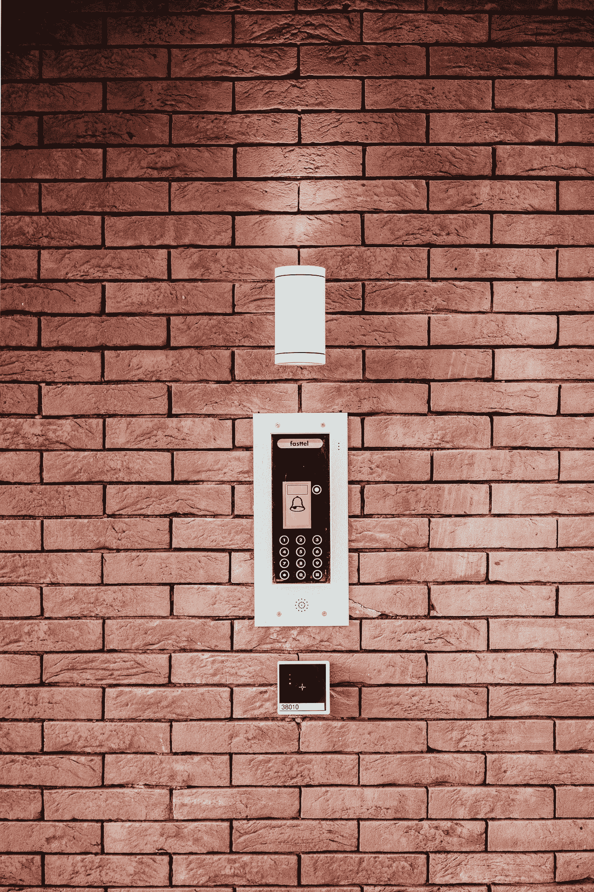

# 基于角色的访问控制(RBAC)模型

> 原文：<https://medium.com/geekculture/role-based-access-control-rbac-model-7d8e7b7350d2?source=collection_archive---------1----------------------->

Photo by [Bernard Hermant](https://unsplash.com/@bernardhermant?utm_source=medium&utm_medium=referral) on [Unsplash](https://unsplash.com?utm_source=medium&utm_medium=referral)

## 角色-权限、用户-角色和角色-角色关系

> 如果你觉得我为你贡献了价值，请支持我！

过去 5 个月，我越来越难达到我想要的收入，但如果我停下来，我会为我推荐的会员感到难过。