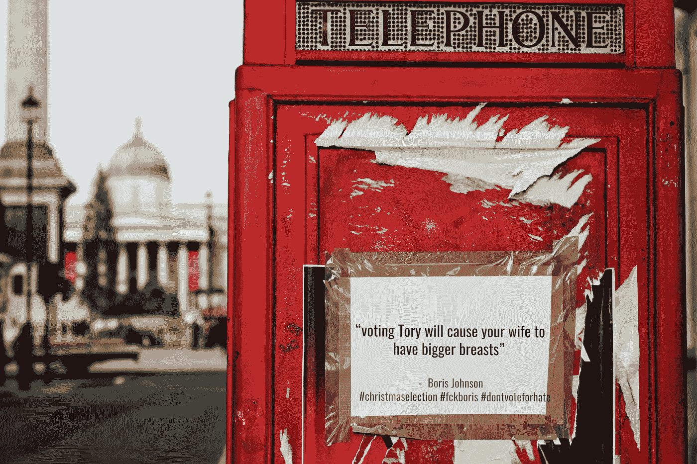

# 人工智能在心理战中的作用

> 原文：<https://medium.com/geekculture/role-of-ai-in-psychological-warfare-73ec0c98515a?source=collection_archive---------44----------------------->

## 剑桥分析公司和 SCL 集团如何开创数据驱动的心理战

[Photo By Metin Ozer, Unsplash](https://unsplash.com/photos/oek14gIKdRI)

自从人类发动战争以来，心理战就一直存在。公元前 6 世纪，波斯人知道埃及人崇拜猫神巴斯泰托女神，就在盾牌上画了猫的形象。成吉思汗使用恐怖作为心理武器…