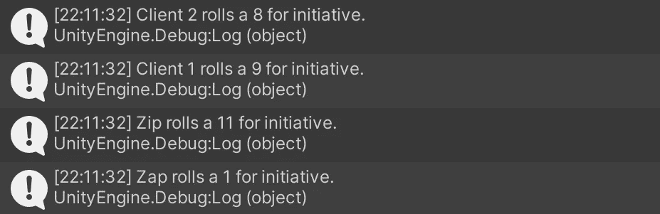
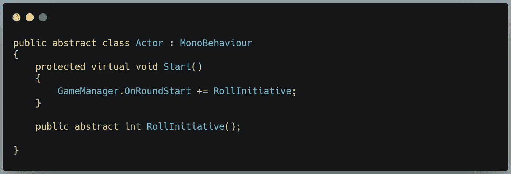
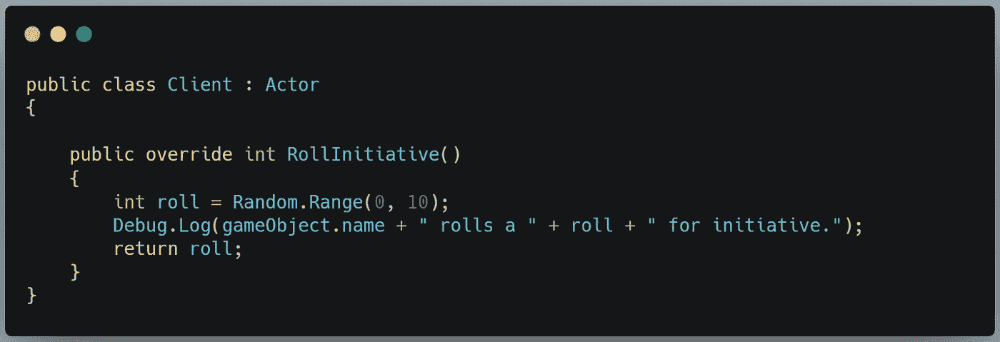
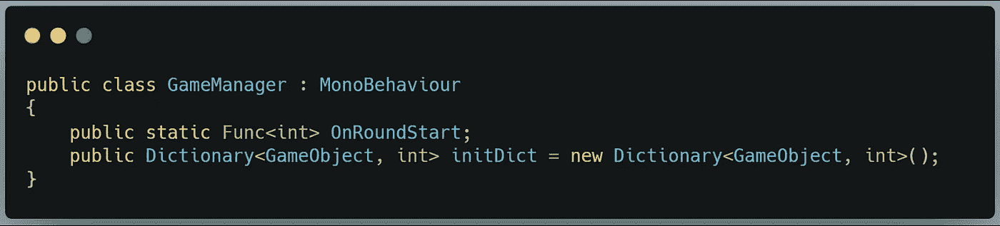
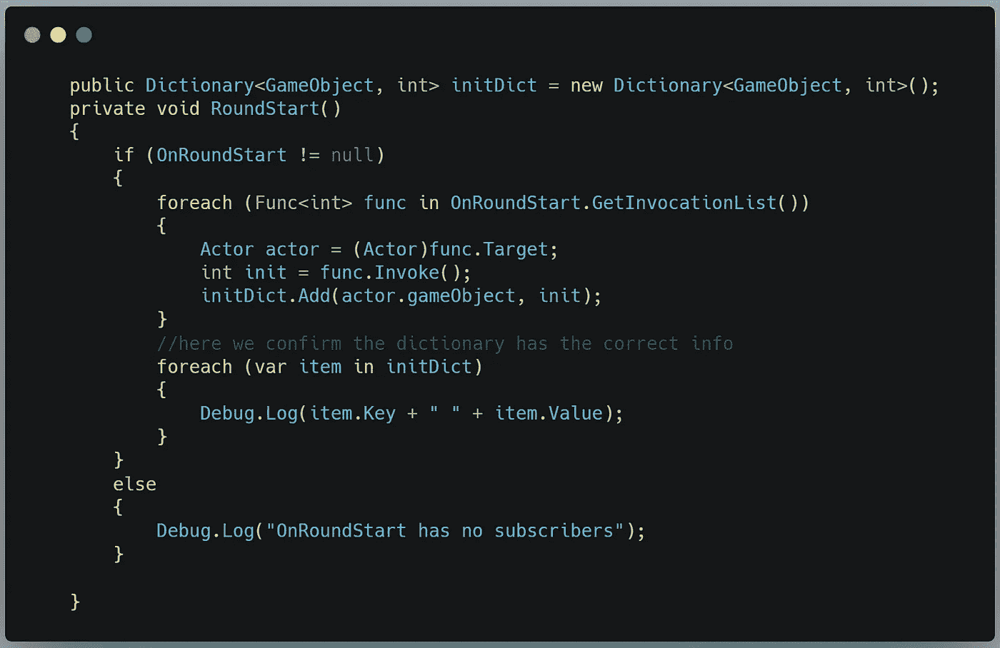
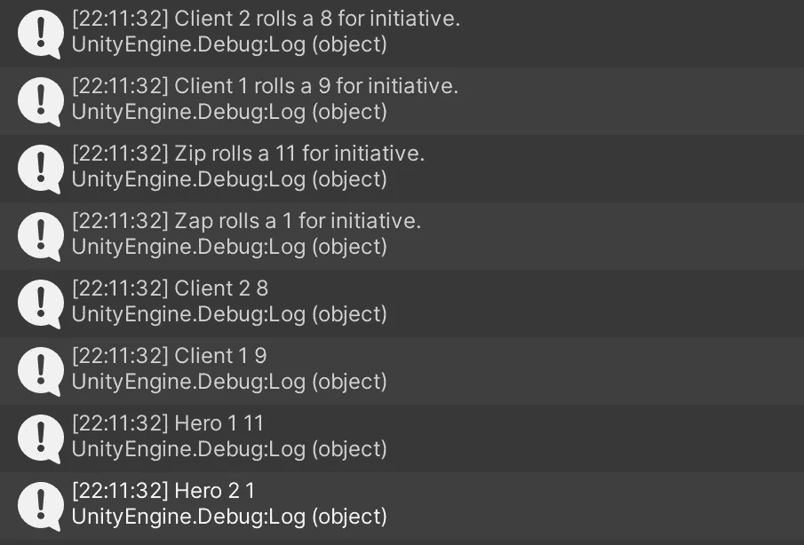

# 滚主动！

> 原文：<https://medium.com/geekculture/roll-initiative-ec1343797da1?source=collection_archive---------36----------------------->

## 使用 Unity 3D 和 C#创建一个事件驱动系统，用于在回合制战术游戏中对演员进行排序

Zip is running circles around Zap this round.

我们的目标是:使用 Unity 3D 和 C#我们希望构建一个系统，它可以提醒任意数量的参与者掷出一个随机数，并报告他们的姓名和倡议编号，以键/值对的形式存储在字典中。

在第一部分，我们将使用 Func <tresult>委托。这是一种可以接受任何返回由 TResult 指定的类型的函数的委托。在这种情况下，我们需要一个委托方法来返回一个整数值——参与者的主动角色。</tresult>

委托声明如下所示:

当我们发出该轮已经开始的信号时，订阅该委托的任何函数都将返回一个整数。让我们找一些订户:

这里我有一个抽象的 actor 类，我的各种 Actor 类型可以继承它。由于每种参与者都有不同的方法来计算他们的主动性，我将为 OnRoundStart 委托订阅一个抽象的 RollInitiative() int 函数。现在，无论他们用什么方法来确定返回值，都取决于他们自己。这里有一个例子:

接下来我们将声明字典:

这里有两个问题。

第一个问题:我们需要不止一个整数返回给我们。我们将这些信息放入一个字典中，它需要两种类型的数据——一个游戏对象(参与者)和一个整数(参与者的主动得分)。

另一个问题:我们的 Func 委托是*多播，*意味着有多个订户。如果我们试图存储 OnRoundStart **的返回值，我们将只能获得调用列表中最后一个订户的值。**显然，我们希望存储每个订户的值，所以简单的 *int roll = OnRoundStart？。Invoke()* 将不起作用。

我们可以在一个 *foreach* 循环中解决这两个问题。第一个问题将通过使用委托来解决。目标属性。如果我们将目标转换为一个 Actor，我们可以将 Actor 实例附加到的游戏对象存储在一个变量中，并将其用作字典键/值对的键的一半。

为了解决第二个问题，我们使用委托迭代 foreach 循环。GetInvocationList()方法。此方法保留委托的所有订阅者的列表。我们依次调用()每个订阅者，并将返回的整数存储到一个变量中，用作字典键/值对的值的一半。

下面是实现这一切的 C#方法:

从那里我们得到以下输出:

前四个条目来自单个参与者的 RollInitiative()方法，后四个条目是存储在 Initiative 字典中的内容的详细信息。完全匹配。

在下一篇文章中，我们将通过将字典中的每个键/值对加载到 LinkedList <t>()中来使用字典，我们可以根据游戏的回合进展和参与者行动的初始成本来遍历和重新排序这个链表。</t>