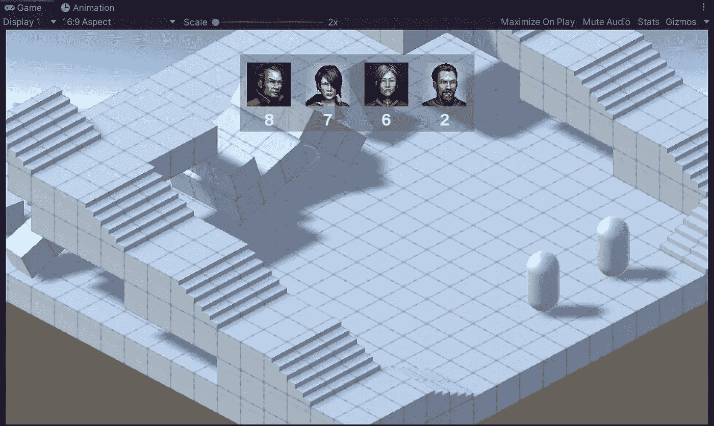
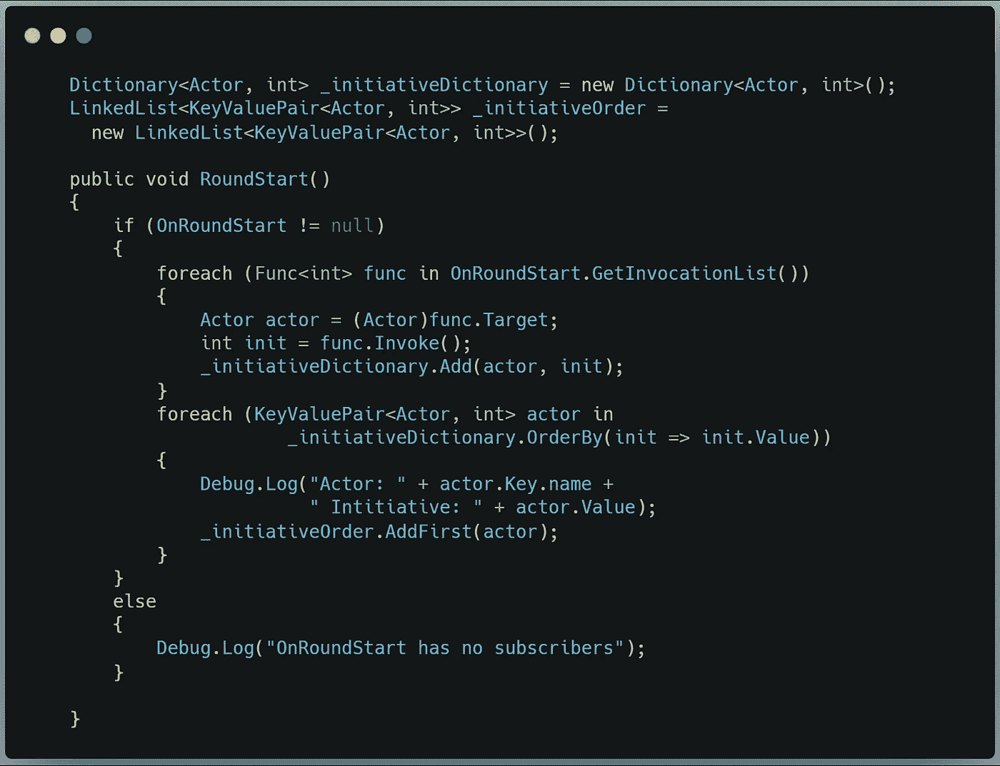
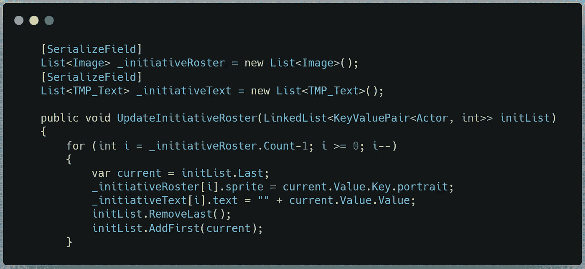
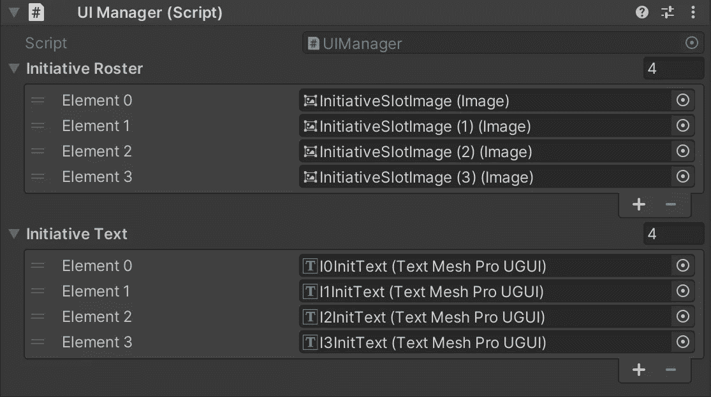
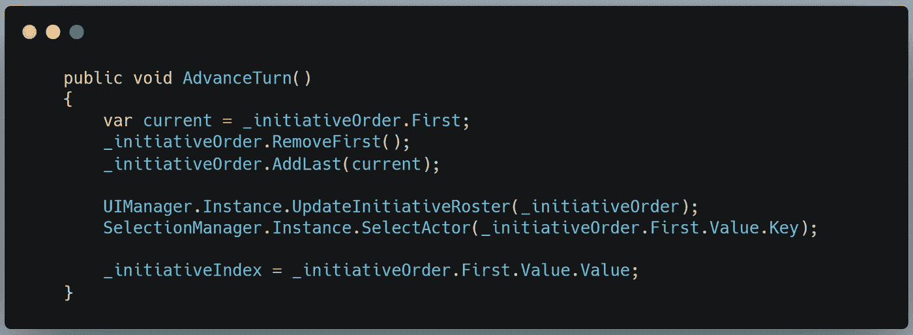
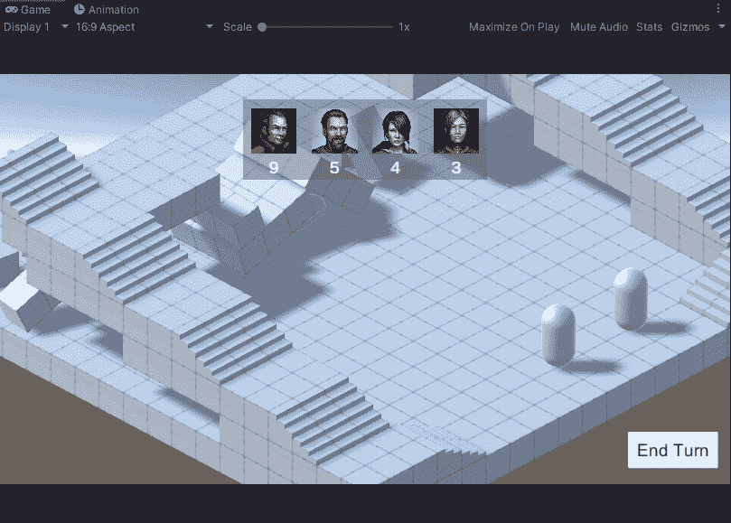

# 滚动计划:第 2 部分

> 原文：<https://medium.com/geekculture/roll-initiative-part-2-d7ab2d82ef27?source=collection_archive---------38----------------------->

## 使用链表处理战术计划数据

今天，我们的目标是按照每个键/值对的 value 属性对 C#字典进行排序，然后将该信息加载到 LinkedList 中。这个列表将允许我们轻松地控制谁可以行动，并在此过程中保持 UI 更新。

我们首先声明一个*linked list<key value pair<Actor，int > >* 来匹配字典中的数据。然后，在我们在上一篇文章中创建的 RoundStart()方法[中，我们将删除调试循环，并用另一个专门针对字典中的键/值对的循环替换它:](/geekculture/roll-initiative-ec1343797da1)

I changed the Key type from GameObject to Actor — it turned out to be more expedient to reference the class instance, and access the GameObject through that only when necessary.

这里我使用 LINQ 按照值的顺序读取字典，然后将当前值添加到主动性工作列表的第一个节点。这将导致当 *foreach* 循环完成时，最低的主动性存储在最后一个节点中。

既然字典已经排序了，我们需要更新 UI 来显示玩家每个人在回合顺序中的位置。为此，我们将转到 UI 管理器。

这就是我们利用 LinkedList 的地方。通常情况下，这种操作会非常耗费资源，需要为循环嵌套*。但是由于 LinkedList 上的每个节点都有一个对其前后节点的引用，我们可以简单地删除列表上的最后一项，并将其放在前面。因为我们从最低到最高向后迭代，这将把肖像和主动性值放在它们适当的位置。*

请注意，为了使其可扩展，我们稍后需要添加动态填充和扩展 _*initiative oster*和 *_initiativeText* 列表的能力，以考虑任意数量的演员，但现在我们将序列化它并为场景中的四个演员填充列表。

最后，我们需要一个按钮在转弯之间前进。该按钮将触发 GameManager 类中的 AdvanceTurn()方法:

在这里，我将列表中的第一个(当前的)参与者/计划对移动到列表的后面。然后，我告诉 UI 管理器更新主动显示，并让 SelectionManager 知道谁是主动参与者(下一篇文章将详细介绍)。最后，我将当前计划值分配给一个索引，这样我就可以跟踪我们在计划轮中的位置。

是时候看看我们有什么了:

神奇。

今天到此为止。在我的下一篇文章中，我将通过开发方法来区分玩家和 AI 回合，并适当地处理输入，来总结主动系统。