# 旋转量子位

> 原文：<https://medium.com/geekculture/rotating-the-qubit-8359fdf50037?source=collection_archive---------14----------------------->

## 刚刚开始量子编程？你来对地方了。我们要不要和量子比特呆在一起，然后和它们叠加？除非你没有任何并发症

参观:[amitnikhade.com](https://amitnikhade.com/)

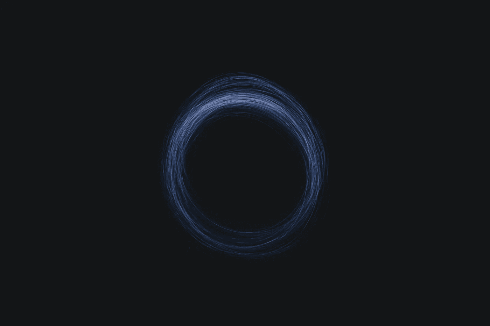

Photo by [gryffyn m](https://unsplash.com/@botanicalnature?utm_source=unsplash&utm_medium=referral&utm_content=creditCopyText) on [Unsplash](https://unsplash.com/s/photos/sphere?utm_source=unsplash&utm_medium=referral&utm_content=creditCopyText)

[阿米特尼哈德](https://medium.com/u/8cc2ede908a6?source=post_page-----8359fdf50037--------------------------------)

> 我将帮助你在[量子机器学习](https://en.wikipedia.org/wiki/Quantum_machine_learning)中快速起步，所以如果你发现由于所用的数学很难阅读，试着至少读两遍。我试图从理论上解释一切，而不是数学上的东西。

## 介绍

他需要从经典计算转移到量子计算，这不仅仅是偶然的，从而通过释放对量子时代的愿景来加速技术革命。人工智能和量子计算的结合可以创造奇迹。这是未来几代人将会看到的。因此，做好准备并更接近计算机的未来是我们的使命。

这个介绍似乎很超前。别理它，开始工作..首先，我们将快速浏览一下我们将要看到的主题。

我们将要实现一个基本的[量子](https://en.wikipedia.org/wiki/Quantum#:~:text=In%20physics%2C%20a%20quantum%20(plural,%22the%20hypothesis%20of%20quantization%22.)机制来旋转一个量子位，在 python 编程语言中使用一个叫做 [pennylane](https://pennylane.ai/) 的酷库。这是一个跨平台的 [Python](https://www.python.org/) 库，用于[量子计算机](https://en.wikipedia.org/wiki/Quantum_computing)的差异化编程。暂时假设[差分编程](http://Differentiable programming)为机器学习。

## 建议

[](/mlearning-ai/basic-terminologies-in-quantum-computing-you-must-know-f7e0191e3f96) [## 量子计算中的术语，你必须知道。

### 让我们以光速穿越量子时代😉

medium.com](/mlearning-ai/basic-terminologies-in-quantum-computing-you-must-know-f7e0191e3f96) 

## 该装置

进行快速 pip 安装

> ***注*** *:本库支持 python 版本或更新版本。或者如果你是在文章发表后的某一天或某一周看到这篇文章的。*

```
pip install pennylane --upgrade
```

您甚至可以从源代码构建它。

## 快速概述量子位

量子位只不过是量子计算机的基本构件，类似于我们日常使用的计算机中的二进制位。让我们更深入，用[布洛赫球](https://en.wikipedia.org/wiki/Bloch_sphere)清晰地想象量子位的状态。

这是球体

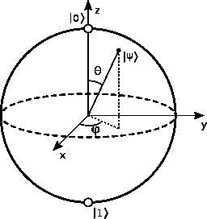

Source: [Wikipedia](https://upload.wikimedia.org/wikipedia/commons/thumb/6/6b/Bloch_sphere.svg/1200px-Bloch_sphere.svg.png)

布洛赫球是量子位状态的几何表示。使用布洛赫球可以很容易地看到单个量子位的操作。纯态ψ可以写成矢量∣0⟩和∣1⟩的复叠加

> ∣ψ⟩ = α∣0⟩ + β∣1⟩

每个量子位状态可以表示为∣0⟩和∣1⟩.的[线性组合](https://en.wikipedia.org/wiki/Linear_combination#:~:text=In%20mathematics%2C%20a%20linear%20combination,a%20and%20b%20are%20constants).)只有当|α|的平方和|β|的平方之和为 1 且半径(r) =1 时，上述等式才表示量子位状态。量子位在∣0⟩状态的概率是∣*α*∣2，它在∣1⟩状态被测量的概率是∣*β*∣2.因此，观察到的概率之和是 1。

其中α和β是复数，它们只是概率振幅

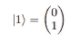

State 1 [**source**](https://www.google.com/imghp?hl=EN)

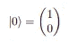

State 2 [**source**](https://www.google.com/imghp?hl=EN)

用于状态 1 的替代符号是∣-⟩，用于状态 2 的替代符号是∣+⟩.这两种状态形成了一个正交基，位于球块的对面。在布洛赫球的图形中，θ，φ是实数。其中数字 0 ≤ θ ≤ π和 0 ≤ φ ≤ 2π定义了单位三维球面上的一个点。这就是量子位的状态。

∣0⟩和∣1⟩之间的相位差被称为相对相位。

一个量子位的任意单一状态可以写成

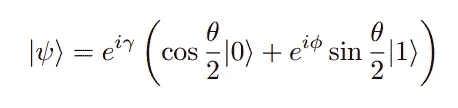

[**source**](https://www.google.com/imghp?hl=EN)

在上式中，θ、φ和γ是实数。但是γ的任意值和 e 的 iγ次方的阶乘没有表现出可观察的效果，并且量子位状态的定义点位于相同的位置。因此，[希尔伯特空间](https://mathworld.wolfram.com/HilbertSpace.html#:~:text=A%20Hilbert%20space%20is%20a,finite%2Ddimensional%20Hilbert%20spaces%20include)中的量子位状态的方程被写成

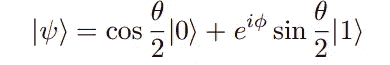

[**source**](https://www.google.com/imghp?hl=EN)

注意:如果θ增加，我们更有可能观察到状态 1。

## 旋转操作

量子位的状态可以通过绕 x、y 和 z 轴旋转来转换。

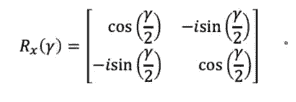

Rx rotation matrix [**source**](https://www.google.com/imghp?hl=EN)

用于围绕 X 轴旋转单个量子位的操作。Rx 门实现π旋转，即围绕块球体的 X 轴旋转 180 度。X 门也被称为非门。通过大门时，∣0⟩代表∣1⟩，∣1⟩代表∣0⟩。

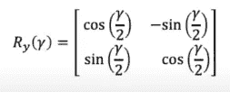

Ry rotation matrix [**source**](https://www.google.com/imghp?hl=EN)

类似地，Ry 操作用于围绕 Y 轴旋转单个量子位

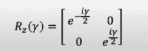

Ry rotation matrix [**source**](https://www.google.com/imghp?hl=EN)

以及用于将单个量子位围绕 Z 轴旋转到块球体的π的 Z 门操作。

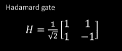

Hadamard Gate [**source**](https://www.google.com/imghp?hl=EN)

实现 H 门是为了将量子位从块球体的极点移开，并产生两个状态的叠加

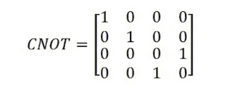

CNOT Gate [**source**](https://www.google.com/imghp?hl=EN)

[受控非](https://en.wikipedia.org/wiki/Controlled_NOT_gate)门是一个双量子位操作，其中第一个被称为控制量子位，第二个是目标量子位。如果控制量子位是∣1⟩，CNOT 门翻转目标量子位

> **测量**:这是一个[量子电路](https://en.wikipedia.org/wiki/Quantum_circuit#:~:text=In%20quantum%20information%20theory%2C%20a,as%20an%20n%2Dqubit%20register.)末端的步骤，观察或测量电路的输出，这是一种状态形式的概率，即概率状态
> 
> **Bra-kets:** (由 [Paul Dirac](https://en.wikipedia.org/wiki/Paul_Dirac) 发明)括号符号只不过是一种将位和位串包含在不对称括号中的符号方式，称为 kets，我们在这里写|0⟩和|1⟩，而不是 0 和 1。

## 履行

好了，在漫长的理论阶段之后，让我们来玩一些代码。

我希望你已经安装了潘尼莱恩。它允许我们使用我们在经典机器学习中使用的相同的[优化器](https://www.kdnuggets.com/2020/12/optimization-algorithms-neural-networks.html#:~:text=Optimizers%20are%20algorithms%20or%20methods,problems%20by%20minimizing%20the%20function.)来执行[反向传播](https://brilliant.org/wiki/backpropagation/#:~:text=Backpropagation%2C%20short%20for%20%22backward%20propagation,neural%20networks%20using%20gradient%20descent.&text=It%20is%20a%20generalization%20of,to%20multilayer%20feedforward%20neural%20networks.)。

我们将尝试实现一个量子位旋转的电路，而量子位在基态|0⟩.首先用 [NumPy](https://numpy.org/) 库导入 Pennylane 库，该库与 Pennylane 集成以获得更好的性能。

```
**#import libs****import** **pennylane** **as** **qml**
**from** **pennylane** **import** numpy **as** np
```

接下来，我们将初始化量子设备。您可以使用使用 IBM quantum experience API 的硬件设备或替代设备来初始化它。

```
**device = qml.device("default.qubit", wires=2)**
```

其中 ***线*** 是要使用的子系统的数量，因为我们使用 2 个量子位操作，所以使用 2 条线。而***default . qubit***是我们要用的默认模拟器设备。

我们需要一个函数来对量子位进行量子操作，这涉及到某些[量子门](https://en.wikipedia.org/wiki/Quantum_logic_gate)。

```
**def** circuit(params):
    qml.RX(params[0], wires=0)
    qml.RY(params[1], wires=1)
    **return** qml.expval(qml.PauliZ(0))
```

第一个指令是我们在理论部分看到的 RX 门，它将量子位绕 X 轴旋转 180 度。第二个指令是 RY 门将量子位绕 y 轴旋转。 *expval* 将对泡利 Z 门输出的值进行最终测量，该门将量子位绕 Z 轴旋转到π，这也是我们需要在函数之前添加装饰器以使其成为 Q 节点并在我们之前初始化的设备上运行的可观察到的结果之一。

```
**@qml.qnode(device)
def** circuit(params):
    qml.RX(params[0], wires=0)
    qml.RY(params[1], wires=1)
    **return** qml.expval(qml.PauliZ(0))
```

以我们在经典机器学习中创建的相同方式创建成本函数。

```
**def** cost(x, y):
    **return** np.sin(np.abs(circuit(x, y))) - 1
```

我们将创建一个[成本函数](https://towardsdatascience.com/coding-deep-learning-for-beginners-linear-regression-part-2-cost-function-49545303d29f)来衡量我们的电路功能的性能，这也是我们在经典机器学习中通常会做的。我们将进一步尝试优化它。

```
**opt** = qml.grad(cost, argnum=[0, 1])
```

在这里，我们最终使用带有成本函数的[梯度下降](https://builtin.com/data-science/gradient-descent#:~:text=Gradient%20descent%20is%20an%20optimization,function%20to%20its%20local%20minimum.)优化器，通过将布尔值作为参数传递给成本函数来优化我们的旋转。它将返回一个对象类型输出。

所以这只是量子机器学习的开始。现在我们将尝试使用我们常用的包(如 PyTorch)来执行量子机器学习。所以让我们开始吧。

## [PyTorch](https://pytorch.org/) 实现

制作 Pytorch 安装和导入库

```
**Make sur that you've installed PyTorch
For PyTorch latest release -** [**Here**](https://pytorch.org/)**import** **pennylane** **as** **qml
from pennylane import** **numpy** **as** **np****import** **torch**
**from** **torch.autograd** **import** Variable
```

首先，用 2 个量子位的模拟器初始化量子器件。我们还可以使用量子硬件，只需更改上面的这行代码，就可以手动初始化它。

```
dev = qml.device('default.qubit', wires=2)
```

像往常一样，我们将创建一个量子函数，其中包含旋转量子位的指令。我们还将通过用量子设备初始化它，把它转换成一个 qnode。

```
@qml.qnode(dev, interface='torch')
def circuit(phi1, phi2):
 qml.RX(phi1, wires=0)
 qml.RY(phi2, wires=1)
 return qml.expval(qml.PauliZ(0))
```

这个外观和我们之前创建的几乎相似。量子节点可以输出概率、方差、可微分的异常值。qnode 是量子计算机和机器学习库之间的接口

```
def cost(phi1, phi2):
 expval = circuit(phi1, phi2)
 return torch.abs(expval - (-1))**2
```

成本函数与经典处理中使用的相同。

```
phi = torch.tensor([0.011, 0.012], requires_grad=**True**)
theta = torch.tensor(0.05, requires_grad=**True**)
```

这是 PyTorch 张量格式的两个输入参数，必须馈入电路

```
opt = torch.optim.Adam([phi, theta], lr = 0.1)
```

最后，我们将使用 Adam 优化器，我们通常在机器学习中使用它，我们也可以使用其他优化器。优化器自动更新机器学习模型的参数。

```
steps = 200**def** closure():
    opt.zero_grad()
    loss = cost(phi, theta)
    loss.backward()
    **return** loss**for** i **in** range(steps):
    opt.step(closure)
```

训练从这里开始，有 200 步

***什么是变分电路？***

需要参数来获得输出的电路被称为变分电路或参数化量子电路。

该算法包括某些步骤:

1.  组成初始状态或基态，即 0 状态。量子位状态的准备是通过使用像 BasisState 或者量子位状态向量这样的类来完成的，我们在这里还没有用到它们。我们刚刚试图看到量子机器学习的核心思想。
2.  必须传递参数的量子电路。
3.  最后一步是测量电路中每根导线的可观测值。

与 PyTorch 类似，我们也可以使用 [TensorFlow](https://www.tensorflow.org/quantum) 库作为量子机器学习中的接口。

混合计算是经典计算和量子计算的结合，例如 [*变分量子本征解算器*](http://variational quantum eigensolvers)

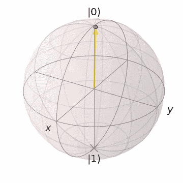

How it exactly looks **s**[**our**](https://pennylane.ai/)**ce**

所以，最后，你已经准备好投入量子机器学习了。我希望你可能已经把一切都弄得非常清楚了，我仍然让它更容易理解，如果你不明白，你可以发表评论并与我联系。我将在以后的文章中深入探讨，所以请保持关注。请不要忘记击掌，跟我一起走过[媒介](/)。谢谢你。

## 要尝试的事情

你也可以尝试解决量子机器学习中的一个分类问题，不一定要使用同一个库，而是你选择的任何人。

## 参考

请浏览那些让我学到更多东西的参考资料。

[](https://pennylane.readthedocs.io/) [## PennyLane 文档- PennyLane 0.16.0 文档

### PennyLane 是一个跨平台的 Python 库，用于量子计算机的可微分编程。训练一个量子…

pennylane.readthedocs.io](https://pennylane.readthedocs.io/) [](https://arxiv.org/abs/quant-ph/9910107) [## 旋转一个量子比特

### 量子物体的态函数相对于它的相位是不确定的。这种不确定性并不重要，如果…

arxiv.org](https://arxiv.org/abs/quant-ph/9910107) [](https://www.wikipedia.org/) [## 维基百科(一个基于 wiki 技术的多语言的百科全书协作计划ˌ也是一部用不同语言写成的网络百科全书ˌ 其目标及宗旨是为全人类提供自由的百科全书)ˌ开放性的百科全书

### 维基百科是一个免费的在线百科全书，由世界各地的志愿者创建和编辑，由维基媒体托管…

www.wikipedia.org](https://www.wikipedia.org/) 

## 关于我

[](https://github.com/AmitNikhade) [## AmitNikhade -概述

### 🂮 |人工智能和机器人爱好者|机器学习、深度学习、NLP、物联网、机器人| LinkedIn…

github.com](https://github.com/AmitNikhade) [](https://twitter.com/theamitnikhade) [## JavaScript 不可用。

### 编辑描述

twitter.com](https://twitter.com/theamitnikhade) [](https://www.linkedin.com/in/theamitnikhade/) [## Amit Nikhade -人工智能工程师-自由职业者| LinkedIn

### 在我的杯子里装了很多咖啡，为普通智力革命而工作。我是一个 AI 爱好者，一个博主，还有…

www.linkedin.com](https://www.linkedin.com/in/theamitnikhade/) [](https://amitnikhade.medium.com/) [## Amit Nikhade - Medium

### 让我们以光速穿越量子时代，像谷歌、微软、IBM 这样的大规模技术专家正在尝试…

amitnikhade.medium.com](https://amitnikhade.medium.com/)