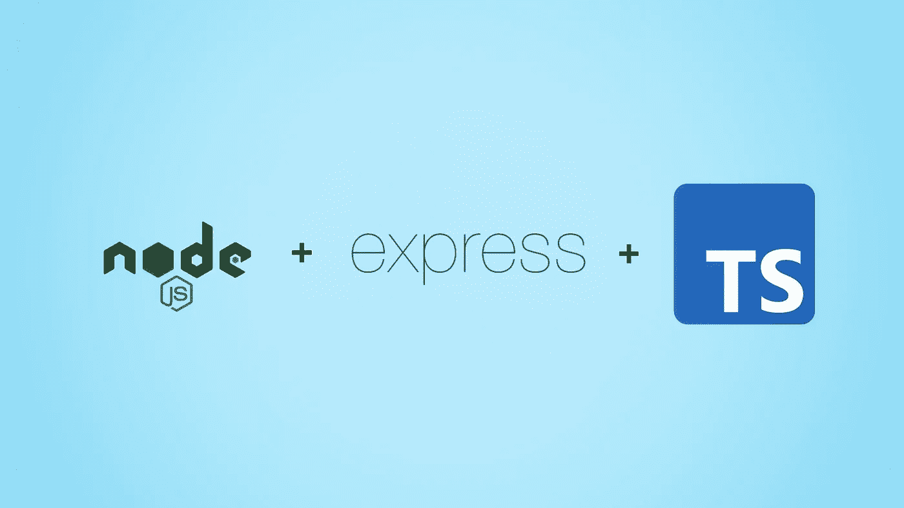
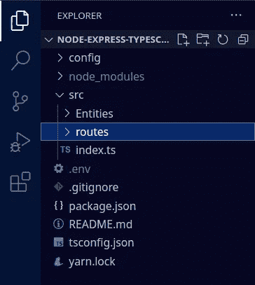
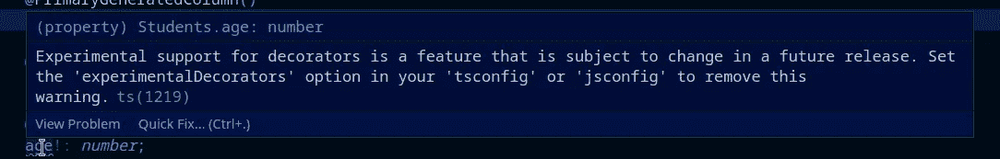
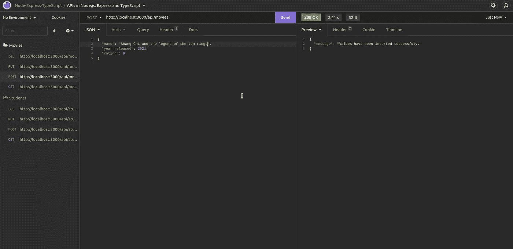
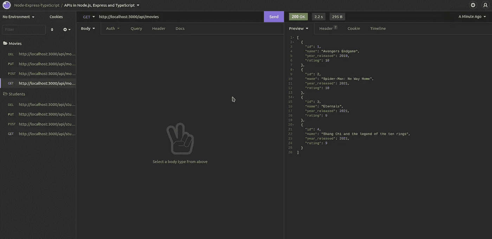
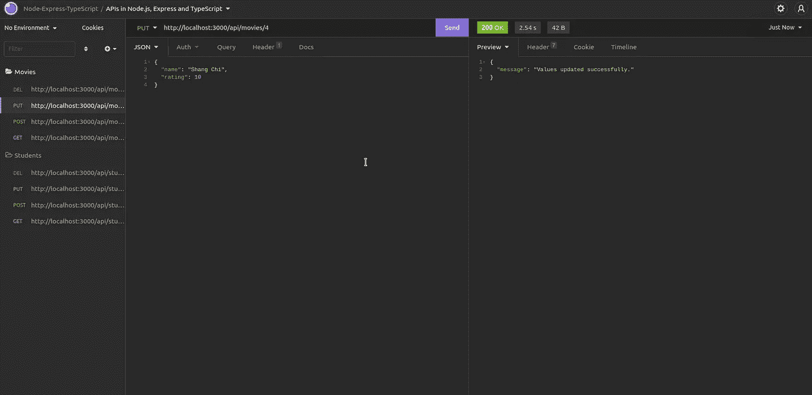
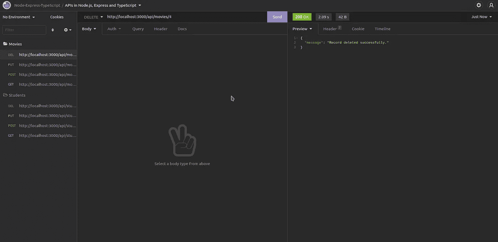

# 在 Express.js 中路由我们的 TypeScript API，并使用 TypeORM 连接到我们的 PostgreSQL DB

> 原文：<https://medium.com/geekculture/routing-our-typescript-api-in-express-js-and-using-typeorm-for-connecting-to-our-postgresql-db-bde5132b5102?source=collection_archive---------2----------------------->



> **免责声明:**请注意，本文是上一篇文章的延续，在上一篇文章中，我们已经在 Express.js 和 TypeScript 中设置了开发环境。如果你想建立项目，你可以在这里找到它[。](/geekculture/setting-up-a-node-js-project-environment-with-express-js-and-typescript-best-practices-284cc37c5aa1)
> 
> **先决条件:**在继续本文之前，我们应该对 TypeORM 有一个基本的了解。如果没有，那么[官方文档](https://typeorm.io/#/)随时可供大家学习。

在我们开始实际编写代码之前，有一些事情我们都需要知道。**路由**就是其中之一。当我们用 Express 创建一个后端应用程序时，这个应用程序不包含任何 API。它有多个 API。它可以有用于认证的 API、用于错误处理的 API、用于将课程添加到流中的 API 等。当我们在处理所有这些的项目中工作时，为了使事情简单易懂，路由变得非常重要。

其次，我们需要知道什么是 ORM。 **ORM** 是**对象关系映射器**的缩写。简而言之，顾名思义，我们在基于类的对象中设计数据库表，ORM 将为我们运行 SQL 查询，而不会破坏原始 SQL 的真正潜力。在我们的任何项目中使用 ORM 的好处之一是，它加快了开发过程，因为我们节省了手动编写 SQL 查询的时间。其次，它很容易集成到我们的项目中。

现在让我们看看代码方面的事情。

**步骤 1:** 在我们现有的项目结构中，我们创建一个名为 **src** 的文件夹，并将我们的 **index.ts** 文件移动到其中。因为我们正在移动我们的 index.ts 文件，所以确保在 **package.json** 中的**‘scripts’**对象内改变**‘start’**的方向。

```
"scripts": {
    "start": "nodemon --exec ts-node src/index.ts",
    "build": "tsc"
 }
```

接下来，在 src 文件夹中再创建两个子文件夹，即**实体**和**路线。我们稍后会谈到这一点。**

回到我们项目的根目录，我们将创建另一个名为 **config** 的文件夹和一个**。env** 文件。完成这些步骤后，这就是我们的项目结构的样子。



Project structure so far.

第二步:下一步是在我们的项目中安装 typeorm、postgres 和 dotenv。

```
yarn add typeorm
yarn add pg
yarn add dotenv
```

在这之后，我们将在**配置**文件夹中创建一个名为 **ormconfig.ts** 的文件。在这个 ormconfig.ts 文件中，我们将建立到数据库的连接。你可以从我下面提供的要点中得到帮助。

另外，请注意，我们必须更新。我们不久前创建的 env 文件。将下面一行代码添加到您的。环境文件。

```
DATABASE_URI=YOUR_DB_CREDENTIALS
```

我们从 typeorm 导入 createConnection 来创建与数据库的连接。我们导入 dotenv，这样我们可以适当地传递敏感信息的环境变量，如数据库 URI。logging 键设置为 true 将在执行时将 SQL 查询记录到您的控制台。synchronize=true 键将在我们每次运行应用程序时将实体与数据库同步。

目前，我们可以在第 13 行注释掉 entities 键，因为我们目前没有任何实体可以使用。

这样做之后，我们只需将 connectDB 导入我们的 index.ts 并相应地调用它。

```
import connectDB from "../config/ormconfig";// Create connection with database
connectDB();
```

**第三步:** **创建实体:**就像我上面提到的，实体只不过是基于类的对象，或者说是模型，在引擎盖下为我们执行所有的 SQL。创建一个非常简单，在我们的实例中，我们将做其中的两个，第一个是学生实体，第二个是电影实体。

这是创建实体的语法。这里我们从 typeorm 导入了四样东西；**实体**、 **PrimaryGeneratedColumn** 、 **Column、**和 **BaseEntity** 。PrimaryGeneratedColumn 相当于为设置为自动递增的普通 SQL 中的表提供主键。之后，我们有其他列，我们也指定我们希望这些列包含的数据类型。永远记住导出你的实体。同样，我们也可以创建电影实体。

**重要提示:**您会注意到，当您创建实体时，IDE 会发出一条警告，内容如下:



仅供参考，装饰者是一种特殊的声明。它们可以在类、参数等中使用。要解决此问题，请删除 tsconfig.json 中以下行的注释:


一旦您删除了这两行中的注释，您将不会收到此警告。

**步骤 4:处理这些实体的 API 的路由:**在我们已经在 src 中创建的 Routes 文件夹中，我们将创建两个文件，即 **studentRoutes.ts** 和 **movieRoutes.ts** 。我们将使用 express.js 中的 router 函数来路由我们的 API。让我们创建 studentRoutes.ts 文件。请参考下面的代码要点:

这里我们调用路由器函数，并用它创建 HTTP 请求。同样，也可以创建 movieRoutes.ts 文件。您可以在资源库中查看，资源库的链接在最后提供。不要忘记在最后导出“路由器”作为默认设置。

**步骤 5:** **在我们的 index.ts 文件中使用这些路线:**创建这些文件后，我们只需将它们导入我们的 index.ts

```
// Import API Routes
import studentRoutes from "./routes/studentRoutes";
import movieRoutes from "./routes/movieRoutes";
```

为了使用它们，我们只需要使用 express.js 提供的**‘use’**函数。首先是我们希望访问 API 的路线，其次是我们从 routes 文件夹中导入的路线。

```
// Fetching API from the routes
app.use("/api/students", studentRoutes);
app.use("/api/movies", movieRoutes);
```

完成这些步骤后，我们的 index.ts 文件如下所示:

在。env 文件中，我声明了一个 SERVER_PORT 并将其设置为一个特定的值。不过这一步是可选的。现在剩下的就是测试我们针对学生和电影的 API 了。为此，我们可以使用任何 API 测试应用程序，Postman 和失眠症是主要的测试应用程序。我将用失眠来测试它。

让我们测试其中一个 APIs



POST request: Movies API



GET request: Movies API



PUT request: Movies API



DELETE request: Movies API

至此，我们的 API 已经准备好了，这就是本文的全部内容。我在一开始就提供了这篇文章第一部分的链接，所以也请查看一下。我已经在其中写了设置过程。

[***链接到资源库***](https://github.com/chinmaykarmokar/node-express-typescript)

谢谢大家！