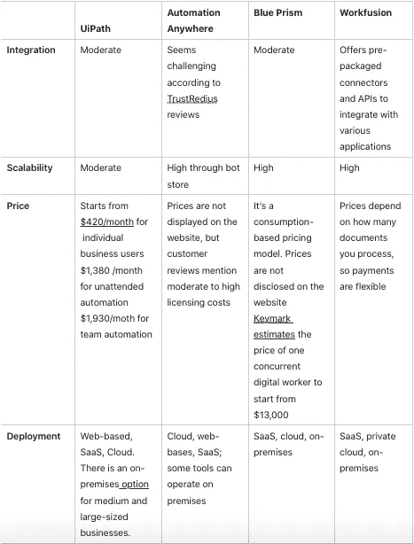
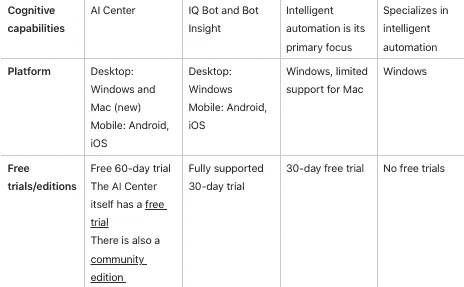

# RPA 工具比较:如何选择正确的自动化供应商

> 原文：<https://medium.com/geekculture/rpa-tool-comparison-how-to-choose-the-right-automation-vendor-8a7393f211b5?source=collection_archive---------4----------------------->

奥地利保险提供商 HDI Versicherung AG 报告称，由于 UiPath 的软件机器人，一年半的时间里节省了 600 个单人工作日。同时，Automation Anywhere 通过其自动化产品每年为纽卡斯尔医院节省了 7000 个工作小时。

您还可以找到其他 RPA 服务提供商发布的类似成功案例。它们表明 RPA 可以转变您的业务，但不能帮助您决定哪家 RPA 供应商适合您。

为了解决这个问题，我们对四家著名的自动化供应商进行了详细的 RPA 工具比较，强调了可以帮助您做出选择的标准，并指定了何时值得研究[构建定制 RPA 解决方案](https://itrexgroup.com/services/robotic-process-automation/)。

# RPA 工具比较:简介

在深入 RPA 工具比较之前，让我们澄清一下 RPA 到底是什么，以及您可以在市场上找到什么类型的自动化解决方案

# RPA 到底是什么？

机器人过程自动化(RPA)依靠可编程软件机器人来复制人类动作并执行某些任务。这些机器人要么可以使用结构化数据来完成重复的过程，而不是当场做出决定，要么它们可以是智能的，能够学习，与[非结构化数据](https://itrexgroup.com/blog/your-unstructured-data/)一起工作，并做出类似人类的决定。

RPA 在不同行业中有许多优势。你可以在我们的博客上阅读更多关于 RPA 如何改变[医疗](https://itrexgroup.com/blog/rpa-in-healthcare/)、[银行](https://itrexgroup.com/blog/rpa-in-finance-banking-use-cases-implementation-expert-advice/)和[保险](https://itrexgroup.com/blog/rpa-in-insurance-ultimate-guide/)的内容。

# 市场上可用的 RPA 解决方案类型

按照学习能力划分，机器人过程自动化产品主要有三种类型:

*   **可编程机器人**。第一代 RPA 工具。他们有一套固定的能力，如果不改变他们的代码，他们就无法学习或进化。
*   **自学习机器人**。这些解决方案可以分析人类的行动，并从中学习，但这种能力是有限的。例如，当遇到一种新的文档格式时，人类员工可以对其进行标记，机器人可以记住这种新的结构，并在下次相应地提取数据。这项新技能不需要修改代码。
*   **智能过程自动化**。智能机器人可以学习，做出复杂的决定，处理不同的文档格式，并分析各种来源的数据。他们使用[人工智能技术](https://itrexgroup.com/services/artificial-intelligence/)，如[计算机视觉](https://itrexgroup.com/services/computer-vision/)和自然语言处理，在没有人类干预的情况下获得新技能。

有关常规机器人过程自动化和智能过程自动化之间差异的更多信息，请查看我们最近关于 [IPA 与 RPA](https://itrexgroup.com/blog/ipa-vs-rpa-vs-bpa/) 的文章。

# RPA 供应商比较

下面，我们根据 Gartner 和 Capterra 等合法网站上提供的信息和用户评论，比较了四家著名的机器人过程自动化供应商。此外，我们咨询了我们的业务流程自动化负责人 [Dzmitry Kliuchnik](https://www.linkedin.com/in/dzmitry-kliuchnik/) 。

# UiPath

[UiPath](https://www.uipath.com/) 是一家总部位于纽约的 RPA 提供商。根据其积极的客户评论和高评级，他们的平台被认为是最好的机器人过程自动化软件产品之一。它为客户提供端到端的高度自动化。该公司从自动化前端流程开始，并不断扩展。UiPath 解决方案的默认编程语言是 VB.NET。该公司在 2020 年推出了 C#，但希望使用 UiPath 的开发人员仍然需要学习 VB.NET，因为所有文档都引用了这种编码系统。

UiPath 是用户友好的，业务用户无需学习编码就可以探索它的特性。它支持无代码数据建模和存储，基于 AI 的无代码文档处理，以及 UiPath Studio 的拖放功能。甚至可以通过使用 [StudioX](https://www.uipath.com/product/studiox) 拖放指令来构建一个简单的机器人。

该平台提供了全面的附加组件，包括协作选项、流程挖掘和自动化评估工具。它还扩展到包括人工智能功能，并可以从半结构化和非结构化来源聚合数据。例如，它可以使用人工智能支持的任务分析来识别自动化机会。

UiPath 允许高级客户访问其人工智能中心。在那里开发的机器人可以理解自然语言，分析图像和表格数据。该中心处理他们的培训、部署和管理。

对于每个许可产品，您都可以从技术团队获得免费的支持。您可以升级到“特优”支持选项和“特优”,在这种情况下，您将获得一个分配给您的案例的个人客户经理。高级订阅还允许您进行季度自动化性能审查，并制定未来 RPA 计划。你可以在这里找到更多的好处。还有一个 UiPath 论坛和问题社区。

在安全性方面，该平台使用加密技术，并管理凭证和访问控制。

**优势:**

*   构建基本的自动化流程不需要编程技能
*   有一个免费的社区版
*   受团队和队友之间协作的欢迎
*   记录用户执行任务时的操作，以便以后自动执行
*   可以处理非结构化数据
*   易于上手

**缺点:**

*   有限的编码功能
*   相当昂贵
*   基于图像的自动化可以使用改进
*   可能很难与第三方软件集成
*   太多的每日更新会中断流程

# 自动化无处不在

[Automation Anywhere](https://www.automationanywhere.com/) 是一家总部位于加利福尼亚州的 RPA 公司。它通过智能软件机器人支持客户业务流程的端到端自动化。该公司声称，80%的医疗保健组织和 60%的技术公司选择它作为他们的自动化供应商。

最初，该平台完全基于脚本，用户需要编程技能来自动化流程，与其他 RPA 工具相比，这是一个缺点。目前，该公司通过引入记录用户行为的可能性来促进无代码自动化，从而克服了这个问题。因此，该平台越来越受到商业用户的欢迎。

Automation Anywhere 提供了五种 RPA 工具:

*   **RPA Workspace** 是一款基于 web 的工具，有助于自动化任务和流程。这里编码是可选的，业务用户可以从一个通用的记录器中受益，该记录器可以捕捉他们的动作。专业程序员可以使用自己的代码来实现更高级的自动化和人工智能功能。
*   **流程发现**使用人工智能和流程挖掘技术来发现流程，无需手动收集数据。它构建跨团队和区域的流程图，并显示流程细节，如持续时间和频率。
*   **智商机器人**使用人工智能技术，如自然语言处理，从不同格式的文档中提取数据。这种情况发生如下:机器人预处理文档以减少噪音，识别相关页面，提取数据，并使用预定义的规则验证它们。
*   **Bot Insight** 分析您的智能自动化程序，并在交互式仪表盘上显示结果，使您能够评估 RPA 投资回报并实时监控您的机器人的性能。
*   **机器人商店**为公司提供预先构建的数字劳动力。当你的自动化范围扩大时，你可以购买专门的机器人。例如，有一个 Salesforce bot 可以完成记录所有权转移任务。

该公司的主要产品 Automation 360 通过了 SOC 1 & 2 和 ISO27001 认证，并提供了分层的安全方法。它采用数据加密，管理身份和访问，并保护其云基础架构。

**优点:**

*   高度安全
*   利用 Bot Insight 进行实时自动化分析
*   可以使用记录器捕捉人的动作，并相应地自动化流程
*   创建流程图，为您提供工作负载的概览
*   具有预构建数字劳动力的市场

**缺点:**

*   手写文档的准确性会下降
*   昂贵的
*   与主要的 ERP 平台(如 Salesforce 和 SAP)集成具有挑战性
*   该平台不能很好地处理 Excel 文件
*   TrustRadius 上的几个用户报告说，人工智能和人工智能的能力仍处于基本水平

# 蓝色棱镜

总部位于英国的[蓝棱镜](https://www.blueprism.com/)将自己定位为智能自动化领域的专家。该工具基于 Java，提供模仿人类动作的自主软件机器人。通过控制室，你可以将流程分配给数字机器人，并按需扩展劳动力。该公司的智能 RPA 平台包括以下功能:

*   **流程和任务挖掘**。它搜索要自动化的流程，其开放的体系结构允许集成其他流程挖掘工具。
*   **决策自动化**。在机器学习模型的帮助下，机器人可以学习做出类似人类的决定。
*   **过程评估**。该平台可以评估您的流程的自动化潜力，例如自动化将花费多少成本，以及从长远来看这样做会节省多少成本。
*   **智能文档处理**。该平台使用[光学字符识别(OCR)](https://itrexgroup.com/blog/how-ocr-algorithms-redefine-business-processes/) 从结构化、非结构化和半结构化文档中提取数据，并使用预定义的模板进行验证。需要时，它还支持人在回路中的验证。该公司声称，该平台也可以处理图像。

在我们最近的文章中，您可以了解更多关于[智能文档处理](https://itrexgroup.com/blog/intelligent-document-processing-complete-guide/)为不同行业带来的好处。

说到安全性，Blue Prism 通过了 ISO27001 认证，它在应用程序和云级别实现了安全性。RPA 解决方案运行静态应用程序安全测试(SAST ),并让开发人员完成一个强调安全重要性的特殊教育计划。

它为业务用户提供了无代码选项，同时也允许代码范围的自动化。Blue Prism 的 Design Studio 支持流程构建的拖放风格。

**优势:**

*   在欧洲的强大市场定位，因为本次 RPA 软件比较中的所有其他供应商都位于美国
*   价格适中，比上述两种选择都便宜(根据用户评论，因为价格没有明确公布)
*   非常适合 SAP 开发
*   它的无代码平台有效且易于使用
*   易于扩展

**缺点:**

*   在 Gartner 上，一些客户[认为法规遵从性和安全性问题](https://www.gartner.com/reviews/market/robotic-process-automation-software/vendor/blue-prism/product/blue-prism-intelligent-automation-platform/likes-dislikes)是使用此 RPA 工具的主要障碍
*   过程自动化用户界面很复杂，并且有一个陡峭的学习曲线。也显得老气横秋。TrustRadius 上的一个用户甚至将它与 Windows 98 进行了比较
*   一些网络浏览器的问题，包括谷歌浏览器
*   没有过程记录选项
*   Excel 表格的问题
*   控制室可能会出现延迟，并且只能从桌面访问
*   与外部环境的集成可能具有挑战性。其中包括 Citrix 和 Salesforce

# 工作融合

总部位于纽约的 [WorkFusion](https://www.workfusion.com/) 主要专注于智能自动化，由[具有人在回路方面的机器学习](https://itrexgroup.com/blog/why-use-human-in-the-loop-machine-learning-approach/)提供支持。它专门研究具有许多决策点的复杂过程，而不是大规模的例行自动化。

除了定制开发之外，该公司还构建预打包的解决方案来自动化标准流程(例如，数字工人)。这些产品可以是特定行业的，也可以是跨行业的。

例如，有专门从事保险承保和客户服务协调的解决方案。你也可以创建定制的机器人。客户可以雇佣这些软件机器人，用他们公司的数据训练它们。数字劳动力可以与人类互动和工作。

与本次 RPA 工具比较中的其他供应商不同，WorkFusion 采用了一种更狭隘的方法，并在其网站上显示其专门从事银行和保险行业。但他们的数字工人也可以接管与行业无关的任务，如人力资源相关的职责、物流运营和数据分析任务。您可以使用无代码或低代码的方法来修改现有的数字劳动力或创建新的机器人。其他选项包括使用预训练的 ML 模型来处理复杂的非结构化文档。WorkFusion 解决方案可以处理 40 多种语言的不同格式的文档，包括 HTML、PDF 和 Excel。

WorkFusion 的文档处理能力

WorkFusion 使用高级功能来确保安全性，如基于角色的访问控制和集中式数据管理。

**优点:**

*   由于 WorkFusion 的预建机器人，您可以在几周内自动化和部署流程
*   监控自动化活动的分析仪表板
*   通过添加更多数字工作人员来轻松扩展
*   复杂过程智能自动化的可靠性能

**缺点:**

*   尽管 RPA 平台提供了自动化构建的无代码选项，但它的功能相当有限
*   作为一个基于 Java 的应用程序，该工具消耗了太多的内存
*   OCR 的能力并不出众

# RPA 工具比较摘要

这里有一个 RPA 供应商比较表，您可以参考它来快速区分。

# 为您的企业选择合适的 RPA 供应商的清单

从上面的机器人流程自动化工具对比表中可以看出，RPA 供应商拥有相似的技术参数，最终决定并不总是显而易见的。如果您在选择时仍然犹豫不决，我们的 RPA 专家 Dzmitry 建议从四个方面入手，帮助您比较 RPA 工具并选择适合您的供应商:

1.  **查看每个 RPA 厂商的合作伙伴列表**。你正在寻找在你的行业中拥有更多客户的公司。如果 RPA 供应商已经与几家医院合作过，他们将比主要与银行合作的供应商更了解医疗保健领域的自动化。
2.  **查看技术合作伙伴列表**。RPA 提供商可能会引导您向其技术合作伙伴寻求帮助。然后核实他们在你的地区是否有相关的公司是有用的，因为他们会熟悉你的国家的法律和具体情况，沟通会更容易。
3.  **查看客户支持选项**。一些供应商将基本技术支持包括在他们的产品包中，或者作为一个收取少量费用的选项添加，但是在这种情况下，您的公司将不是支持团队的优先考虑对象，他们不会实时解决您的问题。另一方面，一些供应商以相当高的价格分配了一个相当有效且响应迅速的团队。因此，您可能需要评估您的自动化流程有多重要。你能等得起支持团队吗？你能忍受的停机时间是多少？也许值得为专门的支持人员支付更多费用。
4.  **关注解决方案的架构。**一些自动化供应商仅支持[基于云的解决方案](https://itrexgroup.com/services/cloud-consulting/)，而其他供应商则专注于内部模型。因此，如果您希望大部分自动化在您的场所进行，那么您需要寻找能够做到这一点的 RPA 供应商。但是，即使您选择了云，检查所选 RPA 公司正在与哪家云提供商合作仍然很重要。可以是亚马逊、微软、谷歌等。也许你偏爱其中一个。

# 定制自动化更适合您的业务吗？

如果您的目标是在决策能力有限的情况下自动化大量标准流程，那么向可靠的自动化供应商寻求现成的解决方案是最佳选择。您可以根据我们的 RPA 比较标准选择一个。他们甚至可能有适合您系统的预打包解决方案，显著缩短您的部署时间。如果你选择的公司在你所在的行业已经有专业知识，并且能够预见到特定行业的障碍，这一点尤其正确。

但是，如果您的流程很复杂，并且您的遗留系统可能会危及与现成解决方案的顺利集成，该怎么办呢？在这些情况下，最好联系[智能流程自动化服务提供商](https://itrexgroup.com/services/intelligent-process-automation/)，他们可以帮助您构建定制 RPA 解决方案来满足您的特定要求。因此，在联系上述四家供应商之一或任何其他现成的自动化供应商之前，请验证您的案例是否具有以下任何特征:

*   一些相当复杂的过程
*   一个流程中的许多决策点
*   遗留系统
*   僵化的系统和流程无法适应现成的产品

如果您的业务案例满足上述标准，那么从头构建的自定义 RPA 解决方案将是更便宜、更快速的选择。您可以在我们博客的最近一篇文章中找到关于[现成 RPA 解决方案与定制 RPA 解决方案](https://itrexgroup.com/blog/getting-started-with-enterprise-automation-itrex-tips/)的更多信息。

为了更好地理解自定义 RPA 解决方案，请考虑以下示例。

一家数字预约服务供应商求助于 ITRex 来[自动化医生预约安排](https://itrexgroup.com/case-studies/medical-appointment-scheduling-system/)。这个项目很有挑战性，因为参与的医生使用不同的异步 EMR 遗留系统来管理探视。

客户不可能使用预先构建的软件，因为它需要大量的定制和与这些 EMR 的集成。因此，他们让我们的团队创建一个自动化解决方案，该解决方案将同步所有不同的传统电子病历和 eClinicalWorks (eCW)平台，并使用医生日程表中的所有数据填充 eCW。我们构建了一个 API，它从遗留系统中聚合数据，并将其填充到相应的 eCW 插槽中，而无需更改 eCW 的源代码或支付 API 费用。

# 综上

当选择一家有现成产品的老牌 RPA 供应商时，您可能会发现集成部分很有挑战性。供应商将带来他们独立开发的代码，并尝试将其安装到您的系统中。您的其他进程可能不会很好地响应。此外，现成的应用程序通常是按照标准流程开发的，因为供应商无法预见所有可能的变化，如果您的流程中有一些变化，可能会导致问题。

此外，尽管上述所有供应商都提到了他们的人工智能智能自动化计划，但客户评论显示，他们仍处于开发阶段，需要改进。另一方面，定制解决方案将根据您的系统量身定制，旨在适应您的具体流程。但这并不能自动保证成功。通用软件提供商在机器人流程自动化方面的经验通常不如上面 RPA 工具比较中提到的四家供应商。

在我们的博客上，你可以找到有用的资源来帮助你准备 RPA 的努力。我们有一篇文章描述了在自动化过程中你可能面临的 [13 个挑战](https://itrexgroup.com/blog/top-rpa-challenges-and-ways-to-overcome-them/)以及克服它们的专家提示。另一篇文章将帮助你对自动化项目的成本有一个现实的想法。

> *不确定现成的 RPA 解决方案是否适合您？* [*取得联系*](https://itrexgroup.com/contact-us/) *！我们的团队将为 RPA 建议一个候选流程，并确定如何继续执行，同时牢记您系统的具体情况。*

*原载于 2022 年 8 月 29 日 https://itrexgroup.com**的* [*。*](https://itrexgroup.com/blog/rpa-tool-comparison-how-to-choose-the-right-automation-vendor/)