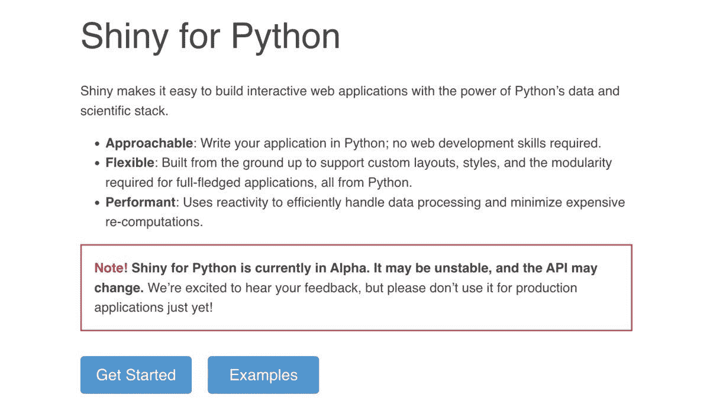

# RStudio 为 Python 揭开闪亮的面纱

> 原文：<https://medium.com/geekculture/rstudio-unveils-shiny-for-python-771865d3559c?source=collection_archive---------7----------------------->

## 在作为 R 框架使用了十年之后，这个闪亮的 web 框架现在可以在 alpha 版本中访问 Python 了。

根据 RStudio 首席技术官郑中今天下午在 RStudio 大会上发布的公告，目前，Python 闪亮 Web 框架的 alpha 版本已经在 shiny.rstudio.com/py,发布。

在他的演讲中，程多次强调了这个框架还处于开发的早期阶段。

换句话说，不要指望在短期内将 Shiny for Python 用于生产中的关键任务程序。

在公开发布之前，RStudio 通常会先软发布其产品，并征求早期用户的意见，但在今天的演示之前，这个项目一直是保密的。

在 Python 领域，Shiny for Python 加入了 Dash 和 Streamlit 等框架。为什么是不同的结构？没有深入细节，Cheng 说他认为每个框架都做出了一系列不同的权衡，它们可以根据用户需求共存。我们相信 Python 社区可能需要一些新鲜的东西，他继续说道。

在介绍新框架之前，Cheng 讨论了 Shiny for R 的开发，该框架于十年前的 2012 年 7 月首次公开。当时许多人认为 R 应该只用于某些统计目的，而不适用于其他目的。但是 R 有一个有趣的特性，使它成为 web 框架的完美之选，Cheng 说:与几乎所有其他当代编程语言不同，R 允许在函数中的位置参数之前插入命名参数。

“R 是闪亮最好的语言。我将死在这座山上，”程说。

他随后引用了丹·卡拉汉的 PyCon 2018 演讲，其中指出 Python 是所有语言中第二好的语言。在程看来，Python 将是这个框架的一个很好的平台。

由于 WebAssembly，除了许多与 Shiny for R 相同的平台，包括 shinyapps.io 和 RStudio Server，Shiny Python 程序还可以部署到静态 Web 服务器上。目前，闪亮的 R 应用程序无法做到这一点。当被问及这是否是《闪亮登场》的计划时，程说，“我们当然希望如此。”