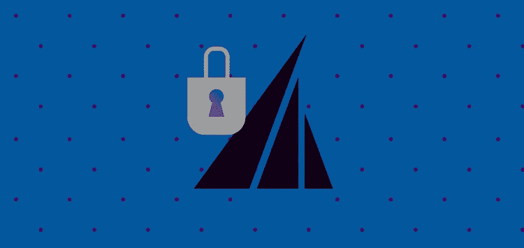

# 方向舵堆栈现已通过 SOC 2 认证

> 原文：<https://medium.com/geekculture/rudderstack-is-now-soc-2-certified-ce631a650948?source=collection_archive---------22----------------------->

我们很高兴地宣布[方向舵栈](https://rudderstack.com/)现已通过 SOC 2 Type 1 认证。这项认证对我们来说是一个重要的里程碑。帮助您确保我们保护您的客户数据，同时帮助您获得业务洞察力。本博客讨论了获得 SOC 2 Type 1 认证的重要性、必要性以及我们遵循的步骤。

# 什么是 SOC 2？

SOC 2 是由第三方认证审计员进行的审计，他们根据五项信任原则检查组织，被视为安全合规性的黄金标准。这个审核流程和认证是由 [**美国注册会计师协会**](https://www.aicpa.org/interestareas/frc/assuranceadvisoryservices/aicpasoc2report.html) 制定的。

根据 [Truvantis](https://www.truvantis.com/soc-2-certification) ，“SOC 2(系统和组织控制 2)是一种审计报告，证明服务组织提供的服务的可信度。它通常用于评估与在线存储客户数据的外包软件解决方案相关的风险。”

# RudderStack 为什么要通过 SOC 2 审核？

RudderStack 是一个智能的客户数据管道，连接您的整个数据堆栈，并在整个过程中传输客户数据。尽管我们不保存任何客户数据，但我们的客户信任我们，会将流经我们系统的敏感数据交给我们。RudderStack 使用 PII 检测和屏蔽代码保护客户的 **PII(个人身份信息)**。

> ***注:在此****[***文章***](https://rudderstack.com/blog/protect-personally-identifiable-information-pii-using-rudderstack) ***中阅读更多关于舵栈如何保护 PII 的内容。****

*如果您处理高度敏感的客户数据(如金融公司)，SOC 2 认证会让您的生活更轻松，并减少您在购买前审计 RudderStack 的工作。该证书意味着我们对您的敏感数据遵循行业标准的安全合规性。*

# *我们是怎么做到的？*

*获得 SOC 2 证书意味着确保每个员工以及每个基础设施都遵守 AICPA 建议的准则。*

# *舵栈队*

*首先，来自 RudderStack 团队(我们所有团队——工程、销售、营销、内容等)的每个人。)完成了包含安全概念、威胁、最佳实践和协议模块的在线培训。在每个模块之后，我们都必须通过多项选择题知识测试。*

*培训完成后，每位员工都必须确保他们的工作机器和帐户(GitHub、电子邮件等)使用防病毒软件、密码保护器和双因素身份验证得到保护。*

*最后，每位 RudderStack 员工都同意保证所有数据安全的条款和条件。*

# *基础设施*

*保护我们生产环境的基础设施对于获得 SOC 2 认证至关重要。生产环境不能有公共/未经授权的访问，访问控制非常重要。*

*为了保护我们的生产环境，我们使用了 [Vanta](https://www.vanta.com/) 代理来帮助监控基础设施机器上的漏洞。*

*保护机器之后，接下来是代码级安全性。对于 GitHub 和 AWS 访问控制，我们实施了双因素身份验证。*

*最后的任务是确保通信安全。我们通过双因素认证来保护我们的 GSuite。*

# *一致性是关键*

*安全不能是一次性的活动；一致性是这里的关键。我们致力于为所有客户提供安全的客户数据管道。我们不仅安全地收集客户数据，而且始终保持安全性。该 SOC 2 认证证明了我们为保护客户数据所做的一切努力，并且在我们努力获得 SOC 2 Type 2 认证的过程中，我们在这一领域的一致性将得到审核和证明。*

# *免费注册并开始发送数据*

*测试我们的事件流、ELT 和反向 ETL 管道。使用我们的 HTTP 源在不到 5 分钟的时间内发送数据，或者在您的网站或应用程序中安装我们 12 个 SDK 中的一个。[上手](https://app.rudderlabs.com/signup?type=freetrial)。*

*本博客最初发表于:
[https://rudder stack . com/blog/rudder stack-is-now-SOC-2-certified-your-trust-is-our-treasure](https://rudderstack.com/blog/rudderstack-is-now-soc-2-certified-your-trust-is-our-treasure)*