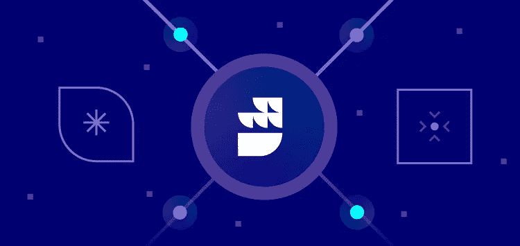
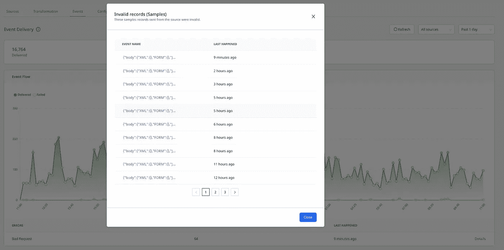
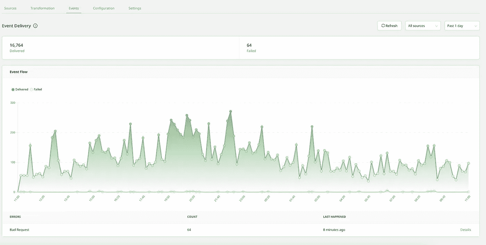

# 方向舵堆栈产品新闻第 019 卷—目的地用户界面

> 原文：<https://medium.com/geekculture/rudderstack-product-news-vol-019-destination-ui-f6f05086541f?source=collection_archive---------16----------------------->

# 目标用户界面

我们现在根据每个目的地提供活动量。在目标 UI 中，我们让用户看到最近 30 天的错误。

[立即尝试](https://app.rudderstack.com/)

# 用于 Klaviyo 的反向 ETL 可视化数据映射器(VDM)

我们为 Klaviyo 发布了新的 VDM。电子商务团队使用 Klaviyo 作为平台，支持独特的功能，如基于类别的细分、基于页面视图的事件触发器等。

[阅读更多](https://rudderstack.com/docs/destinations/marketing/klaviyo/)

# 对讲机

我们现在支持内部通信作为反向 ETL VDM。Intercom 是一个实时业务消息平台，让团队将他们的客户生命周期活动集中到一个地方。

[了解更多](https://rudderstack.com/docs/destinations/business-messaging/intercom/)

# 受款人

Chargebee 是一个订阅管理系统，帮助团队处理订阅生命周期的所有方面，包括发票、重复计费和试用管理。RudderStack 现在支持 Chargebee 作为提取源。

[文档](https://rudderstack.com/guides/how-to-load-data-from-chargebee-to-postgresql/)

# watchOS

我们很高兴宣布我们的 Watch OS SDK，这是为 Apple Watch 开发的基于 iOS 操作系统的操作系统。您可以利用 watchOS SDK 来开发具有交互式用户体验的应用程序。

[文档](https://rudderstack.com/docs/stream-sources/rudderstack-sdk-integration-guides/rudderstack-ios-sdk/watchOS/#watchos)

# tvOS

tvOS 是苹果为第二代或更高版本的苹果电视开发的操作系统。借助面向 tvOS 的 RudderStack SDK，您可以开发将出色的图像质量和声音与交互式用户体验相结合的应用程序。

[文档](https://rudderstack.com/docs/stream-sources/rudderstack-sdk-integration-guides/rudderstack-ios-sdk/tvOS/#tvos)

# 铬铸

谷歌 Chromecast 是一种通过 HDMI 端口插入电视或显示器的设备。它允许你从手机或电脑上下载内容。RudderStack 支持将 JavaScript SDK 与 Cast 应用程序集成。

[文档](https://rudderstack.com/docs/stream-sources/rudderstack-sdk-integration-guides/rudderstack-javascript-sdk/#chromecast)

# 集成

# BigQuery 流

Google 的 BigQuery 允许您通过利用其流式 API 来流式传输事件数据。RudderStack 支持此目的地进行实时流传输。

在文档中了解更多[。](https://rudderstack.com/docs/destinations/streaming-platforms/bigquery-stream/)

# 谷歌广告的动态再营销

我们已经发布了谷歌广告网络设备模式目的地的动态再营销功能。

在这里了解更多。

# 谷歌优化

RudderStack 支持 Google Optimize，Google 的免费网页优化工具，作为一个目的地，你可以将你的网站数据发送到该目的地，以进行高效的 A/B 测试。

在这里了解更多。

# 专业会员后

现在，您可以将您的 RudderStack 活动数据发送到 Post Affiliate Pro，这是一款流行的联盟营销软件，可以让您管理、跟踪和促进您为联盟计划进行的销售线索挖掘工作。

点击了解更多[。](https://rudderstack.com/docs/destinations/marketing/post-affiliate-pro)

# AppsFlyer

AppsFlyer 是一个 SaaS 平台，追踪移动归属和营销分析。RudderStack 现在支持将事件数据从 AppsFlyer 接收到我们的平台中。

点击了解更多[。](https://rudderstack.com/docs/stream-sources/appsflyer)

# 应用中心

微软的应用中心让团队无缝地管理他们的应用的生命周期。了解团队如何从 App Center 向 RudderStack 获取活动数据。

点击了解更多[。](https://rudderstack.com/docs/stream-sources/appcenter/#app-center)

# 舵栈的其他事件

**1 月 27 日现场网络研讨会:新年，Avo 带来更好的活动数据&方向舵堆栈**

加入我们 1 月 27 日的直播，了解 RudderStack + Avo 如何结合起来提高您的活动数据质量并简化您的行为数据管道。**1 月 27 日上午 9 点太平洋时间/下午 12 点东部时间/下午 5 点格林威治时间。**

[立即注册](https://www.avo.app/event-driven-infrastructure-webinar?utm_source=rudder-newsletter&utm_medium=email&utm_campaign=avo-rudderstack-webinar-220127&utm_content=rudderstack)

**数据栈展示:什么是现代数据栈？**

如果你错过了上个月的直播，你很幸运。小组讨论现已成为常规节目。收听 Databricks、dbt、Fivetran、Hinge 和 Essence VC 的领导者对现代数据堆栈的见解。

[听](https://datastackshow.com/podcast/what-is-the-modern-data-stack/?utm_source=customer_io&utm_medium=email&utm_campaign=CMPGN_59_OE&utm_content=None&utm_term=%7Bkeyword%7D&raid=a16bc5700a59d1181476a8a7e73326bb)

**博客上:每天 500 万用户从雪花到可迭代**

我们喜欢帮助客户解决问题，也喜欢展示我们的产品。在这篇文章中，客户成功工程主管 David Daly 详细介绍了 RudderStack 的灵活性如何帮助客户克服与批量订阅注册相关的一些挑战。[阅读更多](https://rudderstack.com/blog/5-million-users-day-from-snowflake-to-iterable/?utm_source=customer_io&utm_medium=email&utm_campaign=CMPGN_59_OE&utm_content=None&utm_term=%7Bkeyword%7D&raid=a16bc5700a59d1181476a8a7e73326bb)

**预测:2022 年数据工程的状态**

在历史性的一年后，我们重温了 2021 年的预测，并为 2022 年做了一些预测。查看这篇文章，了解我们对又一个激动人心的数据年的看法。

[阅读更多](https://rudderstack.com/blog/the-state-of-data-engineering-in-2022/?utm_source=customer_io&utm_medium=email&utm_campaign=CMPGN_59_OE&utm_content=None&utm_term=%7Bkeyword%7D&raid=a16bc5700a59d1181476a8a7e73326bb)

*本博客最初发布于:* [*https://www . rudder stack . com/blog/rudder stack-product-news-vol-019-destination-ui/*](https://www.rudderstack.com/blog/rudderstack-product-news-vol-019-destination-ui/)