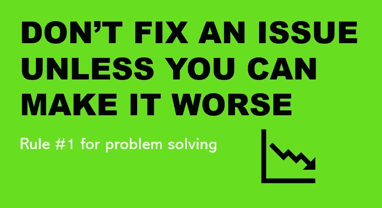

# 规则 1:除非你能让事情变得更糟，否则不要去解决它

> 原文：<https://medium.com/geekculture/rule-1-dont-fix-an-issue-unless-you-can-make-it-worse-1a0acb21890f?source=collection_archive---------18----------------------->

## 解决软件问题不要赌博

## 如何利用根本原因分析(RCA)和一个假设成为终极软件战士？

观察到许多软件工程师试图通过赌上直觉来让事情变得更好，我想…