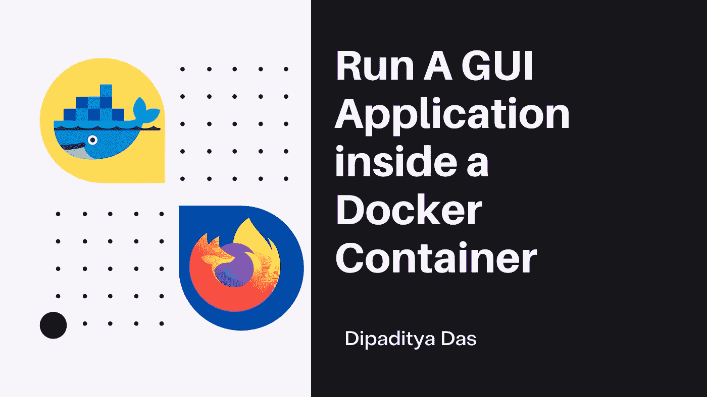
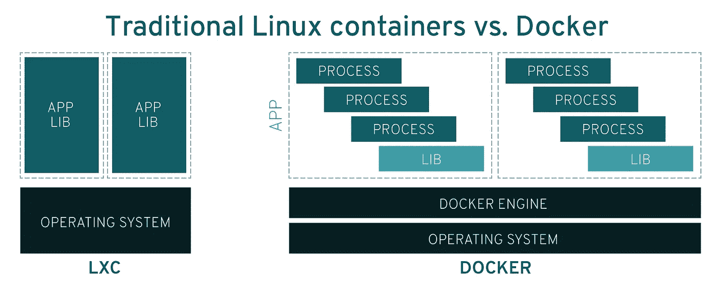
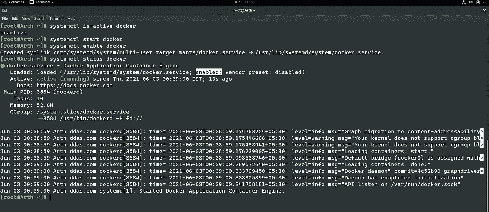
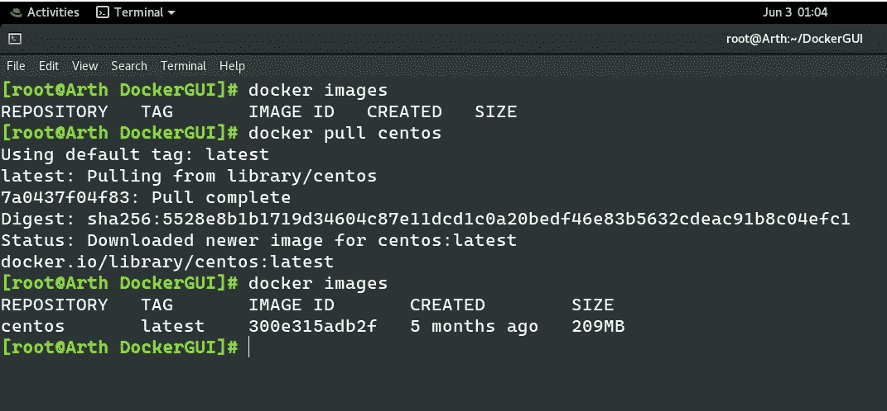
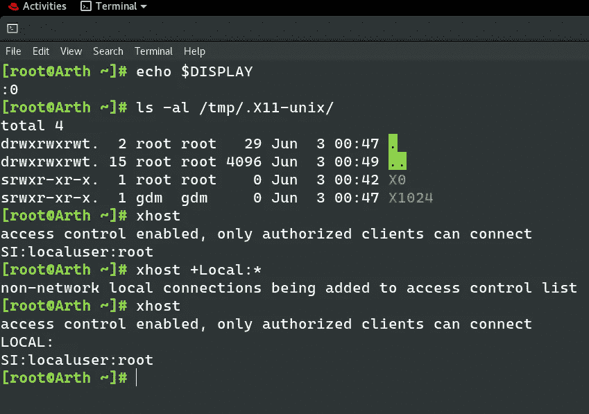
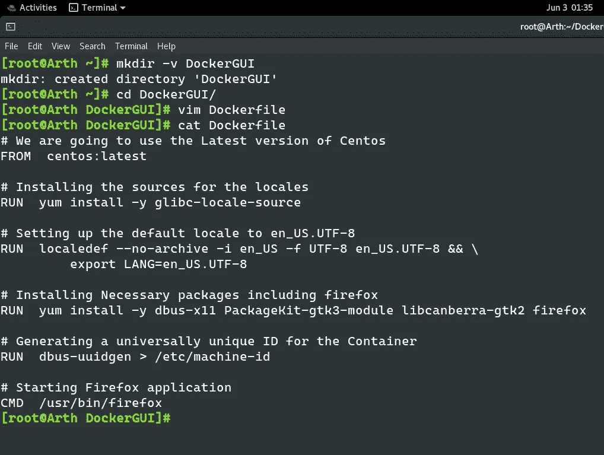
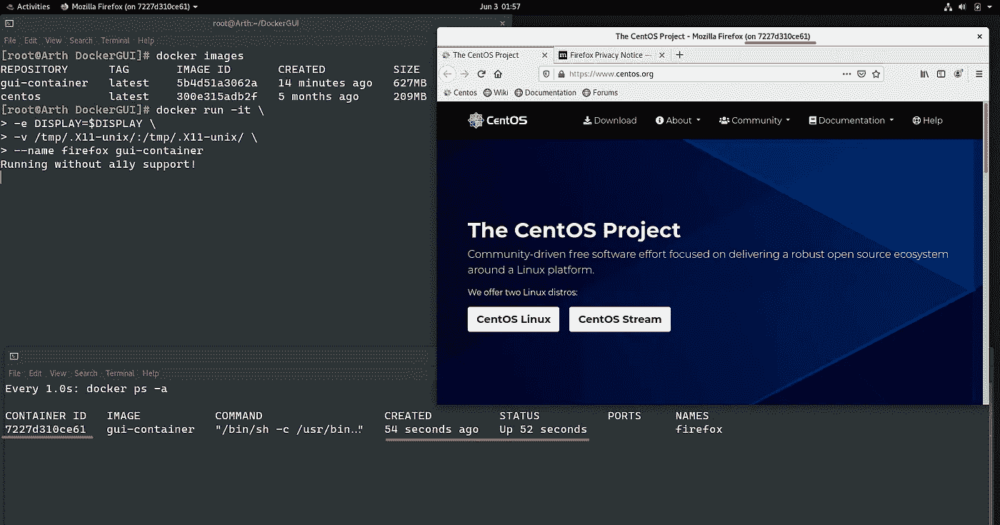

# 在 Docker 容器中运行 GUI 应用程序

> 原文：<https://medium.com/geekculture/run-a-gui-software-inside-a-docker-container-dce61771f9?source=collection_archive---------1----------------------->



在本文中，我们将运行一个 Firefox 应用程序，它基本上是 Docker 容器中的一个 GUI 软件。

# 什么是 Linux 容器？

Linux 容器是一种技术，允许您将应用程序与其整个运行时环境(运行所需的所有文件)打包并隔离。这使得在环境(开发、测试、生产等)之间移动包含的应用程序变得容易。)同时保留全部功能。集装箱也是 [IT 安全](https://www.redhat.com/en/topics/security)的重要组成部分。通过[在容器管道中构建安全性](https://www.redhat.com/en/topics/security/container-security)并保护您的基础设施，您可以确保您的容器是可靠的、可伸缩的和可信的。

# 为什么要使用 Linux 容器？

Linux 容器通过划分职责范围来帮助减少开发和运营团队之间的冲突。开发者可以专注于他们的应用，而运营团队可以专注于基础设施。而且，因为 Linux 容器是基于[开源](https://www.redhat.com/en/topics/open-source/what-is-open-source)技术的，所以一旦它们可用，您就可以获得最新和最大的改进。容器技术——包括 [CRI-O](http://thenewstack.io/cri-o-make-kubernetes-center-container-ecosystem/) 、 [Kubernetes](https://www.redhat.com/en/topics/containers/what-is-kubernetes) 和[Docker](https://www.redhat.com/en/topics/containers/what-is-docker)——帮助您的团队简化、加速和协调应用程序开发和部署。

# Docker 是什么？

Docker 技术使用 [Linux 内核](https://www.redhat.com/en/topics/linux/what-is-the-linux-kernel)和内核的特性，如 [Cgroups](https://access.redhat.com/documentation/en-US/Red_Hat_Enterprise_Linux/6/html/Resource_Management_Guide/ch01.html) 和 [namespaces](https://lwn.net/Articles/528078/) ，来隔离进程，使它们能够独立运行。这种独立性是容器的目的——能够彼此独立地运行多个进程和应用程序，以更好地利用您的基础设施，同时[保持独立系统的安全性](https://www.redhat.com/en/topics/security)。


包括 Docker 在内的容器工具提供了基于映像的部署模型。这使得跨多个环境共享一个应用程序或一组服务及其所有依赖关系变得很容易。Docker 还在这个容器环境中自动部署应用程序(或组成应用程序的组合进程集)。

这些建立在 Linux 容器之上的工具——这使得 Docker 用户友好和独特——为用户提供了前所未有的应用访问、快速部署的能力以及对版本和版本分发的控制。

# 👨‍💻Docker 与 Linux 容器:有区别吗？

虽然有时会感到困惑，但 Docker 并不等同于传统的 Linux 容器。Docker 技术最初是建立在 LXC 技术的基础上的——大多数人把它与“传统的”Linux 容器联系在一起——尽管它已经脱离了这种依赖。LXC 作为轻量级[虚拟化](https://www.redhat.com/en/topics/virtualization)很有用，但是它没有很好的开发者或用户体验。Docker 技术带来的不仅仅是运行容器的能力——它还简化了创建和构建容器、运送图像和版本控制图像等的过程。



传统的 Linux 容器使用可以管理多个进程的 init 系统。这意味着整个应用程序可以作为一个整体运行。Docker 技术鼓励将应用程序分解成独立的进程，并为此提供了工具。这种粒度方法有其优势。

# 🚀码头集装箱的优势🚀

1.  模块性
2.  图层和图像版本控制
3.  反转
4.  快速部署

💡因此，Docker 技术是一种更加精细、可控、基于微服务的方法，更注重效率。

# 码头工人的⚡安装

你可以查看我的另一篇关于 Docker 引擎和 CLI 客户端安装的文章。

🔗 [**在 Docker 上部署机器学习模型| by Dipaditya Das |极客文化| 2021 年 5 月| Medium**](/geekculture/deploy-machine-learning-model-on-docker-6685fd9f401d)

🔗 [**配置 Httpd 服务器并设置 Python 解释器并在 Docker 容器上运行它|由 dipadtya Das | Geek Culture | Medium**](/geekculture/configuring-httpd-server-and-setting-up-python-interpreter-and-run-it-on-docker-containers-258675a48016)

# X11 是什么？

X 窗口系统(也称为 X11，或简称 X)是一个用于位图显示的客户机/服务器窗口系统。它在大多数类 UNIX 操作系统上实现，并被移植到许多其他系统上。X 服务器是显示窗口和处理键盘、鼠标和触摸屏等输入设备的程序或专用终端。客户端是应用程序。

我们将使用 X11 作为主机系统和 docker 容器之间的共享组件。我们将使用 Socket 文件，这是一种 UNIX 技术，可以帮助运行在主机 Linux 系统中的守护进程或服务相互通信。

# 容器中 GUI 应用的用例

*   **应用一致性**
    适用于开发或生产力应用等工作负载的一致应用。
*   **应用交付** 分布式应用无需远程桌面服务。
*   **安全** 安全审计员或安全专业人士，他们希望运行沙盒版本的 Firefox。
*   **漏洞评估** 想要访问易受攻击的一方，并检查安全更新的强度。


## 我们将在[red hat Linux Enterprise 8(rhel 8)](https://www.redhat.com/en/enterprise-linux-8/details)**工作站进行所有的实习。**请注意，基本操作系统采用的是 GUI 形式。

## 步骤 1:启动 Docker 服务

我们需要确保 Docker 服务正常运行。

```
**systemctl is-active docker**
```

该命令检查 Docker 服务是活动的还是非活动的。

```
**systemctl start docker**
```

***该命令启动 Docker 服务。***

```
**systemctl status docker** 
```

***这提供了 docker 服务的详细概述。***



我们可以看到最后一行写着

```
**Started Docker Application Container Engine**
```

## **第二步:从 DockerHub 中提取 Centos 图像**

我们将使用 **Centos** 图像制作一个 Docker 容器，该图像可在 **DockerHub 存储库**中获得。

```
**docker images**
```

***该命令显示所有存在于我们系统本地或从公共或私有存储库或注册表下载的图像。***

```
**docker pull centos**
```

***这将默认从 DockerHub 中提取 centos 图像，并将其存储在我们的本地系统中。***



## 步骤 3:提供必要的权限

在 Docker 中显示基于 GUI 的应用程序通常是 stackoverflow 搜索的一部分，为了节省时间，对于那些粗心大意的人来说，最简单的解决方案是授予 **xhost** 权限，然后删除该权限。

```
**# Allow X server connection
xhost +local:*

# Disallow X server connection
xhost -local:***
```



## *步骤 4:创建 Dockerfile*

我们可以使用 Dockerfile 创建一个 Docker 容器。

一个 **Dockerfile** 是一个文本文档，它包含用户可以在命令行上调用的所有命令来组合一个图像。使用 **docker** build，用户可以创建一个连续执行几个命令行指令的自动化构建。

```
***# We are going to use the Latest version of Centos*
FROM  centos:latest*****# Installing the sources for the locales*
RUN  yum install -y glibc-locale-source*****# Setting up the default locale to en_US.UTF-8*
RUN  localedef --no-archive -i en_US -f UTF-8 en_US.UTF-8 && \
     export LANG=en_US.UTF-8*****# Installing Necessary packages including firefox*
RUN  yum install -y dbus-x11 PackageKit-gtk3-module libcanberra-gtk2 firefox*****# Generating a universally unique ID for the Container*
RUN  dbus-uuidgen > /etc/machine-id*****# Starting Firefox application*
CMD  /usr/bin/firefox**
```



*   ***glibc-locale-source****是很多地区的源文件。*
*   ***dbus-X11****是 D-Bus 的 X11-需求附件。*
*   ***package kit-GTK 3-模块*** *用于使用 PackageKit* 自动安装字体
*   ***Libcanberra****是 XDG 声音主题和名称规范的一个实现，用于在免费桌面上生成事件声音，比如 GNOME。它带有几个后端(ALSA、PulseAudio、OSS、GStreamer、null ),被设计成可移植的。*

## 步骤 5:从 Dockerfile 构建 Docker 映像

现在我们必须使用 docker build 命令构建 Docker 映像。

```
**docker build -t <container_image> .**
```

*   `**-t**` **— *标签选项帮助我们给图像加上合适的名称。***
*   ***最后一个点符表示 Dockerfile 存在于当前文件夹中。***


## **步骤 6:从图像启动 GUI 容器**

我们将使用 docker run 命令来启动容器。

*   **我们必须为容器提供一个** `**DISPLAY**` **环境变量。这指示 X 客户端——您的图形程序——连接到哪个 X 服务器。将容器中的** `**DISPLAY**`设置为主机上 `**$DISPLAY**` **的值。**

```
**-e DISPLAY=$DISPLAY**
```

*   **为 Docker 容器提供对主机 X 套接字的访问是一个简单的过程。X 插座可以在你的主机上的** `**/tmp/.X11-unix**` **中找到。该目录的内容应该装入分配给容器的 Docker 卷中。**

```
**-v /tmp/.X11-unix/:/tmp/.X11-unix/**
```

***这些额外的参数用于在容器内部设置基本的 OS 环境。***

```
**docker run -e DISPLAY=$DISPLAY \
           -v /tmp/.X11-unix/:/tmp/.X11-unix/ \
           --name firefox gui-container**
```



😍我们的图形用户界面软件 Firefox 已经启动并运行。

## 应用

您可能会想"**什么是行业用例？**”。

*   ***好吧，如果你用过 Google 云平台，那么你可能用过 Cloud Shell 和 Eclipse editor 两者都在一个专为你的账户制作的容器里，预装了 GCloud SDK。因为不是所有人都擅长 CLI。***
*   如果你用过 Google Colab，你会知道它也运行在一个容器中。

Source: Giphy

> "睡眠很好，他说，书更好。"

## — — — — — — — — —乔治·R·R·马丁