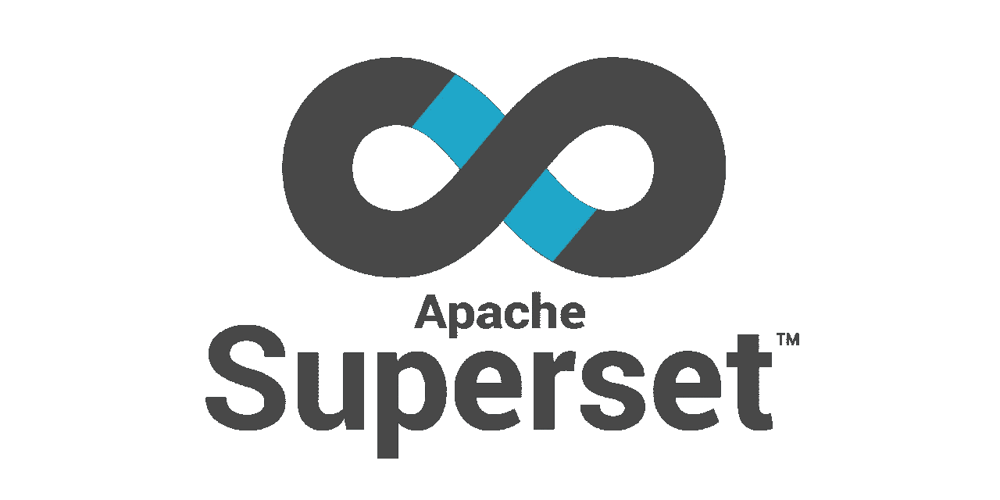
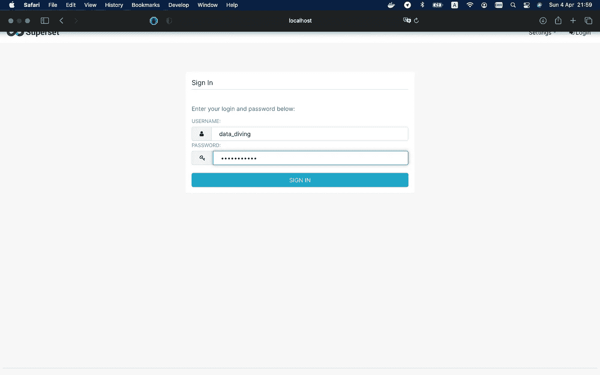

# 10 分钟内在本地运行 Apache 超集

> 原文：<https://medium.com/geekculture/run-apache-superset-locally-in-10-minutes-30bc70ed808c?source=collection_archive---------7----------------------->



Apache Superset logo, [https://superset.apache.org](https://superset.apache.org)

Apache Superset 是一个由开源社区支持和维护的现代数据探索和可视化平台。我可以诚实地说，这是所有公司都必须拥有的服务，我相信这将有助于数据探索和可视化，而且几乎没有成本。

由于 Superset 是免费使用的开源软件，我们现在就开始探索它的功能。

第一步是在你的系统中安装 Docker。Docker 有 macOS、Windows 和 Linux 版本。不幸的是，超集目前在 Windows 平台上还没有得到官方支持，但是你可以把它和安装在虚拟机上的 Docker 一起使用(例如，通过 VirtualBox 安装在 Ubuntu Linux 上)。位于此处的进一步说明:[https://docs.docker.com/get-docker/](https://docs.docker.com/get-docker/)。安装完成后，在终端中使用以下命令检查安装情况:

```
$ **docker** version --format 'Server: {{.Server.Version}}, Client: {{.Client.Version}}'
```

如果您看到类似这样的内容，说明您已经在计算机上成功安装了 Docker 软件:

```
Server: 20.10.5, Client: 20.10.5
```

其次，我们需要提取 Apache 超集映像，并使用以下命令运行它:

```
$ **docker** run -d -p 8080:8088 --name data_diving apache/superset
```

> 请注意，如果你是在 Mac 平台上，你需要调整 Docker 桌面内存设置为最低 8GB 之前，如所示[这里](https://superset.apache.org/docs/installation/installing-superset-using-docker-compose#1-install-a-docker-engine-and-docker-compose)。

是时候初始化本地超集容器了。第三步是为超集安装创建管理帐户:

```
$ **docker** exec -it data_diving superset fab create-admin \
               --username **admin** \
               --firstname Admin \
               --lastname Admin \
               --email admin@superset.com \
               --password **admin**
```

然后，我们必须将本地数据库升级到当前版本:

```
$ **docker** exec -it data_diving superset db upgrade
```

你可以跳过下一步。但是我真的建议执行这个命令，因为它会将示例数据集、图表和仪表板加载到我们的安装中:

```
$ **docker** exec -it data_diving superset load_examples
```

最后一步是初始化数据库中的角色:

```
$ **docker** exec -it data_diving superset init
```

就是这样。现在，您可以访问本地 Apache 超集安装，并通过步骤 1 中使用的凭证登录(用户:data_diving，密码:data_diving)。尽量按照链接[http://localhost:8080/log in/](http://localhost:8080/login/):



您可以自己使用所提供的示例，或者在下一篇文章中加入我，我将描述超集的特性并展示它在 BI 中的强大功能。

我希望，你喜欢这篇文章，这篇信息将帮助你建立有用的可视化。如果有，请在[中](/@agordienko)、 [GitHub](https://github.com/aleksandrgordienko) 、 [Twitter](https://twitter.com/data_diving) 、 [LinkedIn](https://www.linkedin.com/in/aleksandrgordienko/) 关注我。