# 使用 Discord Bot 运行 C 或 Python 程序

> 原文：<https://medium.com/geekculture/run-c-or-python-programs-using-discord-bot-5aff7a58bcbf?source=collection_archive---------4----------------------->


DiscordJs

在一级防范禁闭期间，我用“不和谐音”与我的朋友互动，同时玩视频游戏，就像《我们中间》一样。我们过去常常使用 discord bot(groovy)播放音乐，而我们会休息大约 5 分钟。我一直在想创造一个不和谐机器人。我最初的想法是创造一个能播放音乐的不和谐机器人。后来有一天，我的朋友想出了一个疯狂的主意，用一个不和谐机器人运行用 c 或 python 写的程序。我接受了这个挑战，最终创造了一个运行 c 和 python 程序的机器人。

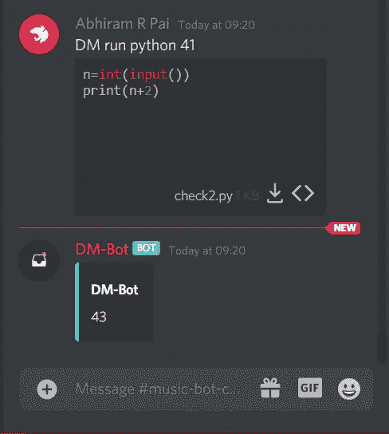

Running Python Program using Discord Bot

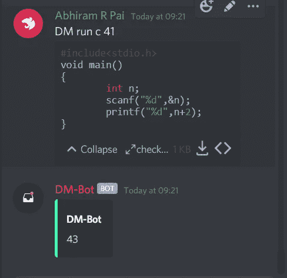

Running C Program using Discord Bot

# 先决条件

> NodeJs
>code editor(vs code，Atom，Sublime 等..)
>不一致账户和不一致服务器

# 让我们开始创建机器人

首先你必须在[不和谐开发者门户](https://discord.com/login?redirect_to=%2Fdevelopers%2Fapplications)注册这个机器人。

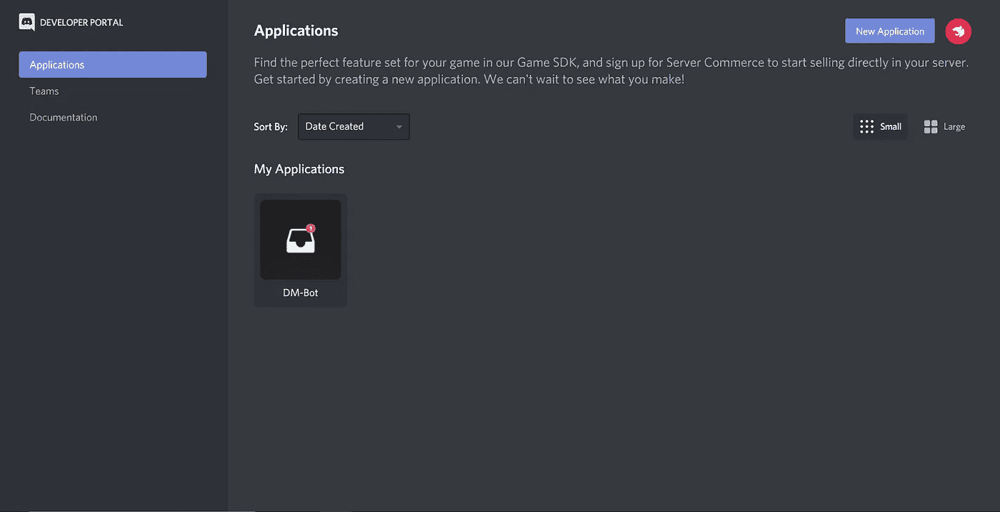

Developer Portal

登录后，您将进入该屏幕，然后单击“新建应用程序”，您将能够创建一个新的应用程序。

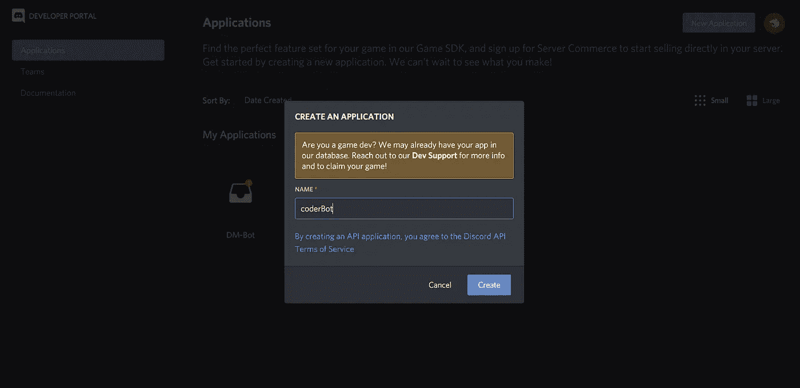

Creating the bot

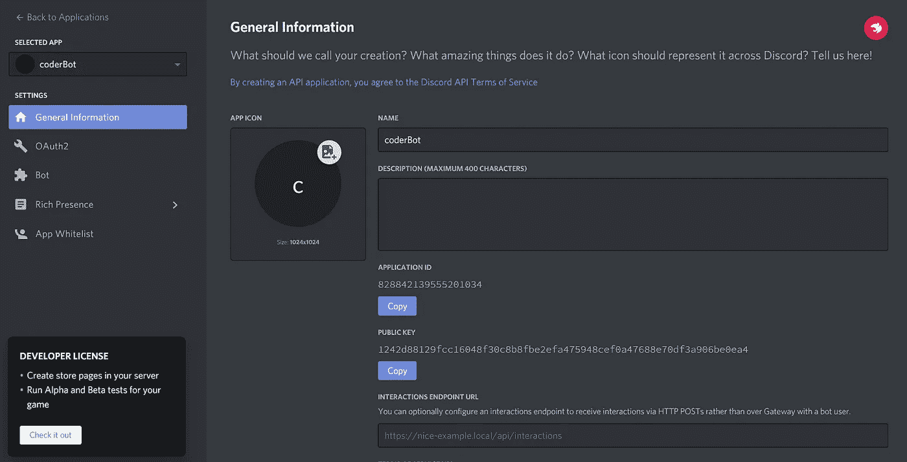

General Info of the new bot

在这个页面上，你可以设置机器人图标描述。

选择 bot 选项，并添加一个 bot。

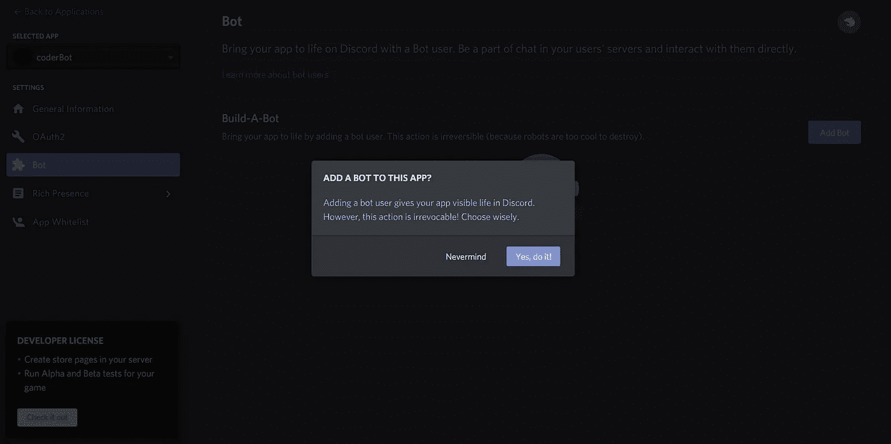

Adding bot

现在机器人已经安装好了，

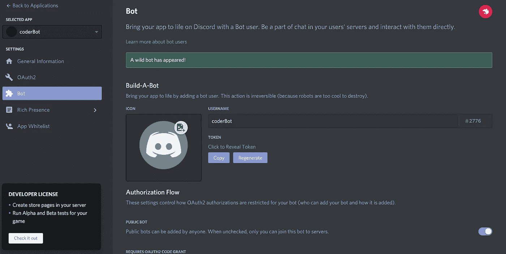

Bot details

## 现在让我们编码机器人

首先让我们为机器人创建一个目录，并安装编码机器人所需的依赖项。

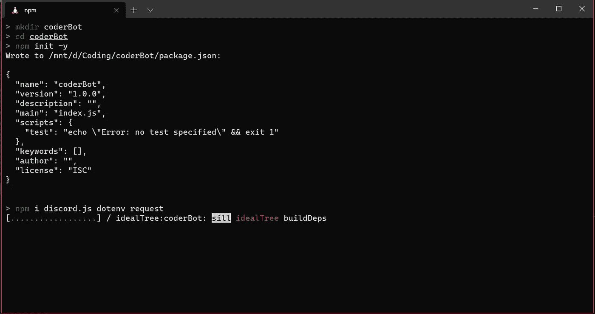

Inital Steps

*   **discord . js—**Discord 库用来创建我们的 Discord 机器人。
*   dotenv —这将允许我们隐藏某些变量，比如我们的机器人的客户端 ID。
*   **请求** —该包用于发出 http 和 https 请求。

让我们通过打开首选代码编辑器开始编码，我使用的是 [vscode](https://code.visualstudio.com/Download) 。

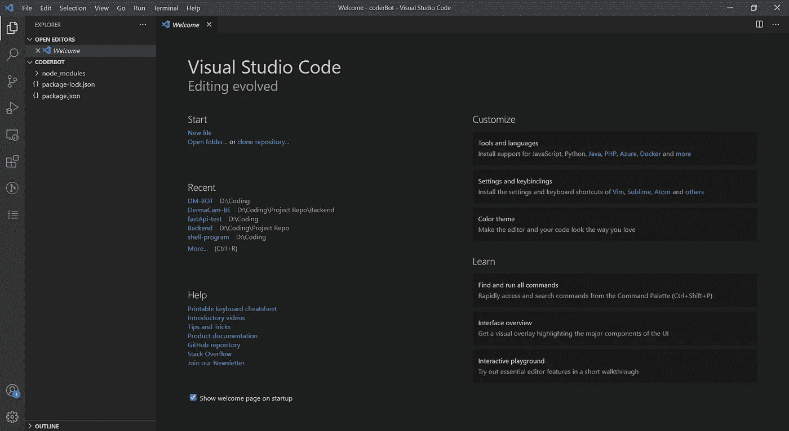

vscode folder structure

现在让我们添加。env 和 node_modules。gitignore，这样以后这些文件就不会被推送到 github repo。

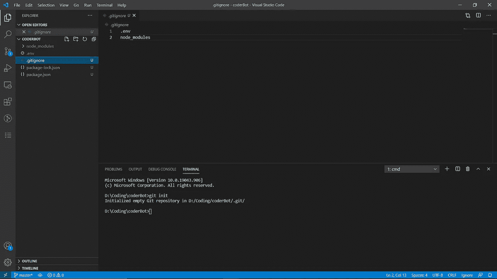

gitignore

现在我们将从[开发者门户](https://discord.com/developers/applications)获取我们的机器人的令牌，

点击 bot 选项，然后点击复制，

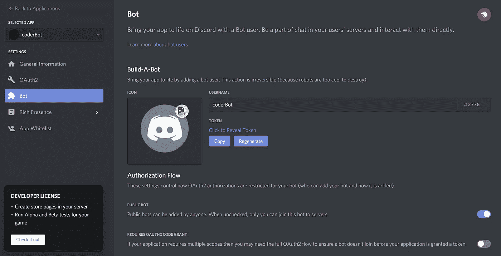

bot token

现在粘贴 bot 令牌。环境文件

```
CLIENT_TOKEN=<your token>
```

现在，在 json 包中，在脚本标签中添加一行代码，

```
“start”:"node index.js"
```

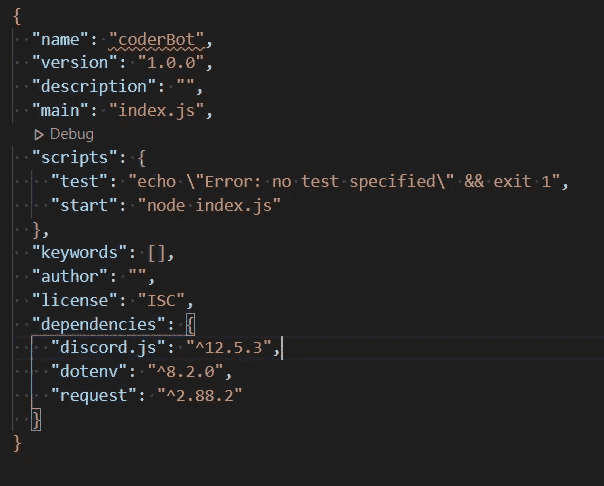

package.json

现在让我们创建一个 index.js 文件，并添加所需的依赖项

```
const Discord = require(“discord.js”);
const client = new Discord.Client();
var request = require(“request”);
require(“dotenv”).config();client.login(process.env.CLIENT_TOKEN);
```

现在，对于编译器，我们将使用 [jdoodle api](https://www.jdoodle.com/compiler-api/) ，
注册并获取客户端 Id 和客户端密码，然后将其粘贴进去。环境文件，

```
CLIENT_ID=<your client Id>
CLIENT_SECRET=<your client secret>
```

现在让我们添加运行 c 和 python 程序的代码

```
const Discord = require("discord.js");
const client = new Discord.Client();
var request = require("request");
require("dotenv").config();

const prefix = "coder ";

client.on("ready", () => {
    console.log("coder-BOT is online!");
  });

  client.on("message", async (message) => {
    try {
      let args = message.content.substring(prefix.length).split(" ");
      switch (args[0]) {case "run":
      var input = "";
      var language, index;
      if (args[1] == "C" || args[1] == "c") {
        language = "c";
        index = "0";
      } else if (args[1] == "python") {
        language = "python3";
        index = "3";
      }
      var fileName = message.attachments.array()[0];
      for (var i = 2; i < args.length; i++) input += args[i] + " ";

      request.get(fileName.url, (err, response, body) => {
        const runRequestBody = {
          script: body,
          language: language,
          stdin: input,
          versionIndex: index,
          clientId: process.env.CLIENT_ID,
          clientSecret: process.env.CLIENT_SECRET,
        };
        request
          .post({
            url: "https://api.jdoodle.com/execute",
            json: runRequestBody,
          })
          .on("error", (error) => {
            console.log("request.post error", error);
            return;
          })
          .on("data", (data) => {
            const parsedData = JSON.parse(data.toString());
            if (parsedData.error) {
              return;
            } else {
              var output = "";
              for (var i = 0; i < parsedData.output.length; i++) {
                if (parsedData.output[i] == "\n") output += "\n";
                else output += parsedData.output[i];
              }
              let outputOfProgram = new Discord.MessageEmbed()
                .setAuthor(client.user.username)
                .setDescription("Result!!!")
                .setColor("33FFB3")
                .setDescription(output);
              message.channel.send(outputOfProgram);
              return;
            }
          });
      });
      break;
    }
}
catch (Exception) {
    console.log(Exception);
    let Errorbotembed = new Discord.MessageEmbed()
      .setAuthor(client.user.username)
      .setDescription("Error!!!")
      .setColor("FFFFFF")
      .setDescription("Error Encountered\nFor Help use\nDM help");
    message.channel.send(Errorbotembed);
  }
});

client.login(process.env.CLIENT_TOKEN);
```

所以让我们破解密码，

当不和谐机器人上线时，它会在命令提示符下显示 coder-BOT 在线。

当有人在 discord bot 可以访问的通道中发送消息时，client.on message 就会起作用。

在我们的例子中，我们在这里做的是分割消息，检查消息的开始是否包含模式**“编码器”。**如果一条消息以编码器开始，那么我们理解这条消息是给编码器的。这里我使用了 switch 语句，因为我们只有一个命令 coderbot 地址，那就是 run 命令。

当一条消息以“coder run”开始时，第一种情况将运行，我们在这里要做的是检查 run 命令后面的参数是什么，如果是 c，那么使用 c 编译器，如果是 python，那么使用 python 解释器。索引变量是根据在 jdoodle ide 中如何设置索引来设置的，也就是说，在我们的例子中，我们使用的是 python 3.7.4，它位于 jdoodle python ide 的索引 3 处，而 gcc 5.3.0 c 编译器位于索引 0 处。

现在，在指定了语言之后，我们指定了文件的输入。

现在要捕获与我们使用的消息一起上传的文件，

```
var fileName = message.attachments.array()[0];
```

现在，我们使用 jdoodle api 发送请求，并相应地打印输出。

# 将机器人添加到服务器

导航到开发人员门户中的 OAuth2 选项，

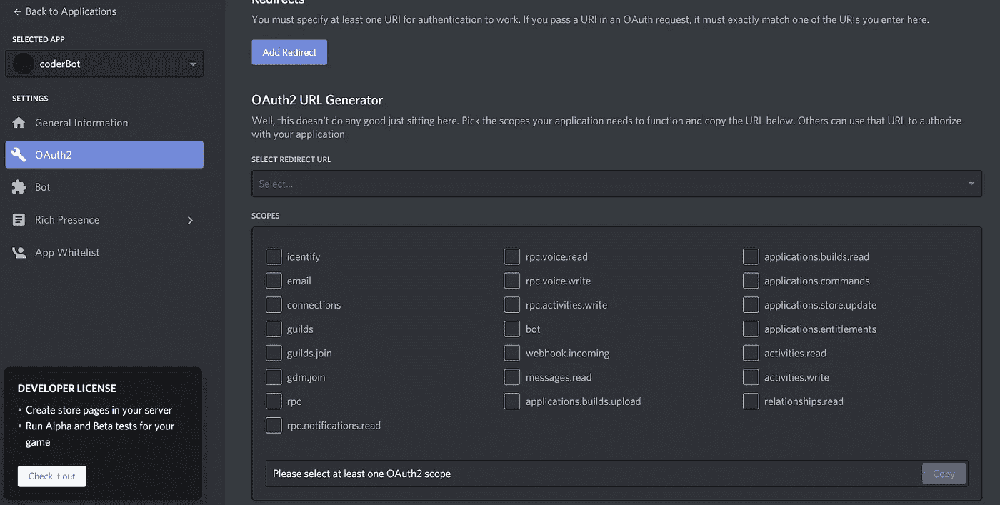

Oauth2 of the application

在范围中选择机器人，

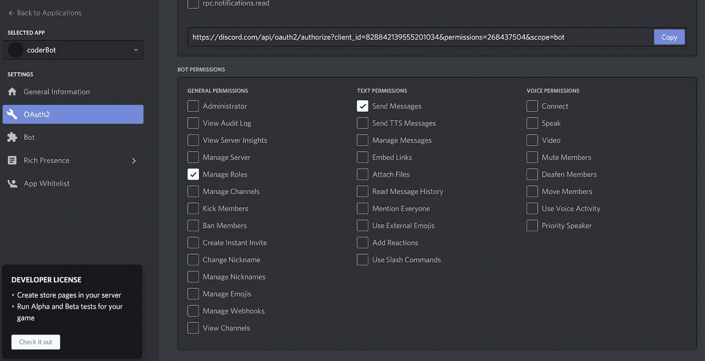

Bot Permssion

然后在机器人权限中选择发送消息和管理角色。

复制链接，然后转到链接并添加到不和谐服务器。

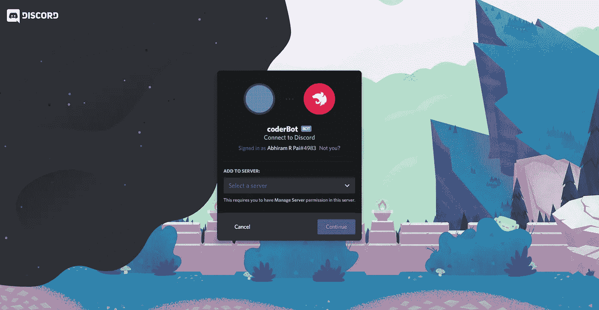

Add Bot To Server

在这之后，机器人将被添加到不和服务器。

现在让我们试着运行机器人。

使用命令，

```
npm start
```

你会在 cmd 中得到编码器-Bot 在线消息。

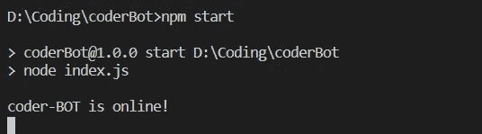

cmd

现在让我们看看它是否能运行 c 和 python 程序，

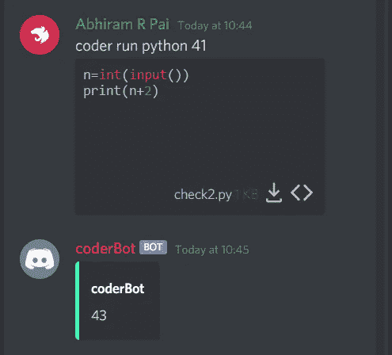

Running Python Program using Coder Bot

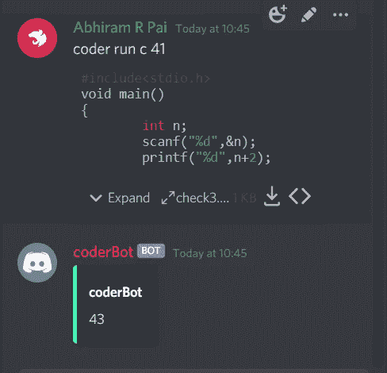

Running C Program using Coder Bot

因此，我们已经成功构建了一个不和谐机器人，它可以使用不和谐 js 运行 c 和 python 程序。

你可以在这里找到完整的代码，

[https://github.com/abhirampai/coderBot](https://github.com/Pai026/coderBot)

[https://gist . github . com/abhirampai/9979 af 5829 a 5854882858 fcab fa 6 EB 97](https://gist.github.com/abhirampai/9979af5829a5854882858fcabfa6eb97)

任何疑问，请发邮件给我@ abhirampai1999@gmail.com，

或者在糖尿病时，

[https://www.linkedin.com/in/abhiram-r-pai-bb3288170](https://www.linkedin.com/in/abhiram-r-pai-bb3288170)

[Abhiram R Pai (@pai_abhiram) /推特](https://twitter.com/pai_abhiram)

[Abhiram Pai(@ Abhiram _ Pai)insta gram 照片和视频](https://www.instagram.com/abhiram_pai/)