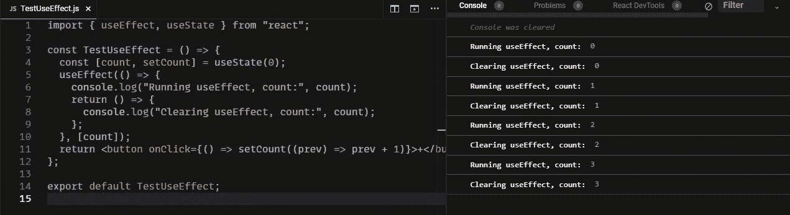
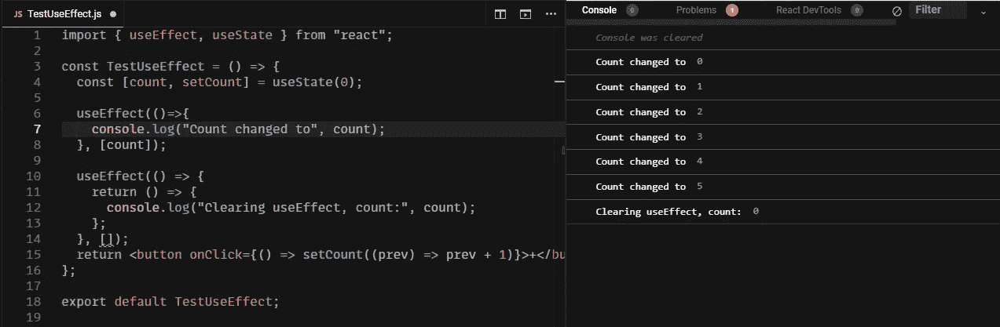
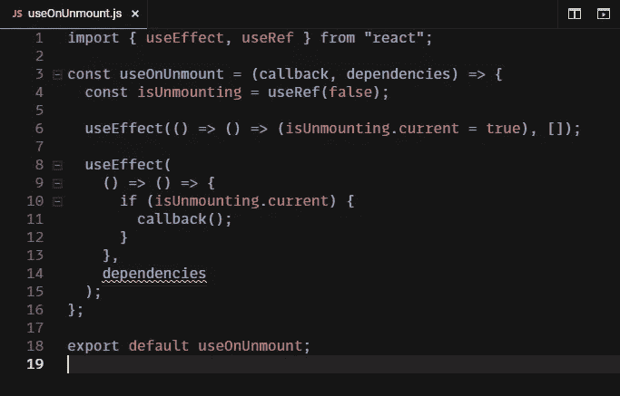

# 使用自定义挂钩“useOnUnmount”在组件卸载时运行代码

> 原文：<https://medium.com/geekculture/run-code-on-component-unmount-with-the-custom-hook-useonunmount-5355bd99e11e?source=collection_archive---------3----------------------->

React 钩子:React 自 16.8.0 版本以来的一个很酷的新增功能。

从那时起，您可以编写功能组件，同时仍然拥有类组件状态管理功能。既然用钩子编码成了标准的反应方式。

每一个钩子都为功能组件增加了一个小的功能，例如，useState 代表状态(正如你从名字中猜到的那样)，useRef 代替 createRef(同样，命名也很恰当)。

关于生命周期事件 componentDidMount、componentDidUpdate、componentdimunmount，它们都组合在一个钩子中:useEffect。

useEffect 接受一个回调函数作为输入，该函数可以返回一个函数和一个依赖项数组。每次依赖项改变来自先前调用的回调 get 的返回值，回调 get 再次运行。

例如:组件一挂载，第一行 get 就被记录，每次 count get 更新时，它都会记录清除(用旧值)并重新运行 useEffect。当组件被卸载后，会记录一个最终的“清除”消息。

这似乎与 componentWillUnmount 非常相似，对吗？没那么快。这里有一个小小的警告:如果你只需要在组件被卸载时运行一些代码，并且这些代码依赖于一些变量，那么问题就出现了。为了避免每次依赖关系改变时都运行代码，您应该从依赖关系数组中忽略该依赖关系，但是清除函数中使用的值不是最后一个！

我已经添加了第二个使用效果，只是为了向您展示计数实际上发生了变化。但是清算并没有登记这种变化。这可能是个问题。

# 解决方案

这个问题的解决方案很简单:我们需要创建一个 ref(不触发重新渲染)并将初始值设置为 false。然后，我们可以将该值添加为依赖项，并检查在 useEffect 的返回值中 ref 的当前值是否为 false，并且只有在它不为 false 时才运行代码。然后，我们将在一个独立的 useEffect 中将 ref 的值设置为 true，而不依赖于它。

将我们所说的一切包装在一个定制的钩子中，就产生了这个又酷又易用的钩子:

只有当组件真正卸载时，使用这个钩子才会导致带有更新的依赖关系的代码执行。

如果你想尝试这个或者只是想复制钩子，我会留下一个代码沙箱的链接。

[https://codesandbox.io/s/useonunmount-xfcwp?file=/src/useOnUnmount.js](https://codesandbox.io/s/useonunmount-xfcwp?file=/src/useOnUnmount.js)