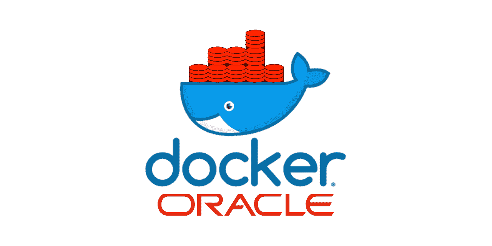
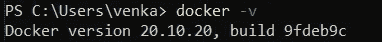
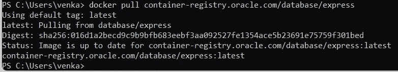
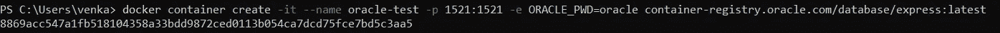
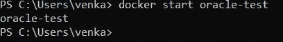
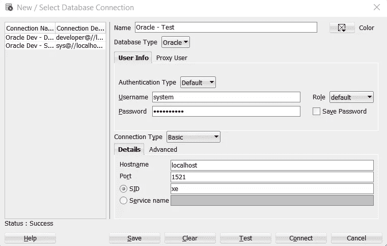

# 在 Docker 中运行 Oracle 数据库 21c

> 原文：<https://medium.com/geekculture/run-oracle-database-21c-in-docker-351049344d0c?source=collection_archive---------1----------------------->

在 Docker (Windows)中将 Oracle 数据库部署为容器的快速指南



# 概观

在这篇博客中，我们将了解如何使用 Docker 快速设置 Oracle 21c 数据库，以用于开发或学习目的。当您计划将 Oracle 用作概念验证(PoC)或探索其特性的数据库时，本指南将派上用场。

# 流动

*   检查 Docker 安装
*   Docker Hub —身份验证
*   调出 Docker 图像
*   创建并运行容器
*   连接到数据库

# 检查 Docker 安装

如果你还没有在你的机器上安装 Docker Desktop，你可以通过阅读 Docker 的官方文档来安装它。

一旦我们安装了它，我们可以进入命令提示符并发出以下命令，以确保在安装过程中一切顺利。



Installed version of Docker

# Docker Hub —身份验证

我们需要一个 Docker Hub 帐户来执行下一步，您可以在这里创建一个— [Docker Hub](https://hub.docker.com/)

一旦我们有了凭证，执行下面的命令登录。

```
docker login
```


Login to Docker Hub

# 调出 Docker 图像

我们可以使用 docker pull 命令提取图像。这将从 Oracle 的官方容器注册表中获取最新的更新。我们在这个博客中使用的是速成版，同样其他版本也是可用的。

```
docker pull container-registry.oracle.com/database/express:latest
```

如果你对数据库的具体版本感兴趣，我们可以像`docker pull container-registry.oracle.com/database/express:21.3.0-xe`一样提及



Pull the Oracle DB Image

对我来说，它没有要求 Oracle 凭证，因为映像已经下载了。但是，如果您是第一次这样做，它会提示您输入 Oracle 帐户凭据。

# 创建并运行容器

一旦我们提取了图像，我们就可以基于该图像创建一个 Docker 容器。

```
Syntax

docker container create `
   -it ` # Run the container in interactive mode
   --name [container-name] `  # Name of the container
   -p [host-port]:1521 `  # Map the port from host to container for DB
   -e ORACLE_PWD=[custom-pass] `  # Password for default user
   container-registry.oracle.com/database/express:[version]  # Image

Example

docker container create `
   -it `
   --name oracle-test `
   -p 1521:1521 `
   -e ORACLE_PWD=welcome123 `
   container-registry.oracle.com/database/express:latest
```



Confirmation of container creation

反勾号(`)用于换行，以提高可读性

一旦创建了容器，我们可以使用**docker start[container-name]**或**docker stop[container-name]**命令来启动或停止容器。



Start the container

# 连接到数据库

现在，我们可以使用 SQL Developer 或任何其他 SQL 编辑器中的默认凭据连接到新创建的数据库。

```
**Database Info**

host: localhost
port: 1521
username: system
password: welcome123
sid: xe
```



Connect using SQL Developer

PS:希望你能继续学习本教程，如果你面临任何挑战或有任何建议，请在下面留下评论。

**参考文献**

[Oracle 容器注册中心:探索 Oracle 存储库](https://container-registry.oracle.com/ords/f?p=113:1:15353542563714:::1:P1_BUSINESS_AREA:3&cs=3ocpkm2--hIpqhtDCVYsN9hjQi2cMyDn9LIfwkRRuG5YsFUF24EKuwpoQXxywBtqTWBd8Jv3jUNyXBmP2PeuIBg)

[Oracle 数据库快速版—存储库详细信息](https://container-registry.oracle.com/ords/f?p=113:4:15353542563714:::4:P4_REPOSITORY,AI_REPOSITORY,AI_REPOSITORY_NAME,P4_REPOSITORY_NAME,P4_EULA_ID,P4_BUSINESS_AREA_ID:803,803,Oracle%20Database%20Express%20Edition,Oracle%20Database%20Express%20Edition,1,0&cs=3PjQFQAeuLjzkfxeXh6pRypoIcylvjQ7jfkVgY40x7susp2kKccECvYgJj-VYPvjYNN0TpwHfZ6JKt7QRHezW8Q)