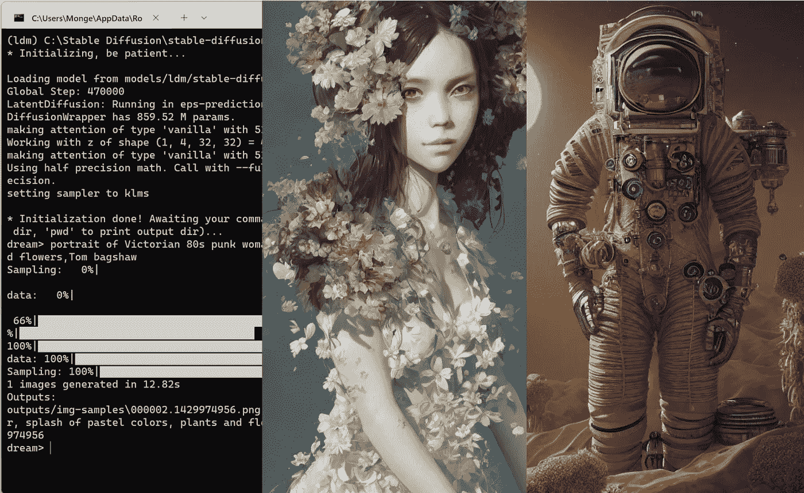

# 在家里运行稳定的扩散人工智能—无代码指南

> 原文：<https://medium.com/geekculture/run-stable-diffusion-in-your-local-computer-heres-a-step-by-step-guide-af128397d424?source=collection_archive---------0----------------------->

Image by [Jim Clyde Monge](https://medium.com/u/819323b399ac?source=post_page-----af128397d424--------------------------------)

最近，初创公司 StabilityAI [宣布](https://stability.ai/blog/stable-diffusion-public-release)发布了[stability Diffusion](/codex/stable-diffusion-new-and-free-text-to-image-ai-tool-70f95ea14440)，这是一款强大的人工智能图像生成器，现在可以在标准显卡上运行。

注意:您不需要任何编程经验就能理解，这一切都很清楚。

## 先决条件