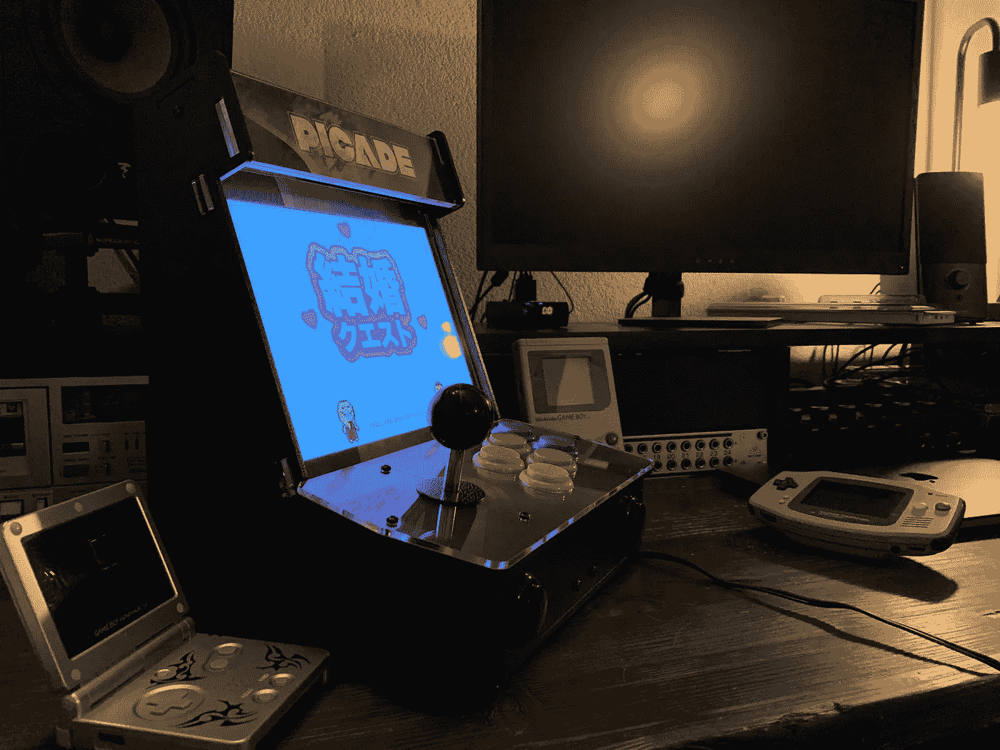
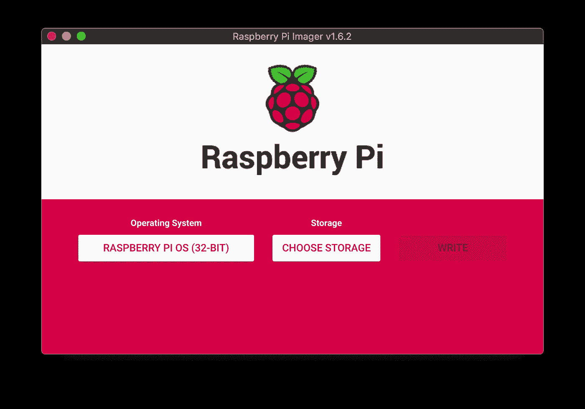

# 用 Picade 街机在 Raspberry Pi 4 上运行 Unity 游戏

> 原文：<https://medium.com/geekculture/run-unity-game-on-raspberry-pi-4-with-picade-arcade-machine-c54210d64b7a?source=collection_archive---------8----------------------->

一个朋友找到我，让我帮他在他捆绑了 Picade 复古街机的 Raspberry Pi 4B (4GB)上安装一个他用 [Unity](https://unity.com) 实现的游戏。下面是我们安装它的步骤。



The game running on the Picade arcade

主要问题是 Raspberry 板由 ARM CPU 驱动，与 Unity 可以实现的 x86_64 版本不兼容。我们已经尝试运行游戏的 Android 版本，但它没有启动。游戏本身是一个复古的平台，图形功能有限，因此我们最终采用了 WebGL 方法，在 Raspberry Pi 上的浏览器中运行游戏。

## **先决条件**

*   [树莓派 4B](https://www.raspberrypi.org/products/raspberry-pi-4-model-b/)
*   [Picade](https://shop.pimoroni.com/products/picade?variant=29210087489619)
*   micro SD 卡，至少 4 GB

# **将操作系统映像写入 SD 卡**

我们已经使用 [Raspberry Pi Imager](https://www.raspberrypi.org/software/) 将推荐的 Raspberry Pi OS (32 位)写入 SD 卡。



Raspberry Pi Imager

一旦写入完成，将 SD 卡插入树莓并启动它，根据提示进行填充。我们建议更改默认密码，否则启动时会出现一个警告窗口。我们把它改成了一个简单的`raspberry2`，因为安全性不是一个要求。

# **通过 WiFi 连接到树莓派**

由于我们必须在 Raspberry 上复制一些文件，所以通过 SSH over WiFi 连接它很方便(我的机器没有以太网端口)。

你需要先把树莓连上 WiFi。我们给它连接了一个键盘以便输入密码，还连接了一个鼠标来浏览菜单。

完成后，您需要激活 SSH 界面:

```
Preferences Menu > Raspberry Pi Configuration > Interfaces Tab > Enable SSH > OK
```

然后，在您的机器上，您可以通过运行以下命令来连接到它:

```
ssh pi@raspberrypi.local
```

并输入您的密码(对我们来说是`raspberry2`)。

# **部署游戏**

WebGL 构建需要由 web 服务器提供服务，浏览器不能简单地打开`index.html`文件。因此，我们使用了 [NGINX](https://www.nginx.com) 来完成这项任务。

1.  在`${game-dir}`中将 WebGL 构建导出到您的机器
2.  在树莓上，为游戏创建一个目录:`mkdir /home/pi/game`
3.  将构建从您的机器复制到 Raspberry: `scp -r ${game-dir} pi@raspberrypi.local:/home/pi/game`
4.  在树莓上安装 NGINX:`sudo apt install nginx`

# 将默认的 web 服务器指向游戏文件夹

下面我们用`vim`编辑文件，可以用`sudo apt install vim`安装。

1.  在默认服务器中打开一个编辑器:`sudo vim /etc/nginx/sites-enabled/default`
2.  修改这一行:`root /var/www/html;`
3.  致:`root /home/pi/game/${game-dir};`
4.  保存并关闭`vim` : ESC + `:wq`
5.  启动 NGINX: `sudo /etc/init.d/nginx start`

NGINX 将在引导时运行，因此不需要额外的设置。

当在树莓上的网络浏览器中打开`[http://localhost](http://localhost:80)`时，游戏现在应该可用了。您也可以使用以下命令通过 SSH 从您的机器上打开这样一个窗口:

```
DISPLAY=:0 chromium-browser --start-fullscreen [http://localhost](http://localhost:80)
```

# 安装 Picade 驱动程序

运行:

```
curl -sS [https://get.pimoroni.com/picadehat](https://get.pimoroni.com/picadehat) | bash
```

然后用:`sudo reboot`重启树莓 Pi。

# 设置键映射

您需要编辑`/boot/config.txt`文件来设置 Picade Arcade 的按键映射。我们在后面展示我们的例子，但是你可以在它们的定义文件中找到所有的[键码。](https://github.com/torvalds/linux/blob/master/include/uapi/linux/input-event-codes.h)

打开配置文件:`vim /boot/config.txt`并在`[all]`下添加以下内容:

```
[all]dtoverlay=picade # should already be present
dtparam=escape=114 # volume down
dtparam=enter=115 # volume up
dtparam=start=25 # p
dtparam=coin=113 # mute
dtparam=button1=24 # o
dtparam=button4=37 # k
dtparam=up=17 
dtparam=down=31
dtparam=left=30
dtparam=right=32
dtparam=button2=23 # i
dtparam=button3=22 # u
dtparam=button5=36 # j
dtparam=button6=35 # h
```

# 启动游戏时启动全屏浏览器

我们已经使用**自动启动**在启动时运行浏览器，因为它是一个 GUI 应用程序。

1.  用:`vim /etc/xdg/autostart/game-browser.desktop`打开一个新文件(扩展名`.desktop`很重要！)
2.  在里面写下以下内容:

```
[Desktop Entry]
Name=Chrome
Exec=chromium-browser --noerrors --disable-session-crashed-bubble --disable-infobars --kiosk [http://localhost](http://localhost:80) --incognito
```

我们需要`--noerrors --disable-session-crashed-bubble --disable-infobars --incognito`选项来避免重启后弹出“恢复页面”。`--kiosk`选项防止在启动时显示“按 F11 退出全屏”消息。

[Unity 的 WebGL build 中提供的默认](https://gist.github.com/kebetsi/f251cbf6dac7a4a6dcf74a0e9e177665) `[index.html](https://gist.github.com/kebetsi/f251cbf6dac7a4a6dcf74a0e9e177665)`文件不全屏显示游戏。我们必须将`/home/pi/game/${game-directory}/index.html`文件中的`body`改为:

```
<body>
 <div class=”webgl-content”>
   <div id=”unityContainer” style=”width: 1152px; height: 864px”>
   </div>
 </div>
</body>
```

根据 Picade 屏幕设置了`width`和`length`的值。我们还删除了带有 Unity 徽标的页脚。

你可以在这里找到完整的例子:[。](https://gist.github.com/kebetsi/ba6c60c653257e04cbb866080ed96e02)

# 固定声音

在 kiosk 模式下启动 chromium 会减弱覆盆子的声音。这需要玩家在每次开机后取消游戏静音来激活声音。我们做了以下工作来确保它处于打开状态:

1.  用鼠标手动取消游戏静音
2.  运行`sudo alsactl store`保存设置

我们仍然需要按下开始屏幕上的任何按钮来激活声音，这似乎是因为我们在 chromium 窗口中没有聚焦，但我们认为这已经足够了。

# 加载时清除要显示的背景

当 Raspberry Pi 启动时，我们不希望显示默认的 Raspberry Pi 操作系统桌面，而是显示自定义图像。

通过以下方式设置您想要的壁纸:

```
Preferences Menu > Raspberry Pi Configuration > Desktop Tab > Picture
```

通过取消选中同一菜单中的`Wastebasket`隐藏垃圾桶图标。

最后，我们隐藏了任务栏，方法是右键单击它，然后单击`Panel Settings`，然后转到`Advanced`选项卡并选中`Minimize panel when not in use`。我们还通过将其`width`设置为`0%`并将`height`设置为最小值`16 pixels`，将其默认大小设置为最小值。它稍微出现在左上角，但是对于我们的用例来说已经足够了。

# 隐藏鼠标跟踪器

1.  打开 GUI 配置文件:`vim /etc/lightdm/lightdm.conf`
2.  在`[Seat:*]`下，添加以下一行:`xserver-command=X -nocursor`

这使得鼠标跟踪不可见，但你仍然可以使用它，如果需要的话。

# 结果呢

Booting the Raspberry Pi directly into the game

# 试试这个游戏

我们已经在网上发布了游戏，[你可以试试这里](https://astro.toys/Kekkon-Quest/) ( [镜像](https://kebetsi.github.io/Kekkon-Quest/))。

# 来源

*   树莓 Pi 成像仪:[https://www.raspberrypi.org/software/](https://www.raspberrypi.org/software/)
*   通过 WiFi 连接树莓:[https://medium . com/@ nikosmouroutis/how-to-setup-your-Raspberry-pi-and-connect-to-it-through-ssh-and-your-local-WiFi-ac53d 3839 be 9](/@nikosmouroutis/how-to-setup-your-raspberry-pi-and-connect-to-it-through-ssh-and-your-local-wifi-ac53d3839be9)
*   在 Raspberry Pi 上安装 NGINX:[https://www . raspberrypi . org/documentation/remote-access/we B- server/NGINX . MD](https://www.raspberrypi.org/documentation/remote-access/web-server/nginx.md)
*   安装 Picade 驱动:[https://learn . pimoroni . com/tutorial/sandyj/getting-started-with-Picade-hat](https://learn.pimoroni.com/tutorial/sandyj/getting-started-with-picade-hat)
*   设置 Picade 键映射:【https://github.com/pimoroni/picade-hat 
*   停止“恢复页面”弹出:[https://www.raspberrypi.org/forums/viewtopic.php?t=212015](https://www.raspberrypi.org/forums/viewtopic.php?t=212015)
*   取消静音:[https://www.raspberrypi.org/forums/viewtopic.php?t=169216](https://www.raspberrypi.org/forums/viewtopic.php?t=169216)
*   隐藏鼠标:[https://www.raspberrypi.org/forums/viewtopic.php?t=234879](https://www.raspberrypi.org/forums/viewtopic.php?t=234879)