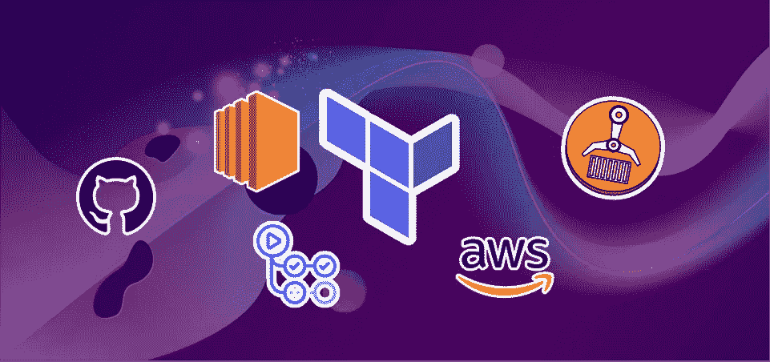
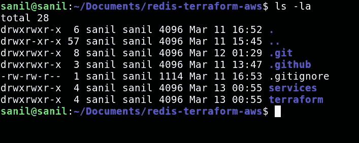
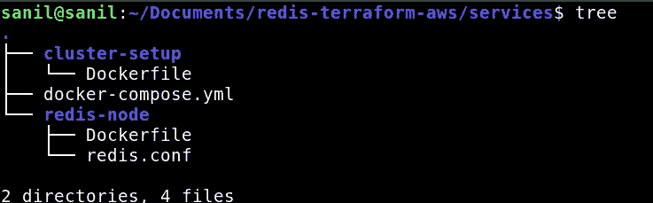
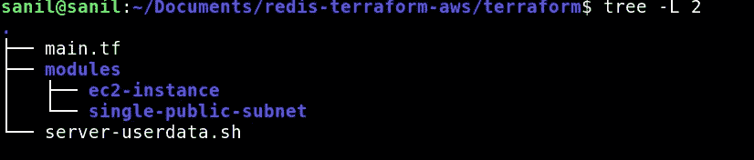
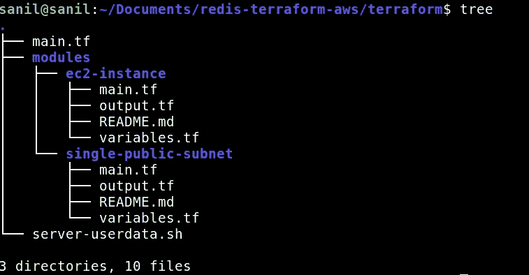
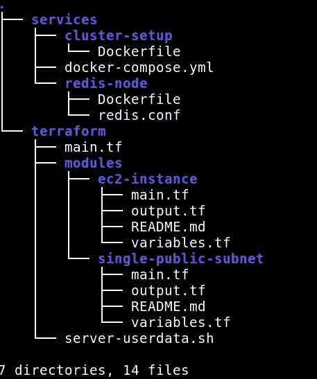
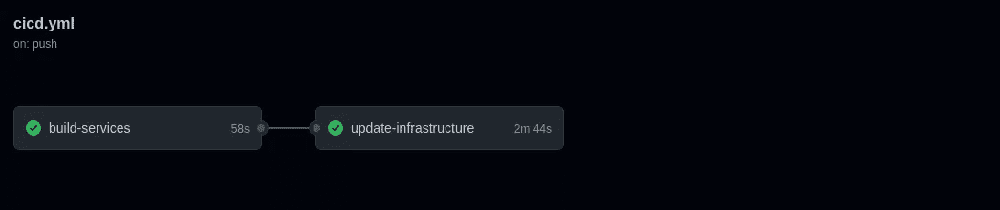

# 在 AWS 上运行 Redis 集群，将 Terraform 作为 IaC，将 Github 操作作为 CI/CD

> 原文：<https://medium.com/geekculture/running-a-redis-cluster-on-aws-with-terraform-as-iac-and-github-actions-as-ci-cd-a806ce6c447d?source=collection_archive---------4----------------------->

# 前言

在这篇文章中，我尝试使用 Github actions 创建一个具有完整 CI/CD 的生产级 Redis 集群，使用 Terraform 创建 IaC，使用 Docker compose 进行容器编排，并将其全部部署在 AWS 上。当然还有改进的空间，但是我已经尽我所能在这篇文章中提到了。

# 介绍演员

在深入实施之前，先介绍一下舞台上的演员！

## 将（行星）地球化（以适合人类居住）

Terraform 用于基础设施代码(IaC)。这意味着您只需将您的基础设施描述为代码，仅此而已！但是更有趣的部分是为什么你可能需要它。

想象一下，你不使用 Terraform，这不是一个博客帖子的小项目，而是一个巨大的项目，有一个大的开发团队，不断的变化，冲刺，期限和其他一切，以及所有这些中最关键的方面，一个不应该停机的运行生产环境。您对应用程序所做的大部分更改可能是代码级的更改，并不复杂，只需有一个 CI/CD 管道就可以在云上自动部署这些更改。如果应用程序崩溃或运行状况恶化，只需单击一个按钮就可以回滚更改，并在单独的环境中进行调查，但有时您也可能会对基础架构进行更改。

我的问题是你如何做出这些改变？你登录到你的控制台，点击几个按钮？那你怎么回滚呢？再次点击 GUI？如果多个人同时尝试进行相同的基础架构更改，会怎么样？如果人们忘记了他们在 GUI 上所做的更改会怎么样？如果您想要快速回滚大型基础架构，您会手动单击 100 个按钮，在您的客户归档票证和产品人员盯着您的时候键入*5 次“永久删除”吗？或者，如果您想在凌晨 3 点进行更改，但*记得*更改的开发人员正在熟睡中，您会怎么办？*

*解决方案是将基础设施写成代码。因此，如果您将 EC2 实例、S3 桶和 RDS 数据库编写为代码，将其上传到版本控制，并使用 CLI 工具获取这些代码并创建基础架构，您就可以解决上述所有问题。不确定在这一重大变化之前的基础设施是什么样的？只要运行`git checkout HEAD~1`就可以得到答案。不确定是谁做出了这种改变？`git blame`会告诉你该怪谁(除非他们用`[git-blame-someone-else](https://github.com/jayphelps/git-blame-someone-else)`！)您还可以将其作为 CI/CD 流程的一部分实现自动化，这样您就不需要手动设置一切，而且您可以调配与在开发或试运行中相同的资源，而不会意外忘记确切的配置。IaC 是一个好主意的原因可能有一百个，但是现在，只要知道它是一个好主意，我们将使用 Terraform 作为工具来做这件事。*

*Terraform 相当简单，至少我们计划如何使用它。只需编写一个定义您的基础设施的`tf`文件，运行`tf apply`来部署您的基础设施。这其中有细微差别，比如我们如何使用 Terraform 模块，这使您的配置更易于管理和模块化，我们如何使用变量和输出，以及如何管理状态，但如果这个新的 terraform 东西对您来说是新的，不要太担心这一点，只需知道我们定义了我们希望在这个`.tf`文件中使用的资源(如 EC2 实例或 S3 桶),并使用一个命令部署它们。*

## *雷迪斯*

*Redis 是一个内存数据库，也可以用作发布-订阅系统。关于这一点有很多要说的，但我在过去几个月里一直在写 Redis，所以如果你是新手，可以看看这个东西。*

## *EC2，ECR*

*对于那些不知道的人来说，EC2 是 AWS 上的一项服务，您可以使用它来提供虚拟专用服务器。你可以通过 SSH 进入这些服务器，运行你的代码，或者做任何你可以在笔记本电脑上通过终端完成的事情。*

*ECR 代表弹性容器注册，是 AWS 中的 docker 注册服务。如果你有 Docker 图片并想把它们放在某个地方，你通常会使用注册服务。您在这个服务中创建了存储库，您可以使用它来推送或提取 docker 图像。*

## *Github 操作*

*Github actions 是我们将用于该系统的 CI/CD 工具。简单地说，我们将在一个简单的 YAML 文件中定义部署服务和基础设施所需的步骤。Github 将在每次推送时基于这个 YAML 文件建立一个工作流，并部署我们的服务和基础设施*

# *履行*

*好，那么我们从实现开始。像往常一样，[这里的](https://github.com/Sanil2108/redis-terraform-aws)是给没有耐心的人看的源代码。*

## *第 1 部分:目录结构*

*让我们从如何组织代码开始。让我们在根目录中创建两个目录，`services`和`terraform`。`terraform`目录包含与设置我们的 AWS 基础架构相关的所有代码，而`services`目录包含我们定义的服务。除此之外，我们还需要一个`.github`目录来写我们的 CI/CD。*

*这是我的根目录现在的样子*

**

## *第 2 部分:集群 Redis 的 Docker 设置*

*这是我之前在这里谈了很多[的事情。在继续之前，请仔细阅读这些内容。](/geekculture/horizontally-scaling-writes-with-redis-clusters-a77cdcdf6de2)*

*我主要使用我在以前的博客文章中定义的用于集群 Redis 的解决方案，但是我做了一些小的改动。*

*因为我希望 docker-compose 文件在 EC2 实例上运行，所以我需要使用 docker 注册表来存储图像，并在 docker-compose 文件中使用`image`指令，而不是`build`指令。*

*这是我的新 docker-compose.yml 文件的样子*

*因为我不能再在构建时引入`REDIS_PORT`变量，所以我把它用作一个环境，而不是一个构建时参数。*

*这是 redis-node 的新 docker 文件的样子*

*所有这些都进入`services`目录。这是服务目录现在的样子*

**

*我以前在以前的帖子中解释过`redis.conf`文件和集群设置的 docker file[这里](/geekculture/horizontally-scaling-writes-with-redis-clusters-a77cdcdf6de2)。*

## *第 3 部分:编写在 EC2 上运行的代码*

*现在我们已经有了想要在 EC2 实例上运行的 docker 容器，那么我们如何运行这些容器呢？要做到这一点，我们必须编写一个在 EC2 首次启动时执行的脚本。*

*这称为用户数据脚本。当我们使用 Terraform 设置 EC2 实例时，我们将配置 EC2 使用这个脚本。*

*这是 server-userdata.sh 文件的外观*

*我已经添加了注释来解释代码，但如果仍然不清楚，我们正在做的是*

1.  *安装 Docker 和 docker-compose*
2.  *保存`docker-compose.yml`文件*
3.  *设置 AWS ECR*
4.  *最后，在 EC2 上运行 docker-compose.yml 文件*

*这个文件存在于我们的 terraform 目录中，因为我们将在我们的`main.tf`文件中链接它。*

## *第 4 部分:地形模块简介*

*在我们深入研究`main.tf`文件之前，让我简单介绍一下我们正在使用的几个模块。*

*对于那些不知道的人，Terraform 模块是较小的 terraform 代码片段，您可以在您的项目中重用。类似于编写一个库，可以在其中定义函数或变量，然后在代码中的多个位置导入它们。这有助于你重用你的代码，使它更加模块化，更好看，更易读，等等。使用 terraform 模块通常被认为是一个好的实践。*

*我在目录结构中组织它的方式如下—*

**

*有一个`main.tf`文件，一个`modules`目录，还有我们之前讲过的`server-userdata.sh`。*

*想法很简单，我写了一个`main.tf`文件来导入和使用这些模块。*

*让我们看看这些模块是如何工作的。*

**

*这两个模块都有自己的`main.tf`文件，还有一个`variables.tf`、`output.tf`和一个`README.md`文件。README.md 文件的目标应该是显而易见的。`variables.tf`和`outputs.tf`文件使得该模块实际上是模块化的。使用这些文件，您可以将模块配置为接受输入并返回输出，类似于函数中的参数和返回值。这就是你的模块可以模块化的原因。*

*现在，谈一下手头的项目。*

*这里有两个我写的并且我们正在使用的模块，`ec2-instance`模块和`single-public-subnet`模块。简单地说，`ec2-instance`模块提供一个 EC2 实例，以及安全组和任何更多的需求，而`single-public-subnet`模块提供一个新的 VPC，具有一个公共的子网，以及路由表、互联网网关等。*

*如果你感兴趣，你可以在 GitHub 上查看代码，但是这对我们现在正在构建的东西并不重要。*

## *第 5 部分:根 main.tf 文件*

*这是 terraform 实际运行的文件，它导入所有模块并部署或破坏我们的基础设施。*

*这是它看起来的样子*

*这相当简单，因为大部分代码都在我们的模块中抽象出来了。它只是将我们的后端设置为 S3 和 DynamoDB(这是 Terraform 存储状态和锁文件的地方)，使用我们讨论过的两个模块，并设置两个 ECR 存储库，我们将使用它们来存储我们的 Docker 映像。*

## *第 6 部分:CI/CD*

*最后，实际设置这一切的部分是 Github actions 中的 CI/CD 流。这是相当大的，但不要担心，我会深入解释它。*

*我们有两份工作，`build-services`和`update-infrastructure`。*

*`build-services`配置我们的 AWS 凭证和 ECR，为`redis-node`和`cluster-setup`构建 docker 映像，并将其部署到 ECR。*

*一旦`build-services`完成，`update-infrastructure`运行。这将设置 terraform，删除 EC2 实例，然后根据当前状态重新创建基础设施。*

*这是我的完整目录结构现在的样子*

**

## *第 7 部分:全部运行*

*要运行整个过程，只需推送您的代码，如果一切配置正确，您的 CI/CD 应该会自动构建 Docker 映像，将其推送到 ECR，初始化 Terraform，设置您的基础设施，并部署一切！*

**

# *结论*

*虽然上述解决方案有效，但仍有很大的改进空间。事实上，我将它部署在一个 EC2 实例上，而不是一个集群，在我看来，这可能是系统中最大的缺陷，但目前，这是我在这个项目中所做的全部工作。也许在不久的将来，我会考虑在堆栈中添加一个合适的容器编排服务，比如 ECS。*