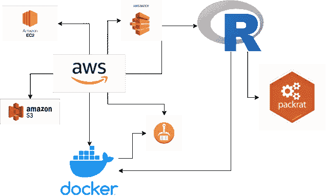
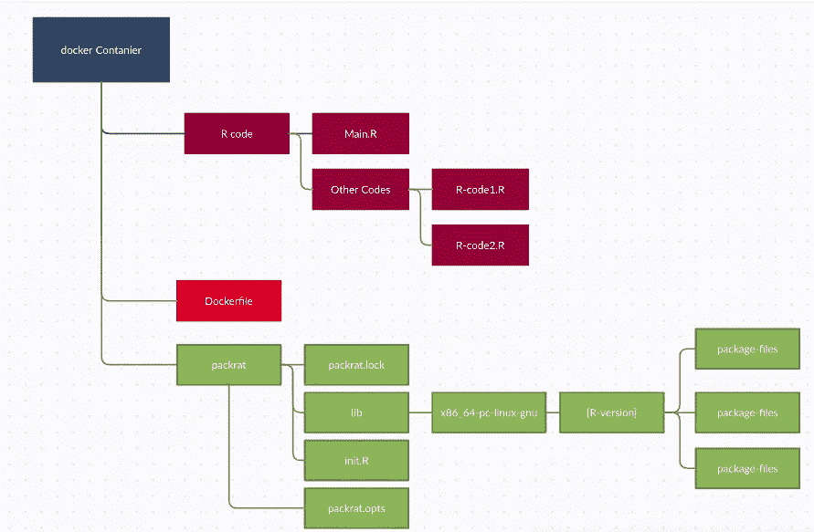

# 在 AWS 批处理上运行 R 代码

> 原文：<https://medium.com/geekculture/running-an-r-container-on-aws-batch-on-production-9be336c34f95?source=collection_archive---------0----------------------->



## 在生产环境中对 AWS 批处理运行 R 代码

在这篇博客中，我们将了解如何在容器、S3、ec2 和环境变量的帮助下在 AWS 批处理上运行作业，以参数化作业。

我使用 R(语言)作为基本容器，但是可能性是无限的。

首先，让我们了解一下 AWS 批处理的好处和局限性。

**AWS Batch** —这是 AWS 提供的一项服务，其基本任务是在 EC2 机器上运行代码，该机器具有内存和存储的弹性，无需担心机器的配置。

**限制** -运行一个任务很容易，但是当代码发生变化(甚至是一点点)并且开发-运营管道没有到位时，我们需要重复下面的过程，从步骤 2 到步骤 9。虽然当我们有一个开发运营管道(Jenkins)时，这将是几秒钟的工作任务。

**流程**

1.  用所需的配置创建一个 docker 文件。
2.  用这个 docker 文件创建一个 docker 映像。
3.  将此 docker 图像推送到 AWS ECR。
4.  在 EC2 中创建一个启动模板。
5.  使用这个启动模板创建一个 EC2 机器。
6.  创建作业队列。
7.  在 ECR 的帮助下创建批处理作业。
8.  运行批处理作业。
9.  坐下来，监控，放松，希望工作会成功。

现在，让我们深入流程，开始我们的任务。

1.  **为 docker 图像创建一个 docker 文件。**

docker 文件将包含程序运行所需的所有库和软件。例如，你需要糖、茶叶、水和其他粉末来泡茶。

Docker 文件

我使用 r-base 作为 docker 文件的基础。和 packrat 作为依赖项管理工具。让我概述一下 packrat。

pack rat——这是一个用于 R 中的依赖管理的库(就像 maven、sbt 和 poem 一样)。

要创建一个样例 packrat 文件，您需要在 R 中安装所有的库，使用 install.packages("packrat ")安装 packrat。

然后运行下面的命令。

```
packrat::init("[path where you want to keep your libraries]")
packrat::restore()
packrat::snapshot()
```

您可以在您在 init 中指定的路径下的 packrat 文件夹中找到 packrat.lock 文件。我的 git 中有一个示例 packrat 文件( [packrat.lock](https://gist.github.com/shubhamji/2abdda2421968607dd7f398a85152f29) )。

现在我们将使用这个 docker 文件创建一个容器。

**2。用这个 docker 文件创建一个 docker 映像。**

转到您创建 docker 文件的文件夹。目录结构将如下所示。我们在同一个目录中创建了一个 packrat 文件。



```
sudo docker build -t R-code:1.0  .
```

3.**将此 docker 图像推送到 AWS ECR。**

在推送这个容器之前，我们需要在 AWS ECR(弹性容器存储库)中创建一个 repo。

为此，请转到 AWS EMR 控制台，然后单击创建存储库。为您的回购命名(例如 R-code-batch)。打开推送功能上的图像扫描(它将扫描图像是否有漏洞)。打开 KMS。这两个特性是可选的。

现在，我们将使用以下命令将这个 docker 映像推送到 ECR(应该由 AWS CLI 触发)。

先决条件-您已经在服务器/系统上设置了 AWS CLI。(关于设置，您可以[点击此处](https://shubham-kanungo95.medium.com/listing-files-from-aws-in-python-using-boto3-8d4738e5598a)，我已经就此创建了一个博客)。

```
aws ecr get-login --region {your-region-name}
# execute the output of above commond (it will look like below command)docker login -u AWS -p {a very long string} -e none https://{your_aws_account_number}.dkr.ecr.{your-region-name}.amazonaws.comdocker tag R-model:1.0 {your_aws_account_number}.dkr.ecr.{your-region-name}.amazonaws.com/R-model:latestdocker push {your_aws_account_number}.dkr.ecr.{your-region-name}.amazonaws.com/R-model:latest
```

如果所有命令都成功，那么您将能够在 AWS ECR repo 中看到图像。

**4。在 EC2 中创建一个启动模板。**

可以使用 Json 文件或 AWS GUI 创建它。在我们的例子中，我们将使用 GUI 创建。

a.给出启动模板名称。现在下面的步骤是可选的。

b.给个 AMI。(机器操作系统。)

c.实例类型。(t2、m4、r4 等)

d.密钥对，如果您想使用 shell/终端登录到机器。

e.VPC(如果在您的组织中启用)。

f.存储容量。(EBS)。当您希望将块存储附加到 ec2 实例时，将使用此属性。

g.IAM 实例概要文件(您将在哪个角色上启动 EC2 机器)。

h.用户数据。如果你想在工作中使用 EFS，这是很重要的。

确保您已经替换了 efs id inline 11。否则，您的代码将无法执行 efs。如果你打算在 EBS 工作，那么不要担心 efs。

**5。在批处理中使用这个启动模板创建 EC2 机器。**

现在转到 AWS 批处理控制台，转到计算环境，并创建计算环境。

a.设置计算环境名称。

b.设置最小 CPU(为了获得最佳成本，将其设置为 0)。

c.设置最大 CPU 数量。

d.所需的 vCPUs。(为了获得最佳成本，将其设置为 0)。

e.根据需要设置实例类型(t2、m4、r4 等)。

f.【**重要**在附加设置中，设置我们上面创建的启动模板。

**6。创建作业队列。**

作业被提交到作业队列。我们将使用下面的过程创建一个作业队列。(我设置了强制属性)

答。为您的作业队列命名。

b.设置我们在上面创建的计算环境。

c.为作业队列设置优先级(对于计算环境，优先级为 1-1000 的作业队列具有较高的整数值)。

**7。借助 ECR 创建批处理作业定义。**

AWS 批处理作业定义指定了作业的运行方式。虽然每个作业都必须引用一个作业定义，但是作业定义中指定的许多参数可以在运行时被覆盖。

a.给你的工作定义起一个名字。

b.使用下面的参考 URL 给出我们推送到 AWS ECR 的图像名称

```
{your_aws_account_number}.dkr.ecr.{your-region-name}.amazonaws.com/R-code:latest
```

c.您可以编辑 CPU、内存、作业角色、卷、挂载点以及添加环境变量。

d.其他属性是可选的。所以我没有涉及它们

**8。运行批处理作业。**

现在，我们已经准备好运行批处理作业了。我们将配置拼图的最后一部分。

a.给你的工作起个名字。

b.选择我们在上面创建的作业定义。

c.选择我们在上面创建的作业队列。

d.执行超时(如果您的代码陷入了无限循环或一些权限问题，您的作业应该会自动终止)。

e.您可以再次设置 vCPUs，内存在这里为您的工作。

f.现在点击提交工作。万岁！！！作业已提交。

# 坐下来，监控，放松，希望工作会成功。

作业已提交给 AWS 批处理。现在我们需要监控和查看日志。

可以在两个地方看到作业的日志。

1.  云观察(链接将在工作状态中提供)。
2.  ECS。

**工作状态**

以下是工作状态，具有特定的含义。

I .已提交-作业已提交给 AWS infra。AWS 将检查作业是否可以运行。

二。待定-尚未收到 AWS infra 的响应。

三。Runnable- Now 批处理将尝试创建一个我们在上面配置的 EC2 机器。这需要一些时间。如果花费大量时间，可能有三个原因([点击此处](https://aws.amazon.com/premiumsupport/knowledge-center/batch-job-stuck-runnable-status/)

**1。资源不足**:您的工作指定了超过计算环境所能分配的 CPU 或内存资源。

2 **。没有分配容器实例**:无法创建实例，网络或安全问题会阻止容器实例加入底层 Amazon 弹性容器服务(Amazon ECS)集群。

**3。主机级问题**:在主机或 Docker 守护进程的级别上，容器实例内部可能存在问题。例如，实例的卷可能已满，或者 Docker 守护程序或 Amazon ECS 容器代理可能存在停止或启动问题。

四。开始——现在创建了 EC2 机器，将容器部署到 EC2 中，现在运行容器。

动词 （verb 的缩写）运行——您的代码运行在 EC2 机器上。

不及物动词 succeeded——顾名思义，您的代码以成功状态完成。

七。失败——顾名思义，您的代码以失败状态完成。

# **结论**

我们已经看到了如何在 AWS 批处理中创建作业定义和提交作业。为什么我们想要一个批处理-在大数据/数据工程领域，一旦代码被开发，那么只有数据被改变，一旦代码是最终的，很少会有代码改变，只是创造一个工作，享受生活。所有环境都将由 AWS 处理。

我试图保持这篇博客的简短(尽管大部分信息都在这里)。如果你需要任何帮助或有任何困惑，请在下面评论。我很乐意帮忙。