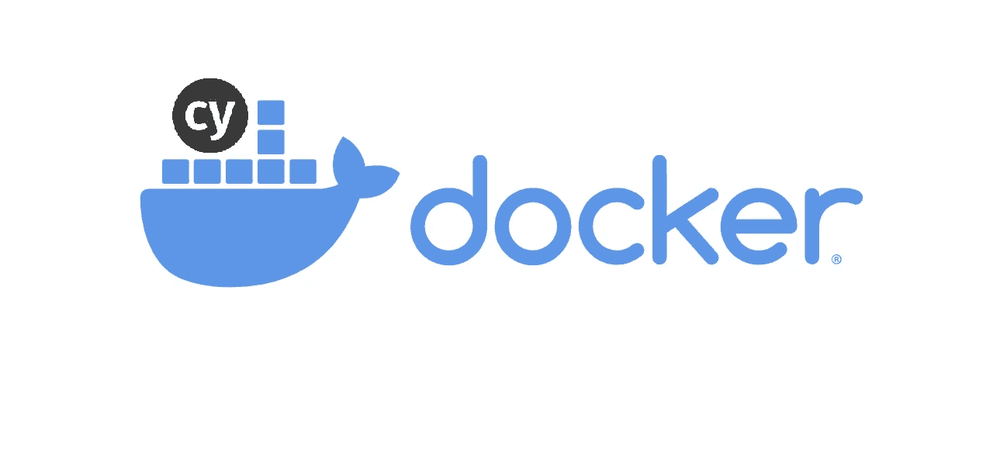
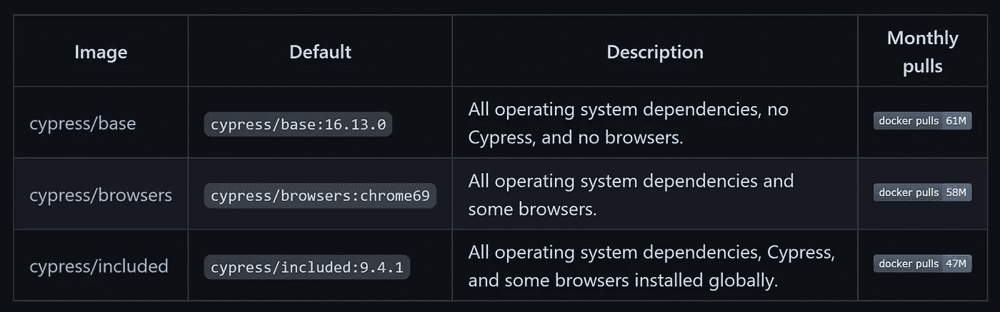
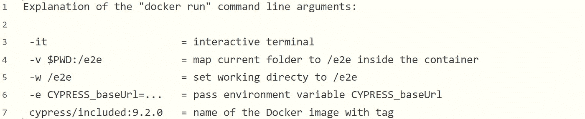
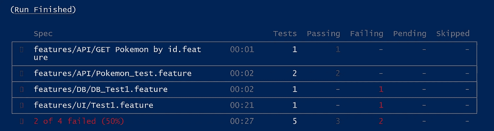
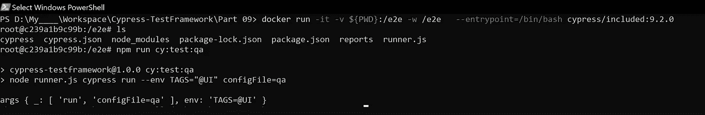

# 在 Docker 中运行 Cypress 测试(第 9 部分)

> 原文：<https://medium.com/geekculture/running-cypress-tests-in-docker-part-9-51f95b2018e0?source=collection_archive---------0----------------------->



こんにちは·孔尼奇瓦，

> [本](https://kushalbhalaik.xyz/blog/building-a-test-automation-framework-using-cypress-io-part-1/)文章系列一直使用 Cypress v 5 . 2 . 0；在这一期中，我们将使用 Cypress v9.2.0(为什么？稍后我会解释)

## 我们可以通过多种方式利用 Docker 和 Cypress 设置，在这篇文章中，我主要关注如何将它与我们正在构建的框架最好地集成，所以不是完全没有偏见。

# 为什么是 Docker？

如果你对 [Docker](http://docker.com) 一窍不通，我建议你看看 InfoWorld 上的这篇好文章。

[](/@zite/so-you-want-to-get-cypress-running-in-docker-7e8fb2837731) [## 你想让赛普拉斯在码头工作？

### 所以，这将是从一个绝对初学者的角度来看，赛普拉斯有很好的文件，但他们认为我有任何想法…

medium.com](/@zite/so-you-want-to-get-cypress-running-in-docker-7e8fb2837731) 

强调几点:

1.  Docker 能够更有效地利用系统资源
2.  您只需创建一次映像，就可以在本地、ci/cd 或任何其他设置中的任何地方运行它
3.  有了 Cypress，您可以在您的连续测试设置中使用 Docker 来获得更好的结果

因此，在我们开始之前，您也可以看看这篇简短的文章，了解一下它是如何工作的。

[](/@zite/so-you-want-to-get-cypress-running-in-docker-7e8fb2837731) [## 你想让赛普拉斯在码头工作？

### 所以，这将是从一个绝对初学者的角度来看，赛普拉斯有很好的文件，但他们认为我有任何想法…

medium.com](/@zite/so-you-want-to-get-cypress-running-in-docker-7e8fb2837731) 

# 起初

首先，您可以在这里克隆这个 repo [，并在您的文件夹路径中打开的终端中运行下面的命令](https://github.com/far11ven/Cypress-TestFramework/tree/develop/Part%2009)

```
$ npm install
```

这将安装所有必需的节点依赖项。

> 我们不会从头开始为这个项目创建 docker 文件，而是使用 [cypress-docker-images](https://github.com/cypress-io/cypress-docker-images) 。如果你想探索一下，看看[这篇文章](https://www.mariedrake.com/post/using-docker-to-run-your-cypress-tests)

> 有三种不同类型的 cypress-docker-images[https://github.com/cypress-io/cypress-docker-images ],我们将使用 cypress/included，原因很简单——它拥有一切！



cypress-docker-images categories

下面是链接:[cypress-docker-images/included/9 . 2 . 0](https://github.com/cypress-io/cypress-docker-images/tree/master/included/9.2.0)

假设你已经在你的机器上安装了 Docker，让我们开始运行已经构建好的镜像[**Cypress/included:9 . 2 . 0**](https://github.com/cypress-io/cypress-docker-images/tree/master/included/9.2.0)这也是我们首先将项目升级到 **Cypress v9.2.0** 的唯一原因

在项目位置打开的终端中

```
$ docker run -it -v $PWD:/e2e -w /e2e cypress/included:9.2.0
```

或者，如果您像我一样运行 windows，那么这个命令稍微修改为:

```
$ docker run -it -v ${PWD}:/e2e -w /e2e cypress/included:9.2.0
```

该命令分为以下几个参数



Explanation of the “docker run” command-line arguments:

该命令将通过从 **cypress.json** 文件中获取测试规范细节来运行一切，结果如下:



Run Results

对刚刚发生的事情做一点解释:

> **cypress/included:9.2.0** 将入口点设置为["cypress "，" run"]，这相当于在您的本地机器
> 上运行 **npx cypress run** ，这在我们的例子中并不那么有用，因为一切都是使用 runner.js 驱动的，runner . js 在内部调用 [Cypress 模块 API](https://docs.cypress.io/guides/guides/module-api) 。

# 保留容器(从容器内运行)

每次运行" **docker run"** 都会产生一个新的容器。测试完成后，容器停止运行，但是 Cypress 对此无能为力——是 Docker 命令" **docker run …** "控制这种行为。

如果您一次又一次地运行大量测试，您可能会使用 Bash 作为入口点启动容器一次，而不是默认的 cypress 命令。然后，您可以执行" **cypress run** "或任何其他命令，同时仍然在同一个容器中:

在项目位置打开的终端中

```
PS D:\My____\Workspace\Cypress-TestFramework\Part 09> docker run -it -v ${PWD}:/e2e -w /e2e — entrypoint=/bin/bash cypress/included:9.2.0root@BE4400671ae7:/e2e#
```

进一步检查目录的内容，它与本地机器上的目录相同

```
root@BE4400671ae7:/e2e# ls 
cypress cypress.json node_modules package-lock.json package.json reports runner.js
```

现在，您可以继续在 docker 中运行以下命令，它只是命令"**node runner . js cypress run—env TAGS = " @ API " config file = QA**"的脚本别名

```
root@c239a1b9c99b:/e2e# npm run cy:test:qa
```

使用入口点 **/bin/bash** 在 Cypress docker 容器内执行测试。



Executing tests inside the docker container

正如您所看到的，使用我们的定制脚本，我们只运行了带有@API 标签的测试。


Run Result

一旦所有的测试完成，结果将存储在原来的映射/e2e 文件夹


Reports Directory

# 结束语:

在本文中，我们只看到了如何在 Docker 容器中从 Cypress-TestFramework 运行 Cypress 测试。我们如何在 ci/cd 中实际利用这一点，我们将在下一篇文章“[在 Github Actions 中运行 Cypress 测试(第 10 部分)](https://kushalbhalaik.medium.com/running-cypress-tests-in-github-actions-part-10-8a3d406668bc)”中深入探讨。

免得读者抱怨；我没有涉及 Docker 的许多不同方面，比如构建自定义图像并将它们放入 Docker registry(比如 DockerHub ),我可能会在将来深入研究。

(编辑:你可以阅读[这篇文章](https://kushalbhalaik.xyz/blog/building-custom-docker-images-from-cypress-included/)了解更多信息)

さよなら再见

**有用链接:**

 [## 运行码头集装箱中包含的 Cypress

### 如何使用运行在 Docker 容器中的 Cypress 测试运行在本地主机上的 web 应用程序

glebbahmutov.com](https://glebbahmutov.com/blog/run-cypress-included-from-docker-container/) [](https://docs.cypress.io/examples/examples/docker#Examples) [## Docker | Cypress 文档

### https://github.com/cypress-io/cypress-docker-images 这个回购持有本地运行赛普拉斯的各种码头图像…

docs.cypress.io](https://docs.cypress.io/examples/examples/docker#Examples) [](https://www.cypress.io/blog/2019/05/02/run-cypress-with-a-single-docker-command/) [## 用一个 Docker 命令运行 Cypress

### 如果你是 Node.js 开发人员，在你的 package.json 文件中安装 Cypress 作为一个开发依赖项，甚至通过直接…

www.cypress.io](https://www.cypress.io/blog/2019/05/02/run-cypress-with-a-single-docker-command/) 

> Github 代码:
> 
> [https://github . com/far 11 ven/Cypress-test framework/tree/develop/Part 09](https://github.com/far11ven/Cypress-TestFramework/tree/develop/Part%2009)

*最初发布于*[https://kushalbhalaik . XYZ](https://kushalbhalaik.xyz/blog/running-cypress-tests-in-docker-part-9/)