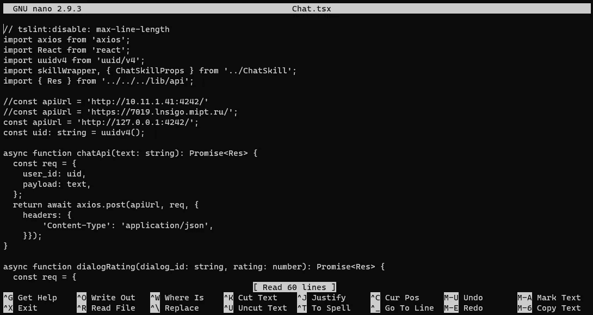
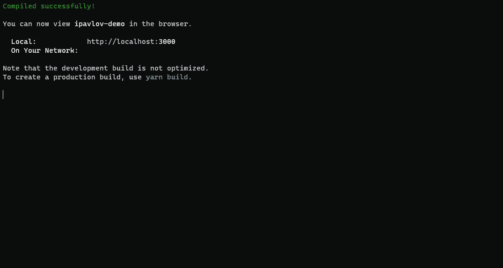
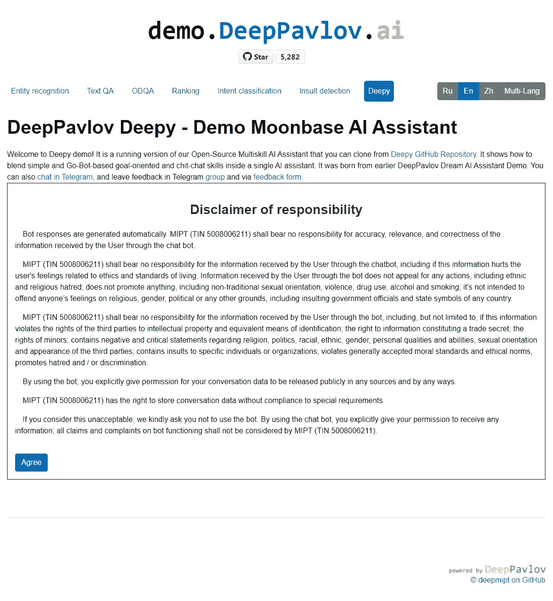
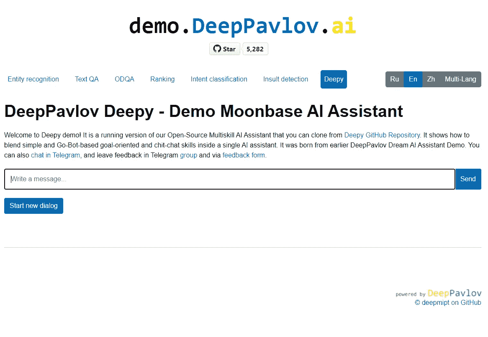

# 在 Windows 11 中的 WSL2 上本地运行 Deepy

> 原文：<https://medium.com/geekculture/running-deepy-locally-on-wsl2-in-windows-11-d7260d82a8e3?source=collection_archive---------5----------------------->

嗨！

在这篇文章中，我将分享我在运行 Windows 11 和 WSL2 的本地 PC 上运行我们的多技能人工智能助手平台 Deepy 的经验。

> 上周，我值得信赖的联想 ThinkPad X1 Yoga 第二代显示了它的年龄(它是在 2017 年 12 月购买的，从那以后在俄罗斯和美国几乎不间断地使用)，我决定换一台新的 PC。这一次考虑到流行病和在家工作的事情，我的目标是有一个坚实的钻机 w/o 妥协。梦想是能够至少部分在本地托管我们的人工智能助手/社交机器人。
> 
> 为了让大家对 DeepPavlov 有所了解，我们在 DGX 集群中部署了运行大量英伟达 GTX 1080 TI GPU 的虚拟机。对于我们去年的梦想人工智能助手演示，我使用了一个这样的带有 3 个 GPU 的虚拟机；那时候，它或多或少足够举办整个活动。我们也有配备 i7–7700、32GB RAM 和相同 GPU 的电脑。在家里，我的 X1 Yoga 配备了普通的英伟达 GTX 1080 GPU。类似的设置，但非 TI GPU 和只有 16GB 的内存。
> 
> 所以，我的新装备是一台 PC(我一生中的第五台)，AMD 锐龙 7 5800 x(16 倍虚拟内核)，64GB 内存，之前安装在雷电 3 dock 中的同一款 NVIDIA GTX 1080，以及 2TB 三星 SSD (NVMe)。该设备有可能承载高达 4gb 的 CPU(3 个 PCIE 16x 端口+ 2 个雷电 3 端口，由 GIGABYTE VISION D-P 主板支持)，以及高达 128GB 的 RAM。

这个平台目前运行在 Windows 11(撰写本文时是 22000.51)下。我想要的是能够在本地(至少部分地)运行我们的人工智能助手平台，并体验你们，我们的开发者，会体验到的东西。

注意:没有在 Ubuntu 下运行它的计划，因为有一些桌面应用程序(主要是微软 Office 和 Visual Studio)不能在那里运行。

关键是我们的 [Deepy](https://github.com/deepmipt/deepy) 以及 DREAM AI Assistant Platform Demo，以及其他社交机器人都使用我们和第三方的 GPU 密集型 NLP 模型。在我的 1080 上运行它们而不是使用 CPU 是有意义的。

# 为什么选择 WSL2？

直到最近的，在 Windows 中不可能将主机的 GPU 传递到虚拟机中，但现在这是 Windows 11 的标准功能。

作为副作用，这也允许你运行 Linux GUI 应用程序。

因此，要在 Windows 11 下运行我们的平台，我们可以使用下面至少三种可能的方法之一:

*   成熟的虚拟机(在 Hyper-V 中运行)
*   在窗户上建造
*   WSL2

虽然在 Windows 上本地构建我们的平台可能很有趣，但考虑到这将涉及检查所有组件的兼容性，在 Linux(例如 Ubuntu 18.04)上本地运行是有意义的，反正我们在数据中心使用 Linux。

结果是，如果你想在 Hyper-V VM 中使用你的 GPU，你必须从你的主机中显式地卸载它，并在 VM 中挂载它。这不是一个选项，因为我的钻机只有一个 GPU，它不能没有它。

因此，WSL2 与它的主机 GPU 共享是必由之路。下面您可以找到详细的说明，让您能够在 Windows 11 机器上使用兼容的 NVIDIA GPU 在 WSL2 中启动和运行我们的 Deepy。

# 逐步说明

## 先决条件

你需要对你的机器有管理员权限。使用 **Windows 终端**(或您选择的任何其他终端应用)开始安装。

**第一步:**为 Linux 安装 Windows 子系统:

```
dism.exe /online /enable-feature /featurename:Microsoft-Windows-Subsystem-Linux /all /norestart
```

**第二步:**安装虚拟机平台(WSL2 需要):

```
dism.exe /online /enable-feature /featurename:VirtualMachinePlatform /all /norestart
```

**第三步:**下载最新的 Linux 内核更新: [AMD64](https://wslstorestorage.blob.core.windows.net/wslblob/wsl_update_x64.msi)

**步骤 4:** 确保您的 WSL 默认设置为 WSL2:

```
wsl --set-default-version 2
```

**步骤 5** :从微软商店选择你的 Linux 发行版，例如 Ubuntu 18.04:

*   [Ubuntu 18.04 LTS](https://www.microsoft.com/store/apps/9N9TNGVNDL3Q) (其他发行版[在此列出](https://docs.microsoft.com/en-us/windows/wsl/install-win10)；你需要支持 glibc 的分布式系统才能在 WSL 中使用支持 NVIDIA CUDA 的驱动程序，例如 Ubuntu 或 Debian)

**第六步:**下载安装预览版 GPU 驱动:

[支持 NVIDIA CUDA 的 WSL 驱动程序](https://developer.nvidia.com/cuda/wsl)

**步骤 7(可选):**使用 NVIDIA GeForce experience 将您的驱动程序升级到最新版本。

**步骤 8:** 确保您的 WSL2 Linux 内核版本至少是 4.19.121 或租用:

```
wsl cat /proc/version
```

如果不是，请使用 Windows Update 获取最新版本。

**第 9 步** : [按照 NVIDIA](https://docs.nvidia.com/cuda/wsl-user-guide/index.html) 的说明安装 NVIDIA CUDA Toolkit。为了简洁起见，我在这里列出了它们，但您可以随意点击上面的链接:

```
$ apt-key adv --fetch-keys http://developer.download.nvidia.com/compute/cuda/repos/ubuntu1804/x86_64/7fa2af80.pub

$ sh -c 'echo "deb http://developer.download.nvidia.com/compute/cuda/repos/ubuntu1804/x86_64 /" > /etc/apt/sources.list.d/cuda.list'

$ apt-get update
```

**第十步:**安装 CUDA。我们在当前版本的 DeepPavlov 库中使用 CUDA 10，所以使用以下命令:

```
$ apt-get install -y cuda-toolkit-10-0
```

**第 11 步:**确保您的 CUDA 应用可以使用您的主机 NVIDIA GPU 运行:

```
$ git clone [https://github.com/NVIDIA/cuda-samples](https://github.com/NVIDIA/cuda-samples)$ cd /usr/local/cuda/samples/4_Finance/BlackScholes$ ./BlackScholes
```

您应该得到这样的输出:

```
Initializing data...
...allocating CPU memory for options.
...allocating GPU memory for options.
...generating input data in CPU mem.
...copying input data to GPU mem.
Data init done.

Executing Black-Scholes GPU kernel (131072 iterations)...
Options count             : 8000000
BlackScholesGPU() time    : 1.314299 msec
Effective memory bandwidth: 60.868973 GB/s
Gigaoptions per second    : 6.086897

...
```

如果这是你所看到的(你的数字会有所不同)，这太好了！这意味着您现在已经准备好继续安装 NVIDIA Docker。

**第十二步:**安装 Docker CE

重要提示:目前，NVIDIA 容器工具包不支持 Docker Desktop 的 WSL2 后端。然而，我不会建议你使用 Docker 桌面。

```
$ curl https://get.docker.com | sh
```

**第十三步:**安装 NVIDIA 容器工具包(你可以在这里阅读他们的说明[):](https://docs.nvidia.com/cuda/wsl-user-guide/index.html#installing-nvidia-docker)

建立稳定的和实验性的知识库和 GPG 键。为支持 WSL 2 而对运行时进行的更改可以在实验存储库中找到:

```
$ distribution=$(. /etc/os-release;echo $ID$VERSION_ID)

$ curl -s -L https://nvidia.github.io/nvidia-docker/gpgkey | sudo apt-key add -

$ curl -s -L https://nvidia.github.io/nvidia-docker/$distribution/nvidia-docker.list | sudo tee /etc/apt/sources.list.d/nvidia-docker.list

$ curl -s -L https://nvidia.github.io/libnvidia-container/experimental/$distribution/libnvidia-container-experimental.list | sudo tee /etc/apt/sources.list.d/libnvidia-container-experimental.list
```

更新软件包列表后，安装 NVIDIA 运行时软件包(及其依赖项):

```
$ sudo apt-get update

$ sudo apt-get install -y nvidia-docker2
```

打开一个单独的 WSL 2 窗口，并使用以下命令再次启动 Docker 守护进程，以完成安装。

```
$ sudo service docker stop$ sudo service docker start
```

**步骤 14:** 检查你的 NVIDIA docker 容器是否可以在你的 WSL2 机器上运行

在这个例子中，让我们运行一个 N 体模拟 CUDA 示例。这个例子已经集装箱化，可从 NGC 获得。

```
$ docker run --gpus all nvcr.io/nvidia/k8s/cuda-sample:nbody nbody -gpu -benchmark
```

从控制台，您应该看到如下所示的输出。

```
$ docker run --gpus all nvcr.io/nvidia/k8s/cuda-sample:nbody nbody -gpu -benchmark
Run "nbody -benchmark [-numbodies=<numBodies>]" to measure performance.
        -fullscreen       (run n-body simulation in fullscreen mode)
        -fp64             (use double precision floating point values for simulation)
        -hostmem          (stores simulation data in host memory)
        -benchmark        (run benchmark to measure performance)
        -numbodies=<N>    (number of bodies (>= 1) to run in simulation)
        -device=<d>       (where d=0,1,2.... for the CUDA device to use)
        -numdevices=<i>   (where i=(number of CUDA devices > 0) to use for simulation)
        -compare          (compares simulation results running once on the default GPU and once on the CPU)
        -cpu              (run n-body simulation on the CPU)
        -tipsy=<file.bin> (load a tipsy model file for simulation)NOTE: The CUDA Samples are not meant for performance measurements. Results may vary when GPU Boost is enabled.> Windowed mode
> Simulation data stored in video memory
> Single precision floating point simulation
> 1 Devices used for simulation
GPU Device 0: "GeForce GTX 1070" with compute capability 6.1> Compute 6.1 CUDA device: [GeForce GTX 1070]
15360 bodies, total time for 10 iterations: 11.949 ms
= 197.446 billion interactions per second
= 3948.925 single-precision GFLOP/s at 20 flops per interaction
```

万岁！

# 在新的基于 WSL2 的 Linux 环境中运行 Deepy

终于到了试用 Deepy 的时候了！

**步骤 1** :克隆 Deepy 的仓库

```
$ git clone https://github.com/deepmipt/deepy
```

**步骤 2:** 构建并运行它

```
$ docker-compose up --build
```

**第三步:**试试看！

一旦所有的东西都被下载、构建和运行，你就可以在你的机器上玩 Deepy 了。

# 用 Deepy 做实验

有几种方法可以玩 Deepy:

*   通过它的 REST APIs，在这种情况下可以在 [http://127.0.0.1:4242/](http://127.0.0.1:4242/) (参见文档[这里](https://deeppavlov-agent.readthedocs.io/en/latest/))
*   via Deepy 3000(我们的[小型 UWP 应用](https://github.com/deepmipt/Deepy1000)最初是为我们在 NVIDIA GTC 2020 年秋季大会上的演讲打造的)
*   通过我们的 demo.deeppavlov.ai 网站在你的机器上运行

为了简洁起见，我将在这里解释如何建立并运行我们的演示网站:

第一步:克隆演示 2 的仓库:

```
$ git clone https://github.com/deepmipt/demo2
```

**第二步**:安装 **node.js** (以下是从[到](https://linuxize.com/post/how-to-install-node-js-on-ubuntu-18.04/)的说明):

作为拥有 sudo 权限的[用户](https://linuxize.com/post/how-to-create-a-sudo-user-on-ubuntu/)，通过运行以下`[curl](https://linuxize.com/post/curl-command-examples/)`命令来启用节点源存储库:

```
$ curl -sL https://deb.nodesource.com/setup_12.x | sudo -E bash - 
```

*该命令会将 NodeSource 签名密钥添加到您的系统中，创建一个 apt 源代码库文件，安装所有必需的软件包并刷新 apt 缓存。*

启用节点源存储库后，通过键入以下命令安装 Node.js 和 npm:

```
$ sudo apt-get install nodejs
```

*nodejs 包包含了* `*node*` *和* `*npm*` *二进制文件。*

**第三步:**安装**纱线**:

启用纱线储存库:

```
$ curl -sS [https://dl.yarnpkg.com/debian/pubkey.gpg](https://dl.yarnpkg.com/debian/pubkey.gpg) | sudo apt-key add -
```

通过键入以下命令，将 Yarn APT 存储库添加到系统的软件存储库列表中:

```
$ echo "deb [https://dl.yarnpkg.com/debian/](https://dl.yarnpkg.com/debian/) stable main" | sudo tee /etc/apt/sources.list.d/yarn.list
```

一旦存储库被添加到系统中，更新包列表，并安装 Yarn，使用:

```
$ sudo apt-get update$ sudo apt-get install yarn
```

**步骤 4:** 编辑用于访问 Deepy bot 的 URI:

```
$ cd /demo2/src/components/skills/en$ nano Chat.tsx
```

在编辑器中，将 URI 改为`127.0.0.1:4242`:



保存并关闭编辑器(Ctrl+X，Y)。

第五步:运行网站:

转到克隆的 demo2 存储库的根目录:

```
$ cd ../../../../$ yarn start
```

一旦所有东西都构建好了，您应该会看到:



瞧。

**第 6 步:**在浏览器中打开您的演示 2 网站:

[http://localhost:3000/#/en/chat](http://localhost:3000/#/en/chat)

这将向您展示 Deepy 3000 web UI:



点击“同意”，你就可以开始了！



现在你已经启动并运行了你的系统，你可以关注我们的 Deepy 的 wiki 来学习如何为你的多技能人工智能助手建立你自己的技能和注释器！

祝你好运，让我们知道你和 Deepy 一起建立了什么！