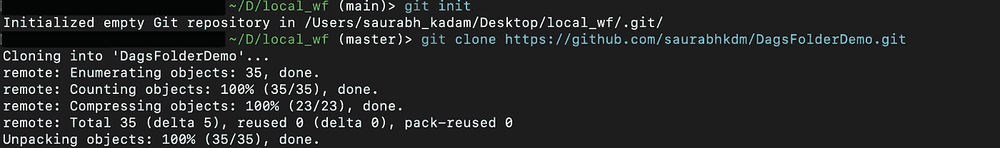
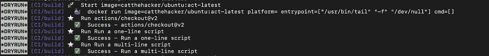
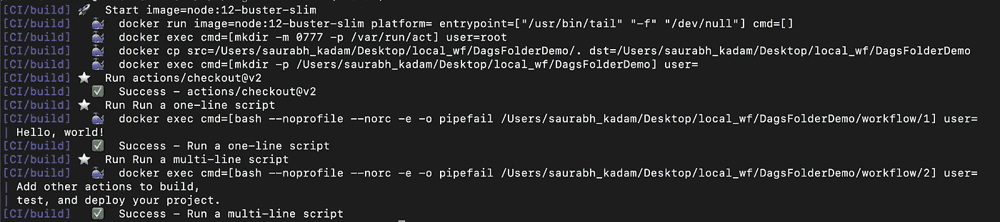
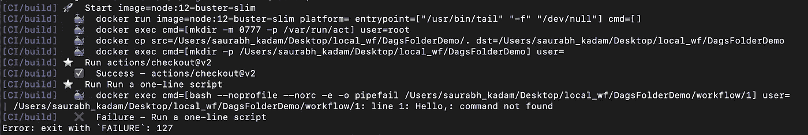

# 在本地机器上运行 Github 操作。

> 原文：<https://medium.com/geekculture/running-github-actions-on-local-machine-f87c8c925951?source=collection_archive---------16----------------------->

Github Action 是一个很大的 CI，但是您想在 Github 中创建一个新的 CI/CD 管道。测试的唯一方法是向相应的存储库发出推或拉请求。


Source: GOOGLE

如果我告诉你还有一种方法可以测试 Github 的动作呢？

[https://github.com/nektos/act](https://github.com/nektos/act)是在推送到 Github 之前在本地测试你的管道进行语法修正甚至修正脚本的解决方案之一。

对于 Mac，这是一个简单的安装。

```
brew install act
```

它将下载并安装本地运行的依赖项。要在存储库中使用它，请在本地机器上克隆存储库



安装完成后，转到根目录。我们可以开始尝试工作流程中的所有步骤。我只有一步工作流程来显示 GitHub 提供的。所以它显示为阶段 0。

```
$ act -l
ID     Stage  Nametest   0      testbuild  0      build
```

*act*是用于运行工作流的命令。它将询问您想要用来运行工作流的图像。请根据您的要求选择图像。更多细节在那个回购的自述里提到。

```
act**? Please choose the default image you want to use with act:****- Large size image: +20GB Docker image, includes almost all tools used on GitHub Actions (IMPORTANT: currently only ubuntu-18.04 platform is available)****- Medium size image: ~500MB, includes only necessary tools to bootstrap actions and aims to be compatible with all actions****- Micro size image: <200MB, contains only NodeJS required to bootstrap actions, doesn't work with all actions****Default image and other options can be changed manually in ~/.actrc (please refer to https://github.com/nektos/act#configuration for additional information about file structure)** Medium
```

求救，是命令 *act-h*

```
Usage:act [event name to run]If no event name passed, will default to "on: push" [flags]Flags:-a, --actor string                     user that triggered the event (default "nektos/act")-b, --bind                             bind working directory to container, rather than copy--container-architecture string    Architecture which should be used to run containers, e.g.: linux/amd64\. If not specified, will use host default architecture. Requires Docker server API Version 1.41+. Ignored on earlier Docker server platforms.--container-cap-add stringArray    kernel capabilities to add to the workflow containers (e.g. --container-cap-add SYS_PTRACE)--container-cap-drop stringArray   kernel capabilities to remove from the workflow containers (e.g. --container-cap-drop SYS_PTRACE)--container-daemon-socket string   Path to Docker daemon socket which will be mounted to containers (default "/var/run/docker.sock")--defaultbranch string             the name of the main branch--detect-event                     Use first event type from workflow as event that triggered the workflow-C, --directory string                 working directory (default ".")-n, --dryrun                           dryrun mode--env stringArray                  env to make available to actions with optional value (e.g. --env myenv=foo or --env myenv)--env-file string                  environment file to read and use as env in the containers (default ".env")-e, --eventpath string                 path to event JSON file--github-instance string           GitHub instance to use. Don't use this if you are not using GitHub Enterprise Server. (default "github.com")-g, --graph                            draw workflows-h, --help                             help for act--insecure-secrets                 NOT RECOMMENDED! Doesn't hide secrets while printing logs.-j, --job string                       run job-l, --list                             list workflows--no-recurse                       Flag to disable running workflows from subdirectories of specified path in '--workflows'/'-W' flag-P, --platform stringArray             custom image to use per platform (e.g. -P ubuntu-18.04=nektos/act-environments-ubuntu:18.04)--privileged                       use privileged mode-p, --pull                             pull docker image(s) even if already present-q, --quiet                            disable logging of output from steps-r, --reuse                            reuse action containers to maintain state--rm                               automatically remove containers just before exit-s, --secret stringArray               secret to make available to actions with optional value (e.g. -s mysecret=foo or -s mysecret)--secret-file string               file with list of secrets to read from (e.g. --secret-file .secrets) (default ".secrets")--use-gitignore                    Controls whether paths specified in .gitignore should be copied into container (default true)--userns string                    user namespace to use-v, --verbose                          verbose output--version                          version for act-w, --watch                            watch the contents of the local repo and run when files change-W, --workflows string                 path to workflow file(s) (default "./.github/workflows/")
```

要以模拟运行的方式运行工作流，它是 act-n。



要运行工作流，您只需要 *act* 命令。它是这样工作的。



Succesful scenario

脚本出现故障怎么办？它可以在运行中显示相同的内容。我故意改变了脚本中的一些变量。



Failure Scenario

在本地机器上开发 CI/CD 管道脚本时，这是一个非常棒的工具。试一试吧。