# 通过 AWS 开发人员工具运行 Terraform 完整的 CI/CD 指南

> 原文：<https://medium.com/geekculture/running-terraform-via-aws-developer-tools-complete-ci-cd-guide-438cd2be514e?source=collection_archive---------0----------------------->

Created by Raktim using Canva

## 了解在 AWS CodeCommit 中存储 Terraform 代码的完整流程&使用 CodePipeline 在 CodeBuild 中部署该代码，以便在 AWS 上提供资源。

在从事各种 DevOps 项目之后，我注意到 CI/CD 可以使用不同的服务以多种方式实现，如 GitLab、Jenkins、Azure DevOps 等。但是 AWS Developer Tools 与其他 AWS 服务有一些惊人的集成，这使得 CI/CD 更加有效。让我们更深入地了解一些 AWS 开发人员工具服务&然后实施一个真实的工业项目，使用这些令人惊叹的技术学习 CI/CD。

# 什么是 AWS 开发者工具？

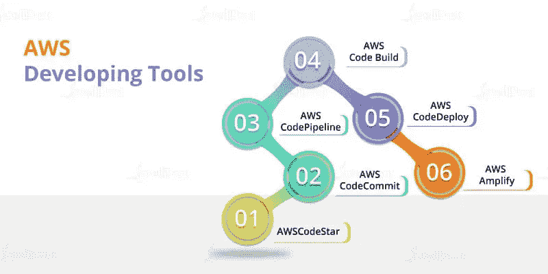

Source: Internet

**这是一组服务，主要由 DevOps 专业人员用来自动化应用程序的持续集成&持续部署。**AWS code commit、CodeBuild、CodeDeploy、CodePipeline 等服务。可用于不同的场景，例如构建完整的工作流、测试&部署应用程序代码、运行代码以供应基础架构等。

> **了解更多:**[**https://docs . AWS . Amazon . com/whites/latest/AWS-overview/developer-tools . html**](https://docs.aws.amazon.com/whitepapers/latest/aws-overview/developer-tools.html)

# 代码提交简介:

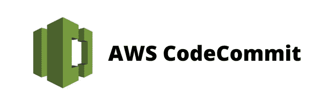

Source: Internet

**简单来说，这是一个类似 GitHub 的云托管&托管版本控制系统。**如今 GitHub 是最流行的代码维护平台。但是如果你想要一个私有的代码库，在那里你可以实现各种各样的 AWS 安全特性&可以与其他 AWS 服务无缝集成，那么更好的选择是使用 AWS CodeCommit。一旦我们开始实践，你会发现在 AWS CodeCommit 上工作非常容易。

> **官方文档页面:**[**https://docs . AWS . Amazon . com/code commit/latest/user guide/welcome . html**](https://docs.aws.amazon.com/codecommit/latest/userguide/welcome.html)

# 代码构建简介:

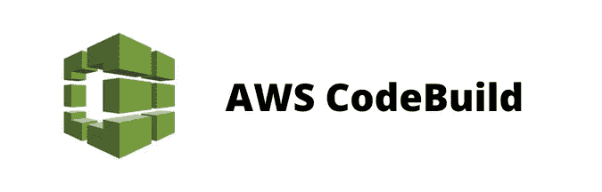

Source: Internet

您可以认为该服务执行一个独立的隔离进程，该进程可以帮助您出于各种目的运行命令——主要是编译/构建代码或运行代码。 **CodeBuild 可以提取容器映像&然后它可以运行该映像来创建容器流程。**您可以将 CodeBuild 与各种 AWS 服务集成，例如 Elastic Container Registry，以获取您自己定制的容器映像，或者让我们说，您可以提供 AWS CodeBuild 必要的权限，以在 CloudWatch 日志中存储构建日志等。

> **官方文档页面:**[**https://docs . AWS . Amazon . com/code build/latest/user guide/welcome . html**](https://docs.aws.amazon.com/codebuild/latest/userguide/welcome.html)

# 简而言之，代码管道:

Source: Internet

这项服务能够在管道中容纳其他服务，这样我们就可以在一个连续的流程中构建、测试和部署我们的应用程序代码。例如，CodePipeline 可以从 CodeCommit &获取一些代码，然后它可以将这些代码发送到 CodeBuild 以开始构建过程。一旦构建完成，CodePipeline 可以将工件&存储在 CodeArtifact 或 S3 中。类似地，它可以集成其他服务，如 SNS、SQS，用于发送关于管道的相关信息，甚至可以将 CodePipeline 与外部代码库集成，如 GitHub、Big Bucket 等。取出密码。

> **官方文档页面:**[**https://docs . AWS . Amazon . com/code pipeline/latest/user guide/welcome . html**](https://docs.aws.amazon.com/codepipeline/latest/userguide/welcome.html)

# 问题陈述:

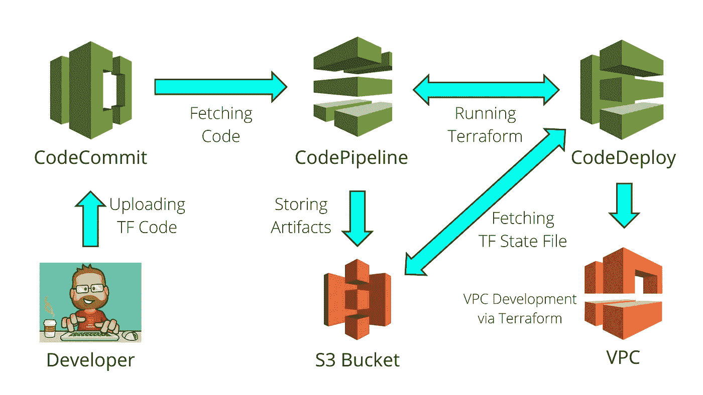

Created by Raktim using Canva

*   在 CodeCommit 上创建一个存储库来存储 terraform 代码。将 CodeCommit 与您的本地计算机连接，以便持续开发 terraform 代码。
*   创建两个 CodeBuild 项目——首先运行 terraform 计划，然后应用更改。
*   创建一个 CodePipeline，它将从 CodeCommit 获取代码，并可以运行 CodeBuild 项目来部署 Terraform 代码。以便我们可以提供其他资源。
*   创建必要的 IAM 角色和权限。还要在 CloudWatch 日志中存储 CodeBuild 过程的日志。

听起来很有趣……让我们一步一步地解决这个问题。但在开始之前，让我告诉你一些基本要求。

# 先决条件:

**在知识方面，你应该了解 Git、Terraform、AWS IAM & S3 的基础知识。其余一切，我会详细讨论。当然，你需要一个 AWS 帐户&我将从该帐户的管理员权力执行一切。**

如果你对 Terraform 没有基本的了解，那么请关注我下面提到的博客:

 [## AWS & Terraform 入门。

### 如何入门使用 Terraform 在 AWS 中构建基础设施？

medium.com](/nerd-for-tech/getting-started-with-aws-terraform-293e9125dff) 

让我们跳进来…

> **注意:想法很简单。最初，我将在我的本地系统上运行 Terraform，以提供 CodeCommit 存储库、CodePipeline 中的管道、CodeBuild 项目、S3 bucket & IAM 角色。**

## **本博客中指定的所有代码都可以在下面提到的 GitHub 资源库中找到:**

 [## GitHub-rak Tim 00/ci-CD-AWS-开发者-工具-tf

### 使用 AWS 开发工具开发演示 CI/CD 环境的代码，以运行 Terraform 代码…

github.com](https://github.com/raktim00/ci-cd-aws-developer-tools-tf) 

# 步骤 1:提供代码提交存储库和 S3 存储桶

CodeCommit 存储库将用于存储 Terraform 代码，我们将使用这些代码来提供除前面提到的资源之外的其他资源。假设您想要建立一个复杂的 VPC 架构。这种方法将向您展示如何创建一个 CI/CD 管道来运行 CodeBuild 中 Terraform 以提供 VPC。

**我们将使用 S3 桶来存储后端状态文件，这样当 CodeBuild 运行 Terraform 时，它可以查看这个状态文件。**起初这听起来可能有点混乱，但相信我，一旦你完成了整个设置，就不难理解了。此外，CodePipeline 将使用同一个桶来存储工件。同样，当我们设置代码管道时，你会看到它是如何工作的。

在您的系统中创建一个工作区文件夹，并将下面提到的代码文件放入其中。请根据您的需要更改参数。

*   这些是 Terraform 中非常基本的文件，用于提供名为“raktim-infra-vpc-backend”的 S3 存储桶，并启用了私有 ACL 和版本控制。此外，该文件提供了一个名为“infra-vpc-repo”的 CodeCommit 存储库。
*   我在 S3 桶中创建了一个空文件夹来存储 Terraform 的后端状态文件，它将在将来供应 VPC 时使用。

> **注意:我使用一个带有“AdministratorAccess”的 AWS IAM 帐户，通过本地系统 aws cli 认证 terraform。**

首先运行“terraform init ”,然后运行“terraform apply ”,以提供 S3 存储区和代码提交存储库。

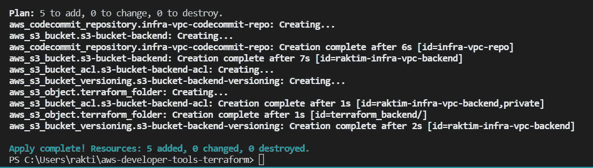

现在去 AWS 帐户，并检查代码提交和 S3。

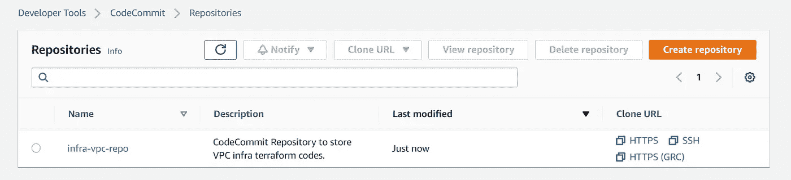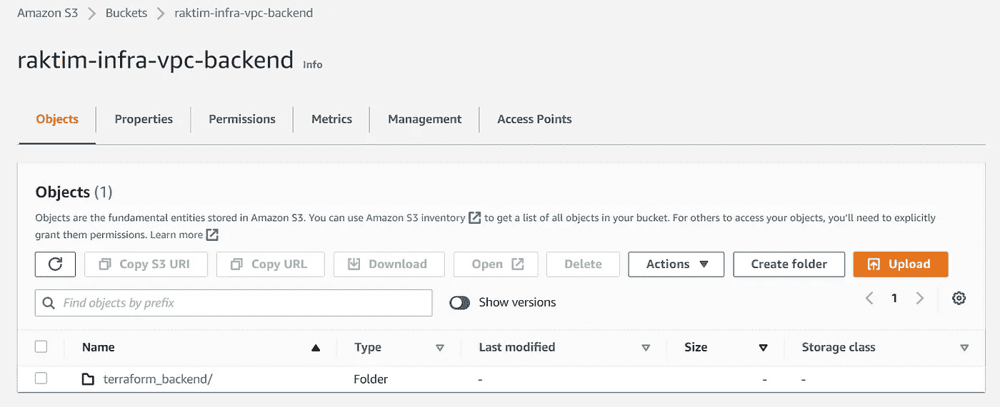

# 步骤 2:设置所需的 IAM 角色

同样，我将使用 Terraform 代码来创建两个 IAM 角色—

*   第一个是 CodeBuild 项目，它将查看 S3 桶以获取 terraform 状态文件。此外，我们需要为 CodeBuild 项目提供一定的权力，以便它可以提供资源——比如我们的 VPC。
*   第二个是 CodePipeline 中的管道，它将运行 CodeBuild 项目。此外，我们将提供从 CodeCommit 获取代码的权限。

首先，为了最佳实践，我在“variables.tf”文件中添加了一些变量。

接下来，我们有代码来为 CodeBuild 创建 IAM 角色…

*   我们正在为 CodeBuild 项目创建一个 IAM 角色，它对 VPC 有权限，在我们指定的 S3 桶内&对 CloudWatch 日志有权限。因为 CodeBuild 项目将使用 Terraform 为我们提供 VPC &它将在 S3 维护 Terraform 状态文件。此外，它会将执行日志存储在 CloudWatch 日志中。

运行“terraform apply”并检查日志。另外，在 AWS 控制台上检查…

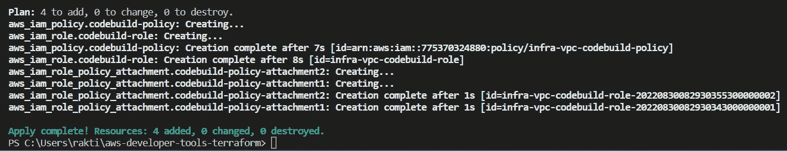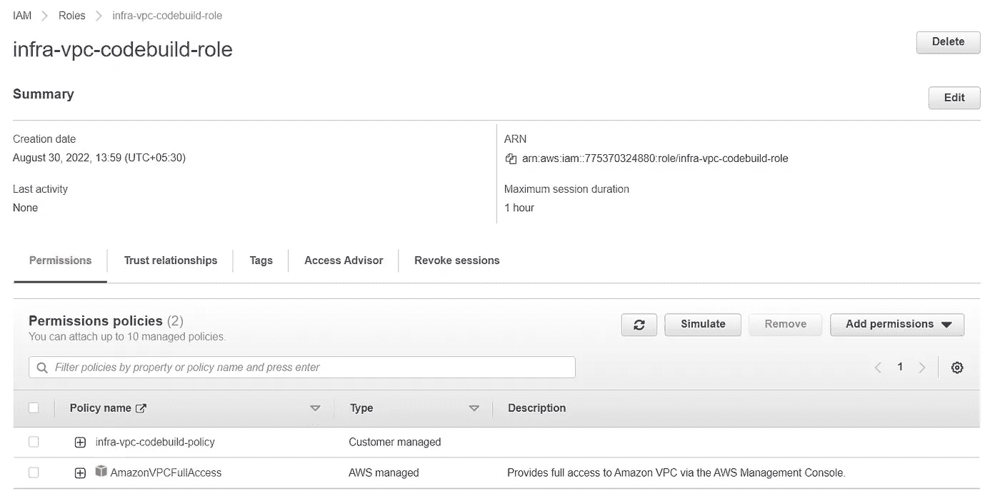

接下来，我们将为代码管道创建另一个用于设置 IAM 角色的代码…

*   该角色具有从 CodeCommit 获取 terraform 代码的特定权限。接下来，它可以运行我们自己创建的 CodeBuild 项目。此外，它可以将 S3 的神器存储在我们指定的桶中。我们正在给予 CloudWatch 许可，以便将来 CodePipeline 可以与 CloudWatch 事件集成。
*   我们之所以创建一个名为“account_id”的局部变量，是因为我们还没有创建 CodeBuild 项目，所以 terraform 无法访问它的 ARN。因此，我们使用变量文件&中的项目名称和帐户 id 手动创建了 ARN。

运行 terraform 命令并在 AWS 中检查 IAM

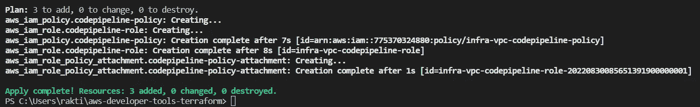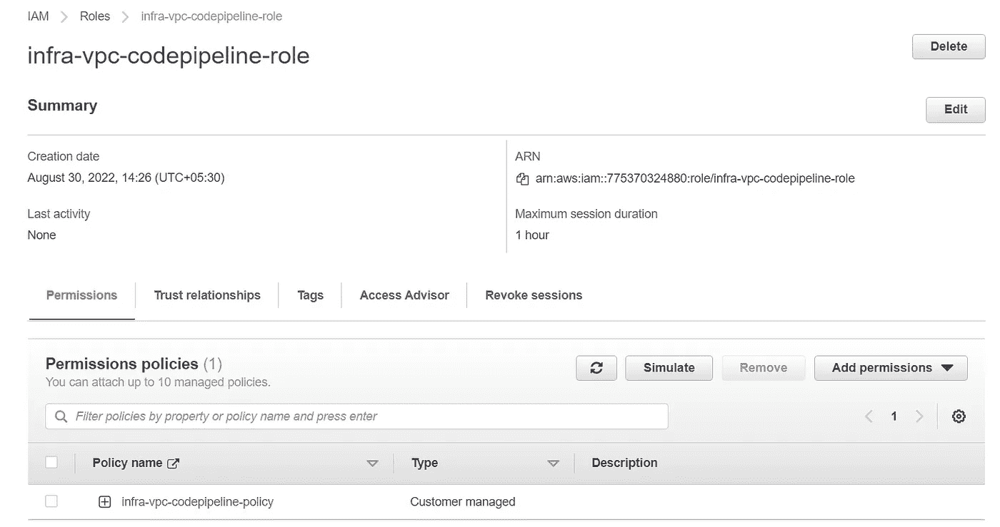

# 步骤 3:提供代码构建项目

最后，是时候创建 CodeBuild 项目了。首先看看下面的代码&之后我会解释它是如何工作的。

*   在这里，我们只是创建两个 CodeBuild 项目—一个是运行“terraform plan”命令，另一个是运行“terraform apply”命令，这样，如果 plan 命令失败，我们以后就不会运行 apply 命令。
*   同样，我们可以看到 CodeBuild source & artifact 是由 CodePipeline 管理的。现在，当我们调用 CodeBuild 时，我们将在容器内运行一些 terraform 命令&为此，我们使用“hashicorp/terraform:latest”容器映像。

现在我们要写那些我们想在容器中运行的 terraform 命令。因此，在你的工作区创建一个名为“buildspec”的文件夹，并放入下面提到的两个文件…

我们完了。让我们再次运行 terraform 命令&在 AWS 控制台上检查。

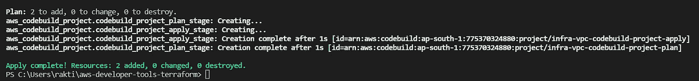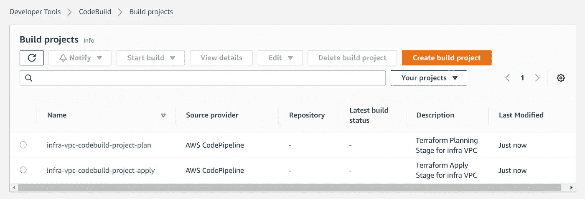

# 步骤 4:提供代码管道项目

我们非常接近完成我们的整个设置。这是我们为完成整个 CI/CD 设置而创建的最后一个文件。参见下面的代码。

*   代码稍微大一点，但是容易理解。我们在 CodePipeline 中创建了一个管道，它有三个阶段。现在，代码管道中的一个约束是，您必须提供一个 S3 存储桶名称，代码管道将在此存储其工件。原因很简单，因为每个代码管道阶段都运行在一个独立的容器中&如果你在第一阶段提取代码，然后在第二阶段使用代码，那么只有当代码管道将代码存储在某个集中的位置时，才能实现这一点。目前，CodePipeline 的工作地点是 S3。
*   这就是为什么我们可以注意到无论 CodePipeline 生成什么输出工件，都与我们在第二和第三阶段传递的输入工件完全相同。
*   接下来，在规划和部署阶段，我们运行我们之前创建的两个代码构建项目。

让我们最后一次运行 terraform 应用程序…

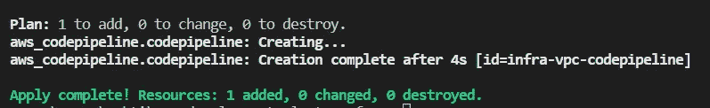

等等…你可能会看到你的代码管道失败了，仅仅是因为它从 CodeCommit 库获取了代码，但是我们仍然没有在那里创建任何代码。

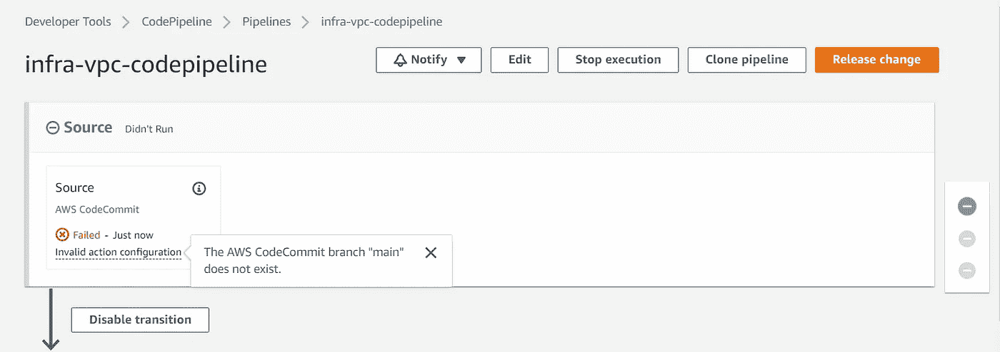

# 步骤 4:克隆代码提交存储库

**如果你知道 Git & GitHub，那么让我告诉你，当你在 GitHub 中创建一个没有初始化的库时，它就像一个空白文件夹，仍然没有被 Git 初始化。**现在有两种技术…

*   首先，您可以创建一个本地系统文件夹。使用 git 初始化该文件夹。输入你的密码。设置远程位置以上传远程存储库中的代码。然后最后做“git 推送”。
*   第二个简单得多。使用“README.md”文件初始化您的远程存储库。然后在本地系统中克隆存储库。输入你的代码，然后上传代码。

我选择第二种方法，所以让我们转到 CodeCommit &用 README.md 文件初始化存储库。

进入您的存储库→向下滚动并点击“创建文件”

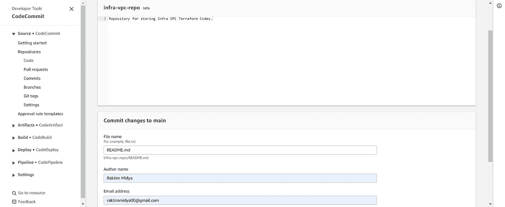

一旦创建了文件，等待一段时间&由于 Poll SCM 调用，您的管道将自动启动。这意味着 CodePipeline 每分钟都在查看 CodeCommit 是否有变化。但还是会失败。原因很简单，因为我们还没有在知识库中创建任何 terraform 代码。

> **注意:这里我没有创建 CloudWatch 事件来调用 CodePipeline。但是你很容易学会。**

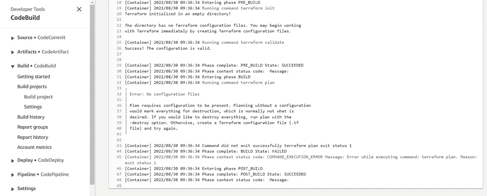

因此，让我们在本地系统中克隆 CodeCommit 存储库&开始编写 Terraform 代码，以 CI/CD 方式开发我们的 VPC。

现在有各种方法可以在你的本地系统中克隆 CodeCommit 库，但是请记住一件事，即 **AWS root 帐户不能克隆库。**最初，我告诉你我使用的是一个 AWS IAM 帐户，该帐户拥有“AdministratorAccess”。我使用那个帐户访问密钥&秘密密钥在我的本地系统上配置 AWS CLI。因此，我能够运行 Terraform 命令。

您可以使用同一个 AWS 帐户来克隆存储库&为此，在您本地系统上安装“python 3”&运行下面的命令来安装“git-remote-codecommit”库。

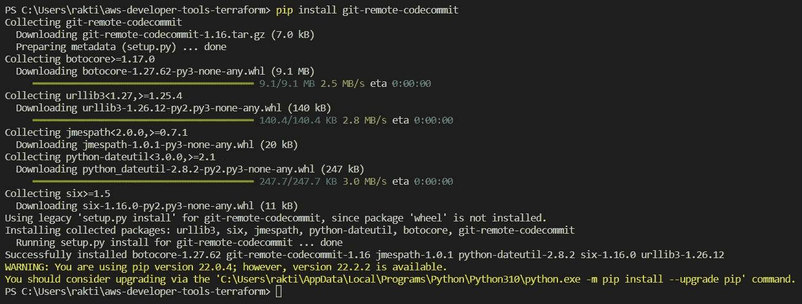

现在，如果您已经配置了 AWS CLI，请转到 AWS CodeCommit 存储库并复制“HTTPS(GRC)”URL。

> **参考文档:**[**https://docs . AWS . Amazon . com/code commit/latest/user guide/setting-up-git-remote-code commit . html**](https://docs.aws.amazon.com/codecommit/latest/userguide/setting-up-git-remote-codecommit.html)

最后运行 git clone 命令&希望您能够克隆存储库。

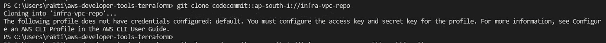

在我的例子中，我使用“raktim_cli”作为概要文件，但是它需要默认的概要文件。因此，我将再次设置我的 AWS 配置。一旦完成，我将拥有默认的概要文件，使用它我可以克隆存储库。

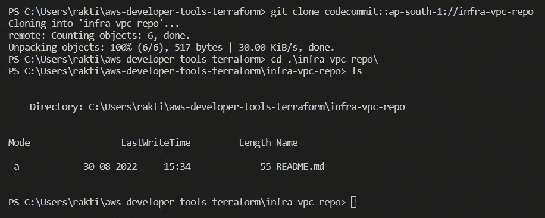

# 步骤 5:设置 Terraform 后端以使用 S3 桶

现在让我们开始为 VPC 开发编码。但在此之前，我会要求你去你的 S3 桶&检查“terraform_backend”文件夹内。它将是空的。

首先，我们将为 terraform 设置“后端”&也就是提供者。因为这些 terraform 文件将在 CodeCommit 中运行&它需要从一个集中的位置获取状态文件。

创建以下三个代码文件…

在这个提供者中，我们不需要传递任何配置文件，因为我们已经给了 CodeBuild 项目 VPC 完全访问和 S3 存储桶访问。因此，它可以轻松地在这两种资源上执行任务。

该文件将有助于维护“terraform_backend”文件夹内 S3 存储桶中的 terraform 状态文件。一件非常重要的事情永远记住，你不能参数化这个文件中的任何值，因为通常“地形后端”是固定的。

现在，如果您快速提交代码，并在 CodeCommit 中推送代码。会发生什么，让我们观察一下…

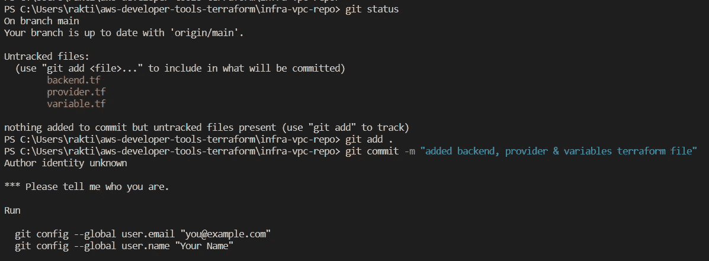

git 肯定需要知道作者的名字&作者的电子邮件 id 来进行提交，就像我们之前在 AWS CodeCommit 中创建 README.md 文件时传递的一样。但是我不会将这两个变量设置为本地变量，因为我还有其他连接到 GitHub、GitLab 等的库。

因此，运行带有“- local”选项的 config 命令，仅为该存储库设置用户名和电子邮件。

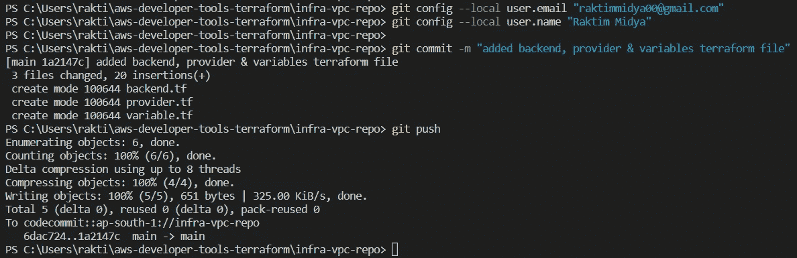

我们已经在 CodeCommit 中成功上传了代码。现在让我们检查一下 AWS 控制台。

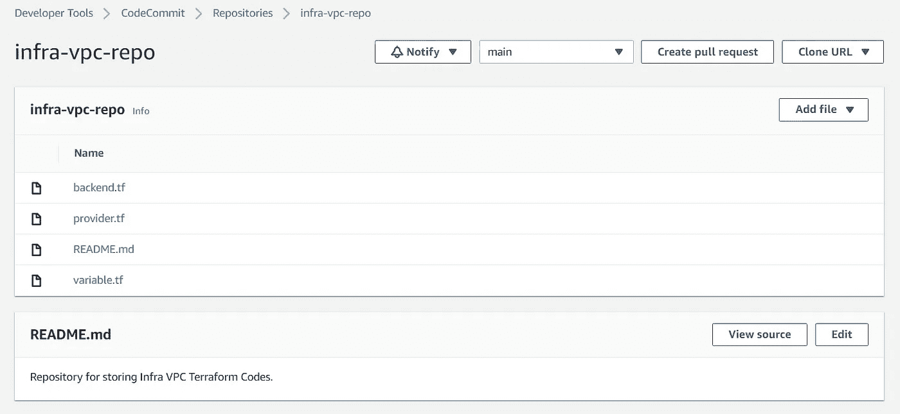

现在等待一段时间&检查 AWS 代码管道。

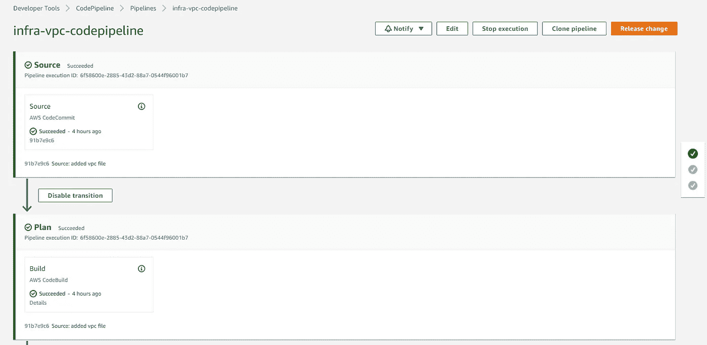

万岁，我们的代码管道工作顺利。现在去你的 S3 桶&你会看到你的地形状态文件存在。

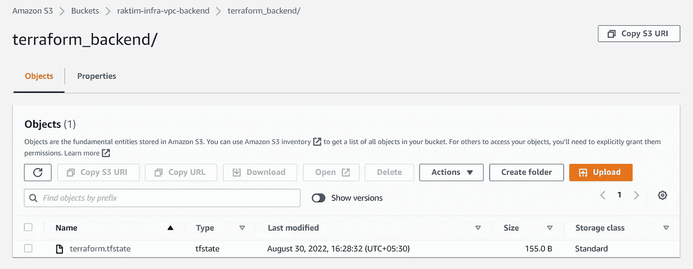

# 步骤 6:使用 CI/CD 实现 VPC

现在一切都非常自动化&顺利。转到您的本地 git 存储库&在“beckend.tf”文件旁边创建另一个文件，比如一个示例 terraform 代码创建一个包含一个子网的 VPC。

将代码提交到 CodeCommit &然后过一段时间检查代码管道和 VPC 仪表板。

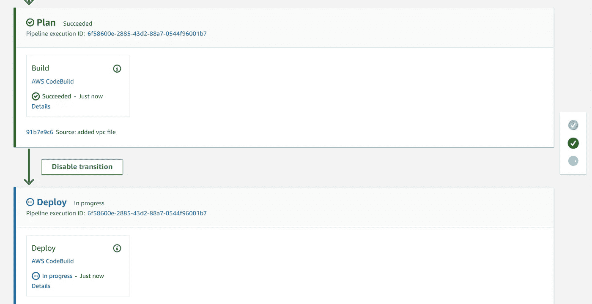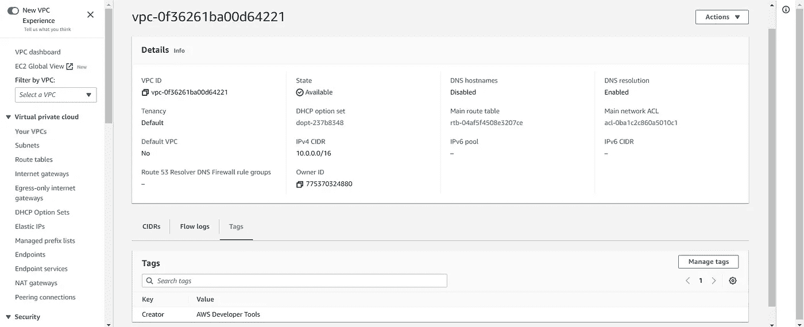

从 VPC 的标签中，我们可以很容易地验证它是由 CodeBuild 项目创建的。**同样，有一件小事要记住，CodeBuild 之所以能够提供 VPC，是因为 CodeBuild IAM 角色拥有“VPCFullAccess”权限。**

# 最后的话:

Source: Internet

*   我知道我知道；这是一次长时间的讨论。但是如果你去任何工业项目，那么这些学习只是整个游戏中很小的一部分。**当然，我相信有一个强大的基础&我希望这个博客能帮助你学习一个很好的用例。**
*   和往常一样，我会请你在评论中分享你的想法&给这个博客一些掌声。在过去的 1.5 年里，我一直在写这样的博客&在这个领域已经超过 2.5 年了。
*   请务必在 LinkedIn 上与我联系。我还提供云计算和开发运维方面的技术咨询。希望有一天我们能互相交谈。

【https://www.linkedin.com/in/raktimmidya/ 

**感谢阅读。就这样…结束…😊**

