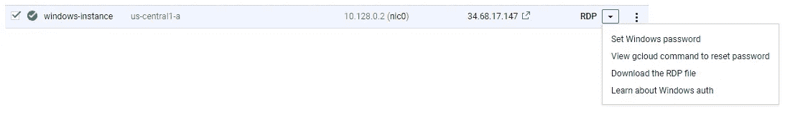
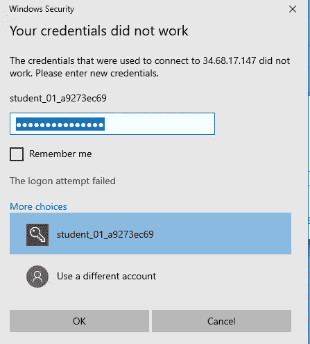
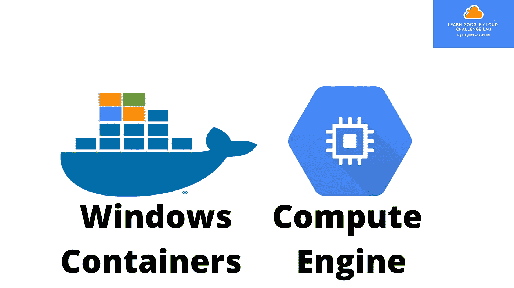
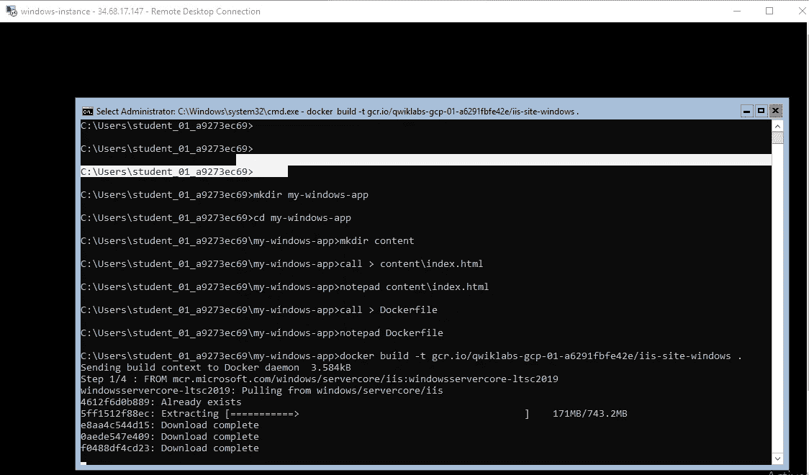
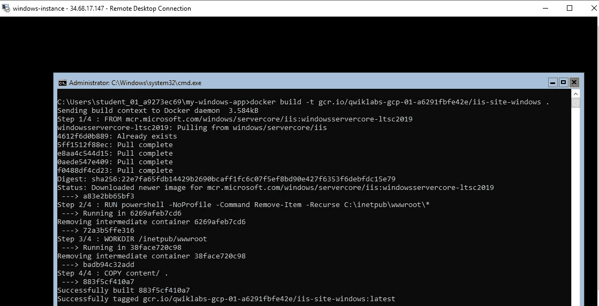
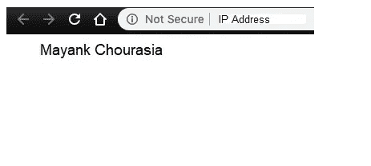

# 在计算引擎上运行 Windows 容器

> 原文：<https://medium.com/geekculture/running-windows-containers-on-compute-engine-e58300446b59?source=collection_archive---------8----------------------->

在本文中，我将带您了解如何在计算引擎上运行 Windows 容器。在进入实现部分之前，您应该熟悉容器、VM 和 Docker。

为此，我已经写了一篇博客，你可以在这里查看[容器相关的](https://mayankchourasia2.medium.com/what-is-kubernetes-and-how-is-it-related-to-containers-76d6d07d0fd5)和[计算引擎](/faun/engines-in-google-cloud-platform-1d57a39192fe)。

当人们讨论容器时，他们通常指的是基于 Linux 的容器。但是[微软](https://blog.docker.com/2016/09/build-your-first-docker-windows-server-container/)已经在 Windows Server 2016 和 Windows 10 中引入了对基于 Windows 的容器的支持。以现有的 Windows 应用程序为例，使用 Docker 将它们容器化，并作为一个隔离的容器在 Windows 上运行。有两种风格的 Windows 容器:Hyper-V 和 Windows Server。您可以在[Microsoft/Windows server core](https://hub.docker.com/r/microsoft/windowsservercore/)或 [microsoft/nanoserver](https://hub.docker.com/r/microsoft/nanoserver/) 基础映像上构建 Windows 容器。

# 为容器创建 Windows VM 实例。

*   在 GCP 控制台中，转到导航菜单>计算引擎。
*   配置以下设置:

名称:windows 实例

启动盘:Windows Server 1809 data center Core for Containers

身份和 API 访问>访问范围:允许对所有云 API 的完全访问

防火墙:检查 HTTP 和 HTTPS

*   点击 RDP 设置 windows 密码。
*   单击设置并复制新的 Windows 密码。



Set Windows Password



Windows Server


Virtual Machine



# RDP 到 Windows 虚拟机

RDP:远程桌面协议 RDP 软件提供对远程主机上托管的桌面或应用程序的访问。它允许您像在本地一样连接、访问和控制远程主机上的数据和资源。

*   在 Windows 命令提示符(`C:\Users\Mayank_file`)下运行以下 docker 命令，查看默认安装的镜像。

```
docker images
```

*   输出

```
mcr.microsoft.com/windows/servercore ltsc2019 32fecabef723 4 months ago 5.12GB
```

# 创建 Windows 容器应用程序

我们在 Windows 容器中使用 IIS Web 服务器。IIS 有一个 Windows Server 2019 的映像。我们按原样使用图像，它服务于默认的 IIS 页面。

*   创建一个名为`my-windows-app`的文件夹，并将其输入到目录中。

```
mkdir my-windows-appcd my-windows-app
```

*   创建文件夹名为`content`，里面有一个名为`index.html`的文件。

```
mkdir contentcall > content\index.html
```

*   mkdir 命令创建目录，而“call”命令创建文件。
*   编辑 docker 文件。

```
notepad content\index.html
```

*   将`index.html`替换为以下内容:

```
<html>
  <head>
    <title>Windows containers</title>
  </head>
  <body>
    <p>Mayank Chourasia</p>
  </body>
</html>
```

*   保存`index.html`

# 建立码头形象

*   为 Docker 映像创建一个 Docker 文件。

```
call > Dockerfile 
```

*   编辑 dockerfile 文件。

```
notepad Dockerfile
```

*   将以下内容复制到该文件中。

```
 FROM mcr.microsoft.com/windows/servercore/iis:windowsservercore-ltsc2019

RUN powershell -NoProfile -Command Remove-Item -Recurse C:\inetpub\wwwroot\*

WORKDIR /inetpub/wwwroot

COPY content/ .
```

*   保存 dockerfile 文件。
*   现在，我们必须构建 Docker 图像并用 Google 容器注册中心(GCR)标记它。用<project-id>替换您的项目 ID。</project-id>

```
docker build -t gcr.io/<Project-ID>/iis-site-windows .
```

*   构建 docker 映像后，获得具有 IIS 依赖项的输出。

```
docker images
```

# 运行 Windows 容器

*   构建 docker 映像后，我们就可以运行 Windows 容器了。在命令提示符下，运行容器并在端口 80 上公开它。

```
docker run -d -p 80:80 gcr.io/<Project-ID>/iis-site-windows
```



Windows Instance-1



Windows Instance-2

*   使用下面的命令，我们可以检查容器状态。

```
docker ps
```

*   复制计算引擎实例的外部 IP，并使用 http:// <external-ip>在新浏览器中打开它</external-ip>



Output

希望本文突出了计算引擎上运行的 Windows 容器。

感谢阅读。

敬请期待下一篇博客。

如果你想和我联系:

【领英:】[*https://www.linkedin.com/in/mayank-chourasia-38421a134/*](https://www.linkedin.com/in/mayank-chourasia-38421a134/)

**推特:*[*https://twitter.com/ChourasiaMayank*](https://twitter.com/ChourasiaMayank)*。**

**谢谢你保持安全，保持健康。**

**[谷歌开发者](https://medium.com/u/991272e72e68?source=post_page-----e58300446b59--------------------------------) [谷歌云](https://medium.com/u/4f3f4ee0f977?source=post_page-----e58300446b59--------------------------------) [谷歌新闻实验室](https://medium.com/u/f226348241d4?source=post_page-----e58300446b59--------------------------------)[qwikilabs](https://medium.com/u/fc35885def18?source=post_page-----e58300446b59--------------------------------)[微软+开源](https://medium.com/u/940e606ec51a?source=post_page-----e58300446b59--------------------------------)**