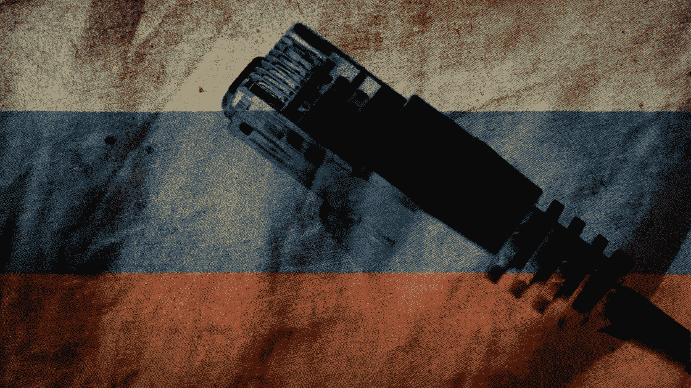

# 俄罗斯将于 3 月 11 日切断全球互联网

> 原文：<https://medium.com/geekculture/russia-is-disconnecting-from-the-global-internet-on-the-11th-of-march-d34aada05b1b?source=collection_archive---------10----------------------->

## 俄罗斯从西方世界分权的下一步

Russian flag over an internet cable (Source: [Freedom House](https://freedomhouse.org/article/russian-elections-will-put-kremlins-internet-controls-test))

自俄罗斯和乌克兰开战以来，西方政府和公司对俄罗斯的制裁对该国的经济产生了重大影响。卢布(俄罗斯货币)正以创纪录的速度暴跌，它可能…