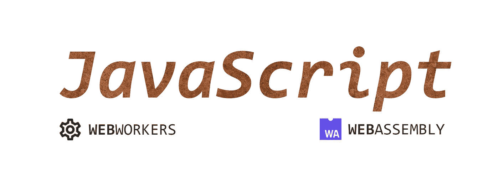
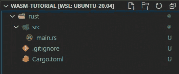
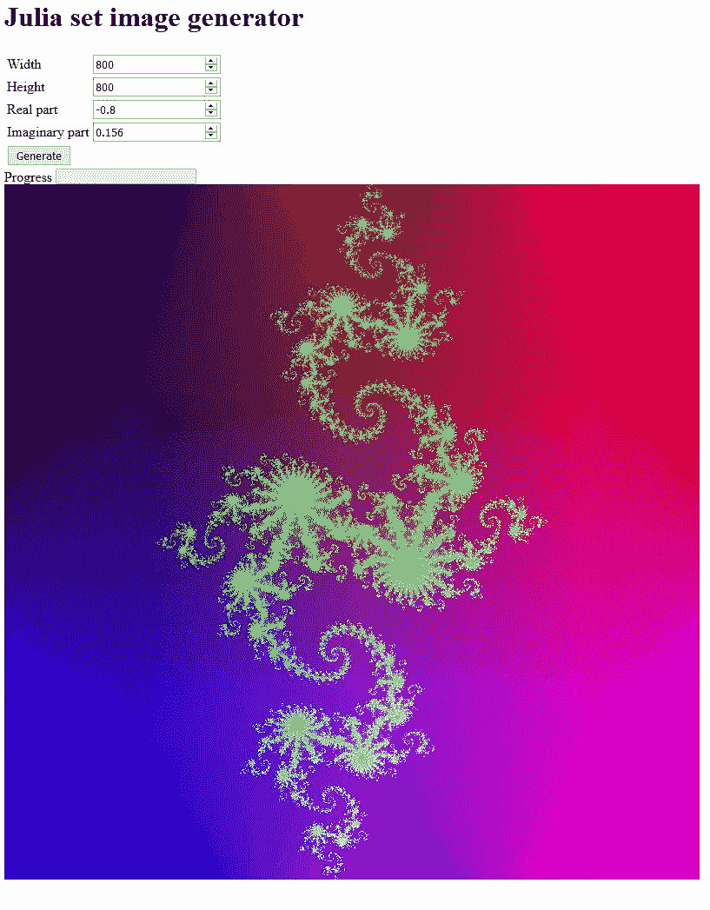

# 生锈的 JavaScript 与 WebAssembly

> 原文：<https://medium.com/geekculture/rusting-javascript-with-webassembly-632405ba5a42?source=collection_archive---------8----------------------->



你想让你的网络应用更快吗？我最近设法在我的一个网络项目中使用了 Rust。闪电般的语言，令人印象深刻的 WebAssembly 支持。前段时间，我们在服务器上执行了耗时的操作。现在可以在现场完成这些任务，并且不会影响用户体验。

在本文中，我们将探索:

*   如何准备一个在 web 上使用的 Rust 项目？
*   如何在 Webpack 5 中使用来自 JavaScript 的 Rust？
*   如何利用 WebWorker 改善用户体验？
*   如何从 Rust 向 JavaScript 发出信号？

首先，让我们决定应用程序的功能。我们将生成 [Julia 集](https://en.wikipedia.org/wiki/Julia_set)图像。这是一项耗时短且需要大量资源的任务。之后，我们将制作一个用户界面，并即时生成图像。说完了，让我们开始吧。


Generated image of Julia set

# 如何准备一个在 web 上使用的 Rust 项目？

我们首先为项目创建一个文件夹结构。主目录为`wasm-tutorial`，子目录`rust`用于包含与 Rust 相关的文件。

```
mkdir wasm-tutorial && cd wasm-tutorial
mkdir rust
```

> 如果你还没有安装 Rust，可以按照[官网](https://www.rust-lang.org/learn/get-started)的说明操作。

在 *rust* 文件夹中初始化 rust 项目`cargo init .`现在你应该有一个基本的货物项目了。



Rust project structure

下一步是编写 Julia 集生成器。出于测试目的，我们将把结果图像输出到一个 PNG 文件中。向`Cargo.toml` 添加依赖关系，并相应地更新`main.rs`:

```
[dependencies]
image = "0.23.14"
num-complex = "0.4.0"
```

运行 *rust* 文件夹中的`cargo run`执行程序。执行完成后，注意`result.png`类似于简介部分的分形图像。

现在是时候为 WebAssembly 修改 Rust 项目了。

## 1.改变我们输出结果的方式

我们将把 base64 编码的字符串传递回 web 应用程序。因此，将`base64 = “0.13.0”`依赖项添加到`Cargo.toml`中，并使用 base64 编码，而不是将图像写入文件。您可以使用下面代码片段中的`base64_png`函数。

```
fn base64_png(img: image::DynamicImage)
  -> image::ImageResult<String> {
    let mut buf = String::from("");

    {
        let mut writer = base64::write::EncoderStringWriter::from(
           &mut buf, base64::STANDARD
        );
        img.write_to(&mut writer, image::ImageOutputFormat::Png)?;
    }

    Ok(buf)
}
```

## 2.为网络组装准备货物

首先在`Cargo.toml`的依赖部分添加 3 个方便的板条箱(类似于 *npm* 中的包裹):

```
console_error_panic_hook = "0.1.6"
wee_alloc = { version = "0.4.5", optional = true }
wasm-bindgen = { version = "0.2.73" }
```

继续将此项目标记为库，并通过在您的 Cargo 文件中添加这两个部分来为发布版本启用优化:

```
[lib]
crate-type = ["cdylib"]

[profile.release]
lto = true
```

## 3.为 WebAssembly 准备 Rust 代码

由于 Rust project 现在是库而不是可执行文件，我们应该将`main.rs`重命名为`lib.rs`。然后 wasm 集成所需的一切`use wasm_bindgen::prelude::*`编写一个将从 JS 调用的函数，并用`#[wasm_bindgen]`标记它这里有一个重要的注意事项，不是产生原始字符串，我们将它包装到 JsValue 中，以便它可以被 JavaScript 理解:`JsValue::from_str(&base64);`

接下来，我们将错误传播到 javascript 控制台，并定义适合 WASM 的`wee_alloc`分配器。

```
#[cfg(feature = "wee_alloc")]
#[global_allocator]
static ALLOC: wee_alloc::WeeAlloc = wee_alloc::WeeAlloc::INIT;

#[wasm_bindgen(start)]
pub fn main_js() -> Result<(), JsValue> {
    console_error_panic_hook::set_once();

    Ok(())
}
```

所有东西放在一起:

我们终于准备好进入 JavaScript 部分了。

# 如何在 Webpack 5 中使用来自 JavaScript 的 Rust？

在根目录中初始化 Webpack 5 项目。为此，我使用发电机。

```
npm init -y
npm install --save-dev webpack webpack-cli
npm install --save-dev @webpack-cli/generators
npx webpack init ./ --force --template=default
```

安装`wasm-pack` Webpack 插件。

```
npm install --save-dev @wasm-tool/wasm-pack-plugin
```

我们已经准备好配置我们的设置。差不多了。我们还需要安装`wasm-pack`防锈。那是所有奇迹发生的地方。可以从[官网](https://rustwasm.github.io/wasm-pack/)下载安装。它是必需的，因为`wasm-pack`插件使用下面的这个程序来构建 rust 项目，并准备好从我们的 web 应用程序中使用它。

现在我们可以告诉 Webpack 自动构建我们的项目。这就像添加一个插件一样简单。

```
new WasmPackPlugin({
    crateDirectory: path.join(__dirname, './rust'),
    outDir: path.join(__dirname, './pkg'),
})
```

`crateDirectory`是 rust 项目的路径，而`outDir`是保存 WASM +一些有用的 JS 文件的编译版本的路径。在 Webpack 5 中，我们还必须启用实验功能`asyncWebAssembly`，因此添加以下部分:

```
experiments: {
    asyncWebAssembly: true,
}
```

让我们测试一下这个系统是否工作。将`index.js`更改如下:

在第一行中，我们导入生成的 Rust 端口。导入成功后，我们就可以调用我们的 rust 库函数`julia_base64`了，就像是用 JavaScript 写的一样。如果你像我一样使用过 webpack project generator，你可以运行`npm run serve`并检查浏览器控制台的输出。

为了让它看起来更像应用程序，我将添加简单的表单和`img`标签，这样我们就可以显示生成的分形。

`index.js`中的一些变化和应用程序准备就绪。



非常有效…不完全是。生成图像仍然需要时间。尤其是在调试版本中。当工作完成时，用户不会收到任何反馈。还有，Rust 使用了和 JavaScript 一样的线程，导致 UI 冻结。让我们在下一节中解决这个问题。

# 如何利用 WebWorker 改善用户体验？

如果不想锁定主线程，可以将繁重的工作转移到另一个线程。在 JavaScript 中，可以通过 WebWorker 来完成。那么，这是怎么做到的呢？

幸运的是，Webpack 5 支持 WebWorkers 开箱即用。但是，为了使主线程和 WebWorker 之间的通信更容易，我使用了`comlink`。通过`npm`安装`comlink`:

```
npm install --save comlink
```

将与 WASM 执行相关的代码移到`julia.worker.js`文件中。然后，创建一个类，它将与 Rust 库一起工作，并使用`comlink`来暴露它。

创建`julia.js`文件，这将是我们的应用程序和 WebWorker 之间的桥梁。

它利用 Webpack 5 WebWorker 特性，连接到“Julia Worker”并将其包装在`comlink`对象中。它使得与 WebWorker 的通信看起来像是在处理函数，而不是处理消息等。

唯一剩下的事情就是更新`index.js`来使用 WebWorker 设置。

太好了！至少 UI 现在不冻了。然而，处理更大的图像仍然需要时间。你可能已经注意到了，我之前添加了进度条。让我们利用它。

# 如何从 Rust 向 JavaScript 发出信号？

我们将向用户显示整个图像中有多少像素已被处理。一旦程序处理完全部图像像素，我们将从 Rust 发出事件。然后，我们将用相应的状态更新进度条。

为了使之成为可能，我们需要一种方法，如何将消息从 Rust 程序内部，也就是 WebWorker 内部，传递给主线程。让我们用函数在`lib.rs`附近创建`progress.js`，它将发布来自 WebWorker 的带有百分比的消息。

然后在`lib.rs`中添加绑定到 JavaScript 函数，当需要进度更新时，用当前百分比从图像生成循环中调用它。

捕捉`update-percentage`消息并在`julia.js`桥中发出带有新百分比的 JavaScript `update-progress`事件。

```
instance.addEventListener("message", (m) => {
  if (m.data?.type === "update-percentage") {
    document.dispatchEvent(
      new CustomEvent(
         "update-progress",
         { detail: { message: () => m.data.message } }
      )
     );
  }
});
```

`julia.js`的最终版本如下:

最后，用进度条更新逻辑更新`index.js`，我们就完成了。

```
const progress = document.getElementById("progress");
document.addEventListener("update-progress", (event) => {
  progress.value = event.detail.message();
});
```

为 web 应用程序提供服务，为一些较大的图像输入参数，并在处理完成时注意进度条的变化。整个解决方案的源代码可以在 [GitHub 资源库](https://github.com/atravkovs/wasm-tutorial)中找到。

现在，您可以运行`npm run build`并从`dist`文件夹中享受应用程序的优化性能，构建文件就放在这个文件夹中。

# 摘要

我们已经探索过，如何设置 JavaScript + Rust WebAssembly 项目，以及如何通过引入 WebWorkers 来获得出色的用户体验。希望现在你已经准备好利用这些新兴技术。