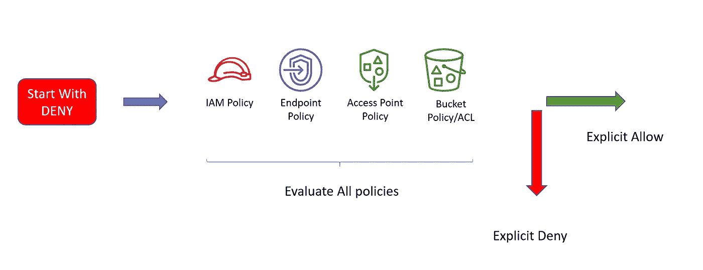
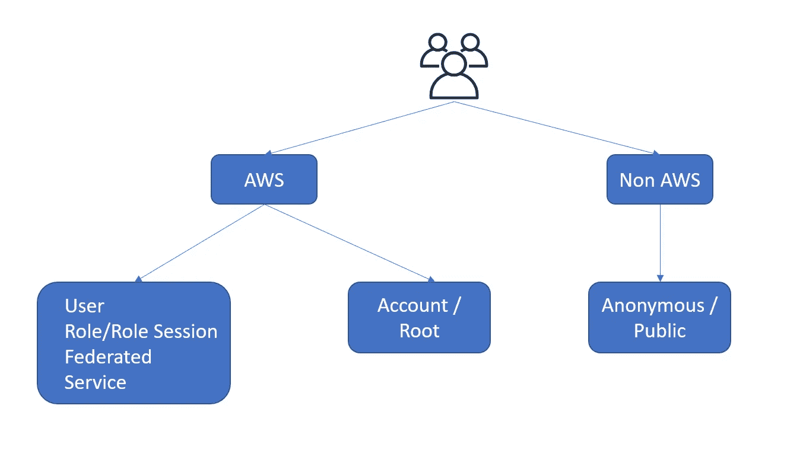
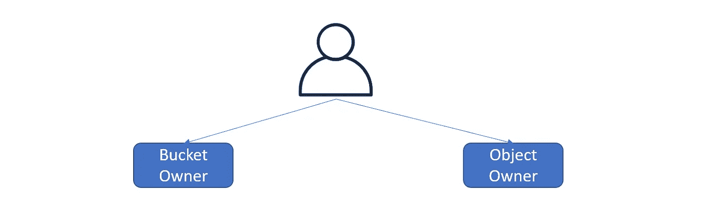
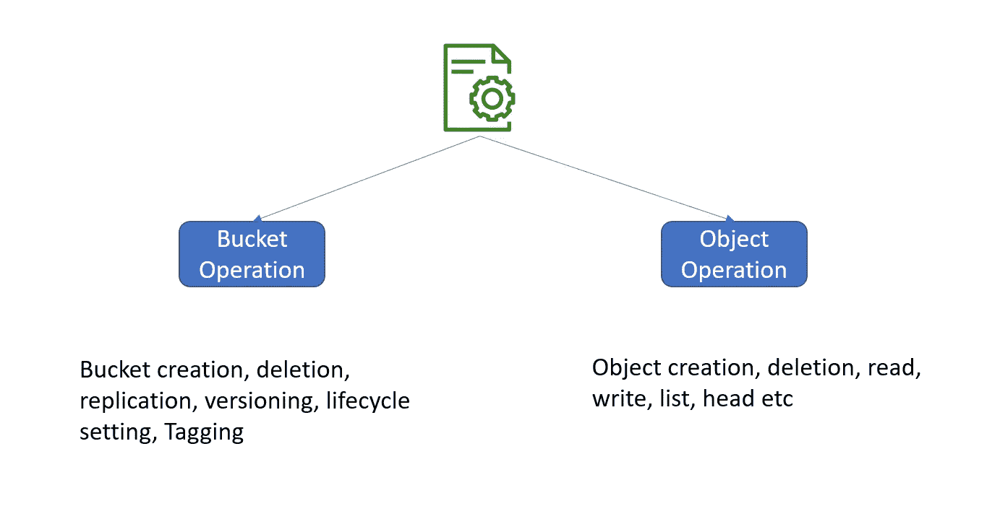
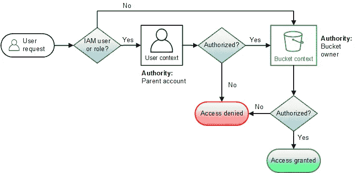
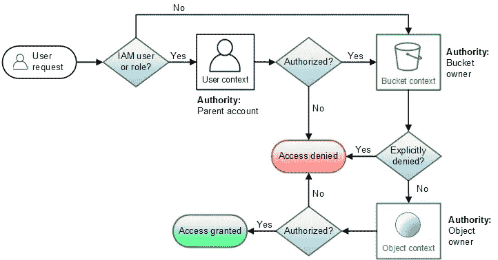

# S3 授权-复习

> 原文：<https://medium.com/geekculture/s3-authorization-refresher-ff3ba6cdc931?source=collection_archive---------8----------------------->


AWS S3 授权涉及多个实体，遵循明确定义的路径。它评估 IAM 策略、存储桶策略、存储桶 ACL、对象 ACL、端点策略和接入点策略。只有在没有显式拒绝并且有显式允许的情况下，它才会成功。



在这篇博客中，我们将经历授权过程。但是，在我们了解如何处理授权请求之前，我们需要明确几个术语:

## 请求者



在访问 S3 实体(桶/对象)时，我们大致有两种类型的请求者。

AWS 已知的或 AWS 拥有的。像创建或链接到 AWS 的角色、用户和身份提供者。此外，帐户的根用户是一个特殊的实体，以不同的方式处理。在 bucket ACL 中，当您看到 authenticated 时，表示 AWS 知道的实体，不一定是您的帐户。

其余的不为 AWS 系统所知。AWS 称之为公开或匿名。

## 物主



默认情况下，当其他 AWS 帐户将对象上传到另一个帐户的存储桶时，这些对象仍归上传帐户所有。对象所有者使用 ACL 委托访问。强制将对象所有权转移到目标帐户的方法是使用一个存储桶策略，该策略只允许在所有权转移时创建对象。下面是那个条件。

```
Condition:
  StringEquals:
    **s3:x-amz-acl: bucket-owner-full-control**
```

然后，用户必须向 ACL 提供所有权转移。请参见下面的代码片段。

```
s3.put_object(
    Bucket=bucketname,
    Key=filename,
    Body=content_bytes,
    ContentMD5=content_md5,
    **ACL="bucket-owner-full-control"**
)
```

需要注意的一点是，如果您想要启用 bucket 复制，您必须强制用户提供`bucket-owner-fill-control`。

## 操作



## 语境

根据实体的所有者(请求者或操作类型)，S3 为策略或访问评估使用不同的上下文。实体所有者帐户具有上下文权限。

**用户背景**

申请人和存储桶位于不同帐户的情况

> 申请人所属的帐户。
> 评估该帐户拥有的策略。
> 母账户的 SCP 将发挥作用

请求者和存储桶在同一个帐户中的情况

> 存储桶策略、ACL 和对象 ACL 一起评估。

***注意:****root 发出的请求，没有用户上下文。*

**桶上下文**

> 该时段所属的帐户。
> 存储桶策略&评估 ACL 以查看是否有明确的拒绝。
> 如果适用，还会评估接入点策略&端点策略

> S3 接入点是具有专用访问策略的唯一主机名，这些策略描述了如何使用该端点访问数据

**对象上下文**

> 检查对象 ACL 以查看对象所有者是否允许访问
> 也寻找显式拒绝。

铲斗操作评估流程:



目标操作评估流程:



## 亚马逊 S3 预定义组

> all users-Public Any one
> authenticated users-Any AWS Account
> log delivery-用于放置来自负载平衡器的访问日志

## ACL 和 IAM 策略的映射

> READ — s3:ListBucket，s3:ListBucketVersions，S3:ListBucketMultipartUploads S3:GetObject，s3:GetObjectVersion，s3:GetObjectTorrent
> 
> WRITE — s3:PutObject 和 s3:DeleteObject，s3:DeleteObjectVersion
> 
> READ _ ACP—S3:GetBucketAcl S3:getobject ACL 和 S3:GetObjectVersionAcl
> WRITE _ ACP—S3:PutBucketAcl S3:putobject ACL 和 S3:PutObjectVersionAcl
> FULL _ CONTROL—READ+WRITE+READ _ ACP+WRITE _ ACP

## 封装的 ACL 和与 ACL 的映射(组)

> private — FULL_CONTROL(所有者)
> public—read—FULL _ CONTROL(所有者)，READ(所有用户)
> public—READ—WRITE—FULL _ CONTROL(所有者)& WRITE(所有用户)
> authenticated—READ—FULL _ CONTROL(所有者)，READ(authenticated users)
> bucket—owner—READ—FULL _ CONTROL(对象所有者)READ(所有者)
> bucket—owner—FULL _ CONTROL—FULL _ CONTROL(所有者)&FULL _ CONTROL(所有者【对象所有者】
> log—delivery—WRITE&

## 存储桶策略(推荐方式)

> 语法与 IAM 类似
> 能够添加 deny，ACL 只能“允许”
> 有选择地使用前缀

## 阻止公共访问

这个特性允许我们阻止任何意外的公共对象/桶。建议在启用 BPA 的不同帐户中为公共存储桶和私有存储桶设置单独的中央帐户。

> BlockPublicAcls —使用公共 ACL 拒绝上传
> ignorrepublicals—忽略公共 ACL
> BlockPublicPolicy—拒绝上传使存储桶公开的策略
> RestrictPublicBuckets —拒绝通过已验证组授予的访问权限

## 使用 Athena 打开访问日志和查询

```
SELECT count(*), bucket
FROM s3_access_logs_db.mybucket_logs
WHERE http_status BETWEEN 200 and 209
AND requester = '-' AND authtype = '-' AND
request_uri not like '%X-Amz-Security-Token%'
GROUP BY bucket
```

安全快乐！！！