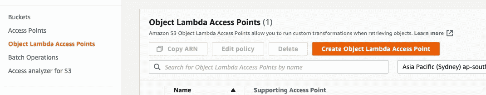
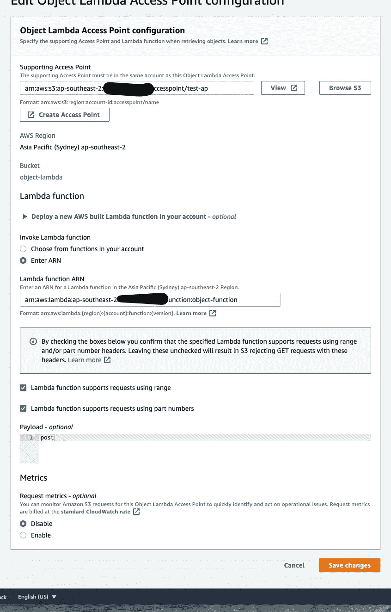
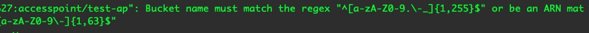

# 在 Typescript 中使用 S3 对象 Lambda

> 原文：<https://medium.com/geekculture/s3-object-lambda-in-typescript-e27c1bd6cc95?source=collection_archive---------5----------------------->

最近 AWS 宣布了 S3 对象 Lambda，它支持从 S3 检索数据时的数据处理。通过使用 S3 对象 Lambda，您可以轻松地呈现来自同一个数据集的多个视图，并且可以随时更新 Lambda 函数来修改这些视图。

例如，我们有一个存储在 S3 的用户数据集，该数据集包含用户的电子邮件、姓名和地址。当电子邮件营销应用程序通过 S3 接入点请求数据时，我们不想公开地址数据，而当上市后应用程序请求数据时，我们不想公开电子邮件数据。让我们用 Typescript 编写一些代码来实现它。

## 希腊字母的第 11 个

lambda 函数很简单，它从 S3 检索对象，修改它，然后覆盖响应。

有几个关键点。

1.  `event.configuration.payload`这是我们在对象 Lambda 接入点配置中创建的值，您可以使用它来添加额外的业务逻辑条件，因为您可以将多个接入点链接到同一个 Lambda 函数。
2.  `writeGetObjectResponse`它基本上覆盖了对 GetObject 请求的响应，只是要注意响应体的类型，在设置响应体的时候可能需要一些数据转换。在我的例子中，我需要转换成字符串，因为`modifiedData`是一个 JavaScript 对象。
3.  **我是角色权限。**你至少需要两份保单。第一个是托管的**awslambdabasiceexecutionrole。**第二个是给函数调用`writeGetObjectResponse`的权限

## 对象λ访问点

创建一个对象 lambda 访问点非常简单，它只是将我们上面创建的 Lambda 函数连接到 S3 访问点。



**注。**一旦对象进入λ访问点，就应该使用对象λ访问点 ARN 来访问数据以便触发对象λ，而不是原来的访问点 ARN。似乎

```
arn:aws:s3-object-lambda:ap-southeast-2:123456789:accesspoint/s2k
```

## **测试**

有许多方法可以测试它的工作，最简单的是使用 AWS CLI。

```
aws s3api get-object --bucket arn:aws:s3-object-lambda:ap-southeast-2:123456789:accesspoint/s2k --key data.json outfile
```

J **必须注意你的 AWS CLI 是最新的**，否则，你会看到这个错误，这是因为旧版本不支持对象 Lambda 访问点 ARN。



或者，如果你喜欢你的脚本做同样的工作。

亚马逊 S3 对象 Lambda 仍然非常年轻，有许多用例将受益于这种新的无服务器武器。与此同时，这样的例子并不多。如果您有任何问题，请随时联系我们！

和往常一样，演示代码在 https://github.com/crespowang/s3-object-lambda/tree/master 的[处。快乐云！](https://github.com/crespowang/s3-object-lambda/tree/master)