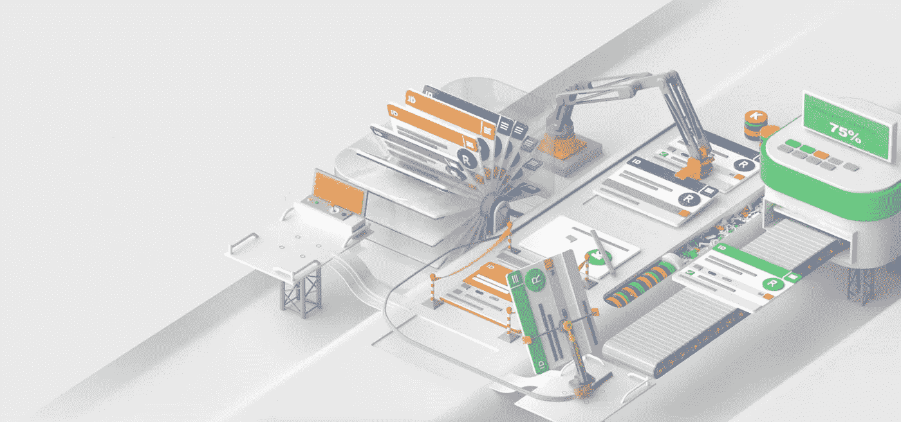

# SaaS 内容创作

> 原文：<https://medium.com/geekculture/saas-content-creation-2ccd23cd9678?source=collection_archive---------24----------------------->

## 提高您的销售线索生成率

3D animation created for the home page of **Kanbanize,** a SaaS company.(photo credit: eDesign Interactive)

软件即服务(SaaS)是一种被许多开发者采用的不断扩展的商业模式。这也是一个竞争非常激烈的市场，有许多软件公司可供选择。推广 SaaS 公司的基本方面包括将你的产品展示给尽可能多的用户，产生并转化有机流量，以及建立强大的客户群…