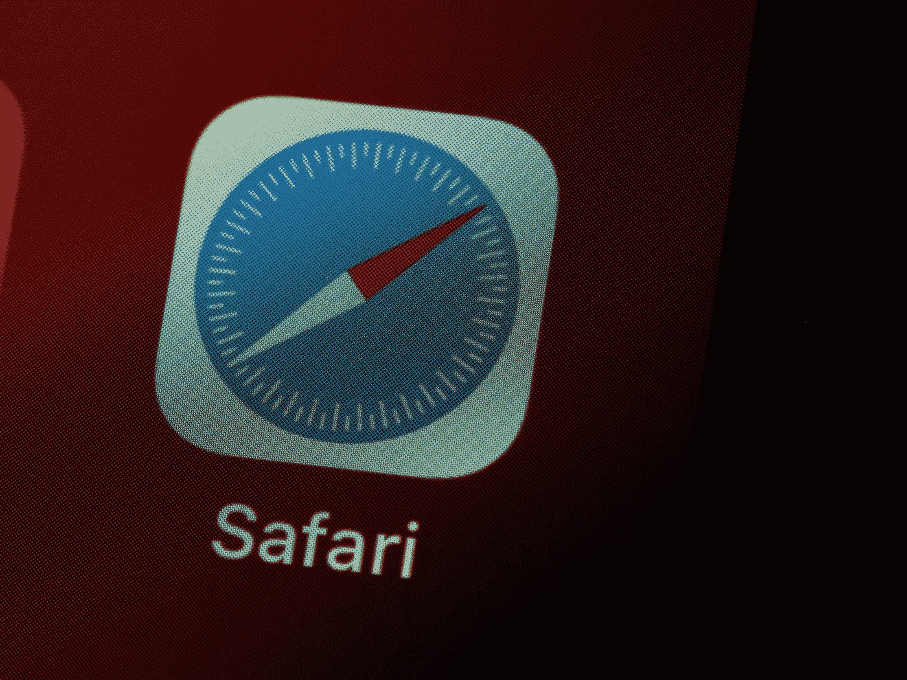
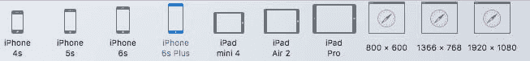

# Safari 是新的互联网浏览器

> 原文：<https://medium.com/geekculture/safari-is-the-new-internet-explorer-475ae84d4c1?source=collection_archive---------16----------------------->

## 关于可怜的 DX/UX 的短咆哮

Photo by [Brett Jordan](https://unsplash.com/@brett_jordan?utm_source=medium&utm_medium=referral) on [Unsplash](https://unsplash.com?utm_source=medium&utm_medium=referral)

我最近在一个网站工作，我收到了设计师的反馈。检查每样东西看起来都很棒，每样东西都像像素一样完美，这很重要，对吗？他们确实进行了跨浏览器测试，我可以很容易地修复大部分问题，但之后出现了一系列 Safari 特有的错误。我想，又来了。上一次出现问题也与 Safari 有关，我对一位同事说 Safari 是新的 IE 浏览器。

怎么会这样我们是如何到达那里的？好吧，2020 年 1 月 15 日，微软从 EdgeHTML 引擎转移到 Chromium 引擎。Internet Explorer 现在基本上像 Chrome 一样工作，从用户和开发者的角度来看，情况都变得更好了。老实说，谁还会关心 IE 11 呢？我估计只有很小一部分人。随着 Internet Explorer 问题的逐渐消失，Safari 中的其他问题开始变得更加明显，这就是 Safari 成为新 IE 的原因。不只我一个人这么说。我也从其他同事那里听说过，甚至在网上这条推文下面的评论中读到过。

> 不要说游猎永远是最后。有时候我们是第一个。
> 
> 演示者:有()
> 
> "例如，a:has(>img)选择所有包含子元素的元素."
> —来自[https://t.co/McFSzhqvwc](https://t.co/McFSzhqvwc)
> 
> ——珍·西蒙斯(@ Jen Simmons)[2021 年 12 月 20 日](https://twitter.com/jensimmons/status/1473051429115940868?ref_src=twsrc%5Etfw)

这篇推文是关于令人兴奋的新 CSS 属性的。这是一个很棒的消息，我很想使用它，但是在 Safari 和其他浏览器之间存在如此多差异的情况下，开创新功能真的有必要吗？苹果难道不应该首先专注于修复和弥合这些差距吗？我工作的网站在 14.7 和 15+版本上进行了测试，在大苏尔和蒙特雷都是如此。两个版本都有一些问题，我认为 14.7 或 14.8 肯定不算太老。简单来说，Safari 落后于所有其他主流浏览器。

例如，我们经历了一个关于`background-size`属性和响应的奇怪行为。此外，我们有新的 CSS 属性`aspect-ratio`的问题。我是一个 Windows 用户，所以它甚至很难测试。事实证明，即使对于 Macbook 用户来说，在 Safari 中调试也不是很简单。让我们来看看响应式模式:

如何将 iPad 的方向从纵向改为横向？我不得不在 iPad 图标上点击 4 次，因为出于某种原因还有一个分割视图。苹果产品的简单性到此为止。当涉及到响应行为时，我还必须更改断点，因为布局没有按预期运行。

听着，我没有 Mac，也不知道 Safari 有多少问题。可能最新版本挺好的。我只列出了我最近偶然发现的几个，但是看起来我不是唯一一个面临这些问题的 web 开发人员。我很欣赏将一些很酷的功能放在桌面上作为第一款浏览器的渴望，但在竞争对手赶上来之前，这只会造成另一个差距。我希望苹果能分清轻重缓急。