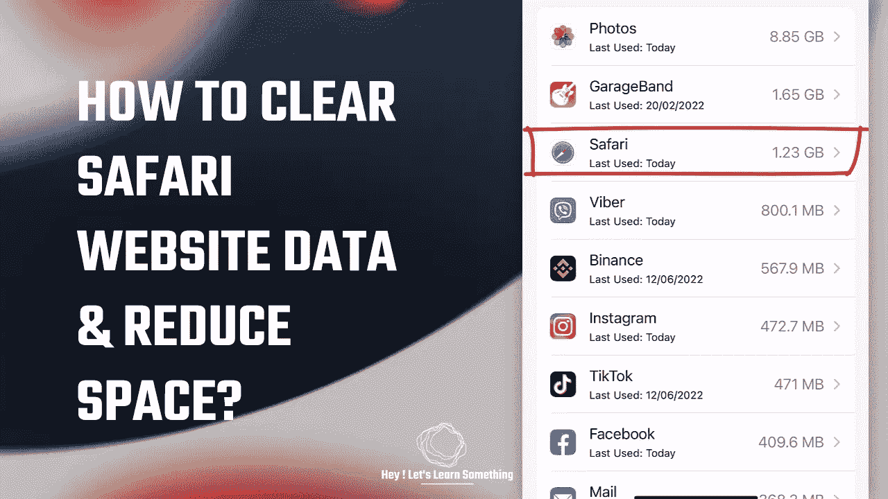

# Safari 占用 1.23GB，将其减少到 22MB

> 原文：<https://medium.com/geekculture/safari-was-taking-1-23gb-reduced-it-to-22mb-33bf6faedbba?source=collection_archive---------2----------------------->

我们只是碰巧检查了 iPhone Safari 占用的存储空间，令我们惊讶的是，它占用了超过 1gb 的空间。尝试清理历史和一切，但数据大小没有减少。然而，最终，我们能够将存储大小减少到 22MB 以下。因此，本文将告诉你如何在 iPhone 上缩小 Safari 浏览器的尺寸。