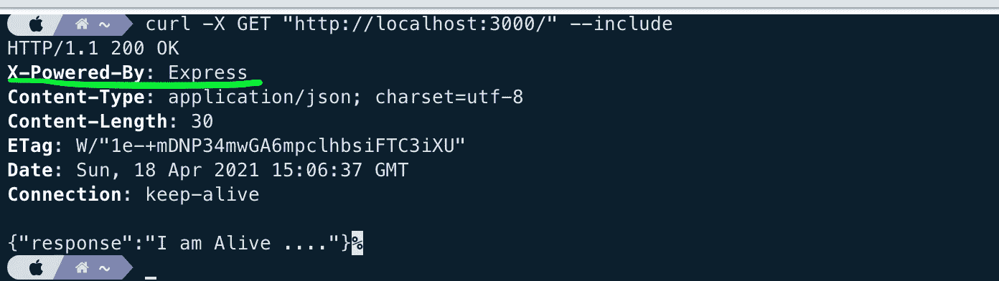
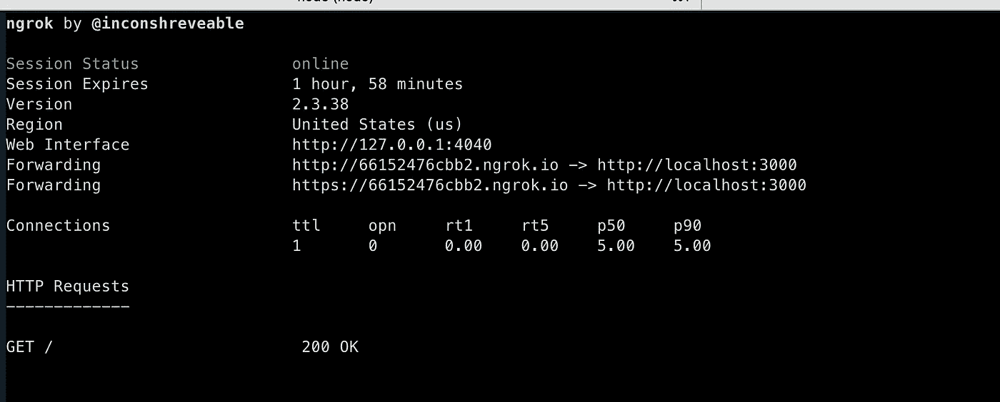
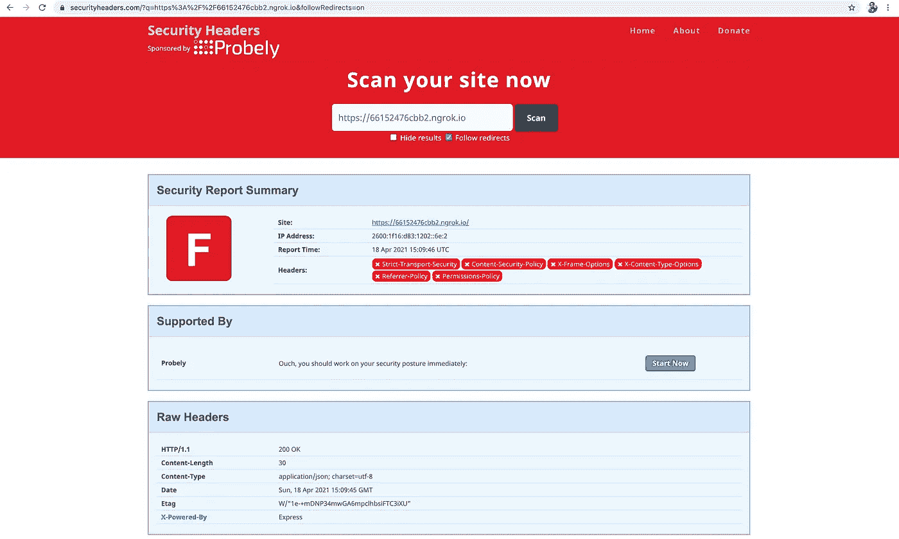
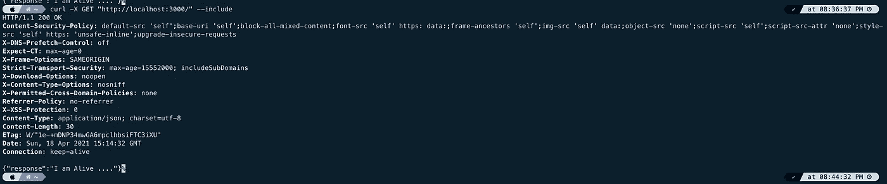
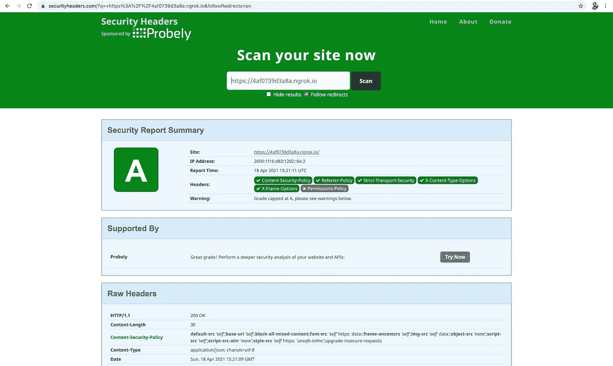

# 保护节点 JS 应用程序

> 原文：<https://medium.com/geekculture/safeguarding-node-js-applications-3af4a7850e0d?source=collection_archive---------10----------------------->

这个故事讲述了如何保护 node js 应用程序免受 Node Js 应用程序最常见的安全威胁。这些是由 OWASP [*文章*](https://speakerdeck.com/ckarande/top-overlooked-security-threats-to-node-dot-js-web-applications) 确定的最常见的安全漏洞。

许多这些问题可以通过使用头盔中间件 [*库*](https://www.npmjs.com/package/helmet) 来解决。

[头盔](https://www.npmjs.com/package/helmet)通过适当设置 HTTP 头，可以帮助保护你的应用免受一些众所周知的 web 漏洞的攻击。

头盔实际上只是一个较小的中间件函数的集合，这些函数设置与安全相关的 HTTP 响应头:

*   [csp](https://github.com/helmetjs/csp) 设置`Content-Security-Policy`头，帮助防止跨站脚本攻击和其他跨站注入。
*   [hidePoweredBy](https://github.com/helmetjs/hide-powered-by) 移除`X-Powered-By`割台。
*   [hsts](https://github.com/helmetjs/hsts) 设置`Strict-Transport-Security`头，强制执行到服务器的安全(HTTP over SSL/TLS)连接。
*   [ieNoOpen](https://github.com/helmetjs/ienoopen) 为 IE8+设置`X-Download-Options`。
*   [noCache](https://github.com/helmetjs/nocache) 设置`Cache-Control`和 Pragma 头来禁用客户端缓存。
*   [noSniff](https://github.com/helmetjs/dont-sniff-mimetype) 设置`X-Content-Type-Options`来阻止浏览器从声明的内容类型中嗅探响应。
*   [护框](https://github.com/helmetjs/frameguard)设置`X-Frame-Options`割台为[点动](https://www.owasp.org/index.php/Clickjacking)提供保护。
*   [xssFilter](https://github.com/helmetjs/x-xss-protection) 设置`X-XSS-Protection`以禁用 web 浏览器中有问题的跨站点脚本(XSS)过滤器。

让我们创建一个示例应用程序

```
**$ mkdir helmet-test
$ cd helmet-test
$ npm init -y
$ npm install express --save**
```

创建文件 index.js

```
**const express = require('express')**

const app = express()

app.get('/', (request, response) => {
  return response.json({
    response: 'I am Alive ....'
  })
})

app.listen(3000)
```

让我们用(— include)为 GET API 执行 CURL 命令



引起我注意的一件事是 x-powered-by 响应头。我不认为知道它是一个快速应用程序会给客户端增加任何价值。相反，如果攻击者发现我们使用的是旧版本的 Express，他们会试图利用任何已知的漏洞。这个头会被头盔摘下来。

使服务器更安全的一些头文件是:

*   内容-安全-策略。
*   严格的运输安全。
*   期待-CT。
*   推荐人-策略。
*   x 内容类型选项。

有一个流行的 [*网站*](https://securityheaders.com/) 会检查网址并给出安全评级。我正在使用 ngrok 将本地 http 端点隧道传输到 https，并在安全评级网站中进行检查。



***捕获 https 端点并验证为 API。下面是报告，评级不是那么令人鼓舞。***



让我们在应用程序中包含头盔，并开始使用它。

```
**$ npm install helmet --save**
```

将 index.js 更改如下。

```
const express = require('express')
**const helmet = require('helmet')**const app = express()
**app.use(helmet())**app.get('/', (request, response) => {
  return response.json({
    response: 'I am Alive ....'
  })
})app.listen(3000)
```

让我们再次运行使用 CURL 调用 GET API 的练习。



现在，头盔已经从响应头中删除了 x-powered-by。除此之外，它还增加了一些默认值。

**拆下 X-Powered-By 割台**

攻击者可以使用 X-Powered-By 标头(在 Node / Express 应用程序中默认设置为“Express ”)来识别站点的基础结构，因此应该隐藏它。

## 内容安全策略:

*Content-Security-Policy*是现代浏览器用来增强文档(或网页)安全性的 HTTP 响应头的名称。Content-Security-Policy 头允许您限制资源(如 JavaScript、CSS 或几乎任何浏览器加载的内容)的方式。

CSP 最初是为了减少跨站点脚本(XSS)攻击的攻击面而设计的，该规范的后续版本还可以防范其他形式的攻击，如点击劫持。

## 期望证书透明

**HTTP Expect-CT** 报头是一个响应类型的报头，它可以防止站点使用错误颁发的证书，并确保它们不会被忽略，它还允许站点决定报告或执行证书透明性要求。

浏览器忽略 HTTP 上的 Expect-CT 头。标头仅对 HTTPS 连接有影响。因此，这是由浏览器进行的显式检查，根据公共日志，该网站的给定证书是有效的。头盔增加了 expect-ct: max-age=0，意味着浏览器应该期望证书有效。

# 推荐人-策略

简单地说，Referrer-Policy 定义了应该从请求的 Referrer 中提取什么数据。默认情况下，Helmet 会将此设置为无数据，这意味着 URL 的任何部分——无论是源还是查询字符串——都不能在您的网站上使用。Web.dev 有一篇关于[推荐人最佳实践](https://web.dev/referrer-best-practices)的精彩文章，带有易于理解的图形解释。头盔增加了 referrer-policy: no-referrer，这是相当限制性的。

## 严格的运输安全

**HTTP** 严格传输安全响应头(通常缩写为 [HSTS](https://developer.mozilla.org/en-US/docs/Glossary/HSTS) )让网站告诉浏览器只能使用 HTTPS 访问，而不能使用 HTTP。

它有 max-age 和 includeSubdomain 指令。Max-age 告诉浏览器应该记住的时间(以秒为单位),即只能使用 HTTPS 访问网站。includeSubdomain 指令是可选的，表示此规则也适用于站点的子域。头盔增加了以下内容:

`*1*strict-transport-security: max-age=15552000; includeSubDomains`

所以它说，该网站需要通过 HTTPS 访问 180 天，其子域名。

除此之外，默认情况下，头盔还会创建其他标题。

让我们再次与网站进行安全检查。

