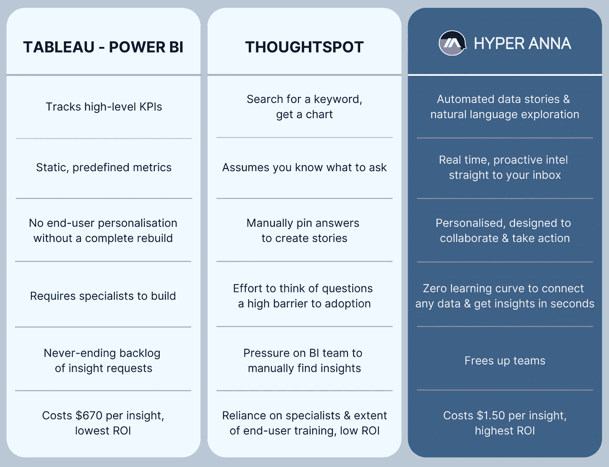
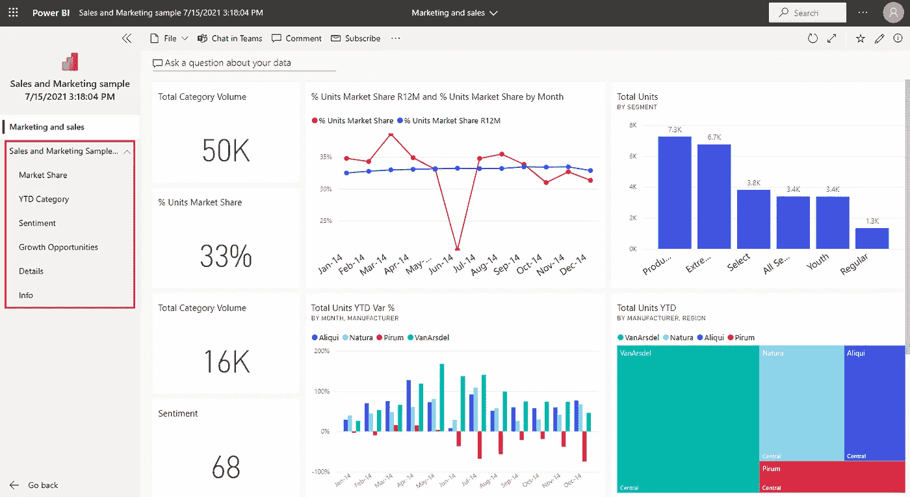
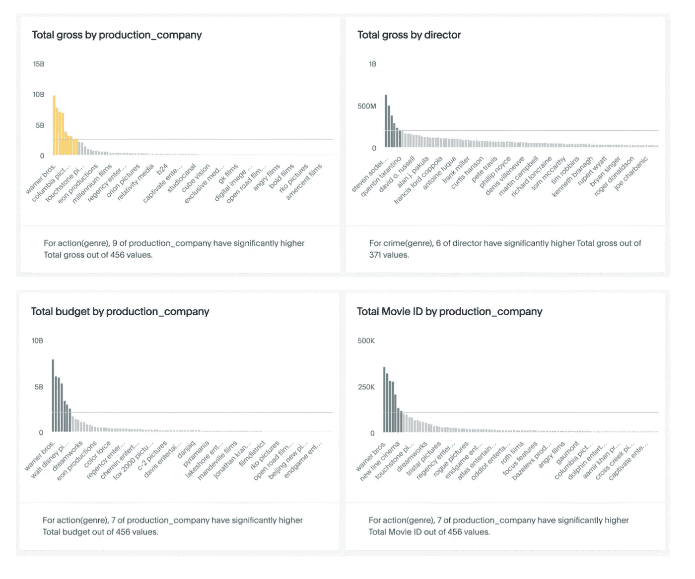
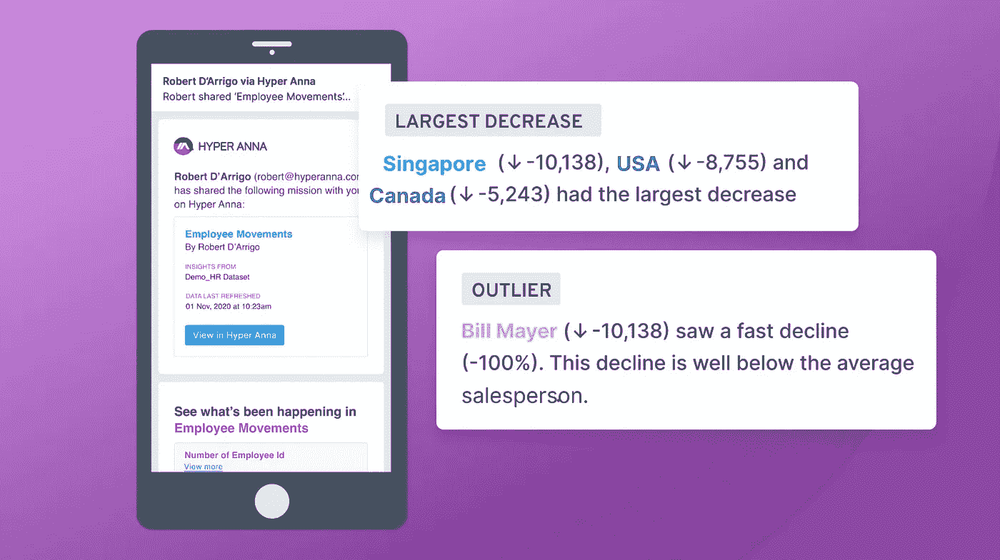
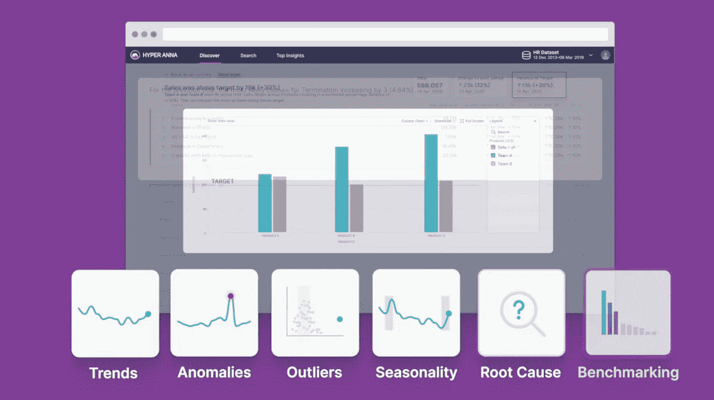
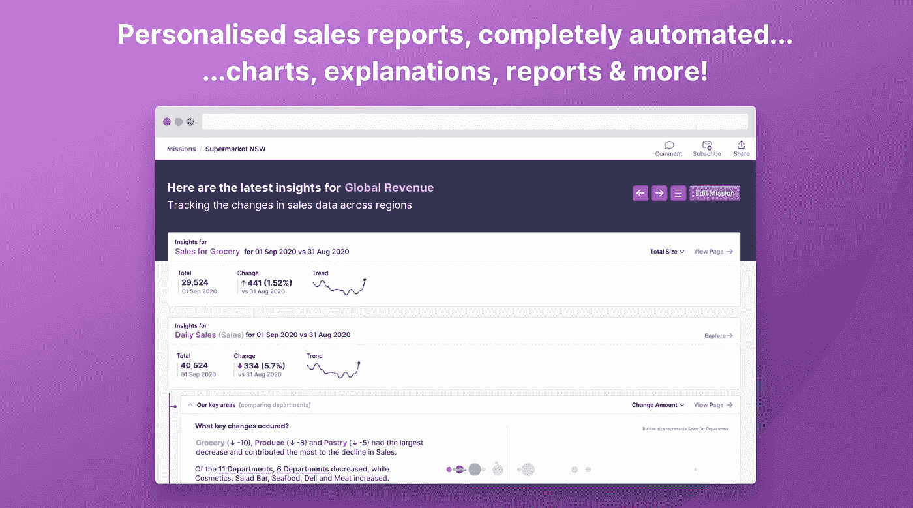
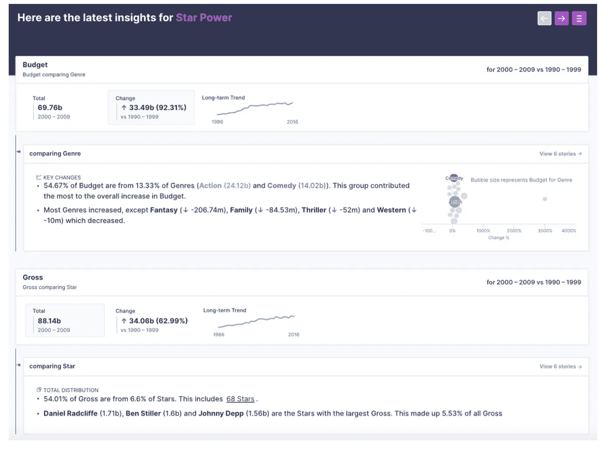
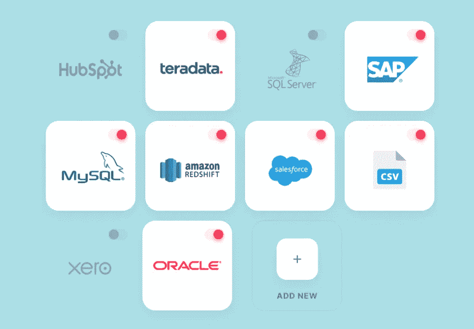
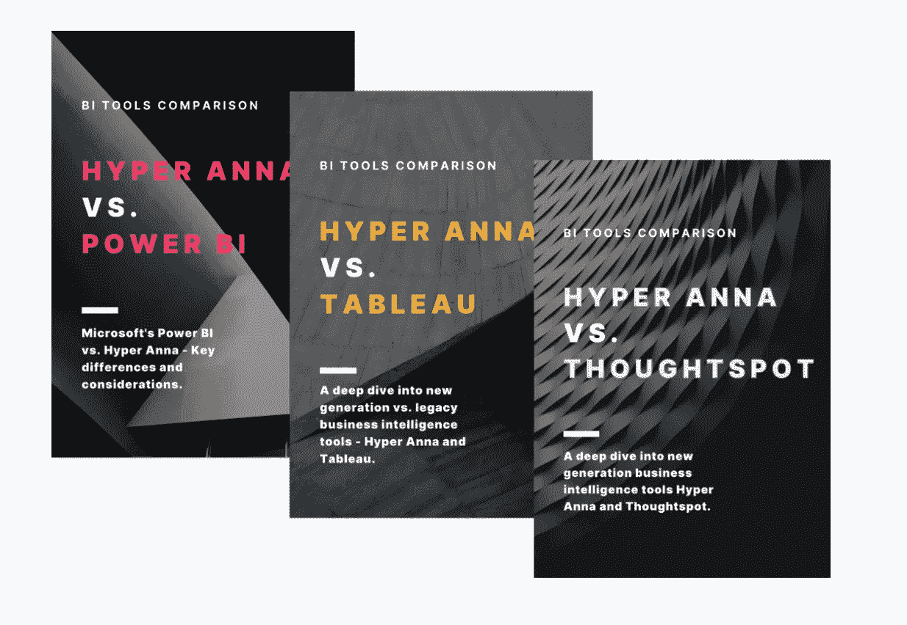

# 销售分析:新的 BI 玩家 ThoughtSpot 和 Hyper Anna 与 Power BI 和 Tableau 相比如何？

> 原文：<https://medium.com/geekculture/sales-analytics-how-do-the-new-bi-players-thoughtspot-hyper-anna-compare-to-power-bi-tableau-ed14909d1846?source=collection_archive---------3----------------------->

旧的淘汰，新的加入？

*When it comes to sales reporting, what’s the best BI tool for the job?*

W 随着[增强分析](https://www.gartner.com/en/information-technology/glossary/augmented-analytics)和[自助商业智能](https://www.gartner.com/en/information-technology/glossary/self-service-business-intelligence)的引入，销售人员现在可以轻松自助洞察哪些团队、地区或行业优于其他人——如果不依靠数据分析师，他们将很难获得这些信息。

虽然像[微软](https://www.hyperanna.com/case-studies/microsoft)这样的公司处于采用的前沿，使用传统( [Power BI](https://powerbi.microsoft.com/en-au/) )和新一代( [Hyper Anna](https://www.hyperanna.com/) ) BI 工具，但对于尚未接受增强分析优势的公司，尤其是在销售职能部门，可能有许多开放式问题需要解决…

# **目录**

1.  [**自助 BI 适合团队销售吗？**](#db9c)
2.  [**新一代 BI 工具是仪表盘还是数据可视化工具？**](#88c5)
3.  [**力量 BI vs 画面 vs 思想点 vs 超安娜**](#751d)
4.  [**Hyper Anna 如何补充我现有的 BI 栈？**](#2b67)
5.  [**它是否与现代销售体系(如 Salesforce)相集成？**](#61d1)
6.  [**开机运行需要多长时间？**](#59d9)
7.  [**销售团队如何有效使用自助 BI？**](#fe32)

# 先睹为快:关键区别是什么？

我们在下表中总结了主要差异。但是如果你想深入了解，请继续阅读我们详细比较这四种工具的地方…

Power BI vs Tableau vs ThoughtSpot vs Hyper Anna

# **第 1 部分—自助 BI 对团队销售有好处吗？**

**是的！**服用[超安娜](https://www.hyperanna.com/)。Anna 通过为团队提供实时数据洞察，然后促进跨职能团队和任何组织中决策者之间的无缝快速协作，帮助销售成为一项团队运动。方法如下:

*   与您的 CRM(和其他销售系统)集成，以便 Anna 可以主动、自动和实时地开始在您的数据中寻找洞察力，并在重要客户发生变化时提醒您。直接发到你的收件箱。
*   掌握销售分析——思考趋势、异常、异常值、基准——无需翻译或统计学学位。一切都用简单的英语解释，辅以图表和互动的视觉效果，以获得清晰和信心。帮助每个人获得赢得交易的洞察力，并让每个人都站在同一立场上。
*   提出问题并在几秒钟内获得答案。非常适合解决会议中出现的问题，并提供数据证据。帮助同事、合作伙伴和专家实时做出决策，帮助更快达成交易。
*   只需点击一下鼠标，就能找到“为什么”,直接找到真相，而不需要导航数据专家来调查发生了什么。
*   无需参加会议，即可查看您角色外围的内部报告和仪表盘，获得赢得交易的洞察力和知识…这意味着花在内部会议上的时间更少，销售时间更多！
*   设置通知以激发协作，并让专家更快地达成交易。
*   快速召集同事、合作伙伴和专家进行实时决策。

# 第 2 部分— **新一代 BI 工具仪表板/数据**是可视化工具吗？

不，Hyper Anna 和 ThoughtSpot 不是仪表板工具，但它们确实允许你创建仪表板，如果这是你所追求的。

传统的 BI 工具 Tableau 和 Power BI 是让数据专家构建仪表板的同义词:帮助企业跟踪高级 KPI，并通过图表和可视化了解他们的数据。由于这些工具已经有大约 18 年(Tableau)和 7 年(Power BI)的历史，有相当多的仪表板开发人员乐于构建定制的解决方案。但是，解决方案(最终交付成果)是预定义的，而不是个性化的，需要专家来构建和维护(这需要很高的价格)。因此，虽然传统的 BI 工具被用作顶线数字的来源，但它们并不适合需要洞察力的经理或销售人员，也不适合回答他们当前的问题。事实上，有一个问题是仪表板的未来是否是无仪表板的

相比之下，像 ThoughtSpot 和 Hyper Anna 这样的工具是新一代 BI 工具的一部分，旨在增强商业智能功能。

*   [**ThoughtSpot**](https://www.thoughtspot.com/) 的建立是为了解决一个类似谷歌搜索的用例:“我想问我的数据问题&得到答案。”
*   [**Hyper Anna**](https://www.hyperanna.com/) 就是为了解决这个问题而建造的:“我需要洞察力。所以如果我的数据中有真知灼见，我想尽快知道。无需等待。不依赖专家。没有问一个问题。”

我们在下表中总结了主要差异。但是，如果您想更深入地了解，请继续阅读我们详细比较这四种工具的地方…

Power BI vs Tableau vs ThoughtSpot vs Hyper Anna

# 第 3 部分—**Power BI vs Tableau vs ThoughtSpot vs Hyper Anna**

> **仪表盘** (Power BI，Tableau)、基于搜索的 BI (ThoughtSpot)和自动化数据故事(Hyper Anna)之间的主要区别是什么？

系好安全带。这是一个长…

# TABLEAU 和 POWER BI

> 用例:“我想要一个仪表板”

听起来很简单。仪表板的使用情形很简单，即监控高级 KPI 的能力。但是，尽管仪表板很普遍，这并不意味着销售团队实际上使用它们来获得洞察力。事实上，现实是暗淡的:传统 BI 工具的利用率低得令人难以置信，在 17-30%之间(来源: [BARC](http://barc-research.com/category/the-bi-survey/) ， [Gartner](https://www.gartner.com/doc/3753469) )。

恰当的例子——看看下面的销售仪表板。除了报告一些指标之外，这是否有助于回答紧迫的问题？转移指针让你接近达成交易？激发灵感或下一步行动？

And this is what your dashboard could look like: Charts and numbers. Zero insight.

# 电力 BI 和 Tableau 的隐性成本

如果你想要一个销售仪表板，这里是你真正的，含蓄的要求:

1.  *我希望数据分析师为我构建一个仪表板。由于这依赖于一个专业的开发人员，我不介意等待几周或几个月来建立它。*
2.  *我明白我不仅为软件付费，也为开发人员构建报告的时间付费。如果这份报告不是更广泛的组织的优先事项，我知道我的洞察请求将留在待办事项中，等待优先处理。*
3.  我很清楚自己想看什么。我能够看到的洞察力的深度和广度完全是预先决定的，我对此没有意见。我的用例只是监控高级 KPI，仅此而已。
4.  *我认识到，如果我想问仪表板过滤器范围之外的问题，我将不能这样做。我需要依靠其他人来回答出现的问题。这意味着我需要更多的时间和金钱。*
5.  我认识到仪表板仅仅报告了一些关键数字。但它不是一个产生洞察力的工具。
6.  *作为一名领导者，我认识到，如果我团队中的人想要深入挖掘洞察力，他们会陷入两种困境:1)将数据摘录导出到 Excel 并试图自己进行分析，或者 2)他们会盲目地做出决策，没有解决关键问题的洞察力。在后一种情况下，我认识到团队可能会不知所措:分析是复杂的，耗时的，容易出错的，需要专业知识，并且需要培训以知道对数据提出正确的问题——他们缺乏分析技能和经验，这影响了他们的信心或从头获得洞察力的愿望。他们还认识到，向数据团队寻求见解通常是徒劳的——拿到一张罚单，然后在积压的数据请求中等待优先处理。*
7.  *我认识到，我的仪表板的质量、设计和建造时间取决于开发商。但是这种花哨的功能可能也没有必要，因为我跟踪高层数字的用例完全是预先确定的。*
8.  *我认为推出仪表板是一个“安全的选择”,因为几乎每个公司、每个部门、每个经理都有一个用例来监控高级 KPI，并通过他们的微软套件访问 Power BI。但是我知道我的团队，客户经理，不会从报告中得到很多。是的，它可能会成为我们团队会议的讨论点，但因为它缺乏洞察力，它不会帮助我们以不同的方式思考，加快决策或激发协作，从而帮助我们更快地达成交易。*

# 思想点

> 用例:“像谷歌搜索一样，我想问我的数据问题并得到答案。”

听起来很简单。但是你真正想要的是:

1.  *我知道如何进行分析性思考，能够提出数据问题，以获得产生洞察力所需的深度和广度。*
2.  *我认识到，使用问答模式依赖于人们知道如何提问——如何表达问题，如何问后续问题，以及如何解决业务问题，提出假设，汇编答案，问后续问题，并得出结论。*
3.  *我知道如何提出问题来确定基准、比较和对比结果，因此我不仅能提出独立的事实或数据点，还能围绕结果说出上下文。*
4.  *我承认这不是真正的自然语言***，但是我必须学会使用语法和关键字来获取结果。**
5.  *我知道如何批判性地思考分析结果。我认识到，得到一个答案——一张图表——并不能产生深刻的见解，因为它缺乏引发啊哈的必要背景支持！瞬间。我认识到我的输出是有偏见的，当我被触发提出问题并花时间寻找答案时，我的输出会受到情况的影响。我也认识到，我的分析因我知道要问的问题而有偏差，这种洞察力可能进一步隐藏在数据中，但没有浮出水面。*
6.  **我认识到，我必须花时间寻找***答案来构建一个连贯的数据故事，这需要时间。***

****

**ThoughtSpot: Ask a question. Pin a chart.**

# **超安娜**

> **用例:“我需要**洞察力**。所以如果我的数据中有洞察力，我想知道它。没有等待，*依靠专家或*问问题。”**

**Hyper Anna 自动化了分析数据、生成分析内容、汇编解释(视觉和书面)和鼓励协作(分享、评论、订阅)的过程。因此，Hyper Anna 的关键 USP 是:**

## ****#1 最容易使用的&大师——最低的学习曲线****

**没有代码，没有应用程序来安装解决方案。一个实时、自助式的 SaaS 分析解决方案。云原生和不可知的架构。Hyper Anna 以客户为中心，为数据和业务团队提供支持。**

*   **[Hyper Anna 专为业务团队打造](https://www.hyperanna.com/product/hyper-anna-for-business-teams)，其消费信息的便捷性注重最终用户体验。**
*   **[对于数据团队](https://www.hyperanna.com/product/hyper-anna-for-data-teams)，掌握 Hyper Anna 的学习曲线是两个小时，与 Power BI 和 Tableau 相比是个零头。数据专业人士表示，需要四年时间来积累专业知识，才能在传统工具中获得与 Hyper Anna 中生成的见解质量相当的见解。**

****

**Hyper Anna: No code, no app to install solution, with the lowest learning curve.**

## ****#2 最低的每洞察成本—最高的投资回报率****

**由于洞察生成中的端到端自动化，Hyper Anna 与所有 BI 竞争对手相比提供了最高的 ROI。**

*   **一个 Hyper Anna 用户平均每月在平台上消费 148 条洞察。每个用户每月的平均许可成本为 200 美元，每个个性化洞察的平均成本为 1.50 美元。**
*   **与手动获得相同洞察的成本相比——每个洞察的成本为 670 美元(假设手动产生一个洞察的资源时间为 4 小时，并遵循国家工资基准)——Hyper Anna 显著降低了组织创建和消费洞察的起点。**

## ****#3 专为数据分析师和业务团队打造****

**对于数据团队，Hyper Anna 处理 80%的洞察请求，将 20%留给数据专家。对于业务团队来说，与传统 BI 工具相比，Hyper Anna 内容的参与度明显更高，粘性也更强。[首席执行官(CEO、CFO)](https://www.hyperanna.com/company/customer-stories)和[前线团队](https://www.hyperanna.com/all-solutions/contact-centres)(联络中心、客服顾问、销售人员)每天都在使用 Hyper Anna。无论安娜的见解是作为每日 15 分钟脱口秀的一部分，还是作为更正式的每周例会的一部分来跟踪节奏，团队都在以前所未有的方式处理数据。**

****

**Hyper Anna: Smart on the inside…**

## ****#4 原生增强分析——比人类更智能的数据分析****

**作为一个增强和上下文分析的本地人，Hyper Anna 从一开始就专注于帮助加快对运营行动的分析洞察。在机器学习的推动下，数据情境化和优化传递了重要的信号，而不是噪音。最佳点是时间序列数据。从数据分析、分析、异常检测和根本原因分析，Hyper Anna 提供了更智能的数据分析，可与人类产生的输出相媲美。**

****

**Hyper Anna: Simple on the outside.**

# ****第 4 部分 Hyper Anna 如何补充我现有的 BI 堆栈？****

**与需要专家构建报告和仪表板的数据可视化工具不同，需要几周或几个月的时间才能获得您需要的答案，Hyper Anna 可以自动完成这项工作，甚至更多！**

**超安娜是为任何人获得洞察力而建造的。我们所说的洞见是指洞见:富含分析的数据故事、图表、清晰的解释、定制所需内容的灵活性、添加评论、构建演示，等等**

****

**Hyper Anna: automated data stories that rivals output produced by humans.**

**只需连接您的数据，与超级智能、超级友好的 Hyper Anna 团队一起参加 2 小时的大师班，每次都可以带着您需要的工具获得个性化、经过验证的见解。然后订阅你的股东，让他们参与进来。就是这样！**

**就最佳 BI 技术堆栈而言……Hyper Anna 专为希望获得最佳结果且不怕问自己是否从传统工具和流程中获得价值的团队而构建。我们的客户是在世界各地都有团队和办公室的大公司。在 Hyper Anna 之前，即使使用了世界上所有的工具，他们也很难获得洞察力。一旦他们开始使用 Hyper Anna，通过支持更多用户和使用案例来获得价值，Hyper Anna 逐渐取代了对仪表盘的需求。**

**这是因为在 Hyper Anna 中，您可以以很低的成本获得更智能、更个性化的实时见解，这是传统 BI 工具从未解决的问题。**

**要了解更多信息，请阅读 Hyper Anna 与 Power BI、Tableau 和 ThoughtSpot 的对比。**

# **第 5 部分——新一代工具是否与现代销售体系相集成，如 [Salesforce](https://www.salesforce.com/) ？**

**[销售](https://www.hyperanna.com/all-solutions/sales-reporting)数据是 Hyper Anna 最早的核心用例之一，让团队可以轻松地与 Anna 保持最新的销售业绩洞察。**

**有两种方式[将任何销售数据连接到 Hyper Anna](https://helpdesk.hyperanna.com/en/collections/1870973-for-admins-to-upload-data) :直接数据库连接或 CSV 上传。每种连接方法都提供相同的功能，但是，我们建议使用直接连接，因为它可以在最新数据可用时自动刷新洞察。**

**了解更多关于如何[增强你的销售洞察力](https://www.hyperanna.com/all-solutions/sales-reporting)及其运作方式的信息。**

****

**Hyper Anna integrates with any ODBC compatible database. With minimal data prep, securely connect to your database or upload flat files. Plug in & power up insights in minutes.**

# ****第 6 部分——启动并运行需要多长时间？****

****快！** SaaS 客户可以在几分钟内上线。对于内部部署，通常需要 1-2 周的时间来准备部署。**

**一旦环境准备就绪，Hyper Anna 可以连接到任何数据库，或者只需拖放一个 CSV 文件即可开始。几分钟内，团队可以配置 Hyper Anna，以适应他们想看的内容和时间。然后瞧！见解直接发送到您的收件箱，按计划进行。更好的是，当数据中出现异常和异常值可能会引起关注时，Anna 会让您知道。**

**Hyper Anna 旨在实现工作自动化。所以她不仅快，而且快得惊人。尤其是与需要数周或数月才能获得见解的传统方式相比。**

**但是 Hyper Anna 不仅仅比 Power BI 和 Tableau 这样的工具更快。安娜提供更多，更多！了解更多关于[如何部署 Hyper Anna 及其工作原理](https://helpdesk.hyperanna.com/en/articles/3386920-on-premise-and-client-cloud-deployment)。**

# ****第 7 部分—销售团队如何有效地使用自助 BI？****

**[销售领导、高管层领导(CEO、CFO)和一线团队(客服顾问、销售人员)每天都在使用 Hyper Anna](https://www.hyperanna.com/case-studies/microsoft)。无论 Anna 的见解是作为每日 15 分钟脱口秀的一部分，还是作为更正式的每周例会的一部分来跟踪节奏，团队都在以前所未有的方式处理数据！**

> **例证:在 Hyper Anna 之前，销售团队“数据丰富，但洞察力贫乏”。**
> 
> **他们可以访问高级仪表板，了解冰山一角的情况。他们还可以访问电子表格中的原始数据(如果他们有勇气看到表面下发生的事情)。**
> 
> **但他们缺乏理解数据的敏捷性和能力，无法获得个性化的见解，也无法以一种简单、可重复的方式做到这一点，而这种方式可以融入他们的每日、每周、每月会议中。**

**那么，是什么让超级安娜如此迷人呢？**

**除了自动化和易于使用，超级安娜成功的关键是[任务](https://helpdesk.hyperanna.com/en/articles/4103921-missions)。**

**通过创建任务(和订阅其他任务)，你正在个性化你想看的，对你的工作重要的东西。这为您的所有报告、团队、办公室和部门创造了一个空间——由 Anna 完全自动化。这意味着见解一旦发生，将直接发送到您的收件箱，让您轻松掌握最新动态。**

**由于任务易于加入和创建，Hyper Anna 可以适应不断变化的需求。如果有人新加入一个项目，你可以简单地将他们添加到任务中。然后他们可以通读旧报告。当需要开始新的事情时，创建一个新的任务，邀请合适的人。**

> ****底线——Hyper Anna 在团队中受欢迎是有原因的:它让他们的工作更简单、更聪明、更有效率。****

# **结论**

> ****在 Hyper Anna，我们相信数据会给你信心。不是剥夺你的权利。****

**随着 BI 技术的进步，Hyper Anna 等新一代工具正处于提供真正有洞察力的见解的最前沿，这些见解准确、快速，旨在展现**啊哈**时刻，因此团队可以专注于最重要的行动。**

# **想了解更多信息吗？**

**最近一次更新于 2021 年，[这份 40 页的报告是“Hyper Anna vs. Top BI Tools”指南](https://www.hyperanna.com/resources/bi-tools-comparison)。下载探索:**

****

**Compare Top Business Intelligence Tools**

# **内容**

1.  ****Hyper Anna 与 Tableau、Qlik、Power BI:** Hyper Anna、Tableau、Qlik 和 Power BI 对比，并排特性对比**
2.  ****数据可视化与洞察:**分析和讲故事与仪表板非常不同**
3.  ****超越仪表盘:**自然语言处理(NLP)的兴起**
4.  ****新机器时代:**自动化数据发现、自助式商业智能、机器学习和分析**

****底线****

**面向首席执行官、首席财务官、首席风险官、首席债务官和主要决策者的实际产品测试和功能比较。**

**[**在这里下载免费指南**](https://www.hyperanna.com/resources/bi-tools-comparison?utm_campaign=website%20&utm_source=medium&utm_medium=automated-analytics-bake-off&utm_content=ha-page-bi-tools-comparison)_ _ _ _ _ _ _ _ _ _ _ _ _ _ _ _ _ _ _ _ _ _ _ _ _ _ _ _ _ _ _ _ _ _ _ _ _ _ _ _ _ _**