# 销售预测:从经典时间序列模型到机器学习模型的多步预测

> 原文：<https://medium.com/geekculture/sales-prediction-multi-steps-forecast-from-classical-time-series-models-to-machine-learning-models-b5718b242648?source=collection_archive---------11----------------------->

## 时间序列分析适用于许多行业，如商业、经济、金融甚至医疗保健。自 19 世纪以来，科学家们一直在研究这个课题。顾名思义，它高度依赖于收集数据的时间点。你有没有想过是什么使它成为一种特殊的数据集，是什么使它不同于回归问题？

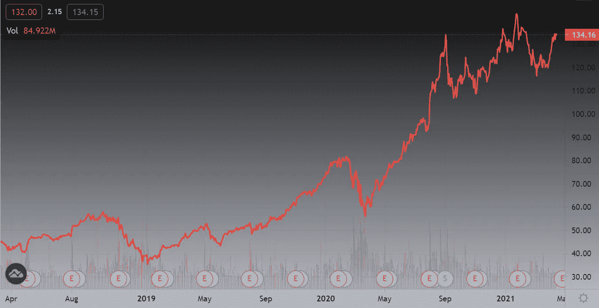

时间序列是在一段时间内顺序收集的有序数据点的集合。一般定期收集。这是特殊的，因为数据点不是独立的，我们期望一定程度的序列相关性。没有独立变量和时间依赖使它不同于回归问题。时间序列预测是基于历史数据，通过提取数据中有用的统计数据和特征来预测未来。在这篇文章中，我们将对时间序列进行描述、分析和建模。

时间序列主要由三部分组成:

1.  趋势—数据变化的总体长期方向
2.  季节性—模式在特定时间段内系统地重复出现
3.  残差-短期随机波动

讨论如何识别这些成分在时间序列中出现的可能性，并对其进行可视化分解，以验证其是否证明我们关于调查领域或分析目标的假设陈述是正确的。例如，一个商人期望他们的年收入呈增长趋势，而预算分配却在减少或保持不变，一个医生则期望相当稳定的心率。基本上，时间序列预测从数据可视化开始，以便对每个组成部分、趋势和季节性进行概述和检查。然后估计并消除这些成分，留下一个平稳序列。模型是在固定系列上构建和优化的。通俗地说，如果一个序列在所有时间点都具有恒定的统计性质，如方差、协方差和均值，则称该序列是平稳的。从形式上讲，设 *X(t)* 是一个时间序列，我们只考虑弱平稳性，它表明一个序列是平稳的，如果

*   *x(t)* 的均值不依赖于 *t*
*   *x(t)* 的方差不依赖于 *t*
*   *x(t)* 和 *x(t+h)* 的协方差不依赖于 *t* ，仅依赖于 *h*

然而，按模型预测的产量并不是我们问题的答案。需要通过将移除的组件添加回所获得的输出来将它重新缩放到原始比例。当然，有一些模型中平稳性不是严格的假设，通过跳过组件分解和重定尺度，过程将被大大简化。时间序列分析中使用的一些概念或术语将在整个过程中讨论。

**问题陈述**

假设你拥有一家商店，目前正在为未来几年做股票规划。通过获取过去 11 年的月度销售数据，您尝试预测未来 12 个月的月度库存消耗，以确保健康的现金流，并通过避免供应过剩来最大限度地减少浪费。

**数据加载**

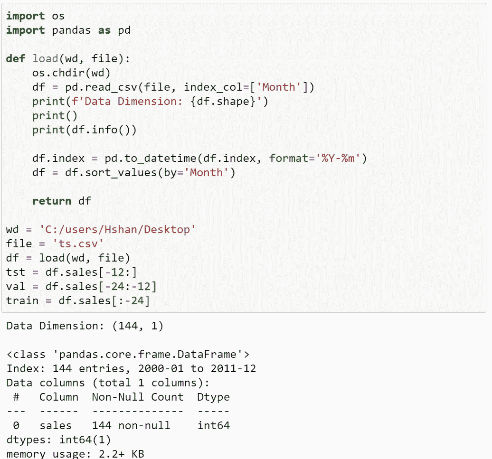

Data Loading and Info.

请注意，数据类型为 date，在加载之后，如果需要的话，它会被更改为 datetime 以提取日期部分。

**数据描述**

既然这是一个时间序列数据，就不应该对其进行随机洗牌和分区。否则，我们会遇到这样的情况:我们可能会根据毫无意义的未来数据来预测过去。订单必须保留，我们把过去 12 个月作为测试数据。没有空数据。

训练数据集:商店中特定产品从 2000 年到 2009 年底的月销售记录。

验证数据集:2009 年 1 月至 2010 年 12 月的月销售额

测试数据集:2011 年 1 月至 2011 年 12 月的月销售额

大小:122 条记录用于训练，12 条用于验证，12 条用于测试

**探索性分析**

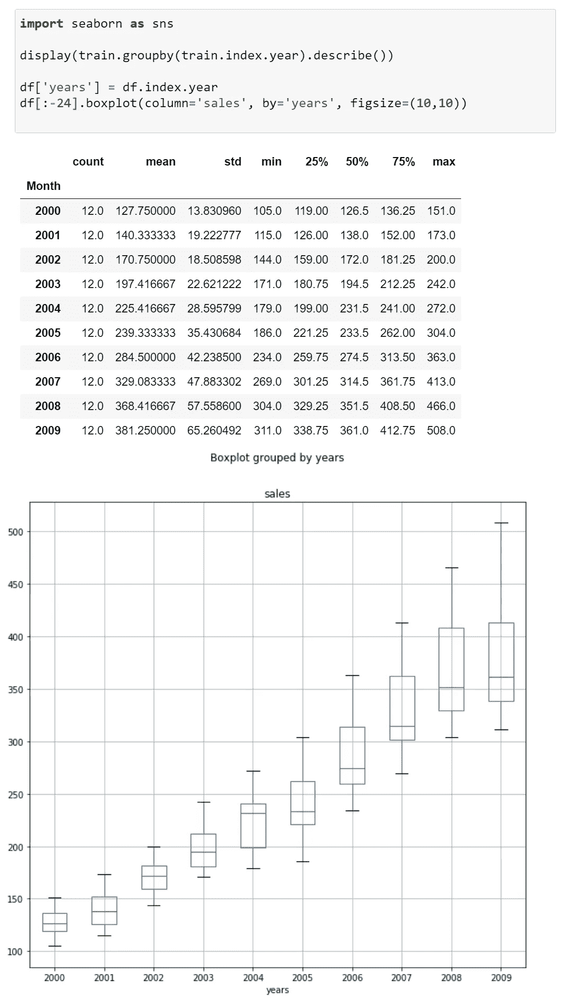

Data Summary and Boxplots

统计摘要显示，除了 2002 年之外，平均值和标准偏差逐年增加，表明存在上升趋势和更广泛的数据传播。数据的传播通过一系列的箱线图可视化，按年份合计销售额，以便更清楚地检查。

Time Series Plot.

时间序列图符合关于上升趋势的假设性陈述，更仔细的观察揭示了季节性的存在，通过沿着线图重复模式，具有不同程度尖峰或扩散的相似形状。

**数据转换**

我们从前面的章节中注意到趋势和季节性的存在。由于大多数统计分析工具或模型非常依赖平稳性假设，因此在继续建模之前，消除这些成分至关重要。因此，待建模的序列在一段时间内将具有恒定的统计特征。有许多方法被引入来验证时间序列的平稳性，但是，只有通过可视化和 Dickey-Fuller 检验的直接检查。Dickey-Fuller 检验是一种假设检验，假设序列是非平稳的。您可能希望对变差函数进行测试，平稳序列预计会在变差函数上达到稳定状态。

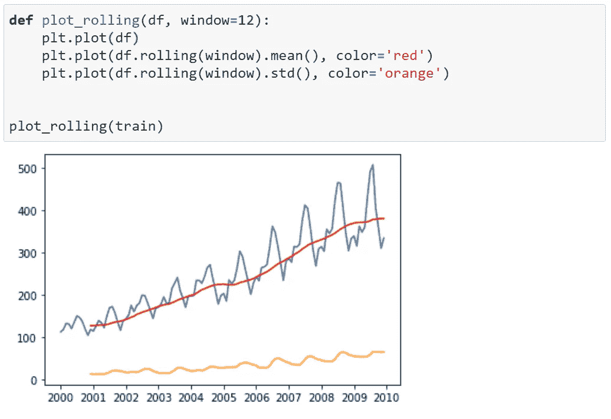

Time Series Plot with Rolling Mean and Standard Deviation (window=12).

绘制了代表窗口为 12 的移动平均值的红线和具有相同窗口的滚动数据的标准偏差的橙线。与数据值相比，滚动数据的标准差要低得多。在目前的分析阶段，我们几乎可以确定有增加的趋势，组件分解已经完成。这里应用的 Python 库在分解时间序列时施加了移动平均。这种分解通常不是告诉你是否有季节性和趋势的直接方法。在你识别它们之后，它打算把它们分解以便可视化。通常，这一步不足以证明平稳性。

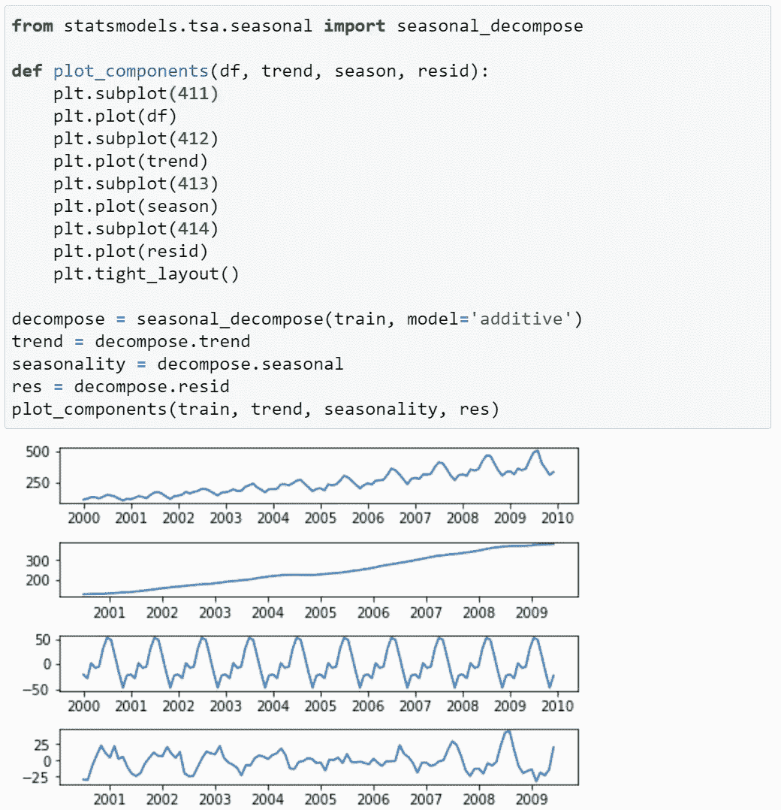

Components Decomposition.

**举例说明移位、滚动平均值和标准差是如何工作的**

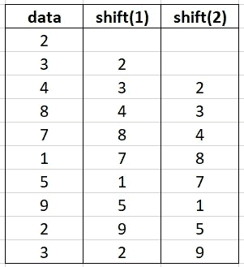

Shifting illustration.

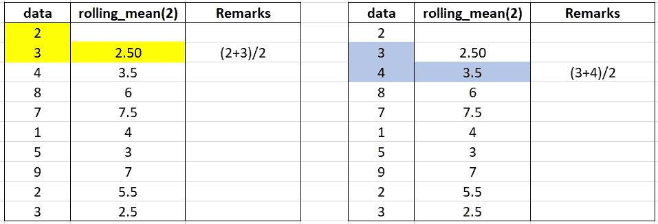

Rolling mean illustration.

滚动标准差的工作方式与滚动平均值相似，但计算功能是从“平均值”变为“标准差”。

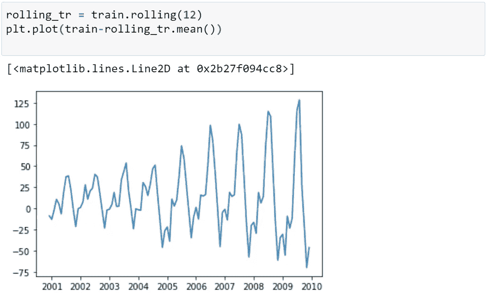

Plot of Training Data — Rolling Mean (window=12).

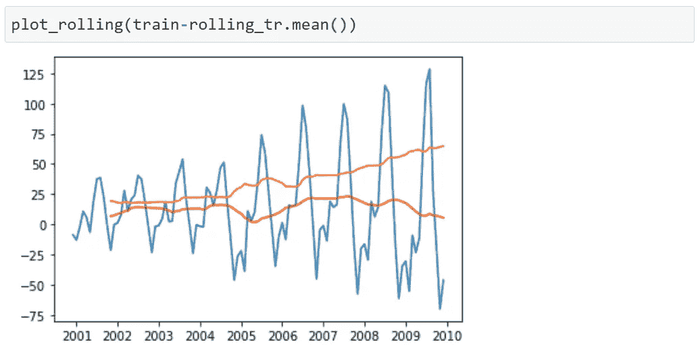

使数列平稳所需的一系列变换和差分。从原始序列中减去滚动平均值后，注意数据分布的增量，而滚动平均值随时间保持不变。因此，对数变换可能是合适，因为它惩罚了大量的数字。

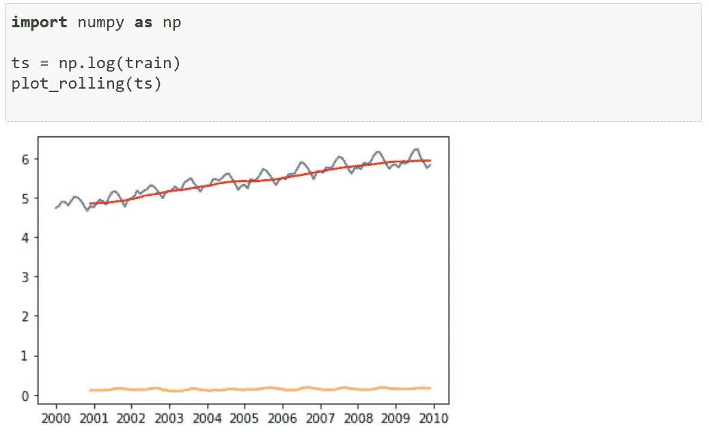

Time Series Plot of Log-transformed Data.

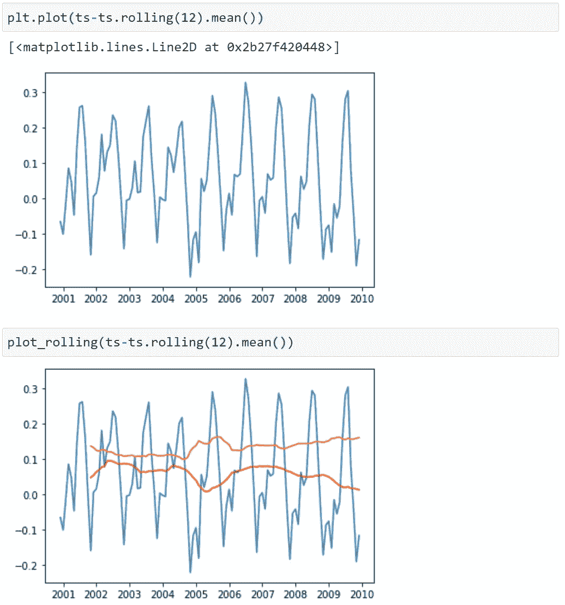

Plot of Log-transformed Data — Rolling Mean (window=12).

尽管对数变换值的范围很大，但与原始序列相比，去除滚动平均值后的对数变换序列的扩散程度并未显示出明显的变化。然而，滚动平均值和标准偏差是波动的，没有观察到明显的模式。总体规模发生了变化，但我们预计每个时间序列组成部分存在的结论不会发生变化。

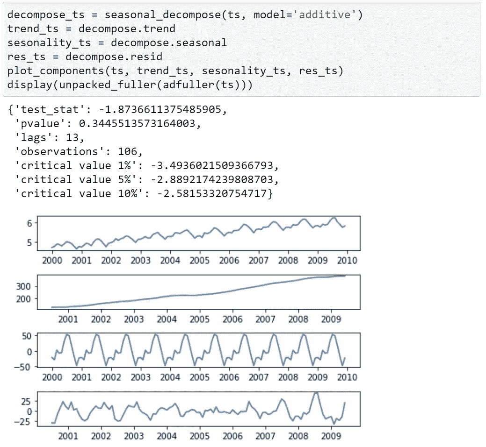

Components Decomposition.

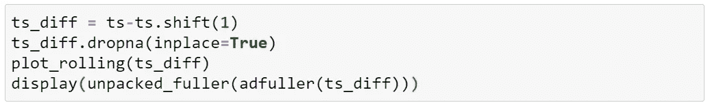

Differencing Code.

**的论调。shift()** 根据不同的顺序进行相应的调整测试，d

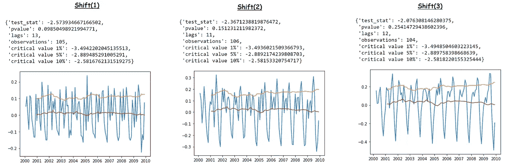

Differenced Series.

接下来，对经过对数变换的序列进行差分。滚动平均值和标准差现在波动很小，可以说在整个期间是恒定的。平稳性通过进行 Dickey-Fuller 检验得到进一步证明，在所有三个显著水平上报告小于临界值的检验统计，拒绝零假设。建模将基于经过对数变换和差分的稳定序列进行。在 1，2，3 处有差异的可视化时间序列告诉我们 d=1 是最好的，具有一致的滚动平均值和较低的滚动标准偏差。什么是合适的模型？如何判断？

**时间序列建模**

这一步比前一步要简单得多。我们主要考虑四种类型的经典时间序列模型，自回归(AR)、移动平均(MA)、自回归-移动平均模型(ARMA，AR 和 MA 的组合)以及最后的自回归综合移动平均(ARIMA)。我们决定差分之前，ARIMA 是选择，所以没有额外的步骤，在创建减去系列需要。MA 和 AR 可以通过设置*【ARIMA(p，d，q)* 的顺序来构造。通过设置 *p=0* 和 *q=0* ，分别为 MA 和 AR。 *p* 和 *q* 的设置涉及自相关(ACF)和偏自相关(PACF)的分析。

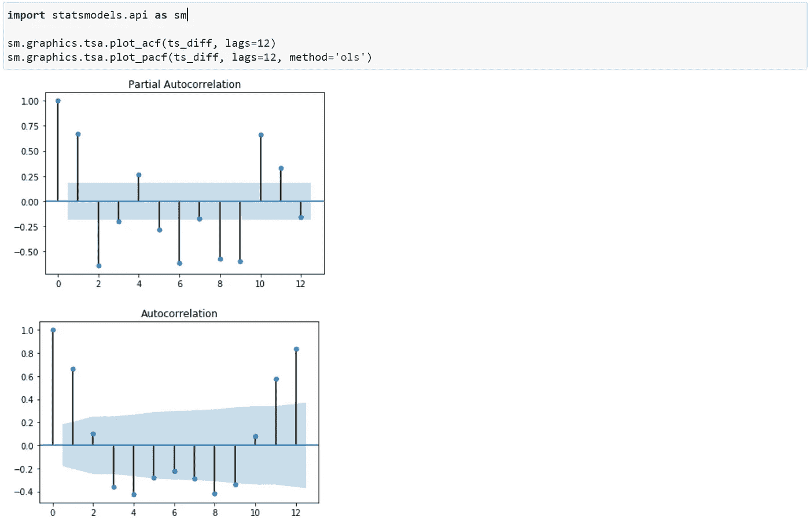

ACF and PACF Plots.

ACF 测量时间序列与其滞后 *k* 的序列的相关系数，意味着我们量化了 *x(t)* 和 *x(t-k)* 之间的相关性。PACF 测量时间序列及其滞后值之间的部分相关性。ACF 和 PACF 的区别在于，考虑到滞后 k 处的 PACF，它考虑了较短滞后 *h* ( *h < k* )处的数据点之间的相关性。有些人倾向于认为这是一个回归问题。取 *w=ax+by+xz* ，PACF 报出 *w* 和 *z* 之间的相关性，仍然是由 *x* 和 *y* 预测的。ACF 和 PACF 的急剧下降分别决定了 *q* 和 *p* 的值。如果 ACF 和 PACF 都逐渐衰落，ARIMA 将被选中。AR 和 MA 模型已经过检验，它们的性能不如组合模型。因此，在这里采用 ARIMA。从这种情况下产生的 ACF 和 PACF 图，将训练和验证 ARIMA 阶的三个组合，[ (2，1，1)，(0，1，1)，(2，1，2) ]。通过更改 ARIMA()的参数“顺序”，可以相应地修改下面的代码。

Code.

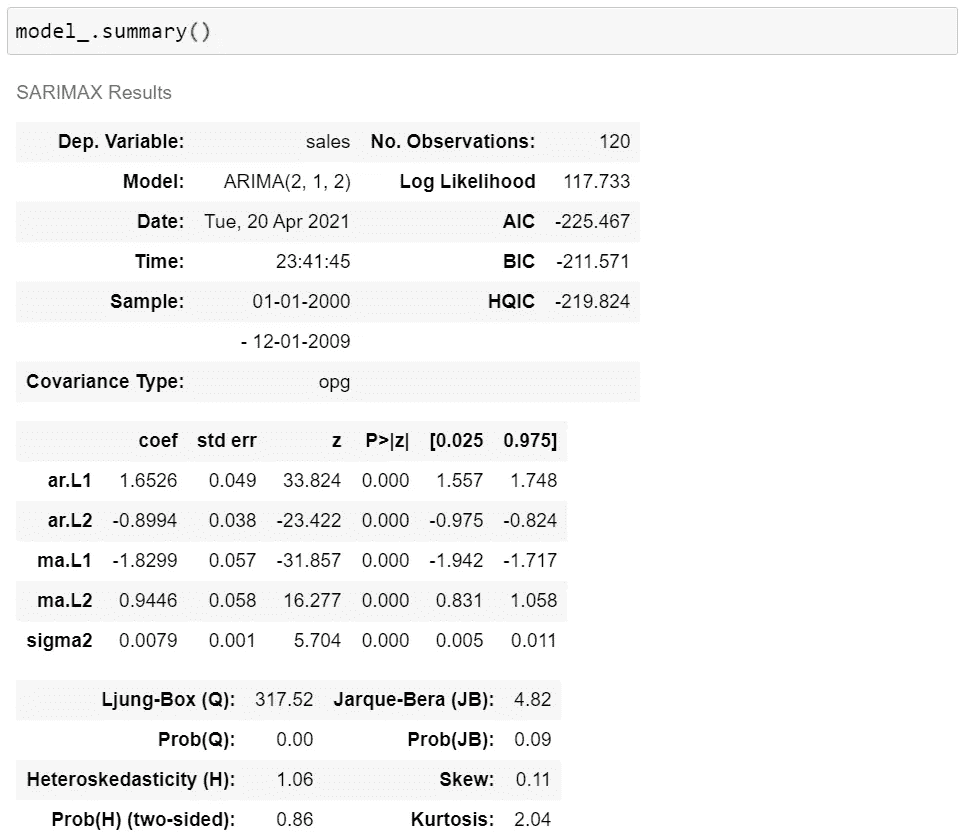

Model Summary for ARIMA (2,1,2)

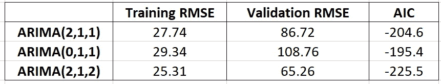

Performance Summary.

*ARIMA(2，1，2)* 在三种模型中 AIC 最低，其所有参数估计都具有统计显著性。值得注意的一点是，ARIMA(2，1，2)在训练和验证 RMSE 之间的差异要小得多。我们将继续使用 *ARIMA(2，1，2)。*

选择的模型用一套完整的训练和验证数据进行改装。预测将从最后一个时间点开始。这是一个时间序列数据，跳过验证集是无效的。如果您跳过，测试数据的预测将基于验证集之前发生的历史，这意味着您将使用 2009 年的销售额来预测 2011 年的销售额。这是一个多步预测问题。12 个月的预测将基于递归预测进行， *X(t+2)* 将基于 *X(t+1)* 的预测，依此类推。

Forecast for 01/2011–12/2011.

获得预测输出与建模中采用对数变换时间序列具有相同尺度。通过取模型预测值的指数将其转换回原始比例，进行反向对数转换以获得最终有效预测。

整个过程涉及在统计学理论的支持下对情节的相当主观的解释。Python 库，pmdarima 为我们提供了名为 auto_arima 的方法。它将对每个参数的值范围进行迭代，并基于指定的一些其他参数进行优化，以找到最佳执行模型。

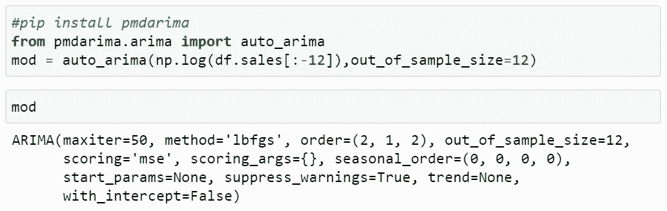

Code.

**机器学习模型**

时间序列问题可以重新表述为 ML 中的监督学习，这样上一步的输出将作为下一步的输入。假设每个数据点都是独立的，因为通过为每个记录创建新要素，已经考虑了输出之间的序列相关性。

几十年后，经典的时间序列模型对于解决我们的问题仍然是有吸引力和有用的。然而，将时间序列预测任务重组为机器学习问题是发人深省的，因为它可能包含更多被怀疑是因变量变化的因素。预测不再仅仅依赖于历史，而是考虑到了周围其他有意义的预测因素。例如，食品杂货销售在节日期间会出现明显的高峰，因此人们是否在某一天庆祝的布尔变量值得作为预测因素包括在内。如何从该数据集创建新数据框的示例如下，任何回归模型(如线性回归、SVR、神经网络等)都可以进行试验。

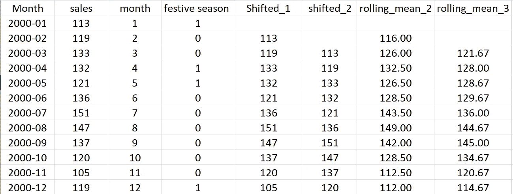

Example of DataFrame Creation for Supervised Learning

请注意，数据分割方法仍然是一个问题，因为事件的顺序很重要。