# SALESFORCE API:集成指南

> 原文：<https://medium.com/geekculture/salesforce-api-integration-guide-d48133e414ee?source=collection_archive---------35----------------------->

*了解如何以低代码连接和扩展您的 Salesforce 实例。*

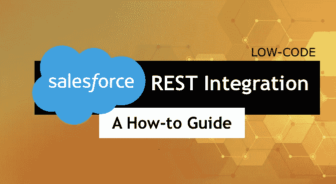

Salesforce 提供了一个 [REST API](https://help.salesforce.com/articleView?id=sf.remoteaccess_oauth_web_server_flow.htm&type=5) ，允许您集成第三方应用程序。本文展示了如何将 Salesforce API 与 [Linx](https://linx.software) 集成，Linx 是一个构建和托管 API、自动化和集成的低代码开发平台。

Linx 为您提供了自动化任务和数据处理功能的能力，以与您的 Salesforce 实例集成，从而允许操作您的数据。您可以轻松扩展 Salesforce 的功能，并将 Salesforce 与其他第三方应用程序集成，如 Xero、QuickBooks 和其他系统 API。这允许您将系统连接在一起，创建一个完全自动化的循环。

本指南将涵盖以下内容:

*   **sales force connected 应用程序和 OAuth 2.0 身份验证的设置**
*   **验证并连接到 Salesforce API**
*   **示例请求**
*   **自定义功能示例**

**提示:**

在继续之前，建议您看一下下面的文章，以熟悉如何使用 Linx 中的 API:

*   [使用 REST API 1](https://community.linx.software/community/t/consuming-rest-apis/482)
*   [通用 OAuth 2.0 认证器](https://community.linx.software/community/t/generic-oauth-2-0-authenticator/487)

# 资源

我们构建了一个示例解决方案，以便更容易地使用 Linx 和 Salesforce 进行开发:

sales force template . lsoz(186.0 KB)

# 1.注册您的 Linx-Salesforce 应用程序

为了与 Salesforce API 交互，您必须首先注册一个连接的应用程序。这将为您提供必要的授权细节，然后您可以使用这些细节来生成您的访问和刷新令牌。

1.  登录到 [Salesforce](https://login.salesforce.com/) 前端。
2.  导航至应用管理器控制台(左侧菜单栏>应用>应用管理器)。
3.  点击屏幕左上角的**新连接的应用**。
4.  完成**基本信息**如下:

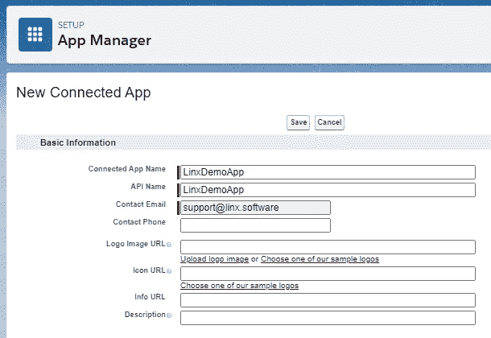

5.选择**启用 OAuth 设置****并完成如下部分:**

**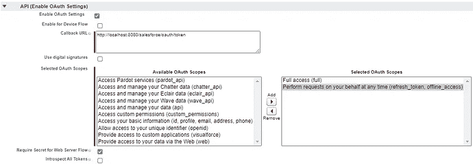**

**6.对于**回调 URL** /重定向 URL，添加以下内容:**

*   **`[http://localhost:8080/salesforce/oauth/token](http://localhost:8080/salesforce/oauth/token)`**

**7.通过单击按钮添加您选择的访问“范围”,出于本指南的目的，我们将授予:**

*   **`Full access (full)`**
*   **`Perform requests on your behalf at any time (refresh_token, offline_access)`**

****注意:**如果选择不同的范围，一定要适当更新`$.Settings.salesforce_app_scopes` 值。关于访问范围的更多信息可以在 [**这里**找到。](https://help.salesforce.com/articleView?id=remoteaccess_oauth_tokens_scopes.htm&type=5)**

**8.点击**保存**。现在，您应该能够看到新创建的应用程序客户端标识符，如下所示:**

**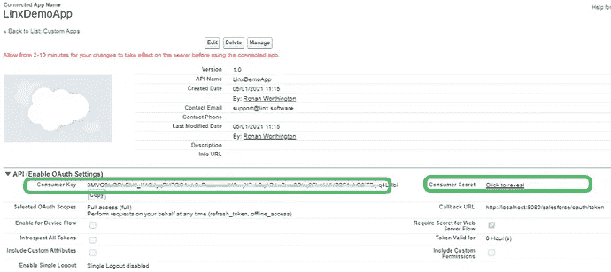**

**9.点击**点击显示消费者密码旁边的**，生成并显示应用密码。复制并保存**消费者密钥**(客户端 ID)以及**消费者秘密**(客户端秘密)，并将其保存在某处以备下一步使用。**

# **2.配置 Linx 应用程序设置**

**在 Linx 设计器中打开提供的示例解决方案，并更新**。带有客户端标识符的 Linx 应用程序的设置**如下:**

*   ****linx _ database _ conn _ string**:用于存储和从数据库中检索认证令牌的连接字符串。点击阅读更多关于创建连接字符串[的信息。](https://linx.software/docs/reference/plugins/database/common/connectioneditor/)**
*   ****sales force _ app _ Consumer _ Key**:您连接的应用的**消费者密钥****
*   ****sales force _ app _ Consumer _ Secret**:您连接的应用的**消费者机密****
*   ****sales force _ API _ version**:API 的当前版本，在编写时是`v50.0`，可能会更改。最新的版本信息可以在这里找到[1](https://developer.salesforce.com/docs/atlas.en-us.chatterapi.meta/chatterapi/intro_working_with_chatter_connect.htm)。**

**您的 Linx 解决方案的 **$。设置** s 应该如下图所示:**

**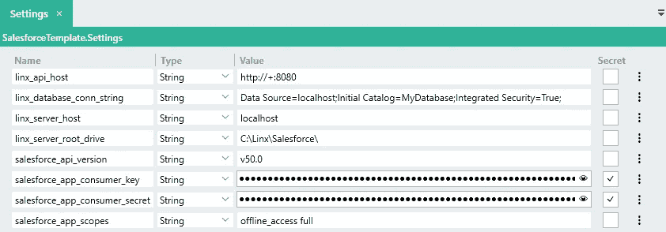**

# **3.授权应用程序**

******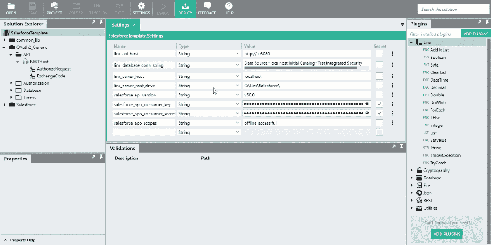**

1.  **在 Linx Designer 中，**debug**the[RESTHostSVC](https://linx.software/docs/reference/plugins/rest/content/resthost)，一旦启动导航到以下 URL 或点击[此处](http://localhost:8080/salesforce/oauth/authorize):**

*   **`[http://localhost:8080/salesforce/oauth/authorize](http://localhost:8080/salesforce/oauth/authorize)`**

**2.登录 Salesforce 并授予对您注册的应用程序的访问权限。一旦您被授权访问，Salesforce 授权服务器将使用`code`和`state`参数将用户代理重定向到回调 URL。这将触发访问令牌生成，如果成功，生成的消息将显示在您的浏览器中，如下所示:**

```
{
  "date":"2021-01-05T13:33:29.36004+02:00",
  "summary":"Linx application successfully authorized.",
  "platform":"SALESFORCE",
  "authorized_entity":"https://yu8.salesforce.com"
}
```

**这表明 Linx 成功地生成并存储了存储在数据库中的访问令牌。每次发出请求时，都会从数据库中检索该令牌信息。**

# **4.向 Salesforce API 发出请求**

**现在，Linx 应用程序已被授予访问权限并生成了访问令牌，您现在能够对 Salesforce 实例中的对象发出 CRUD 请求。**

**为了在 Linx 中发出 HTTP 请求，您必须使用 [CallRESTEndpointFNC](https://linx.software/docs/reference/plugins/rest/content/callrestendpoint) 。**

**要针对 Salesforce API 端点发出请求，您必须使用您的 Salesforce 实例作为端点 URL 的前缀，如下所示，更多信息可在[此处](https://developer.salesforce.com/docs/atlas.en-us.chatterapi.meta/chatterapi/intro_building_url.htm)找到**

```
{instance url}/services/data/v{version number}/sobjects/Account
```

**为了验证请求，您必须在`Authorization`报头中包含`access token`，如下所示:**

```
Authorization : "OAuth " + {access token}
```

# **样本模板**

**[Salesforce API 参考文档](https://developer.salesforce.com/docs/atlas.en-us.api_rest.meta/api_rest/resources_sobject_describe.htm)没有详细描述每个对象、端点或方法。**

**为了在 Salesforce 上使用 [sObjects](https://developer.salesforce.com/docs/atlas.en-us.api_rest.meta/api_rest/resources_sobject_describe.htm) ，您首先需要对返回对象结构的 API 发出请求。由此，您将能够创建适当的数据结构。**

**您可以通过发出如下请求来返回对象的元数据:**

```
{instance url}/v50.0/sobjects/{sObjectName}/describe/
```

**这将为您提供关于该对象的可能性的详细元数据。**

# **模板请求**

**下面构建的自定义函数演示了创建发出单个请求的独立函数的最佳实践。每个函数都以结构化数据的形式返回请求-响应。**

**出于演示的目的，我们将详细介绍“帐户”对象。**

**在解决方案浏览器中可以找到以下自定义函数:**【销售力量】>【客户】>【请求】****

**遵循的最佳实践是为每种类型的调用创建一个包装函数，如下所示:**

*   ****GetAccounts** :从 Salesforce 检索所有现有帐户 id，并返回对象列表作为结果。**
*   ****GetAccount** :根据`Id`输入参数，检索特定账户的详细信息。这可用于检查修改历史，也可用于更新对象。**
*   ****CreateAccount** :根据作为输入参数传入的账户详细信息创建一个新账户。**
*   ****UpdateAccount** :根据输入参数传入的账户明细修改已有账户。**
*   ****删除账户**:删除现有账户。基于`Id`输入参数。**

**然后，您将能够互换使用这些功能来创建自定义逻辑，以在 Salesforce 上自动处理数据。**

****典型结构:****

**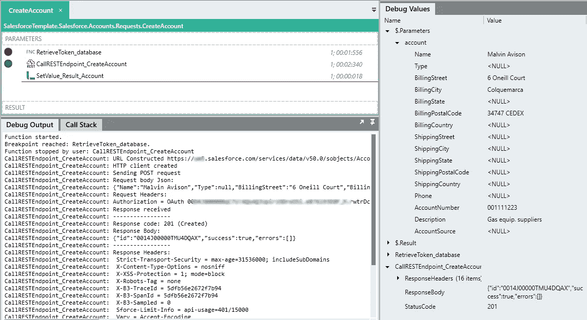**

# **模板功能**

**下面的自定义函数是为了演示真实世界的功能而构建的。**

**在解决方案资源管理器中可以找到以下自定义函数:**【sales force】>【Accounts】>【custom functions】****

## **AddUpdateAccountsFromCSV**

**这个自定义函数处理从本地 CSV 文件中检索的帐户实体的创建或修改。([mock _ customers . CSV](https://community.linx.software/community/uploads/short-url/f1HpQMNi8NivTryA8URXbWihkai.csv)(11.8 KB)包含 100 个与“模拟”客户相关的记录，您可以在测试中使用它们。)**

**1.放置提供的。目录中的 csv:**

```
C:\Linx\Salesforce\Accounts\Upload\
```

**2.在 Linx 设计器中，**调试**中的**AddUpdateAccountsFromCSV**函数。**

**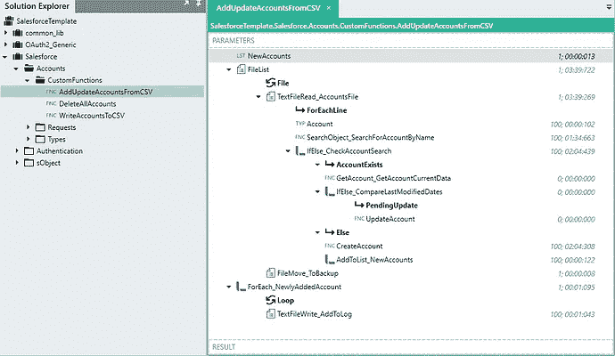**

**一个 [FileListFNC](https://linx.software/docs/reference/plugins/file/content/filelist) 对本地目录进行扫描，过滤掉格式为`*customers*.csv`的文件。对于每个匹配过滤器的文件，返回完整的`FileName`属性。**

**对于获得的每个文件， [TextFileReadFNC](https://linx.software/docs/reference/plugins/file/content/textfileread) 然后解析文件并以结构化的格式逐一返回每一行。**

**对于返回的每一行,“Account”类型的实例被设置为从文件返回的详细信息。**

**然后在 Salesforce 上搜索与文件中的名称匹配的帐户。自定义函数 **SearchObject** 接受当前行`name`细节的输入参数。**

**这将返回任何匹配记录的`Id`。**

**然后使用一个 [IfElseFNC](https://linx.software/docs/reference/plugins/linx/content/ifelse) 来检查是否返回了任何匹配的`Id`值。如果匹配的`Id`确实存在，则使用自定义函数 **GetAccount** 检索与`Id`匹配的账户的具体细节。**

**使用 [IfElseFNC](https://linx.software/docs/reference/plugins/linx/content/ifelse) 将文件中的`last modified`字段与从 Salesforce 返回的`last modified`字段进行比较，从而完成检查。如果文件中的数据比 Salesforce 上的记录更新，则使用自定义函数 **UpdateAccount** 更新帐户详细信息，传入之前设置的“帐户”类型。**

**如果 Salesforce 上不存在该帐户，则使用自定义函数 **CreateAccount** 创建该帐户，并传入之前设置的“帐户”类型。然后返回新创建的`Id`。这个`Id`被添加到包含最近添加的账户的列表中。**

**一旦特定文件完成读取，使用 [FileMoveFNC](https://linx.software/docs/reference/plugins/file/content/filemove) 将其移动到“备份”位置。**

**然后将`Accounts`列表循环并附加到一个本地 CSV 文件中，以便记录保存。**

**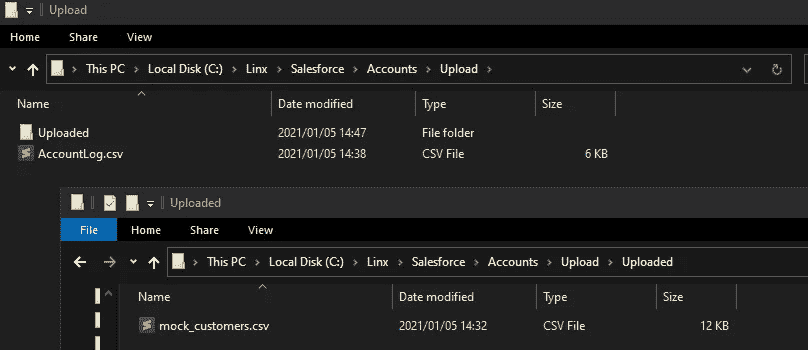**

## **WriteAccountsToCSV**

**此功能将 Salesforce 中所有帐户的详细信息插入本地 CSV 文件。**

**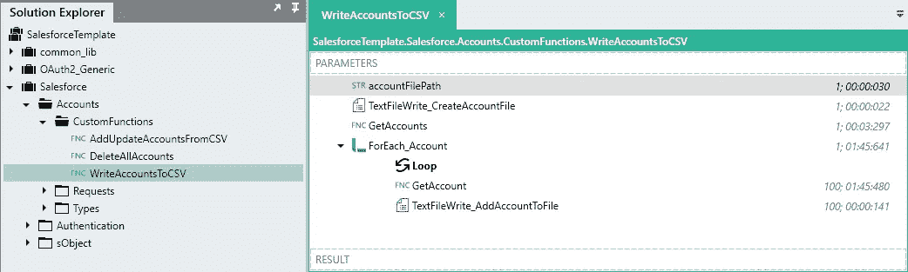**

**首先，使用一个 [TextFileWriteFNC](https://linx.software/docs/reference/plugins/file/content/textfilewrite) 来重置带有列标题的本地文件。**

**然后使用定制函数 **GetAccounts** 检索所有现有的账户 id。使用 [ForEachFNC](https://linx.software/docs/reference/plugins/linx/content/foreach) 对返回的帐户 id 列表执行循环。**

**对于每个帐户，执行自定义函数 **GetAccount** ，将当前循环的`Id`字段值作为输入参数传递。结果是返回特定帐户的详细信息。**

**然后使用 [TextFileWriteFNC](https://linx.software/docs/reference/plugins/file/content/textfilewrite) 将返回账户的详细信息逐行写入 CSV 文件。**

****结果文件:****

**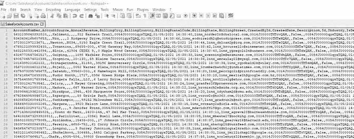**

## **删除所有帐户**

**此自定义功能从 Salesforce 中删除所有现有帐户。**

**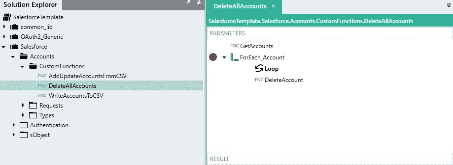**

**首先，使用定制函数 **GetAccounts** 检索所有现有的帐户 id。使用 [ForEachFNC](https://linx.software/docs/reference/plugins/linx/content/foreach) 对返回的帐户 id 列表执行循环。**

**对于每个帐户，执行自定义函数 **DeleteAccount** ，将当前循环的`Id`字段值作为输入参数传递。然后，该特定帐户将从您的 Salesforce 实例中删除。**

****注意:**这将删除当前 Salesforce 上的所有帐户，请谨慎操作。**