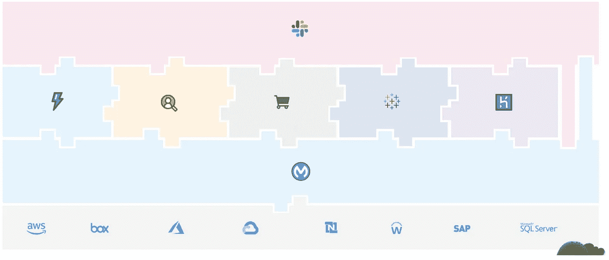
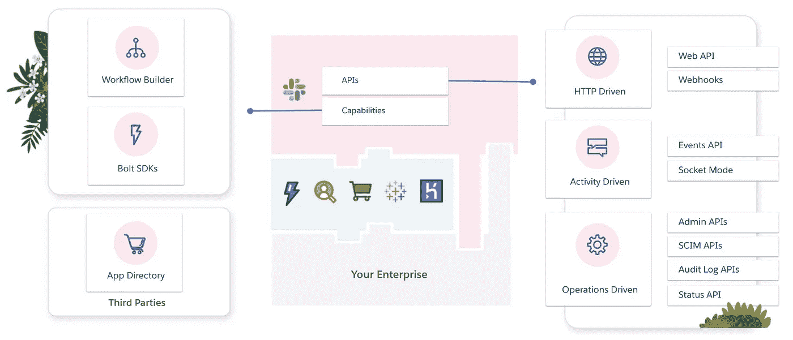
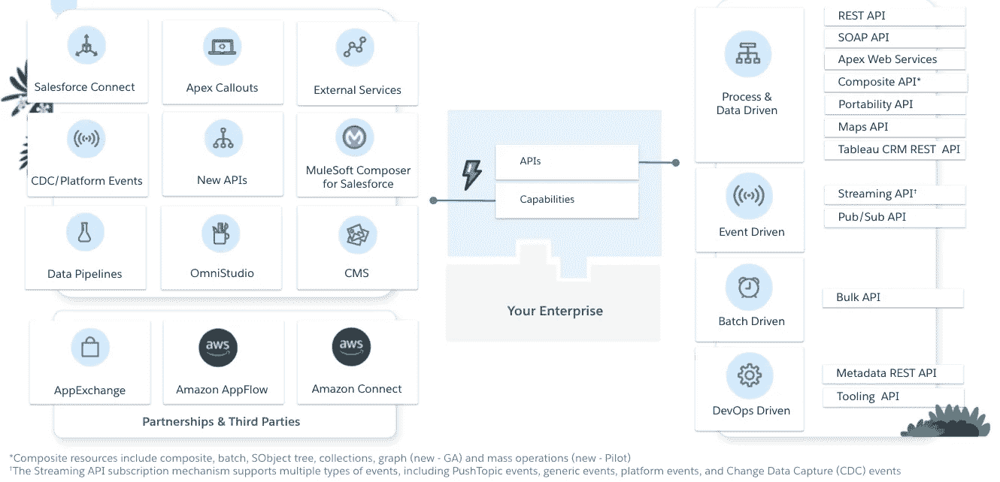
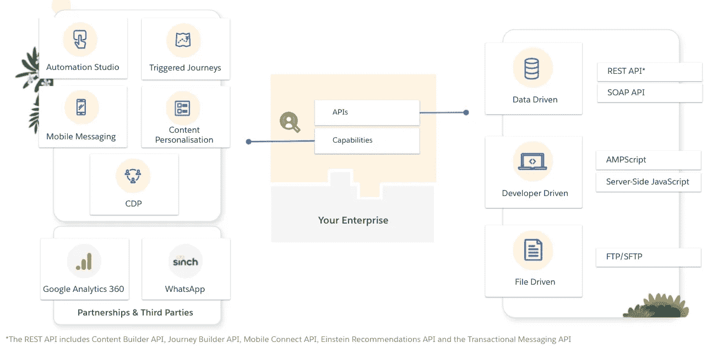
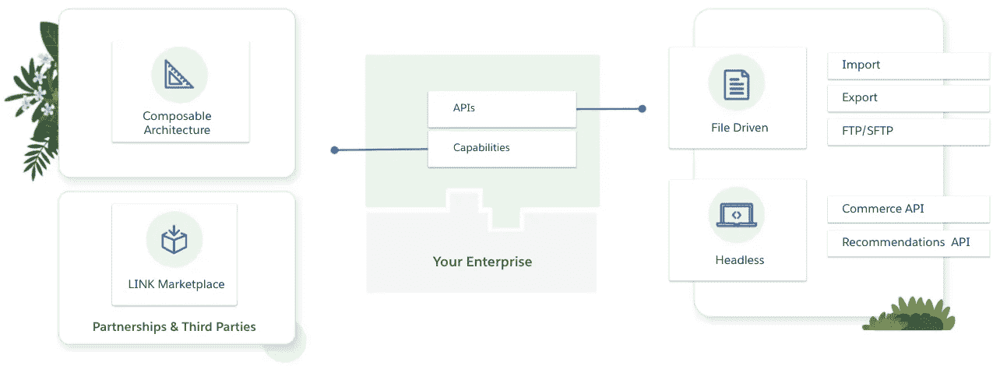
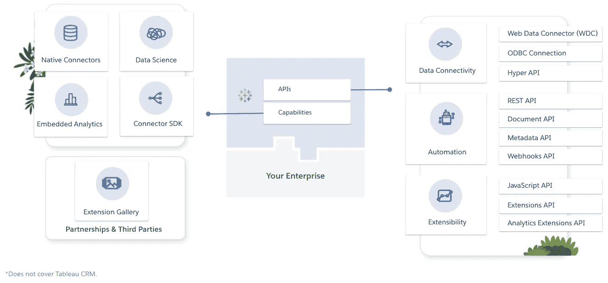
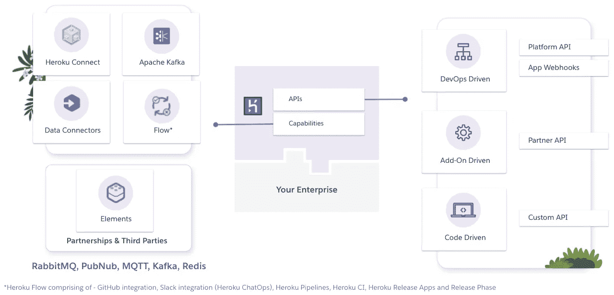
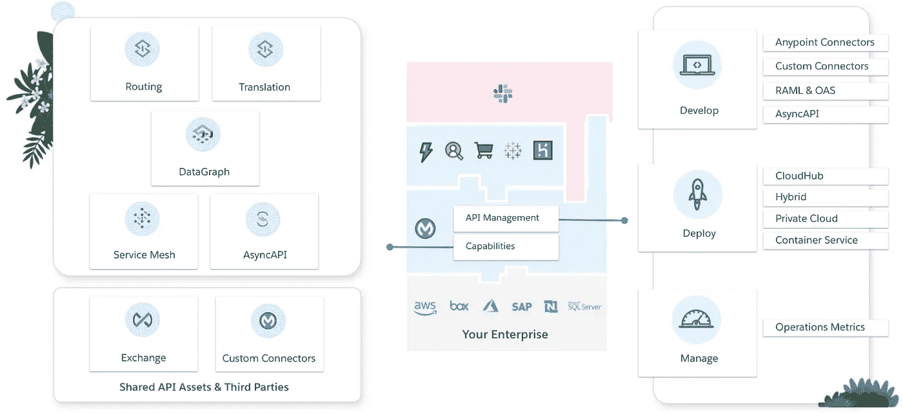
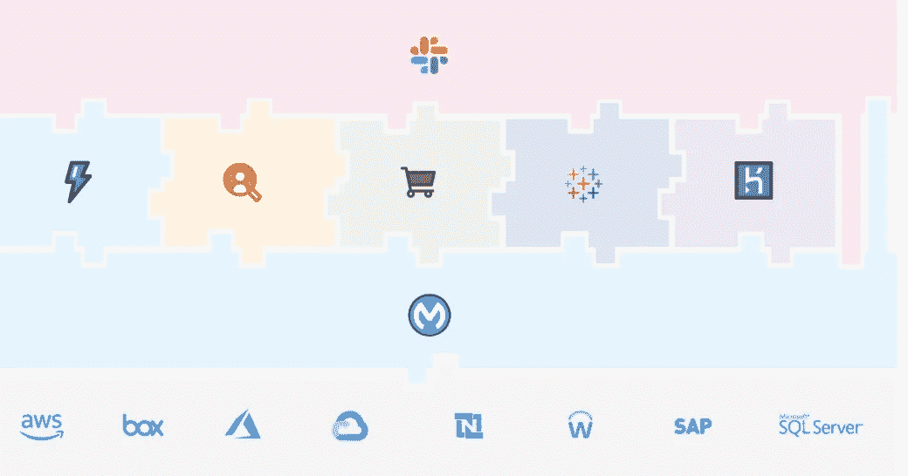

# Salesforce APIs 和集成功能:袖珍指南

> 原文：<https://medium.com/geekculture/salesforce-apis-and-integration-capabilities-the-pocket-guide-2a1a8e97603d?source=collection_archive---------2----------------------->

## 拼图游戏类比

Salesforce 平台是一个连接应用程序的生态系统。这些部分可以独立运行，也可以像拼图一样组合在一起，目标是提供个性化客户、合作伙伴和员工体验的功能。

The Salesforce platform. A connected ecosystem.

集成讨论是微妙的，取决于哪个拼图对你来说是重要的。为了给集成提供一个袖珍指南，我将把每个拼图分成两个部分:

1.  ***API***—这些是可用于与您的数据和元数据交互的端点。
2.  ***功能*** —这些服务将用户和开发者从底层 API 中抽象出来。

为了简洁起见，省略了一些 API 和功能。

# 松弛的

Slack: The digital HQ

Slack 是 Salesforce 的数字总部。旨在使不同团队之间的沟通有组织、有效率。

## 松弛 API

*   [**Web API**](https://api.slack.com/apis) 是一个从中查询信息*并在*一个空闲工作空间中制定变更*的接口。*
*   [**web hooks**](https://api.slack.com/apis)**是一种从应用程序向 Slack 发布消息的简单方法。**
*   **[**事件 API**](https://api.slack.com/apis) 允许活动驱动的集成，并使应用和机器人能够响应这些触发器。这包括**套接字模式**——允许应用程序使用事件 API，而无需公开公共 HTTP 请求 URL。**
*   **[**管理 API**](https://api.slack.com/apis)是 Web APIs 的子集，旨在自动化和简化 Slack 的管理。**
*   **[**SCIM API**](https://api.slack.com/apis)可用于供应和管理用户。**
*   **[**审计日志 API**](https://api.slack.com/apis)可由安全监控和事件管理工具使用，例如，将松弛访问数据自动输入 SIEM 工具(安全事故和事件监控)。**
*   **[**状态 API**](https://api.slack.com/apis) 提供了监控 Slack 健康状况的编程方式。**

## **松散集成能力**

*   **[**工作流构建器**](https://api.slack.com/workflows) 工作流是 Slack 内的自动化多步骤任务或流程。工作流生成器是创建它们的无代码界面。**
*   **[**Bolt SDK**](https://api.slack.com/tools/bolt)是用 JavaScript、Python 或 Java 的 Slack 平台开始编程的最佳方式。它们允许您对松弛事件做出响应，并构建丰富的交互式消息。**
*   **应用程序目录提供来自第三方的预构建应用程序，可简化通信、多步骤流程等。像谷歌日历、Zoom 和 PagerDuty 这样的应用。**

# **闪电平台**

****

**The home of Sales, Service, Experience, Industry Clouds + more**

## **Lightning 平台 API**

*   **[**REST、SOAP、BULK、Composite 和 Apex Web 服务**](https://developer.salesforce.com/developer-centers/integration-apis)API 提供创建、读取、编辑和删除数据的事务性访问。复合资源包括集合和图形，允许您在一次 API 调用中与相关数据进行交互。**
*   **[**流式**](https://developer.salesforce.com/docs/atlas.en-us.change_data_capture.meta/change_data_capture/cdc_intro.htm) 和**[**Pub/Sub**](https://developer.salesforce.com/blogs/2021/07/pub-sub-api-building-event-driven-integrations-just-got-even-easier)**API(Beta)通过流式事件实现事件驱动的通信，并提供分别使用 Bayeux 和 gRPC 协议在内部和外部订阅那些事件的机制。******
*   ******[**元数据**](https://developer.salesforce.com/docs/atlas.en-us.api_meta.meta/api_meta/meta_intro.htm) 和[**工具**](https://developer.salesforce.com/docs/atlas.en-us.api_tooling.meta/api_tooling/intro_api_tooling.htm)API 为构建发布管理和版本控制活动提供支持。******

## ****闪电平台集成能力****

*   ****[**Salesforce Connect**](https://trailhead.salesforce.com/en/content/learn/projects/quickstart-lightning-connect)通过允许您的用户查看、搜索和修改存储在您的 sales force 组织外部的数据，提供跨系统边界的无缝数据集成。例如，您可能有存储在企业资源规划(ERP)系统中的数据。您可以使用外部对象通过 web 服务标注实时访问数据，而不是将数据复制到您的组织中。****
*   ****[**Apex 标注**](https://trailhead.salesforce.com/en/content/learn/modules/apex_integration_services) 通过调用外部 Web 服务或从 Apex 代码发送 HTTP 请求，然后接收响应，使您能够将 Apex 与外部服务紧密集成。Apex 提供与利用 SOAP 和 WSDL 或 HTTP 服务(RESTful 服务)的 Web 服务的集成。****
*   ****[**外部服务**](https://trailhead.salesforce.com/en/content/learn/modules/external-services) 提供了一种在您的 Salesforce 组织和外部服务之间交换信息的方式。与 Apex 标注不同，外部服务允许您以声明方式与符合开放标准的外部托管服务集成。****
*   ****[**变更数据捕获(CDC)**](https://trailhead.salesforce.com/content/learn/modules/change-data-capture) 发布变更事件，表示对 Salesforce 记录的变更。这些活动可以在 lightning 平台内或从外部应用程序订阅。****
*   ****[**平台事件**](https://trailhead.salesforce.com/en/content/learn/modules/platform_events_basics) 发布定制的有效负载，这使得它们适合于发布订阅模式，而不是记录更改。****
*   ****[**MuleSoft Composer for sales force**](https://trailhead.salesforce.com/en/content/learn/trails/get-started-with-mulesoft-composer)—允许业务用户使用预建的连接器为常见的企业应用程序(如微软团队、Netsuite 和吉拉)创建集成..通过指定您的源、事件和目的地，您无需编写代码就可以满足集成用例。****
*   ****[**数据管道**](https://help.salesforce.com/articleView?id=release-notes.rn_bi_data_pipelines_enrich_salesforce_data.htm&type=5&release=232) 是一项新功能，允许您从 50 多个数据源获取数据，对其进行转换和计算，然后将其加载到 5 个目的地之一，包括您的 Salesforce 组织。****
*   ****[**OmniStudio**](https://trailhead.salesforce.com/en/content/learn/modules/omnistudio-dataraptors?trail_id=get-to-know-omnistudio) 作为 Vlocity 收购的一部分进入平台。它具有拖放配置功能，让客户通过点击而不是自定义代码来创建特定于其行业的引导式品牌体验。OmniStudio 还包括与其他企业应用程序集成的工具，即[集成程序](https://trailhead.salesforce.com/en/content/learn/modules/omnistudio-integration-procedures?trail_id=get-to-know-omnistudio)和[数据猛禽](https://trailhead.salesforce.com/en/content/learn/modules/omnistudio-dataraptors?trail_id=get-to-know-omnistudio)。****
*   ****[**内容管理系统**](https://developer.salesforce.com/docs/atlas.en-us.communities_dev.meta/communities_dev/communities_dev_cms_connect_intro.htm) (CMS)通常用于集中数字资产并在整个企业内共享。 *CMS Connect* 可以被 Experience Cloud 用来集成存储在 Adobe、Drupal、Sitecore 等中的数字资产。您还可以在 *Salesforce CMS* 中管理内容，并在内部和外部使用。****
*   ****[**AppExchange**](https://appexchange.salesforce.com/) 是 lightning 平台的 Salesforce 在线市场。它拥有超过 4，500 个应用程序，并与 iPaaS 提供商建立了合作关系，可以快速跟踪您的实施。****

****Salesforce 还与 Google 和 AWS 建立了战略合作伙伴关系，以进一步提供满足集成用例的灵活性。****

*   ****[**亚马逊 AppFlow**](https://trailhead.salesforce.com/en/content/learn/modules/amazon-appflow/get-started-with-amazon-appflow) 是一项完全托管的集成服务，使您能够在软件即服务(SaaS)应用程序(如 Salesforce)和 AWS 服务(如亚马逊简单存储服务(亚马逊 S3)和亚马逊红移)之间安全地交换数据。****
*   ****[**亚马逊连接**](https://trailhead.salesforce.com/en/content/learn/projects/build-an-amazon-connect-integration?trail_id=integrate-aws-and-salesforce) 为服务云中的代理和主管提供预集成的云电话和自动语音识别。****

# ****营销云****

********

****Engage customers with personalised marketing campaigns****

## ****营销云 API****

*   ****[**REST 和 SOAP API**](https://developer.salesforce.com/docs/marketing/marketing-cloud/guide/apis-overview.html)包括内容构建器 API、旅程构建器 API、移动连接 API、爱因斯坦推荐 API 和事务性消息传递 API。创建这些不仅是为了启动与客户的沟通，也是为了创建和修改营销内容。****
*   ****[**AMPScript** 和**服务器端 JavaScript**](https://developer.salesforce.com/docs/marketing/marketing-cloud/guide/programmatic-content-overview.html) 也可以通过调用 API 端点来动态引入按需数字内容，从而以编程方式驱动行为。****
*   ****[**FTP/SFTP**](https://help.salesforce.com/s/articleView?id=sf.mc_es_enhanced_ftp_guide.htm&type=5) 提供了一个安全的 FTP 站点，您的潜在客户名单可以安全地共享和导入，以用于您的营销活动。****

## ****营销云集成能力****

*   ****[**Automation Studio**](https://help.salesforce.com/s/articleView?id=sf.mc_as_automation_studio.htm&type=5)允许营销人员通过点击 UI 执行多步数据管理活动。在营销云和您的企业中导入、过滤和分发数据。使用脚本生成 HTTP 标注以在运行时检索数据。****
*   ****通过 Journey Builder，您可以根据受众细分来设计和交付个性化内容。您还可以通过在外部事件发生时触发**来将 journey 的启动与您更广泛的企业应用程序集成在一起(比如服务中断)。******
*   ********手机短信**提供通过短信和彩信与客户联系的功能。它还支持基于位置和信标的消息传递。******
*   ****[**内容个性化**](https://developer.salesforce.com/docs/marketing/marketing-cloud/guide/programmatic-content-overview.html) 是指一系列广泛的功能，允许客户进行实时标注，以将个性化内容注入他们的营销传播中。这可以使用服务器端 JavaScript、AMPScript、Automation Studio 或它们的组合。****
*   ****[**客户 CDP**](https://developer.salesforce.com/docs/atlas.en-us.c360a_api.meta/c360a_api/c360a_api_quick_start.htm) 有助于统一分散的数据源，并映射到一个通用的信息模型，该模型可用于创建单一数据源(SSOT)。这种 SSOT 可用于营销活动，以个性化内容和细分客户。****
*   ****[**Google Analytics 360**](https://trailhead.salesforce.com/content/learn/modules/google-analytics-360-integration-for-marketing-cloud)用户可以访问未采样的数据和受众，允许他们根据 Google 和 Salesforce 提供的报告采取行动。Google Analytics 360 客户可以使用 Google Analytics 360 条目源在 Journey Builder 中向您的受众中的客户进行营销。****
*   ****[**Sinch**](https://www.youtube.com/watch?v=oAEi8Yepeko) 是一个合作伙伴关系，支持 WhatsApp 集成，允许客户在 WhatsApp 中创建和回复消息。****

# ****B2C 商务云****

********

****A scalable digital storefront****

## ****B2C 商务云 API****

*   ****[**Commerce API**](https://developer.commercecloud.com/s/article/CommerceAPI) 是一个 RESTful API，提供对 B2C 商务云资源的访问，是提供一个*无头*电子商务店面的关键。****
*   ****[**推荐 API**](https://developer.commercecloud.com/s/api-details/a003k00000UI4hPAAT/commerce-cloud-developer-centereinsteinrecommendations) 有 2 个主要功能。以接收和输出推荐并允许容易地切换推荐器。****

## ****B2C 商务集成能力****

*   ****[**可组合架构**](https://developer.commercecloud.com/s/storefront-applications) 允许您选择您想要使用的店面技术。您可以使用带有预配置集成的预构建店面，或者使用渐进式 Web 应用程序(PWA)工具包和托管运行时，以允许您使用 Node 和 React 等现代编程语言进行构建，或者您可以通过在商业 API 之上构建您的自定义店面来获得完全控制。****
*   ****[**链接市场**](https://www.salesforce.com/products/commerce-cloud/partner-marketplace/) 是合作伙伴扩展 B2C 商务体验的在线市场。寻找支付供应商，如 Stripe 和 PayPal 或评级插件，如 Get Feedback。****

# ****（舞台上由人扮的）静态画面****

********

****Using data insights to solve problems****

## ****Tableau APIs****

*   ****[**【Web Data Connector(WDC)**](https://www.tableau.com/developer/tools/web-data-connector)**是一个 API 集合，使开发者能够将 Tableau 连接到 Web 上的任何数据。******
*   ******[**【ODBC(开放式数据库连接)**](https://help.tableau.com/current/pro/desktop/en-us/examples_otherdatabases.htm) 受广泛的数据源支持。Tableau 允许您使用其内置的 ODBC 连接器连接到这些 ODBC 兼容的源。******
*   ****[**Hyper API**](https://www.tableau.com/developer/tools/hyper-api)**允许你创建自定义脚本与 extract(。超级)文件。这允许您更新现有提取文件中的数据或从中读取数据。******
*   ******[**REST API**](https://www.tableau.com/developer/tools/rest-api)**允许开发者访问内容、用户、站点等。这使得在第三方网站中嵌入 Tableau 仪表板或自动化任务(如管理用户)成为可能。********
*   ******[**文档 API**](https://www.tableau.com/developer/tools/document-api) 允许您以编程方式修改 Tableau 文件，并帮助支持将工作簿从测试迁移到生产。******
*   ****[**元数据 API**](https://www.tableau.com/developer/tools/metadata-api) — 查询和发现关于内容和外部资产的元数据。例如，查询数据库和视图或分析依赖关系，如哪些工作簿依赖于哪些列。****
*   ****[**web hooks**](https://www.tableau.com/developer/tools/webhook-api)**启用 Tableau 事件的通知，比如可以在数据源刷新时发送短信。******
*   ****[**JavaScript API**](https://www.tableau.com/developer/tools/javascript-api)**允许您以编程方式与单个仪表板进行交互——在第三方应用程序中嵌入仪表板时非常有用。******

## ******Tableau 集成功能******

*   ******[**原生连接器**](https://help.tableau.com/current/pro/desktop/en-us/exampleconnections_overview.htm) 为通用数据平台和应用提供 100 多个数据源的无缝集成。这允许您立即提取和可视化现有企业数据资产中的数据。******
*   ****[**数据科学整合**](https://www.tableau.com/developer/tools/python-integration-tabpy) 让你的统计模型进入更多人的手中。在 Tableau 中集成来自 R、Python 和 MATLAB 模型的数据。****
*   ****[**嵌入式分析**](https://help.tableau.com/current/api/js_api/en-us/JavaScriptAPI/js_api.htm) 让更多人更容易与数据互动，然后将您的可视化嵌入到其他业务应用中。****
*   ****[**连接器 SDK**](https://www.tableau.com/developer/tools/connector-sdk) —如果您没有针对特定 ODBC 或 JDBC 支持的数据源的本机连接器，则构建一个。****
*   ****[**扩展图库**](https://extensiongallery.tableau.com/) 是 Tableau 在线集市。它拥有第三方数据连接器和由不断发展的开发者生态系统编写的定制仪表板扩展。****

# ****赫罗库****

********

****Custom applications, in modern programming languages, with managed data services****

## *****Heroku API*****

*   ****[**平台 API**](https://devcenter.heroku.com/articles/platform-api-quickstart) 使开发者能够自动化、扩展和组合 Heroku 与其他服务。您可以通过编程方式创建应用、提供附加组件和执行其他任务，而无需依赖 CLI。****
*   ****[**App Webhooks**](https://devcenter.heroku.com/categories/app-webhooks) 使开发者能够在你的 Heroku 应用程序发生特定变化时收到通知。这有助于监控域名变更、应用构建和发布，或者查看正在发生的动态信息变更。****
*   ****[**合作伙伴 API**](https://devcenter.heroku.com/articles/platform-api-for-partners) —开发者可以为 Heroku 应用创建附加组件。开发人员可以注册一个端点，通过附加组件合作伙伴 API 接收与您的附加组件相关的管理任务。****
*   ******自定义 API**—API 可以用多种编程语言创建，Heroku 支持 Go、Scala、Ruby、NodeJS、Python、Java、Clojure 和 PHP。使用您选择的堆栈创建一个安全的 REST API。****

## ****Heroku 集成能力****

*   ****[**Heroku Connect**](https://devcenter.heroku.com/articles/heroku-connect)让您轻松构建与您的 Salesforce 部署共享数据的 Heroku 应用程序。使用 Salesforce 和 Heroku Postgres 之间的双向同步。它还内置了一个 OData 提供程序来可视化 Postgres 数据，而无需将数据复制到您的 Salesforce 部署中。****
*   ****[**Heroku Kafka**](https://devcenter.heroku.com/articles/kafka-on-heroku) 是一个插件，提供 Kafka 即服务，完全集成到 Heroku 平台中。Kafka 可以轻松接收大量入站事件，而不会对下游应用程序产生不稳定的扩展需求。****
*   ****[**流数据连接器**](https://devcenter.heroku.com/articles/heroku-data-connectors) 是为 Heroku Postgres 事件提供变更数据捕获(CDC)的附加组件。这使得向下游应用程序通知对事务数据库所做的更改变得很容易。****
*   ****[**Heroku Flow**](https://www.heroku.com/flow) 将 6 个功能汇集成一个易于使用的工作流程。它连接到您的 GitHub 存储库，允许您设置审查和暂存应用程序以支持您的测试生命周期，在低配置测试运行程序中运行测试，并与 Slack 集成以进行监控和部署。****
*   ****[**Elements**](https://www.heroku.com/elements) 是一个由第三方开发的附加组件在线市场。像 Twilio Send Grid 和 New Relic 这样的应用程序提供了一个引导实现来为你的应用程序增值。****

# ****MuleSoft****

********

****A unified, single solution for iPaaS and full API management****

> ****如果 Salesforce 产品生态系统中有大量 API 和集成功能，为什么 MuleSoft 是拼图的一部分？****

****归根结底，集成关乎灵活性。支持许多不同协议、标准和集成模式的灵活性。没有人做*只有*事件驱动架构。大多数人用 REST (OpenAPI)、GraphQL 和/或 RPC APIs 来补充它们。MuleSoft 是实现企业级集成策略的拼图中的一块。它是唯一支持复杂路由、100 多个企业应用程序的预建连接器、复杂消息转换和灵活部署选项的产品。你成为一个 API 创建者。****

## ****MuleSoft 的 API 管理****

*   ****[**Anypoint 和自定义连接器**](https://anypoint.mulesoft.com/exchange/) 是 Mule runtime engine (Mule)的可重用扩展，使您能够将 Mule 应用程序与第三方 API、数据库和标准集成协议集成。****
*   ****[**RAML&OAS**](https://docs.mulesoft.com/design-center/design-create-publish-api-specs)—RESTful API 建模语言(RAML)让管理 API 从设计到部署再到共享的生命周期变得简单。在 API 规范中独一无二的是，它被开发来建模 API，而不仅仅是记录它。您还可以使用本机 OpenAPI 规范(OAS) 3.0 格式来实现、部署和操作 API。****
*   ****[**部署**](https://docs.mulesoft.com/runtime-manager/deployment-strategies) —用于 API 和集成的轻量级、可扩展运行时引擎 Mules 可以部署在任何地方——内部部署、云部署(CloudHub)或两者都部署。****

## ****MuleSoft 的主要特性****

*   ****[**路由**](https://docs.mulesoft.com/mule-runtime/3.9/routers) 允许 MuleSoft 通过将消息以流的形式发送到各个目的地来满足复杂的 API 和集成需求。一些路由器在路由发生之前结合逻辑来分析和转换消息。****
*   ****[**翻译**](https://docs.mulesoft.com/mule-runtime/4.3/dataweave-cookbook) 是连接不同数据源所需的关键功能。DataWeave 脚本作用于数据。您可以使用 DataWeave 将该数据中的选定字段修改并输出为新的数据格式。****
*   ****借助[**any point data graph**](https://www.mulesoft.com/platform/anypoint-design-center/datagraph)，企业架构师可以轻松地将 API 统一到一个数据服务中——无需编写更多代码。开发人员可以在一个 GraphQL 请求中使用来自数据服务的多个 API。****
*   ****[**Anypoint 服务网格**](https://docs.mulesoft.com/service-mesh/1.2/) 使您能够通过将非 MuleSoft 应用程序纳入 Anypoint 平台范围来扩展您的微服务网络。然后，您可以从单一面板无缝地管理和保护您的应用网络，包括您的非骡子应用。****
*   ****[**AsyncAPI**](https://www.asyncapi.com/) 是一个开源项目，旨在改善事件驱动架构(EDA)的现状。长期目标是让使用 EDAs 像使用 REST APIs 一样简单。从文档到代码生成，从发现到事件管理。****
*   ****[**定制连接器**](https://docs.mulesoft.com/mule-sdk/1.1/)——从根本上创建自己的连接器或流程模块，抽象并封装可重用的代码——消除跨项目重复工作的需要。这个 SDK 提供了创建一个的脚手架。****

# ****摘要****

****Salesforce 平台是一个连接应用程序的生态系统。这些应用服务于不同的用例，运行在不同的技术栈上。****

****虽然应用程序被设计为独立运行，但它们也被设计为组合在一起——就像拼图游戏一样。每个 jigsaw 组件不仅提供了对通过 API 调用操纵数据的广泛支持，而且具有解决常见集成用例而无需编写代码的交钥匙功能。****

********