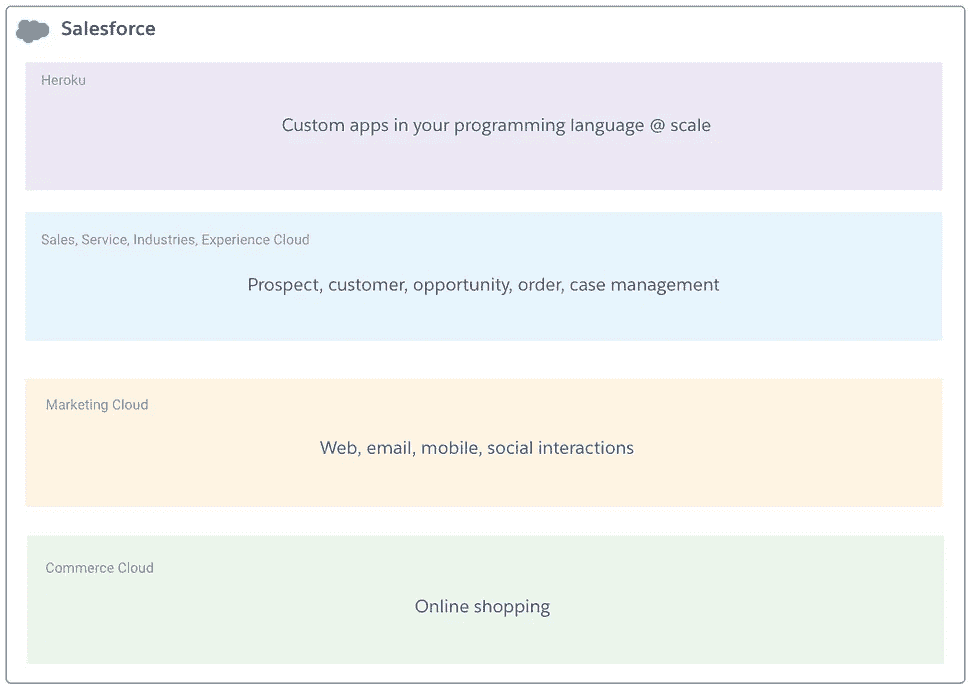
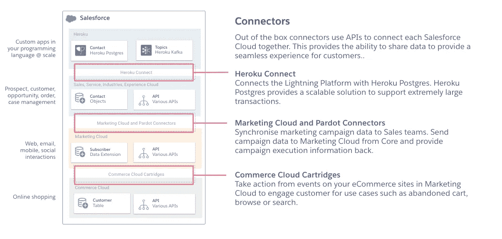
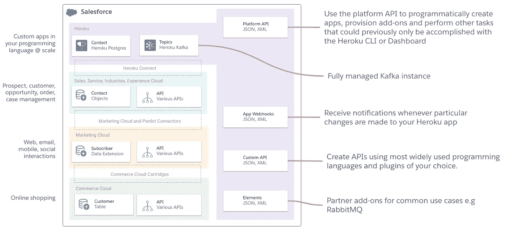
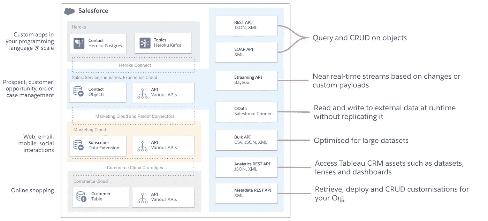
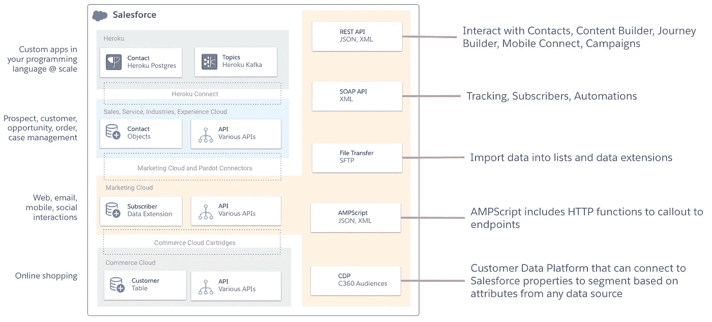
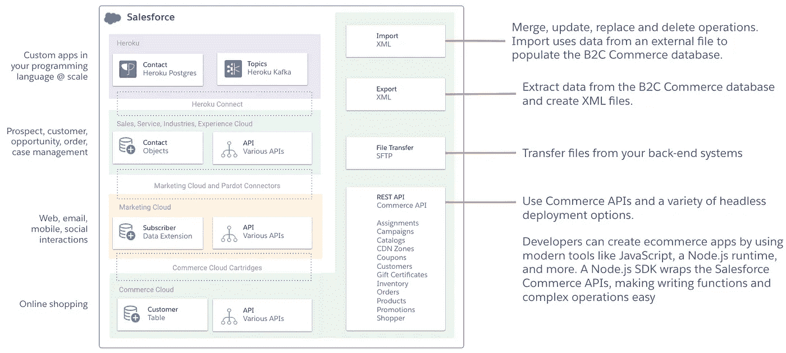
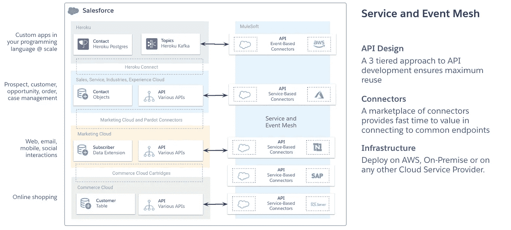

# Salesforce APIs 解释

> 原文：<https://medium.com/geekculture/salesforce-apis-explained-c1ca7aea2113?source=collection_archive---------8----------------------->

## 如果你喜欢蛋糕会有帮助。彩虹蛋糕。

Photo by [Sharon McCutcheon](https://unsplash.com/@sharonmccutcheon?utm_source=unsplash&utm_medium=referral&utm_content=creditCopyText) on [Unsplash](/s/photos/rainbow-cake?utm_source=unsplash&utm_medium=referral&utm_content=creditCopyText)

# TL；速度三角形定位法(dead reckoning)

本文描述了跨 Salesforce 云可用的 API。它链接到一个框架，帮助选择最适合您的用例的 API，并讨论彩虹蛋糕。你还需要什么？

要开始这篇文章，我首先需要回答以下问题。

> 什么是 sales force 客户 360 平台？

该平台已经成为一个连接的服务生态系统。它提供市场领先的解决方案，以获取、建立忠诚度并减少您与客户、员工和合作伙伴的互动摩擦。

站台就像一块**蛋糕**。每一层代表一个 Salesforce 云或一组服务，提供更好地服务您的目标受众的功能。

The Salesforce platform: A rainbow cake (Photo by [Sharon McCutcheon](https://unsplash.com/@sharonmccutcheon?utm_source=unsplash&utm_medium=referral&utm_content=creditCopyText) on [Unsplash](/s/photos/rainbow-cake?utm_source=unsplash&utm_medium=referral&utm_content=creditCopyText))

如果每一层都代表一个 Salesforce 云，并且每一层都收集数据，那么我如何在各层之间共享数据，而不会产生复杂的集成成本？

## 连接器

蛋糕类比有助于涵盖集成故事的第一步——连接器。连接器(大部分)是免费的，并提供将蛋糕层粘在一起的奶油糖果。它们使用本文稍后描述的 API，并提供了一个方便的抽象层。

Salesforce Connectors to share data between Clouds.

连接器关注驱动特定结果的用例。

当顾客放弃购物车时，想让他们开始营销之旅吗？—使用*商务云墨盒*。

想要将浏览您网站的评分潜在客户发送到销售云，以便他们可以作为销售线索跟进？—使用 *Pardot 连接器*

想要将服务云中的数据同步到一个全面管理、可扩展的 Postgres 数据库中吗？—使用 Heroku Connec。

想做点别的吗？你需要一个 *API* 。

# 蜜蜂

Salesforce 平台的每一层都为不同的使用情形提供不同的服务。这意味着每一层都有不同的 API。让我们从较高的层次来介绍它们。

## ***Heroku***

[***Heroku***](https://www.heroku.com/home)使开发者能够在完全托管的基础设施上，用最流行的编程语言创建定制应用。开发人员可以快速添加 Postgres、Redis 和 Kafka 资源来满足他们的集成需求，或者从 [Elements marketplace](https://elements.heroku.com/) 中选择一个插件。

Heroku APIs

## 核心服务([销售](https://www.salesforce.com/au/products/sales-cloud/overview/)，[服务](https://www.salesforce.com/au/products/service-cloud/overview/)，[体验](https://www.salesforce.com/au/products/community-cloud/overview/)，[产业](https://www.salesforce.com/au/solutions/industries/))

蛋糕的 ***核心服务*** 层存储客户、机会和案例的交易数据(+更多)，通常是集成时关注的焦点。这就是为什么会有很多 API 来满足不同的用例。

Core Service APIs: Sales, Service, Experience, Industries, AppExchange etc

## 营销云

[***营销云***](https://www.salesforce.com/au/products/marketing-cloud/overview/) 有助于创建个性化的营销活动，通过各种渠道吸引客户。它包含订户列表，并提供 API 来导入和导出数据，并能够与自动化交互以支持您的集成用例。

Marketing Cloud APIs

## B2C 商务云

[***B2C 商务云***](https://www.salesforce.com/au/products/commerce-cloud/overview/) 使客户能够构建数字商务体验。导入和导出数据是能够上传产品目录和导出订单以便履行的关键组件。API 已经覆盖了你。

B2C Commerce Cloud APIs

## MuleSoft

那么 [***MuleSoft Anypoint 平台***](https://www.salesforce.com/au/products/integration/overview/)*适合在哪里呢？回到彩虹蛋糕的比喻，最好不要把 MuleSoft 作为一层，而是作为顶部的糖衣。*

*大型企业正在寻求将许多系统连接在一起——不仅仅是 Salesforce 的彩虹蛋糕——还有其他云和内部应用程序。他们正在寻找一种解决方案，能够提供最高效、最可扩展和最安全的方式来交付这些基于事件和服务的 API。*

*MuleSoft APIs 由客户创建，使用私有和公共市场中预先构建的连接器。它们支持复杂的集成模式，并提供路由和转换功能。*

**

*MuleSoft APIs*

# *哪个 API 适合我的解决方案？*

*由于大多数时候您将与位于核心服务层的事务性数据集成，Trailhead 为您提供了一个方便的框架。看看这里。*

* [## 面向架构师的 API 规划框架

### 使用 API 规划框架，使用正确的 API 设计您的解决方案。

trailhead.salesforce.com](https://trailhead.salesforce.com/en/content/learn/modules/design-with-the-right-api) 

# 摘要

Salesforce 平台就像一个彩虹蛋糕，每一层都是 Salesforce 云。每个客户可以选择他们有多少层或云。

每一层都有特定的 API 来满足与层内服务交互的需求，客户可以从外部系统调用这些服务或从该层调出。

对于涉及复杂路由和转换的集成用例来说，你的彩虹蛋糕上需要一些 MuleSoft 形式的糖衣。MuleSoft 提供了一个可重用的 API 设计范例来创建基于事件和服务的 API，以连接许多不同的系统。*