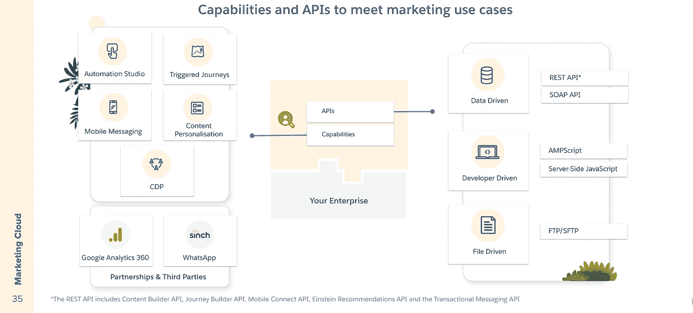
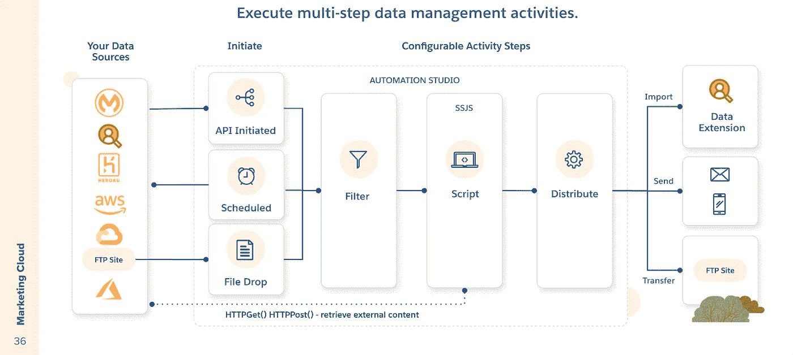
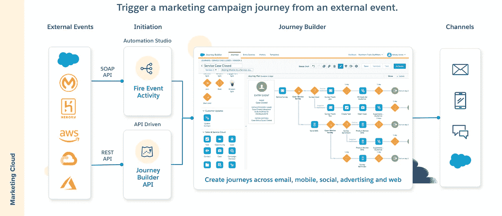
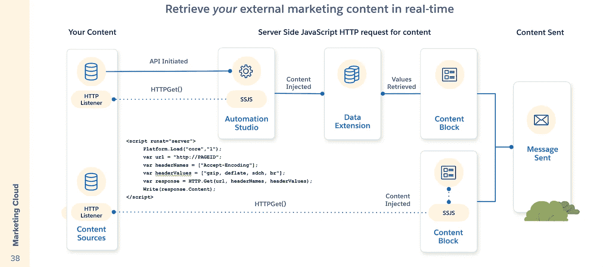
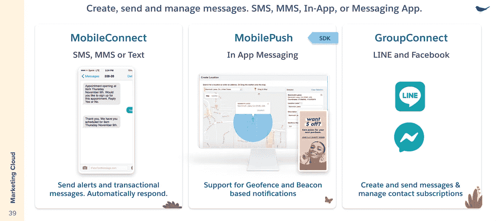
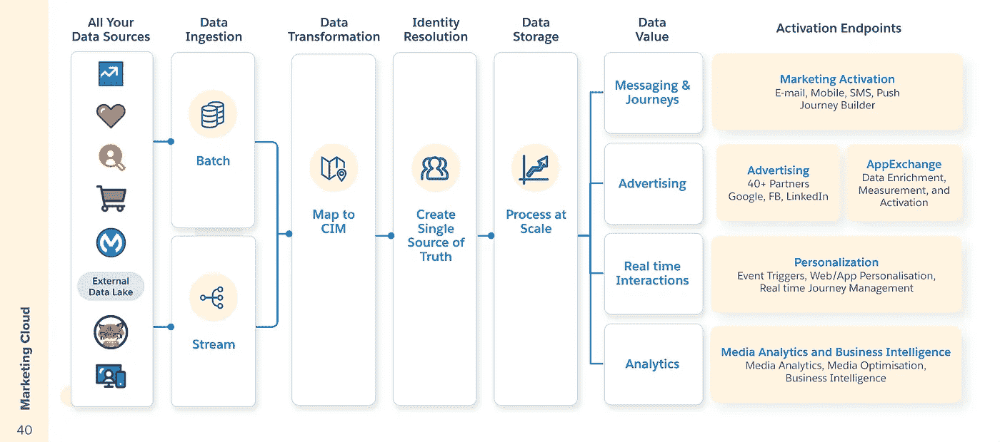
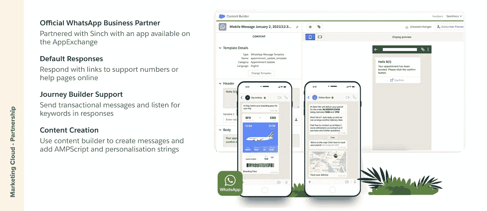

# Salesforce 营销云集成功能:迷你指南

> 原文：<https://medium.com/geekculture/salesforce-marketing-cloud-integration-capabilities-the-mini-guide-4baa4dd38c54?source=collection_archive---------3----------------------->

## Automation Studio、Journey Builder、内容个性化、CDP、移动消息等。

在我之前的帖子中，我们讨论了构成 Salesforce 平台的[互连部分，并总结了 API 和功能。](/geekculture/salesforce-apis-and-integration-capabilities-the-pocket-guide-2a1a8e97603d?source=friends_link&sk=8bc83d17960cd031782b0ea2e3011f8c)

在本帖中，我们将双击营销云，更深入地了解它的**集成能力**。

Marketing Cloud APIs and key integration capabilities

# 自动化工作室

Automation Studio 是一个营销云应用程序，用于即时、触发或按计划执行多步营销和数据管理活动。

有三个起始来源:

**API Initiated** —使用 API Initiated 以编程方式启动、更新或暂停自动化*。*

***Scheduled** —当您希望自动化执行的数据和消息传递操作以*特定的时间间隔*发生时，使用计划来启动自动化。*

***文件拖放** —当*文件拖放*到指定的增强型 FTP 文件夹时，如果提示开始自动化，则使用文件拖放*

*Automation Studio 有活动步骤和一个声明性画布，可以在其中添加和链接多步骤活动。活动包括将数据导入数据扩展、发送电子邮件、将数据传输到 FTP 站点、过滤数据集以及最重要的集成**脚本**。*

*脚本活动包含*服务器端 JavaScript* (SSJS)，并作为 automation studio 进程的一部分执行。出于集成的目的，可以使用 SSJS 来启动 HTTPGet 和 HTTPPost，以便从指定的 URL 检索内容。这使得开发人员可以将存储在营销云之外的动态内容注入下游活动，例如将动态数据导入可用于驱动个性化内容的数据扩展。*

# *触发的旅程*

**

*Journey builder 根据数据扩展中存储的属性、浏览行为和购买历史记录，利用您的所有客户数据来构建个性化的及时信息。它为沟通、培养和建立忠诚度提供了一个框架。*

*但是，有许多用例您需要与客户沟通，不是基于持续的培养之旅，而是基于营销云之外发生的事件。这些包括通知、确认、服务提醒和基于交易的活动。REST API 提供了一种基于外部事件发起的 API 调用为客户启动旅程的方法。例如，对于服务中断，您的集成中间件可以向 Journey Builder API 发送一条消息，向受影响的客户发送电子邮件和文本。*

# *内容个性化*

**

*使用服务器端 JavaScript 中的 HTTP 函数可以实时检索 HTML 内容。*

*这张幻灯片上显示了两个常用选项。*

*选项 automation studio 作业可以通过 API 调用按需启动。automation studio 中的活动步骤可用于编写对外部端点的 HTTP 调用的脚本。当返回 HTML 响应时，可以将它放入数据扩展中，当发送电子邮件时，该数据扩展又可以用于内容块中。*

*选项 2 是直接在内容块中创建脚本，并在发送电子邮件时注入 HTML 响应。*

# *手机短信*

**

*Mobile Studio 允许营销人员通过短信营销、推送通知和群发消息对移动消息进行个性化处理，从而在任何设备上联系客户。*

*MobileConnect 允许您向任何拥有支持 SMS 或 MMS 的移动电话的用户发送高质量、相关且及时的消息。*

*Mobile Studio 还提供了一个 **MobilePush SDK** ，它集成了本地移动推送通知功能，并提供了与低能耗信标设备的集成。这将解锁创建 geofenced messaged 的功能，当您的客户进入或退出目标区域时，该功能会自动向他们发送优惠券或促销信息。信标允许更近的接近信息——在几英尺之内——来引起对特定报价的注意。*

# *客户数据平台*

**

*Salesforce CDP 允许您使用高级查询和配置文件 API 在任何应用程序中消费数据，跨 Salesforce 供应解析的客户数据以连接云。使用内置连接器向消息、广告和个性化端点发布数据。CDP 不仅为 Salesforce 端点，还通过 MuleSoft 的 Anypoint 平台为更广泛的生态系统提供大规模数据接收和激活。*

*然后，我们可以将这些摄取的数据映射到云信息模型(CIM)——这种功能可以帮助营销人员掌握已知和未知的客户解决方案，并将数据映射到单个信息模型中。该系统的核心是高级匹配的客户解析。该系统还将提供一个全局当事人 ID(持久简档),它将多个子身份映射到一个主“父”简档。*

*Salesforce CDP 的核心是细分引擎，它使业务用户能够查询系统中的所有数据，创建客户的细分，并了解他们的构成。*

# *谷歌分析*

**

*通过 Google Analytics 360 和营销云之间的战略合作伙伴关系，您将受益于将网络分析和其他渠道(如电子邮件和移动设备)结合在一起的整合。*

*您可以使用直观的编辑器快速设置所有电子邮件的自定义链接跟踪，将整个网站的行为联系在一起，并衡量您的电子邮件和其中的内容如何导致下游转化。*

*在 Journey Builder 中，您可以访问 Journey Analytics 仪表盘，在那里您可以看到目标衡量、电子商务指标、网站使用情况，甚至内容统计，以及营销云的电子邮件性能。*

*您可以利用 Analytics 360 内置的受众，在营销云中启动客户之旅*

*您可以在 Analytics 360 中使用数据驱动的归因来了解电子邮件和移动设备如何促进收入增长。*

# *WhatsApp 集成*

**

*通过这种集成，您可以受益于营销云平台的全部功能。使用联系人生成器管理您的受众。使用内容生成器进行内容生成、预览和个性化。使用旅程构建器向您的客户发送消息，作为客户旅程的一部分。*

*你可以发送两种类型的 WhatsApp 消息:模板和会话。*

***模板消息**是事务性的。模板消息的一些例子包括:发货通知、订单确认、预订或事件提醒、废弃购物车提醒。*

***会话消息**是对用户发起的对话的响应。当用户向你的 WhatsApp 频道发送消息时，你无需使用模板就可以回复他们*

# *摘要*

*营销云中的集成功能侧重于与潜在客户列表交互的 API，以及对发送给订户的内容进行个性化的功能。这些功能允许开发者以最少的摩擦创建定制的营销体验。*