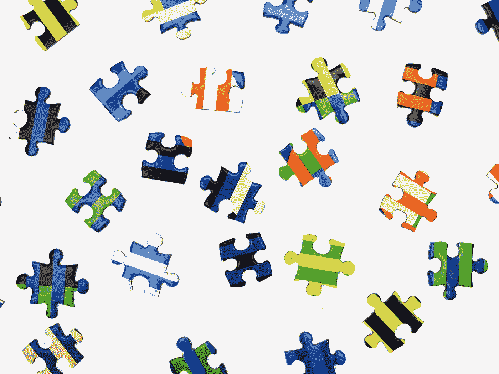
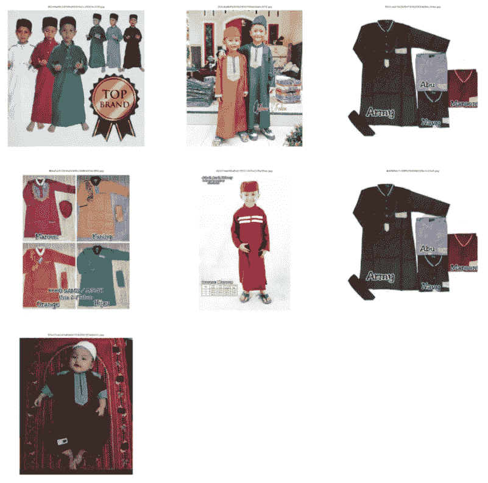
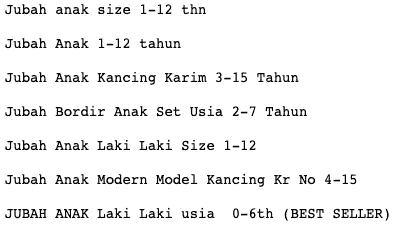
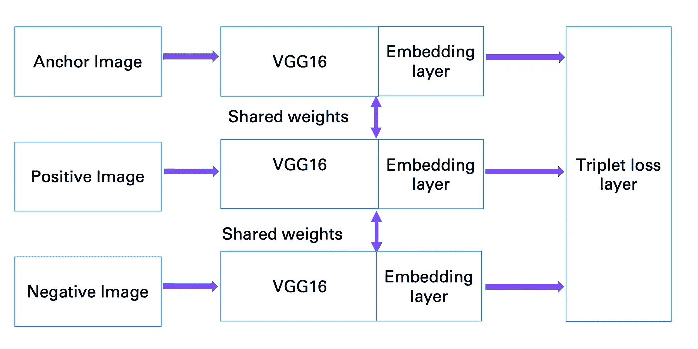
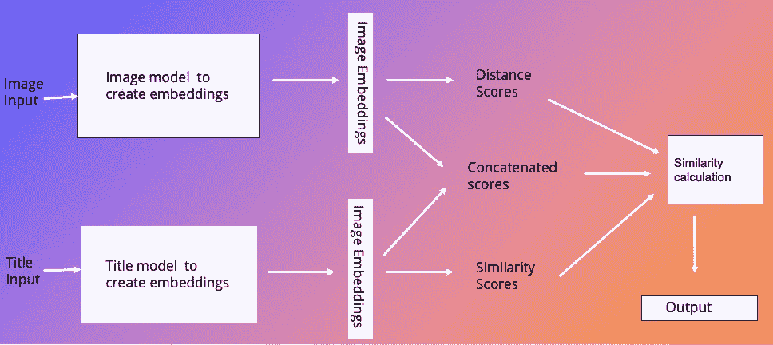
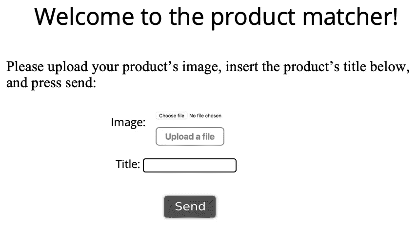
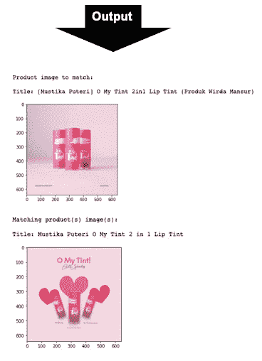

# 相同-相同但不同:通过电子商务标题和图片检测产品相似性

> 原文：<https://medium.com/geekculture/same-same-but-different-detecting-product-similarities-by-their-e-commerce-titles-and-images-5ea10021f522?source=collection_archive---------13----------------------->

**作者:** [伊塔马尔·扎尔茨曼](https://www.linkedin.com/in/itamar-zaltsman/)，[卡里什马·沙阿](https://www.linkedin.com/in/karishma-shah-7b1b1786/)，[罗伊·亚诺夫斯基](https://www.linkedin.com/in/roy-yanovski/)

这项工作是作为数据科学课程的期末项目完成的。我们选择了一个卡格尔竞赛([https://www.kaggle.com/c/shopee-product-matching/](https://www.kaggle.com/c/shopee-product-matching/))作为我们这个项目的挑战。下面的文章描述了数据集、我们的工作流程和我们遇到的挑战，还包括我们的最佳解决方案和我们实现它的方式。

# 介绍

电子商务是一个不断增长的行业，已经成为许多人消费习惯中值得注意的一部分。网上购物的优点是购物快捷方便，还能接触到各种各样的卖家和产品。但这种丰富也可能是一个缺点，因为很难做出决定并在众多选项中导航。许多网站试图提供过滤和比较工具来改善这种体验，但许多人仍然会感到失落，并可能由于数据过载造成的混乱而最终不购买。
产品匹配可用于比较产品，并查找某些产品。消费者可能希望比较产品，看看他们是否找到了一个好的交易，未来的应用程序可能会在网上搜索在商店/街上发现后拍摄的产品。

我们的数据集有以下特征:
-一个唯一的 ID(‘posting _ ID’)。
-产品的图像(“图像”)。
-基于图像的相位*(‘image _ Phash’)。
-产品的标题(“标题”)。
归属于某些产品的类别(“标签组”)。
* Phash(感知哈希)是一种算法，可生成代表特定图像的短字符序列。它可以被称为图像的一种“指纹”。更多关于图像哈希的内容可以在这里找到:[https://people . cs . umass . edu/~ libera to/courses/2020-spring-compsci 590k/lectures/09-perceptual-hashing/](https://people.cs.umass.edu/~liberato/courses/2020-spring-compsci590k/lectures/09-perceptual-hashing/)
数据集包含**34250 个**样本，属于**11014 个**独特产品。班级人数范围在**2–51**之间，平均班级人数为 **3** 。

我们的目标:
根据给定的某个产品的图片和标题来检测相似的产品。
*在 phash 功能没有取得巨大成功后，我们决定将重点放在图片和标题上，作为我们产品的特色。

# 探测

数据集包含**32412**个唯一图像、**28735**个唯一相位和**33117**个唯一标题。这意味着我们在每个特性上都有一些副本(尽管在所有特性上都没有完全的副本)。

**图片**

让我们看看随机产品(一组带有相同标签的样品)是什么样子的:

Seven sample images that belong to the same class.

正如我们在上面看到的，我们面临的一个挑战是，来自同一类别的产品有着非常不同的形象。
接下来，我们想看看图像的形状。我们发现有 **824** 种不同的形状，都是 RGB (3 通道)图像，但有许多不同的长度和宽度。最常见的形状是 640 X 640 ( **12，259** 个样本)，83.4%**的图像具有 5 种最常见形状中的一种。**

**标题**

让我们看看标题。我们将展示我们用于图像演示的类的不同标题。

Seven different sample titles that belong to the same class.

正如我们在上面看到的，我们面临的另一个挑战是这些标题是用不同的语言写的，而且不全是英文。因此，我们使用 google translator API 来检测语言，并在必要时将其转换为英语。

接下来，我们看了标题长度(字数)的分布:

Title counts by different lengths.

可以看出，大多数标题的长度为 2-20 个单词，峰值大约为 7-8 个单词。

# 预处理

我们有两个不同的数据源:图像和文本，所以我们将使用计算机视觉和 NLP(自然语言处理)模型来解决这个问题。每个模型将需要不同的预处理步骤，但总的来说，我们重塑了图像，使它们都具有相同的形状，我们将标记标题中的单词。然后，我们将在模型中使用余弦相似性，以便根据相似性对产品进行分类。

# 建模

我们选择 F1 分数作为我们的衡量标准(在 Kaggle 竞赛中也是如此)。我们的基线得分是 **0.00149** (通过简单地返回数据集中最大的一个类来计算)。

**第一步——创建基线模型**
我们的基线模型是两个模型的集合，一个用于图像(计算机视觉模型)，一个用于标题(NLP 模型)。对于计算机视觉，我们使用来自 imagededup 库的 CNN(卷积神经网络)模型，该模型使用来自 Keras 的预训练的 MobileNet CNN 作为模型。它需要将图像调整为 224 X 224。对于 NLP，我们在解码为 unicode 和小写单词后创建了一个 tf-idf 矩阵，并将这两个模型转换为余弦相似度矩阵。然后，我们使用不同的相似性阈值(CNN 使用 **0.85** ，tf-idf 使用 **0.5** )来确定匹配，并通过简单地添加他们找到的匹配来组合他们的结果。这一组合导致 F1 得分为 **0.48** 。

**第二步——使用更复杂的模型来提高性能**
我们再次选择集成两个模型。对于计算机视觉，我们使用了一个连体神经网络，它使用相同的权重，同时串联三个不同的输入向量，以便计算可比较的输出向量，并通过三重损失函数更新权重。它基本上是通过每次将一幅图像与来自相同类别的一幅图像以及来自不同类别的一幅图像进行比较来进行训练的，并且它输出可用于使用简单的 K-最近邻算法来计算距离的嵌入。
暹罗网络由三个 VGG16 预训练网络和一个再训练输出层组成。它需要一个训练测试分裂和图像整形到 200 x 200。连体神经网络的输出 F1 分数为 **0.50** 。

The general architecture of the Siamese network used for this project.

在这种情况下，我们的 NLP 模型是 difflib 库的 SequenceMatcher，它以一种非常有趣的方式比较序列(有关更多信息，请参见文档页面:[https://docs.python.org/3/library/difflib.html](https://docs.python.org/3/library/difflib.html))。仅 SequenceMatcher 给出的 F1 分数**为 0.55** 。
然后，我们以如下方式组合连体 NN 和序列匹配器:如果这三个条件中的一个为真，则选择图像作为匹配:
1。暹罗网络返回的距离得分低于 **0.95** 。
2。SequenceMatcher 返回一个高于 **0.55** 的相似性分数。
3。他们的综合得分(距离+(1-相似度))低于 **1.4** 。这些集合导致 F1 分数为 **0.71** 。

A general abstract structure of the final model architecture.

使用 Flask 在 AWS 服务器上提供最终模型。理想情况下，它将接收图像和标题，并为它们创建嵌入，并将它们与现有的数据库进行比较，以输出类似产品的图像和标题。现在，它可以处理数据库中已经存在的产品。

A demo of our product matching tool.

# 讨论

这是一项非常具有挑战性的任务。匹配来自超过 **11，000** 个不同类别的样本，这些类别的标题和图像可能包含高度多样性。鉴于基线如此之低，我们的最终分数 **0.71** 可以被认为是一个不错的分数。话虽如此，但未来仍有进一步改进的空间。我们认为，主要的改进可以来自于 NLP 部分，方法是尝试使用深度学习模型，如 RNN/LSTM 模型和像 BERT 这样的变压器模型。此外，增加数据库和调整模型参数也可以改善暹罗网络的结果。
最重要的是，我们相信这个项目显示了克服产品内差异问题以检测匹配产品的可行性。

总之，随着电子商务行业的发展，消费者可以享受到来自不同卖家的各种各样的产品，并享受到比较和点击按钮获得优惠的奢侈。但这也存在信息泛滥的问题，导致完全相反的结果。这是一个经典案例，机器学习可以通过提供工具来提供解决方案，使消费者可以访问大量数据。这个项目可能会被用于创建这样的工具，这将改善用户体验，并进一步发展电子商务行业。