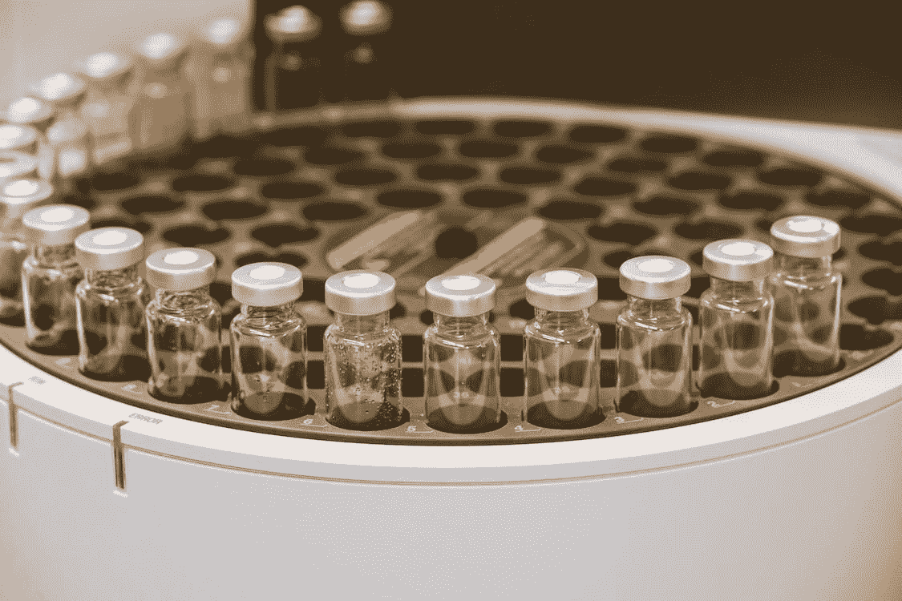

# 取样方法:综合底漆

> 原文：<https://medium.com/geekculture/sampling-methods-comprehensive-primer-6e32d936868f?source=collection_archive---------2----------------------->

## 概率和非概率抽样都有解释

Free for Use Photo from [Pexels](https://www.pexels.com/ko-kr/photo/9259963/)

# 介绍

什么是抽样？抽样是指“[我们如何从目标人群中选择成员、项目或元素以纳入研究](https://www.khanacademy.org/math/statistics-probability/designing-studies/sampling-methods-stats/a/sampling-methods-review)”。抽样由不同的阶段组成，从确定目标人群，描述抽样框架，决定…