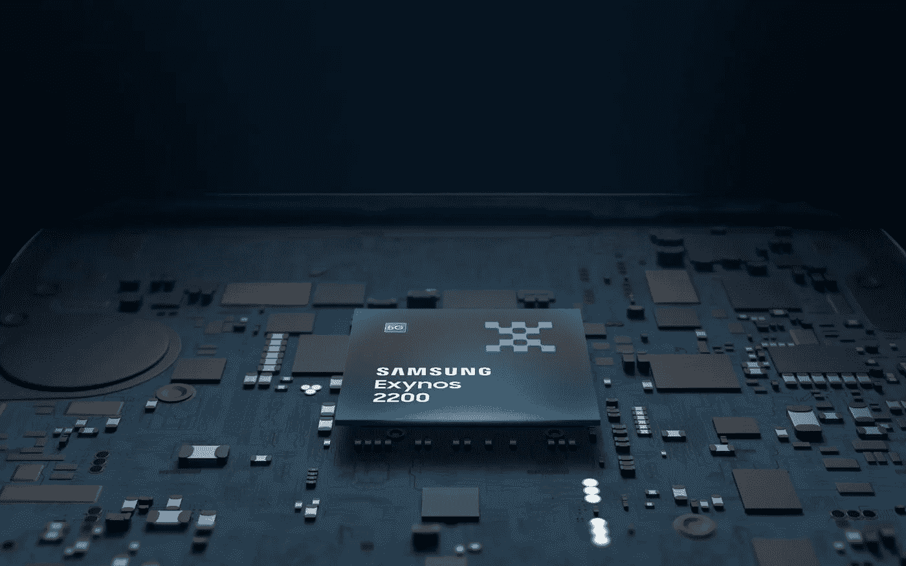

# 三星通过 Exynos 2200 将 AMD 显卡引入移动设备

> 原文：<https://medium.com/geekculture/samsung-brings-amd-graphics-to-mobile-devices-with-the-exynos-2200-884c46895f4f?source=collection_archive---------18----------------------->

## 该公司令人印象深刻的最新芯片将为即将到来的 Galaxy S22 提供动力——为什么这次它非常重要？

Samsung just unveiled the chip that the next Galaxy S family of smartphones will be based on — and there are quite a few features it brings to the table that look extremely promising right now. (Image: Samsung)

**在预期的几天后**——发布会的原定日期应该是 1 月 11 日——三星宣布了它最新最棒的…